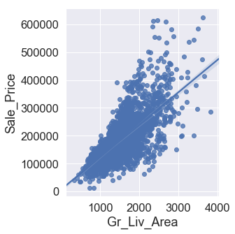
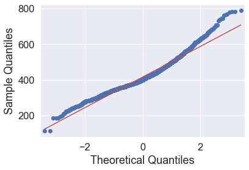

### Exploratory Data Analysis (EDA) for Regression

First, let’s load the required libraries. We will use the sklearn library for our ML tasks, and the pandas, numpy, matplotlib and seaborn libraries for general data processing and visualisation.


```python
import matplotlib.pyplot as plt
import numpy as np
import pandas as pd
import statsmodels.api as sm
import seaborn as sns
from sklearn import preprocessing
from sklearn import model_selection
# pip install UpSetPlot #no conda option??
# import upsetplot
%matplotlib inline
sns.set(font_scale = 1.5)
```

## Load the data

We will use the Ames housing data to explore different ML approaches to regression. This dataset was “designed” by Dean De Cock as an alternative to the “classic” Boston housing dataset, and has been extensively used in ML teaching. It is also available from kaggle as part of its [advanced regression practice competition](https://www.kaggle.com/c/house-prices-advanced-regression-techniques).

The Ames Housing [Data Documentation file](https://github.sydney.edu.au/informatics/lessons-mlr/blob/gh-pages/_episodes_rmd/data/AmesHousing_DataDocumentation.txt) describes the independent variables presented in the data. This includes:

- 20 continuous variables relate to various area dimensions for each observation
- 14 discrete variables, which typically quantify the number of items occurring within the house
- 23 ordinal, 23 nominal categorical variables, with 2 (STREET: gravel or paved) - 28 (NEIGHBORHOOD) classes

We will explore both the “uncleaned” data available from kaggle/UCI, and the processed data available in the AmesHousing package in R, for which documentation is available [here](https://cran.r-project.org/web/packages/AmesHousing/AmesHousing.pdf). It can be useful for understanding what each of the independent variables mean.


```python
ameshousingClean = pd.read_csv('data/AmesHousingClean.csv')
ameshousingDirty = pd.read_csv('data/AmesHousingDirty.csv')
```

## Exploratory data analysis

Exploratory data analysis involves looking at:

- the distribution of variables in your dataset
- whether any data is missing
- skewed
- correlated variables

> ## Challenge
>
> 1. Explore the Ames Housing dataset. What can you figure out about the different variables? 
> Which do you think are more or less important?
> 
> 2. Compare the "Clean" and "Dirty" datasets:
> - What was missing in the raw data?
> - What are some of the approaches that have been taken to deal with missingness?
> 
> {: .source}
>
> > ## Solution
> > print(ameshousingClean.shape)
> > 
> > print(ameshousingDirty.shape)
> > 
> > Let's now proceed to explore the rest of the answers to this challenge.
> >
> > {: .output}
> {: .solution}
{: .challenge}

What are the dimensions of the data?

Look at the data:


```python
ameshousingClean.head()
```


<div>
<style scoped>
    .dataframe tbody tr th:only-of-type {
        vertical-align: middle;
    }

    .dataframe tbody tr th {
        vertical-align: top;
    }

    .dataframe thead th {
        text-align: right;
    }
</style>
<table border="1" class="dataframe">
  <thead>
    <tr style="text-align: right;">
      <th></th>
      <th>MS_SubClass</th>
      <th>MS_Zoning</th>
      <th>Lot_Frontage</th>
      <th>Lot_Area</th>
      <th>Street</th>
      <th>Alley</th>
      <th>Lot_Shape</th>
      <th>Land_Contour</th>
      <th>Utilities</th>
      <th>Lot_Config</th>
      <th>...</th>
      <th>Fence</th>
      <th>Misc_Feature</th>
      <th>Misc_Val</th>
      <th>Mo_Sold</th>
      <th>Year_Sold</th>
      <th>Sale_Type</th>
      <th>Sale_Condition</th>
      <th>Sale_Price</th>
      <th>Longitude</th>
      <th>Latitude</th>
    </tr>
  </thead>
  <tbody>
    <tr>
      <th>0</th>
      <td>One_Story_1946_and_Newer_All_Styles</td>
      <td>Residential_Low_Density</td>
      <td>141</td>
      <td>31770</td>
      <td>Pave</td>
      <td>No_Alley_Access</td>
      <td>Slightly_Irregular</td>
      <td>Lvl</td>
      <td>AllPub</td>
      <td>Corner</td>
      <td>...</td>
      <td>No_Fence</td>
      <td>None</td>
      <td>0</td>
      <td>5</td>
      <td>2010</td>
      <td>WD</td>
      <td>Normal</td>
      <td>215000</td>
      <td>-93.619754</td>
      <td>42.054035</td>
    </tr>
    <tr>
      <th>1</th>
      <td>One_Story_1946_and_Newer_All_Styles</td>
      <td>Residential_High_Density</td>
      <td>80</td>
      <td>11622</td>
      <td>Pave</td>
      <td>No_Alley_Access</td>
      <td>Regular</td>
      <td>Lvl</td>
      <td>AllPub</td>
      <td>Inside</td>
      <td>...</td>
      <td>Minimum_Privacy</td>
      <td>None</td>
      <td>0</td>
      <td>6</td>
      <td>2010</td>
      <td>WD</td>
      <td>Normal</td>
      <td>105000</td>
      <td>-93.619756</td>
      <td>42.053014</td>
    </tr>
    <tr>
      <th>2</th>
      <td>One_Story_1946_and_Newer_All_Styles</td>
      <td>Residential_Low_Density</td>
      <td>81</td>
      <td>14267</td>
      <td>Pave</td>
      <td>No_Alley_Access</td>
      <td>Slightly_Irregular</td>
      <td>Lvl</td>
      <td>AllPub</td>
      <td>Corner</td>
      <td>...</td>
      <td>No_Fence</td>
      <td>Gar2</td>
      <td>12500</td>
      <td>6</td>
      <td>2010</td>
      <td>WD</td>
      <td>Normal</td>
      <td>172000</td>
      <td>-93.619387</td>
      <td>42.052659</td>
    </tr>
    <tr>
      <th>3</th>
      <td>One_Story_1946_and_Newer_All_Styles</td>
      <td>Residential_Low_Density</td>
      <td>93</td>
      <td>11160</td>
      <td>Pave</td>
      <td>No_Alley_Access</td>
      <td>Regular</td>
      <td>Lvl</td>
      <td>AllPub</td>
      <td>Corner</td>
      <td>...</td>
      <td>No_Fence</td>
      <td>None</td>
      <td>0</td>
      <td>4</td>
      <td>2010</td>
      <td>WD</td>
      <td>Normal</td>
      <td>244000</td>
      <td>-93.617320</td>
      <td>42.051245</td>
    </tr>
    <tr>
      <th>4</th>
      <td>Two_Story_1946_and_Newer</td>
      <td>Residential_Low_Density</td>
      <td>74</td>
      <td>13830</td>
      <td>Pave</td>
      <td>No_Alley_Access</td>
      <td>Slightly_Irregular</td>
      <td>Lvl</td>
      <td>AllPub</td>
      <td>Inside</td>
      <td>...</td>
      <td>Minimum_Privacy</td>
      <td>None</td>
      <td>0</td>
      <td>3</td>
      <td>2010</td>
      <td>WD</td>
      <td>Normal</td>
      <td>189900</td>
      <td>-93.638933</td>
      <td>42.060899</td>
    </tr>
  </tbody>
</table>
<p>5 rows × 81 columns</p>
</div>


What types are each of the columns?


```python
ameshousingClean.dtypes
```


    MS_SubClass            object
    MS_Zoning              object
    Lot_Frontage            int64
    Lot_Area                int64
    Street                 object
    Alley                  object
    Lot_Shape              object
    Land_Contour           object
    Utilities              object
    Lot_Config             object
    Land_Slope             object
    Neighborhood           object
    Condition_1            object
    Condition_2            object
    Bldg_Type              object
    House_Style            object
    Overall_Qual           object
    Overall_Cond           object
    Year_Built              int64
    Year_Remod_Add          int64
    Roof_Style             object
    Roof_Matl              object
    Exterior_1st           object
    Exterior_2nd           object
    Mas_Vnr_Type           object
    Mas_Vnr_Area            int64
    Exter_Qual             object
    Exter_Cond             object
    Foundation             object
    Bsmt_Qual              object
                           ...   
    Kitchen_AbvGr           int64
    Kitchen_Qual           object
    TotRms_AbvGrd           int64
    Functional             object
    Fireplaces              int64
    Fireplace_Qu           object
    Garage_Type            object
    Garage_Finish          object
    Garage_Cars             int64
    Garage_Area             int64
    Garage_Qual            object
    Garage_Cond            object
    Paved_Drive            object
    Wood_Deck_SF            int64
    Open_Porch_SF           int64
    Enclosed_Porch          int64
    Three_season_porch      int64
    Screen_Porch            int64
    Pool_Area               int64
    Pool_QC                object
    Fence                  object
    Misc_Feature           object
    Misc_Val                int64
    Mo_Sold                 int64
    Year_Sold               int64
    Sale_Type              object
    Sale_Condition         object
    Sale_Price              int64
    Longitude             float64
    Latitude              float64
    Length: 81, dtype: object


Get information about index type and column types, non-null values and memory usage.


```python
ameshousingClean.info()
```

    <class 'pandas.core.frame.DataFrame'>
    RangeIndex: 2930 entries, 0 to 2929
    Data columns (total 81 columns):
    MS_SubClass           2930 non-null object
    MS_Zoning             2930 non-null object
    Lot_Frontage          2930 non-null int64
    Lot_Area              2930 non-null int64
    Street                2930 non-null object
    Alley                 2930 non-null object
    Lot_Shape             2930 non-null object
    Land_Contour          2930 non-null object
    Utilities             2930 non-null object
    Lot_Config            2930 non-null object
    Land_Slope            2930 non-null object
    Neighborhood          2930 non-null object
    Condition_1           2930 non-null object
    Condition_2           2930 non-null object
    Bldg_Type             2930 non-null object
    House_Style           2930 non-null object
    Overall_Qual          2930 non-null object
    Overall_Cond          2930 non-null object
    Year_Built            2930 non-null int64
    Year_Remod_Add        2930 non-null int64
    Roof_Style            2930 non-null object
    Roof_Matl             2930 non-null object
    Exterior_1st          2930 non-null object
    Exterior_2nd          2930 non-null object
    Mas_Vnr_Type          2930 non-null object
    Mas_Vnr_Area          2930 non-null int64
    Exter_Qual            2930 non-null object
    Exter_Cond            2930 non-null object
    Foundation            2930 non-null object
    Bsmt_Qual             2930 non-null object
    Bsmt_Cond             2930 non-null object
    Bsmt_Exposure         2930 non-null object
    BsmtFin_Type_1        2930 non-null object
    BsmtFin_SF_1          2930 non-null int64
    BsmtFin_Type_2        2930 non-null object
    BsmtFin_SF_2          2930 non-null int64
    Bsmt_Unf_SF           2930 non-null int64
    Total_Bsmt_SF         2930 non-null int64
    Heating               2930 non-null object
    Heating_QC            2930 non-null object
    Central_Air           2930 non-null object
    Electrical            2930 non-null object
    First_Flr_SF          2930 non-null int64
    Second_Flr_SF         2930 non-null int64
    Low_Qual_Fin_SF       2930 non-null int64
    Gr_Liv_Area           2930 non-null int64
    Bsmt_Full_Bath        2930 non-null int64
    Bsmt_Half_Bath        2930 non-null int64
    Full_Bath             2930 non-null int64
    Half_Bath             2930 non-null int64
    Bedroom_AbvGr         2930 non-null int64
    Kitchen_AbvGr         2930 non-null int64
    Kitchen_Qual          2930 non-null object
    TotRms_AbvGrd         2930 non-null int64
    Functional            2930 non-null object
    Fireplaces            2930 non-null int64
    Fireplace_Qu          2930 non-null object
    Garage_Type           2930 non-null object
    Garage_Finish         2930 non-null object
    Garage_Cars           2930 non-null int64
    Garage_Area           2930 non-null int64
    Garage_Qual           2930 non-null object
    Garage_Cond           2930 non-null object
    Paved_Drive           2930 non-null object
    Wood_Deck_SF          2930 non-null int64
    Open_Porch_SF         2930 non-null int64
    Enclosed_Porch        2930 non-null int64
    Three_season_porch    2930 non-null int64
    Screen_Porch          2930 non-null int64
    Pool_Area             2930 non-null int64
    Pool_QC               2930 non-null object
    Fence                 2930 non-null object
    Misc_Feature          2930 non-null object
    Misc_Val              2930 non-null int64
    Mo_Sold               2930 non-null int64
    Year_Sold             2930 non-null int64
    Sale_Type             2930 non-null object
    Sale_Condition        2930 non-null object
    Sale_Price            2930 non-null int64
    Longitude             2930 non-null float64
    Latitude              2930 non-null float64
    dtypes: float64(2), int64(33), object(46)
    memory usage: 1.8+ MB


Compare with "non-clean" dataset


```python
ameshousingDirty.info()
```

    <class 'pandas.core.frame.DataFrame'>
    RangeIndex: 2930 entries, 0 to 2929
    Data columns (total 82 columns):
    Order              2930 non-null int64
    PID                2930 non-null int64
    MS SubClass        2930 non-null int64
    MS Zoning          2930 non-null object
    Lot Frontage       2440 non-null float64
    Lot Area           2930 non-null int64
    Street             2930 non-null object
    Alley              198 non-null object
    Lot Shape          2930 non-null object
    Land Contour       2930 non-null object
    Utilities          2930 non-null object
    Lot Config         2930 non-null object
    Land Slope         2930 non-null object
    Neighborhood       2930 non-null object
    Condition 1        2930 non-null object
    Condition 2        2930 non-null object
    Bldg Type          2930 non-null object
    House Style        2930 non-null object
    Overall Qual       2930 non-null int64
    Overall Cond       2930 non-null int64
    Year Built         2930 non-null int64
    Year Remod/Add     2930 non-null int64
    Roof Style         2930 non-null object
    Roof Matl          2930 non-null object
    Exterior 1st       2930 non-null object
    Exterior 2nd       2930 non-null object
    Mas Vnr Type       2907 non-null object
    Mas Vnr Area       2907 non-null float64
    Exter Qual         2930 non-null object
    Exter Cond         2930 non-null object
    Foundation         2930 non-null object
    Bsmt Qual          2850 non-null object
    Bsmt Cond          2850 non-null object
    Bsmt Exposure      2847 non-null object
    BsmtFin Type 1     2850 non-null object
    BsmtFin SF 1       2929 non-null float64
    BsmtFin Type 2     2849 non-null object
    BsmtFin SF 2       2929 non-null float64
    Bsmt Unf SF        2929 non-null float64
    Total Bsmt SF      2929 non-null float64
    Heating            2930 non-null object
    Heating QC         2930 non-null object
    Central Air        2930 non-null object
    Electrical         2929 non-null object
    1st Flr SF         2930 non-null int64
    2nd Flr SF         2930 non-null int64
    Low Qual Fin SF    2930 non-null int64
    Gr Liv Area        2930 non-null int64
    Bsmt Full Bath     2928 non-null float64
    Bsmt Half Bath     2928 non-null float64
    Full Bath          2930 non-null int64
    Half Bath          2930 non-null int64
    Bedroom AbvGr      2930 non-null int64
    Kitchen AbvGr      2930 non-null int64
    Kitchen Qual       2930 non-null object
    TotRms AbvGrd      2930 non-null int64
    Functional         2930 non-null object
    Fireplaces         2930 non-null int64
    Fireplace Qu       1508 non-null object
    Garage Type        2773 non-null object
    Garage Yr Blt      2771 non-null float64
    Garage Finish      2771 non-null object
    Garage Cars        2929 non-null float64
    Garage Area        2929 non-null float64
    Garage Qual        2771 non-null object
    Garage Cond        2771 non-null object
    Paved Drive        2930 non-null object
    Wood Deck SF       2930 non-null int64
    Open Porch SF      2930 non-null int64
    Enclosed Porch     2930 non-null int64
    3Ssn Porch         2930 non-null int64
    Screen Porch       2930 non-null int64
    Pool Area          2930 non-null int64
    Pool QC            13 non-null object
    Fence              572 non-null object
    Misc Feature       106 non-null object
    Misc Val           2930 non-null int64
    Mo Sold            2930 non-null int64
    Yr Sold            2930 non-null int64
    Sale Type          2930 non-null object
    Sale Condition     2930 non-null object
    SalePrice          2930 non-null int64
    dtypes: float64(11), int64(28), object(43)
    memory usage: 1.8+ MB


Explore how many null values are in the clean dataset


```python
ameshousingClean.isnull().sum(axis = 0)
```


    MS_SubClass           0
    MS_Zoning             0
    Lot_Frontage          0
    Lot_Area              0
    Street                0
    Alley                 0
    Lot_Shape             0
    Land_Contour          0
    Utilities             0
    Lot_Config            0
    Land_Slope            0
    Neighborhood          0
    Condition_1           0
    Condition_2           0
    Bldg_Type             0
    House_Style           0
    Overall_Qual          0
    Overall_Cond          0
    Year_Built            0
    Year_Remod_Add        0
    Roof_Style            0
    Roof_Matl             0
    Exterior_1st          0
    Exterior_2nd          0
    Mas_Vnr_Type          0
    Mas_Vnr_Area          0
    Exter_Qual            0
    Exter_Cond            0
    Foundation            0
    Bsmt_Qual             0
                         ..
    Kitchen_AbvGr         0
    Kitchen_Qual          0
    TotRms_AbvGrd         0
    Functional            0
    Fireplaces            0
    Fireplace_Qu          0
    Garage_Type           0
    Garage_Finish         0
    Garage_Cars           0
    Garage_Area           0
    Garage_Qual           0
    Garage_Cond           0
    Paved_Drive           0
    Wood_Deck_SF          0
    Open_Porch_SF         0
    Enclosed_Porch        0
    Three_season_porch    0
    Screen_Porch          0
    Pool_Area             0
    Pool_QC               0
    Fence                 0
    Misc_Feature          0
    Misc_Val              0
    Mo_Sold               0
    Year_Sold             0
    Sale_Type             0
    Sale_Condition        0
    Sale_Price            0
    Longitude             0
    Latitude              0
    Length: 81, dtype: int64


What about in the original?


```python
ameshousingDirty.isnull().sum(axis = 0)
```


    Order                0
    PID                  0
    MS SubClass          0
    MS Zoning            0
    Lot Frontage       490
    Lot Area             0
    Street               0
    Alley             2732
    Lot Shape            0
    Land Contour         0
    Utilities            0
    Lot Config           0
    Land Slope           0
    Neighborhood         0
    Condition 1          0
    Condition 2          0
    Bldg Type            0
    House Style          0
    Overall Qual         0
    Overall Cond         0
    Year Built           0
    Year Remod/Add       0
    Roof Style           0
    Roof Matl            0
    Exterior 1st         0
    Exterior 2nd         0
    Mas Vnr Type        23
    Mas Vnr Area        23
    Exter Qual           0
    Exter Cond           0
                      ... 
    Bedroom AbvGr        0
    Kitchen AbvGr        0
    Kitchen Qual         0
    TotRms AbvGrd        0
    Functional           0
    Fireplaces           0
    Fireplace Qu      1422
    Garage Type        157
    Garage Yr Blt      159
    Garage Finish      159
    Garage Cars          1
    Garage Area          1
    Garage Qual        159
    Garage Cond        159
    Paved Drive          0
    Wood Deck SF         0
    Open Porch SF        0
    Enclosed Porch       0
    3Ssn Porch           0
    Screen Porch         0
    Pool Area            0
    Pool QC           2917
    Fence             2358
    Misc Feature      2824
    Misc Val             0
    Mo Sold              0
    Yr Sold              0
    Sale Type            0
    Sale Condition       0
    SalePrice            0
    Length: 82, dtype: int64


Find out what's the top missing:


```python
missingNo = ameshousingDirty.isnull().sum(axis = 0).sort_values(ascending = False)
missingNo = missingNo[missingNo.values  > 0]
missingNo
```


    Pool QC           2917
    Misc Feature      2824
    Alley             2732
    Fence             2358
    Fireplace Qu      1422
    Lot Frontage       490
    Garage Qual        159
    Garage Yr Blt      159
    Garage Cond        159
    Garage Finish      159
    Garage Type        157
    Bsmt Exposure       83
    BsmtFin Type 2      81
    BsmtFin Type 1      80
    Bsmt Cond           80
    Bsmt Qual           80
    Mas Vnr Type        23
    Mas Vnr Area        23
    Bsmt Full Bath       2
    Bsmt Half Bath       2
    Garage Area          1
    Garage Cars          1
    Total Bsmt SF        1
    Bsmt Unf SF          1
    BsmtFin SF 2         1
    BsmtFin SF 1         1
    Electrical           1
    dtype: int64


Plot that missingness


```python
f, ax = plt.subplots(figsize = (10, 20))
sns.barplot(missingNo.values, missingNo.index, ax = ax)
```


    <matplotlib.axes._subplots.AxesSubplot at 0x1b35a3b80f0>


```python
# future: upsetplot for missingness - FIXME
# upsetplot.plot()
# ref https://upsetplot.readthedocs.io/en/stable/_examples/plot_boston.html#sphx-glr-examples-plot-boston-py
```

> ### Challenge: Missingness
>
> Compare the entries in the "clean" and "dirty" data frames. How was the data cleaned up?

>
> 
> {: .source}
>
> > ## Solution
> > 
> > ~~~
> > # poolQC
> > print(ameshousingDirty['Pool QC'].value_counts())
> > print(ameshousingClean['Pool_QC'].value_counts())
> > # Misc Feature
> > print(ameshousingDirty['Misc Feature'].value_counts())
> > print(ameshousingClean['Misc_Feature'].value_counts())
> > # Alley
> > print(ameshousingDirty['Alley'].value_counts())
> > print(ameshousingClean['Alley'].value_counts())
> > # Fence              2358
> > print(ameshousingDirty['Fence'].value_counts())
> > print(ameshousingClean['Fence'].value_counts())
> > # Fireplace Qu       1422
> > print(ameshousingDirty['Fireplace Qu'].value_counts())
> > print(ameshousingClean['Fireplace_Qu'].value_counts())
> > # Lot Frontage        490
> > print(ameshousingDirty['Lot Frontage'].describe())
> > print(ameshousingClean['Lot_Frontage'].describe())
> > # Garage Qual         159
> > print(ameshousingDirty['Garage Qual'].value_counts())
> > print(ameshousingClean['Garage_Qual'].value_counts())
> > ~~~
> > 
> > {: .output}
> {: .solution}
{: .challenge}

***
## Explore the data to see whether there are any unusual relationships between variables 

#### Pull out numeric and categoric variables:

1. What data types do I have in my data? Can I infer that some of them are categorical, and others are not?


```python
ameshousingClean.dtypes.value_counts()
```


    object     46
    int64      33
    float64     2
    dtype: int64


2. Pull out the categorical and numerical variables


```python
catVars = ameshousingClean.select_dtypes(include = ['object']).columns
numericVars = ameshousingClean.select_dtypes(exclude = ['object']).columns
```

3. Plot the first 11 numerical variables, and their relationship with sale price


```python
sns.pairplot(
    ameshousingClean,
    vars = numericVars[np.append(np.arange(1, 11), 33)]
)
```


    <seaborn.axisgrid.PairGrid at 0x1b35a780320>


```python
sns.pairplot(
    ameshousingClean,
    diag_kind="kde",
    vars = numericVars[np.append(np.arange(11, 22), 33)])
```

    C:\Users\dvanichkina\AppData\Local\Continuum\anaconda3\lib\site-packages\scipy\stats\stats.py:1713: FutureWarning: Using a non-tuple sequence for multidimensional indexing is deprecated; use `arr[tuple(seq)]` instead of `arr[seq]`. In the future this will be interpreted as an array index, `arr[np.array(seq)]`, which will result either in an error or a different result.
      return np.add.reduce(sorted[indexer] * weights, axis=axis) / sumval


    <seaborn.axisgrid.PairGrid at 0x1b35faec5c0>


Of the numeric variables, which ones are the most correlated (with Sale price, and, more critically, with each other)?
> ## Challenge
>
> What variables are the most correlated with SalePrice?
>
> 
> {: .source}
>
> > ## Solution
> > 
> > ~~~
> > 
> > ameshousingClean[list(numericVars)].corr().round(2).sort_values('Sale_Price', ascending = False)['Sale_Price']
> > 
> > ~~~
> > 
> > {: .output}
> {: .solution}
{: .challenge}


Now generate a correlation plot to visualise this relationship


```python
corr = ameshousingClean[numericVars].corr()
rs = np.random.RandomState(33)

# Generate a mask for the upper triangle
mask = np.zeros_like(corr, dtype=np.bool)
mask[np.triu_indices_from(mask)] = True

# Generate a custom diverging colormap
cmap = sns.diverging_palette(220, 10, as_cmap=True)

# Draw the heatmap with the mask and correct aspect ratio
sns.heatmap(corr, mask=mask, cmap=cmap, vmax=.3, square=True)
```


    <matplotlib.axes._subplots.AxesSubplot at 0x1b36778da58>


```python
sns.lmplot(
    data = ameshousingClean,
    x = 'Gr_Liv_Area', y = 'Sale_Price'
)
```


    <seaborn.axisgrid.FacetGrid at 0x1b36779bbe0>





### Explore distribution of Outcome variable

You also need to do EDA on the outcome variable to:

- identify outliers
- explore whether there is any skew in its distribution, and possibly identify a transformation to use when modelling the data

This is because many models, including ordinary linear regression, assume that prediction errors (and hence the response) are normally distributed.

Can you see any outliers in the data? Arguably, the five points on the right, wtih Gr_Liv_Area > 4000, are outliers, that can significantly affect the fit of our model. We will filter these out prior to modelling:


```python
ameshousingClean = ameshousingClean.loc[ameshousingClean['Gr_Liv_Area'] <= 4000, :]
```

> The next 2 plots do not need to be demonstrated in class, but are here as notes

You can also use violin and box plots to explore the relationship between categorical variables and the Outcome


```python
# skip while teaching
f, ax = plt.subplots(figsize = (20, 10))
sns.violinplot(
    x = 'Overall_Qual',
    y = 'Sale_Price',
    data = ameshousingClean,
    ax = ax
)
```

    C:\Users\dvanichkina\AppData\Local\Continuum\anaconda3\lib\site-packages\scipy\stats\stats.py:1713: FutureWarning: Using a non-tuple sequence for multidimensional indexing is deprecated; use `arr[tuple(seq)]` instead of `arr[seq]`. In the future this will be interpreted as an array index, `arr[np.array(seq)]`, which will result either in an error or a different result.
      return np.add.reduce(sorted[indexer] * weights, axis=axis) / sumval


    <matplotlib.axes._subplots.AxesSubplot at 0x1b3680342b0>


```python
# skip while teaching
f, ax = plt.subplots(figsize = (20, 10))
sns.boxplot(
    x = 'Overall_Qual',
    y = 'Sale_Price',
    data = ameshousingClean,
    ax = ax
)
```


    <matplotlib.axes._subplots.AxesSubplot at 0x1b367fa2940>


```python
# DO INCLUDE this one though
f, ax = plt.subplots(figsize = (20, 10))
sns.distplot(
    ameshousingClean['Sale_Price'],
    kde = False,
    ax = ax
)
```

    C:\Users\dvanichkina\AppData\Local\Continuum\anaconda3\lib\site-packages\scipy\stats\stats.py:1713: FutureWarning: Using a non-tuple sequence for multidimensional indexing is deprecated; use `arr[tuple(seq)]` instead of `arr[seq]`. In the future this will be interpreted as an array index, `arr[np.array(seq)]`, which will result either in an error or a different result.
      return np.add.reduce(sorted[indexer] * weights, axis=axis) / sumval


    <matplotlib.axes._subplots.AxesSubplot at 0x1b3698ab550>


Explore different ways of transforming the Sale Price.


```python
# raw data
sm.qqplot(
    ameshousingClean['Sale_Price'],
    line = 's'
)
```


```python
# sqrt transformation
sm.qqplot(
    np.sqrt(ameshousingClean['Sale_Price']),
    line = 's'
)
```





```python
# log transform
sm.qqplot(
    np.log(ameshousingClean['Sale_Price']),
    line = 's'
)
```


```python
# log10 transform
sm.qqplot(
    np.log10(ameshousingClean['Sale_Price']),
    line = 's'
)
```


> ## Challenge
>
> If you were working with this dataset, which of the above would you prefer?
>
> 
> {: .source}
>
> > ## Solution
> > 
> > The log10 transformation seems best, as it both helps the distribution look more normal and
> > helps keep our error metrics and final predictions easily interpretable.
> > It also means that the errors of predicting the values of inexpensive 
> > and expensive houses will affect the prediction equally. 
> > 
> > {: .output}
> {: .solution}
{: .challenge}

