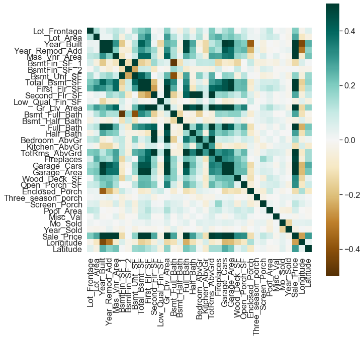
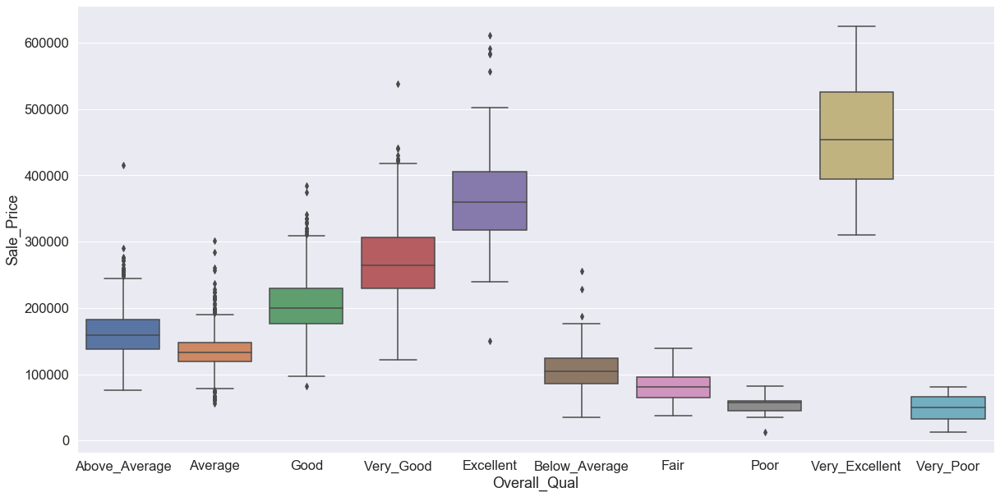

### Exploratory Data Analysis (EDA) for Regression

First, let’s load the required libraries. We will use the sklearn library for our ML tasks, and the pandas, numpy, matplotlib and seaborn libraries for general data processing and visualisation.


```python
import matplotlib.pyplot as plt
import numpy as np
import pandas as pd
import statsmodels.api as sm
import seaborn as sns
from sklearn import preprocessing
from sklearn import model_selection
import upsetplot
%matplotlib inline
sns.set(font_scale = 1.5)
```

## Load the data

We will use the Ames housing data to explore different ML approaches to regression. This dataset was “designed” by Dean De Cock as an alternative to the “classic” Boston housing dataset, and has been extensively used in ML teaching. It is also available from kaggle as part of its [advanced regression practice competition](https://www.kaggle.com/c/house-prices-advanced-regression-techniques).

The Ames Housing [Data Documentation file](https://github.sydney.edu.au/informatics/lessons-mlr/blob/gh-pages/_episodes_rmd/data/AmesHousing_DataDocumentation.txt) describes the independent variables presented in the data. This includes:

- 20 continuous variables relate to various area dimensions for each observation
- 14 discrete variables, which typically quantify the number of items occurring within the house
- 23 ordinal, 23 nominal categorical variables, with 2 (STREET: gravel or paved) - 28 (NEIGHBORHOOD) classes

We will explore both the “uncleaned” data available from kaggle/UCI, and the processed data available in the AmesHousing package in R, for which documentation is available [here](https://cran.r-project.org/web/packages/AmesHousing/AmesHousing.pdf). It can be useful for understanding what each of the independent variables mean.


```python
ameshousingClean = pd.read_csv('data/AmesHousingClean.csv')
ameshousingDirty = pd.read_csv('data/AmesHousingDirty.csv')
```

## Exploratory data analysis

Exploratory data analysis involves looking at:

- the distribution of variables in your dataset
- whether any data is missing
- skewed
- correlated variables

> ## Challenge
>
> 1. Explore the Ames Housing dataset. What can you figure out about the different variables? 
> Which do you think are more or less important?
> 
> 2. Compare the "Clean" and "Dirty" datasets:
> - What was missing in the raw data?
> - What are some of the approaches that have been taken to deal with missingness?
> 
> {: .source}
>
> > ## Solution
> > print(ameshousingClean.shape)
> > 
> > print(ameshousingDirty.shape)
> > 
> > Let's now proceed to explore the rest of the answers to this challenge.
> >
> > {: .output}
> {: .solution}
{: .challenge}

What are the dimensions of the data?

Look at the data:


```python
ameshousingClean.head()
```


<div>
<style scoped>
    .dataframe tbody tr th:only-of-type {
        vertical-align: middle;
    }

    .dataframe tbody tr th {
        vertical-align: top;
    }

    .dataframe thead th {
        text-align: right;
    }
</style>
<table border="1" class="dataframe">
  <thead>
    <tr style="text-align: right;">
      <th></th>
      <th>MS_SubClass</th>
      <th>MS_Zoning</th>
      <th>Lot_Frontage</th>
      <th>Lot_Area</th>
      <th>Street</th>
      <th>Alley</th>
      <th>Lot_Shape</th>
      <th>Land_Contour</th>
      <th>Utilities</th>
      <th>Lot_Config</th>
      <th>...</th>
      <th>Fence</th>
      <th>Misc_Feature</th>
      <th>Misc_Val</th>
      <th>Mo_Sold</th>
      <th>Year_Sold</th>
      <th>Sale_Type</th>
      <th>Sale_Condition</th>
      <th>Sale_Price</th>
      <th>Longitude</th>
      <th>Latitude</th>
    </tr>
  </thead>
  <tbody>
    <tr>
      <th>0</th>
      <td>One_Story_1946_and_Newer_All_Styles</td>
      <td>Residential_Low_Density</td>
      <td>141</td>
      <td>31770</td>
      <td>Pave</td>
      <td>No_Alley_Access</td>
      <td>Slightly_Irregular</td>
      <td>Lvl</td>
      <td>AllPub</td>
      <td>Corner</td>
      <td>...</td>
      <td>No_Fence</td>
      <td>None</td>
      <td>0</td>
      <td>5</td>
      <td>2010</td>
      <td>WD</td>
      <td>Normal</td>
      <td>215000</td>
      <td>-93.619754</td>
      <td>42.054035</td>
    </tr>
    <tr>
      <th>1</th>
      <td>One_Story_1946_and_Newer_All_Styles</td>
      <td>Residential_High_Density</td>
      <td>80</td>
      <td>11622</td>
      <td>Pave</td>
      <td>No_Alley_Access</td>
      <td>Regular</td>
      <td>Lvl</td>
      <td>AllPub</td>
      <td>Inside</td>
      <td>...</td>
      <td>Minimum_Privacy</td>
      <td>None</td>
      <td>0</td>
      <td>6</td>
      <td>2010</td>
      <td>WD</td>
      <td>Normal</td>
      <td>105000</td>
      <td>-93.619756</td>
      <td>42.053014</td>
    </tr>
    <tr>
      <th>2</th>
      <td>One_Story_1946_and_Newer_All_Styles</td>
      <td>Residential_Low_Density</td>
      <td>81</td>
      <td>14267</td>
      <td>Pave</td>
      <td>No_Alley_Access</td>
      <td>Slightly_Irregular</td>
      <td>Lvl</td>
      <td>AllPub</td>
      <td>Corner</td>
      <td>...</td>
      <td>No_Fence</td>
      <td>Gar2</td>
      <td>12500</td>
      <td>6</td>
      <td>2010</td>
      <td>WD</td>
      <td>Normal</td>
      <td>172000</td>
      <td>-93.619387</td>
      <td>42.052659</td>
    </tr>
    <tr>
      <th>3</th>
      <td>One_Story_1946_and_Newer_All_Styles</td>
      <td>Residential_Low_Density</td>
      <td>93</td>
      <td>11160</td>
      <td>Pave</td>
      <td>No_Alley_Access</td>
      <td>Regular</td>
      <td>Lvl</td>
      <td>AllPub</td>
      <td>Corner</td>
      <td>...</td>
      <td>No_Fence</td>
      <td>None</td>
      <td>0</td>
      <td>4</td>
      <td>2010</td>
      <td>WD</td>
      <td>Normal</td>
      <td>244000</td>
      <td>-93.617320</td>
      <td>42.051245</td>
    </tr>
    <tr>
      <th>4</th>
      <td>Two_Story_1946_and_Newer</td>
      <td>Residential_Low_Density</td>
      <td>74</td>
      <td>13830</td>
      <td>Pave</td>
      <td>No_Alley_Access</td>
      <td>Slightly_Irregular</td>
      <td>Lvl</td>
      <td>AllPub</td>
      <td>Inside</td>
      <td>...</td>
      <td>Minimum_Privacy</td>
      <td>None</td>
      <td>0</td>
      <td>3</td>
      <td>2010</td>
      <td>WD</td>
      <td>Normal</td>
      <td>189900</td>
      <td>-93.638933</td>
      <td>42.060899</td>
    </tr>
  </tbody>
</table>
<p>5 rows × 81 columns</p>
</div>


What types are each of the columns?


```python
ameshousingClean.dtypes
```


    MS_SubClass        object
    MS_Zoning          object
    Lot_Frontage        int64
    Lot_Area            int64
    Street             object
                       ...   
    Sale_Type          object
    Sale_Condition     object
    Sale_Price          int64
    Longitude         float64
    Latitude          float64
    Length: 81, dtype: object


Get information about index type and column types, non-null values and memory usage.


```python
ameshousingClean.info()
```

    <class 'pandas.core.frame.DataFrame'>
    RangeIndex: 2930 entries, 0 to 2929
    Data columns (total 81 columns):
     #   Column              Non-Null Count  Dtype  
    ---  ------              --------------  -----  
     0   MS_SubClass         2930 non-null   object 
     1   MS_Zoning           2930 non-null   object 
     2   Lot_Frontage        2930 non-null   int64  
     3   Lot_Area            2930 non-null   int64  
     4   Street              2930 non-null   object 
     5   Alley               2930 non-null   object 
     6   Lot_Shape           2930 non-null   object 
     7   Land_Contour        2930 non-null   object 
     8   Utilities           2930 non-null   object 
     9   Lot_Config          2930 non-null   object 
     10  Land_Slope          2930 non-null   object 
     11  Neighborhood        2930 non-null   object 
     12  Condition_1         2930 non-null   object 
     13  Condition_2         2930 non-null   object 
     14  Bldg_Type           2930 non-null   object 
     15  House_Style         2930 non-null   object 
     16  Overall_Qual        2930 non-null   object 
     17  Overall_Cond        2930 non-null   object 
     18  Year_Built          2930 non-null   int64  
     19  Year_Remod_Add      2930 non-null   int64  
     20  Roof_Style          2930 non-null   object 
     21  Roof_Matl           2930 non-null   object 
     22  Exterior_1st        2930 non-null   object 
     23  Exterior_2nd        2930 non-null   object 
     24  Mas_Vnr_Type        2930 non-null   object 
     25  Mas_Vnr_Area        2930 non-null   int64  
     26  Exter_Qual          2930 non-null   object 
     27  Exter_Cond          2930 non-null   object 
     28  Foundation          2930 non-null   object 
     29  Bsmt_Qual           2930 non-null   object 
     30  Bsmt_Cond           2930 non-null   object 
     31  Bsmt_Exposure       2930 non-null   object 
     32  BsmtFin_Type_1      2930 non-null   object 
     33  BsmtFin_SF_1        2930 non-null   int64  
     34  BsmtFin_Type_2      2930 non-null   object 
     35  BsmtFin_SF_2        2930 non-null   int64  
     36  Bsmt_Unf_SF         2930 non-null   int64  
     37  Total_Bsmt_SF       2930 non-null   int64  
     38  Heating             2930 non-null   object 
     39  Heating_QC          2930 non-null   object 
     40  Central_Air         2930 non-null   object 
     41  Electrical          2930 non-null   object 
     42  First_Flr_SF        2930 non-null   int64  
     43  Second_Flr_SF       2930 non-null   int64  
     44  Low_Qual_Fin_SF     2930 non-null   int64  
     45  Gr_Liv_Area         2930 non-null   int64  
     46  Bsmt_Full_Bath      2930 non-null   int64  
     47  Bsmt_Half_Bath      2930 non-null   int64  
     48  Full_Bath           2930 non-null   int64  
     49  Half_Bath           2930 non-null   int64  
     50  Bedroom_AbvGr       2930 non-null   int64  
     51  Kitchen_AbvGr       2930 non-null   int64  
     52  Kitchen_Qual        2930 non-null   object 
     53  TotRms_AbvGrd       2930 non-null   int64  
     54  Functional          2930 non-null   object 
     55  Fireplaces          2930 non-null   int64  
     56  Fireplace_Qu        2930 non-null   object 
     57  Garage_Type         2930 non-null   object 
     58  Garage_Finish       2930 non-null   object 
     59  Garage_Cars         2930 non-null   int64  
     60  Garage_Area         2930 non-null   int64  
     61  Garage_Qual         2930 non-null   object 
     62  Garage_Cond         2930 non-null   object 
     63  Paved_Drive         2930 non-null   object 
     64  Wood_Deck_SF        2930 non-null   int64  
     65  Open_Porch_SF       2930 non-null   int64  
     66  Enclosed_Porch      2930 non-null   int64  
     67  Three_season_porch  2930 non-null   int64  
     68  Screen_Porch        2930 non-null   int64  
     69  Pool_Area           2930 non-null   int64  
     70  Pool_QC             2930 non-null   object 
     71  Fence               2930 non-null   object 
     72  Misc_Feature        2930 non-null   object 
     73  Misc_Val            2930 non-null   int64  
     74  Mo_Sold             2930 non-null   int64  
     75  Year_Sold           2930 non-null   int64  
     76  Sale_Type           2930 non-null   object 
     77  Sale_Condition      2930 non-null   object 
     78  Sale_Price          2930 non-null   int64  
     79  Longitude           2930 non-null   float64
     80  Latitude            2930 non-null   float64
    dtypes: float64(2), int64(33), object(46)
    memory usage: 1.8+ MB


Compare with "non-clean" dataset


```python
ameshousingDirty.info()
```

    <class 'pandas.core.frame.DataFrame'>
    RangeIndex: 2930 entries, 0 to 2929
    Data columns (total 82 columns):
     #   Column           Non-Null Count  Dtype  
    ---  ------           --------------  -----  
     0   Order            2930 non-null   int64  
     1   PID              2930 non-null   int64  
     2   MS SubClass      2930 non-null   int64  
     3   MS Zoning        2930 non-null   object 
     4   Lot Frontage     2440 non-null   float64
     5   Lot Area         2930 non-null   int64  
     6   Street           2930 non-null   object 
     7   Alley            198 non-null    object 
     8   Lot Shape        2930 non-null   object 
     9   Land Contour     2930 non-null   object 
     10  Utilities        2930 non-null   object 
     11  Lot Config       2930 non-null   object 
     12  Land Slope       2930 non-null   object 
     13  Neighborhood     2930 non-null   object 
     14  Condition 1      2930 non-null   object 
     15  Condition 2      2930 non-null   object 
     16  Bldg Type        2930 non-null   object 
     17  House Style      2930 non-null   object 
     18  Overall Qual     2930 non-null   int64  
     19  Overall Cond     2930 non-null   int64  
     20  Year Built       2930 non-null   int64  
     21  Year Remod/Add   2930 non-null   int64  
     22  Roof Style       2930 non-null   object 
     23  Roof Matl        2930 non-null   object 
     24  Exterior 1st     2930 non-null   object 
     25  Exterior 2nd     2930 non-null   object 
     26  Mas Vnr Type     2907 non-null   object 
     27  Mas Vnr Area     2907 non-null   float64
     28  Exter Qual       2930 non-null   object 
     29  Exter Cond       2930 non-null   object 
     30  Foundation       2930 non-null   object 
     31  Bsmt Qual        2850 non-null   object 
     32  Bsmt Cond        2850 non-null   object 
     33  Bsmt Exposure    2847 non-null   object 
     34  BsmtFin Type 1   2850 non-null   object 
     35  BsmtFin SF 1     2929 non-null   float64
     36  BsmtFin Type 2   2849 non-null   object 
     37  BsmtFin SF 2     2929 non-null   float64
     38  Bsmt Unf SF      2929 non-null   float64
     39  Total Bsmt SF    2929 non-null   float64
     40  Heating          2930 non-null   object 
     41  Heating QC       2930 non-null   object 
     42  Central Air      2930 non-null   object 
     43  Electrical       2929 non-null   object 
     44  1st Flr SF       2930 non-null   int64  
     45  2nd Flr SF       2930 non-null   int64  
     46  Low Qual Fin SF  2930 non-null   int64  
     47  Gr Liv Area      2930 non-null   int64  
     48  Bsmt Full Bath   2928 non-null   float64
     49  Bsmt Half Bath   2928 non-null   float64
     50  Full Bath        2930 non-null   int64  
     51  Half Bath        2930 non-null   int64  
     52  Bedroom AbvGr    2930 non-null   int64  
     53  Kitchen AbvGr    2930 non-null   int64  
     54  Kitchen Qual     2930 non-null   object 
     55  TotRms AbvGrd    2930 non-null   int64  
     56  Functional       2930 non-null   object 
     57  Fireplaces       2930 non-null   int64  
     58  Fireplace Qu     1508 non-null   object 
     59  Garage Type      2773 non-null   object 
     60  Garage Yr Blt    2771 non-null   float64
     61  Garage Finish    2771 non-null   object 
     62  Garage Cars      2929 non-null   float64
     63  Garage Area      2929 non-null   float64
     64  Garage Qual      2771 non-null   object 
     65  Garage Cond      2771 non-null   object 
     66  Paved Drive      2930 non-null   object 
     67  Wood Deck SF     2930 non-null   int64  
     68  Open Porch SF    2930 non-null   int64  
     69  Enclosed Porch   2930 non-null   int64  
     70  3Ssn Porch       2930 non-null   int64  
     71  Screen Porch     2930 non-null   int64  
     72  Pool Area        2930 non-null   int64  
     73  Pool QC          13 non-null     object 
     74  Fence            572 non-null    object 
     75  Misc Feature     106 non-null    object 
     76  Misc Val         2930 non-null   int64  
     77  Mo Sold          2930 non-null   int64  
     78  Yr Sold          2930 non-null   int64  
     79  Sale Type        2930 non-null   object 
     80  Sale Condition   2930 non-null   object 
     81  SalePrice        2930 non-null   int64  
    dtypes: float64(11), int64(28), object(43)
    memory usage: 1.8+ MB


Explore how many null values are in the clean dataset


```python
ameshousingClean.isnull().sum(axis = 0)
```


    MS_SubClass       0
    MS_Zoning         0
    Lot_Frontage      0
    Lot_Area          0
    Street            0
                     ..
    Sale_Type         0
    Sale_Condition    0
    Sale_Price        0
    Longitude         0
    Latitude          0
    Length: 81, dtype: int64


What about in the original?


```python
ameshousingDirty.isnull().sum(axis = 0)
```


    Order               0
    PID                 0
    MS SubClass         0
    MS Zoning           0
    Lot Frontage      490
                     ... 
    Mo Sold             0
    Yr Sold             0
    Sale Type           0
    Sale Condition      0
    SalePrice           0
    Length: 82, dtype: int64


Find out what's the top missing:


```python
missingNo = ameshousingDirty.isnull().sum(axis = 0).sort_values(ascending = False)
missingNo = missingNo[missingNo.values  > 0]
missingNo
```


    Pool QC           2917
    Misc Feature      2824
    Alley             2732
    Fence             2358
    Fireplace Qu      1422
    Lot Frontage       490
    Garage Qual        159
    Garage Yr Blt      159
    Garage Cond        159
    Garage Finish      159
    Garage Type        157
    Bsmt Exposure       83
    BsmtFin Type 2      81
    BsmtFin Type 1      80
    Bsmt Cond           80
    Bsmt Qual           80
    Mas Vnr Type        23
    Mas Vnr Area        23
    Bsmt Full Bath       2
    Bsmt Half Bath       2
    Garage Area          1
    Garage Cars          1
    Total Bsmt SF        1
    Bsmt Unf SF          1
    BsmtFin SF 2         1
    BsmtFin SF 1         1
    Electrical           1
    dtype: int64


Plot that missingness


```python
f, ax = plt.subplots(figsize = (10, 20))
sns.barplot(missingNo.values, missingNo.index, ax = ax);
```


```python
# Use upsetplot to see where missing values occur
# together
# Only use the top 5 columns
missing_cols = missingNo.index[:5].tolist()
missing_counts = (ameshousingDirty.loc[:, missing_cols]
                  .isnull()
                  .groupby(missing_cols)
                  .size())

upsetplot.plot(missing_counts);
```


> ### Challenge: Missingness
>
> Compare the entries in the "clean" and "dirty" data frames. How was the data cleaned up?

>
> 
> {: .source}
>
> > ## Solution
> > 
> > ~~~
> > # poolQC
> > print(ameshousingDirty['Pool QC'].value_counts())
> > print(ameshousingClean['Pool_QC'].value_counts())
> > # Misc Feature
> > print(ameshousingDirty['Misc Feature'].value_counts())
> > print(ameshousingClean['Misc_Feature'].value_counts())
> > # Alley
> > print(ameshousingDirty['Alley'].value_counts())
> > print(ameshousingClean['Alley'].value_counts())
> > # Fence              2358
> > print(ameshousingDirty['Fence'].value_counts())
> > print(ameshousingClean['Fence'].value_counts())
> > # Fireplace Qu       1422
> > print(ameshousingDirty['Fireplace Qu'].value_counts())
> > print(ameshousingClean['Fireplace_Qu'].value_counts())
> > # Lot Frontage        490
> > print(ameshousingDirty['Lot Frontage'].describe())
> > print(ameshousingClean['Lot_Frontage'].describe())
> > # Garage Qual         159
> > print(ameshousingDirty['Garage Qual'].value_counts())
> > print(ameshousingClean['Garage_Qual'].value_counts())
> > ~~~
> > 
> > {: .output}
> {: .solution}
{: .challenge}

***
## Explore the data to see whether there are any unusual relationships between variables 

#### Pull out numeric and categoric variables:

1. What data types do I have in my data? Can I infer that some of them are categorical, and others are not?


```python
ameshousingClean.dtypes.value_counts()
```


    object     46
    int64      33
    float64     2
    dtype: int64


2. Pull out the categorical and numerical variables


```python
catVars = ameshousingClean.select_dtypes(include = ['object']).columns
numericVars = ameshousingClean.select_dtypes(exclude = ['object']).columns
```

3. Plot the first 11 numerical variables, and their relationship with sale price


```python
sns.pairplot(
    ameshousingClean,
    vars = numericVars[np.append(np.arange(1, 11), 33)]
);
```


```python
sns.pairplot(
    ameshousingClean,
    diag_kind="kde",
    vars = numericVars[np.append(np.arange(11, 22), 33)],
    diag_kws={'bw': 0.01}
);
```


Of the numeric variables, which ones are the most correlated (with Sale price, and, more critically, with each other)?
> ## Challenge
>
> What variables are the most correlated with SalePrice?
>
> 
> {: .source}
>
> > ## Solution
> > 
> > ~~~
> > 
> > ameshousingClean[list(numericVars)].corr().round(2).sort_values('Sale_Price', ascending = False)['Sale_Price']
> > 
> > ~~~
> > 
> > {: .output}
> {: .solution}
{: .challenge}


Now generate a correlation plot to visualise this relationship


```python
corr = ameshousingClean[numericVars].corr()

# Draw the heatmap with the mask and correct aspect ratio
fig, ax = plt.subplots(figsize=(10, 10))
sns.heatmap(corr,
            cmap=plt.cm.BrBG, 
            vmin=-0.5, vmax=0.5, 
            square=True,
            xticklabels=True, yticklabels=True,
            ax=ax);
```





```python
sns.lmplot(
    data = ameshousingClean,
    x = 'Gr_Liv_Area', y = 'Sale_Price'
);
```


### Explore distribution of Outcome variable

You also need to do EDA on the outcome variable to:

- identify outliers
- explore whether there is any skew in its distribution, and possibly identify a transformation to use when modelling the data

This is because many models, including ordinary linear regression, assume that prediction errors (and hence the response) are normally distributed.

Can you see any outliers in the data? Arguably, the five points on the right, wtih Gr_Liv_Area > 4000, are outliers, that can significantly affect the fit of our model. We will filter these out prior to modelling:


```python
ameshousingClean = ameshousingClean.loc[ameshousingClean['Gr_Liv_Area'] <= 4000, :]
```

> The next 2 plots do not need to be demonstrated in class, but are here as notes

You can also use violin and box plots to explore the relationship between categorical variables and the Outcome


```python
# skip while teaching
f, ax = plt.subplots(figsize = (20, 10))
sns.violinplot(
    x = 'Overall_Qual',
    y = 'Sale_Price',
    data = ameshousingClean,
    ax = ax
);
```


```python
# skip while teaching
f, ax = plt.subplots(figsize = (20, 10))
sns.boxplot(
    x = 'Overall_Qual',
    y = 'Sale_Price',
    data = ameshousingClean,
    ax = ax
);
```





```python
# DO INCLUDE this one though
f, ax = plt.subplots(figsize = (20, 10))
sns.distplot(
    ameshousingClean['Sale_Price'],
    kde = False,
    ax = ax
);
```


Explore different ways of transforming the Sale Price.


```python
# raw data
sm.qqplot(
    ameshousingClean['Sale_Price'],
    line = 's'
);
```


```python
# sqrt transformation
sm.qqplot(
    np.sqrt(ameshousingClean['Sale_Price']),
    line = 's'
);
```


```python
# log transform
sm.qqplot(
    np.log(ameshousingClean['Sale_Price']),
    line = 's'
);
```


```python
# log10 transform
sm.qqplot(
    np.log10(ameshousingClean['Sale_Price']),
    line = 's'
);
```


> ## Challenge
>
> If you were working with this dataset, which of the above would you prefer?
>
> 
> {: .source}
>
> > ## Solution
> > 
> > The log10 transformation seems best, as it both helps the distribution look more normal and
> > helps keep our error metrics and final predictions easily interpretable.
> > It also means that the errors of predicting the values of inexpensive 
> > and expensive houses will affect the prediction equally. 
> > 
> > {: .output}
> {: .solution}
{: .challenge}

