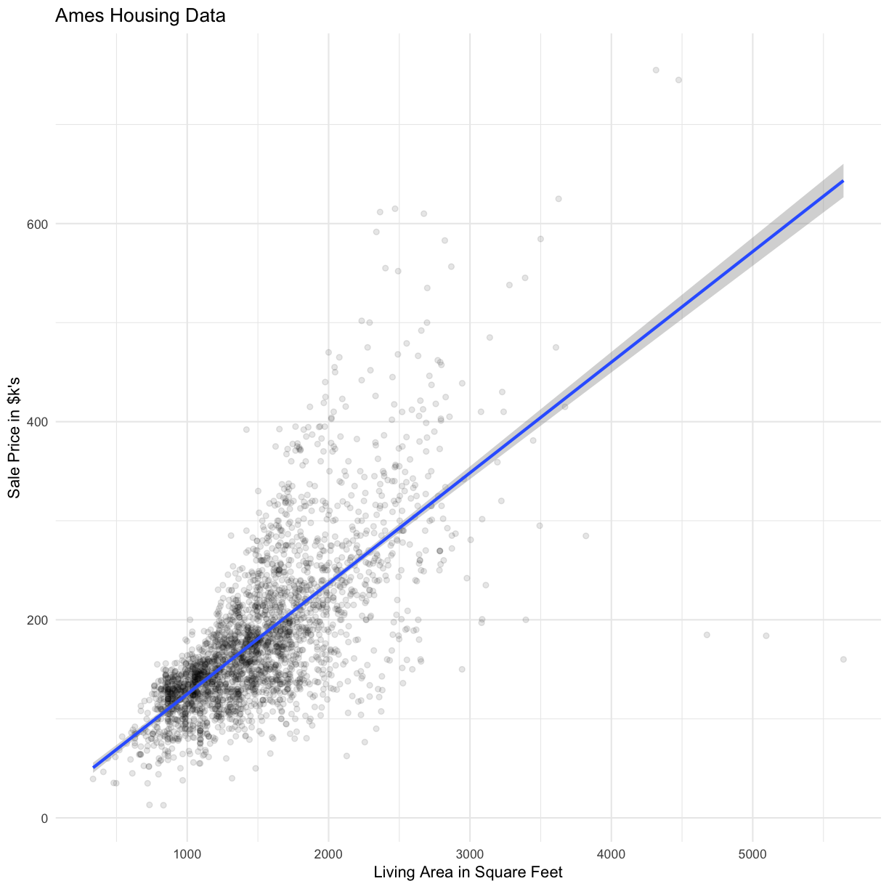

---
# Please do not edit this file directly; it is auto generated.
# Instead, please edit 03-EDA.md in _episodes_rmd/
title: "EDA for Regression"
author: "Darya Vanichkina"
exercises: 0
keypoints: 
- Regression is the prediction of the value of a continuous variable based on one or more other continuous or categorical variables.
- Exploratory data analysis is the essential first step in ML
objectives: 
- Introduce some of the key packages for EDA and ML
- Introduce and explore the Ames Housing dataset
questions: 
- How do we predict one continuous variable based on others?
- What is the first step of any ML project (and often the most time consuming)?
source: Rmd
start: 0
teaching: 30
bibliography: references.bib
---

First, let's load the required libraries. We will use the `caret` library for our ML tasks, and the `tidyverse` for general data processing and visualisation.

~~~
# set knitr options
# opts_knit$set(warning = FALSE, message = FALSE)

library(tidyverse)
library(caret)
library(tidymodels)
library(naniar) # for visualising missing data
library(ggplot2)
library(GGally) # for EDA
library(psych)
library(corrplot)
library(AmesHousing)
library(bestNormalize)

theme_set(theme_minimal())
~~~
{: .language-r}

We will use the Ames housing data to explore different ML approaches to regression. This dataset was designed by Dean De Cock [@de2011ames] as an alternative to the "classic" Boston housing dataset, and has been extensively used in  ML teaching. It is also available from kaggle as part of its [advanced regression practice competition](https://www.kaggle.com/c/house-prices-advanced-regression-techniques).

The Ames Housing Data Documentation file describes the independent variables presented in the data. This includes:
- 20 continuous variables relate to various area dimensions for each observation
- 14 discrete variables, which typically quantify the number of items occurring within the house
- 23 ordinal, 23 nominal categorical variables, with 2 (STREET: gravel or paved) - 28 (NEIGHBORHOOD) classes 

We will explore both the "uncleaned" data available from kaggle/UCI, and the processed data available in the `AmesHousing` package in R, for which documentation is available [here](https://cran.r-project.org/web/packages/AmesHousing/AmesHousing.pdf). It can be useful for understading what each of the independent variables mean.

~~~
ameshousing <- AmesHousing::make_ames()

# Read in the uncleaned data. 
ameshousing2 <- read_csv("data/AmesHousing.csv", guess_max=1500)
~~~
{: .language-r}

~~~
Parsed with column specification:
cols(
  .default = col_character(),
  Order = col_double(),
  `Lot Frontage` = col_double(),
  `Lot Area` = col_double(),
  `Overall Qual` = col_double(),
  `Overall Cond` = col_double(),
  `Year Built` = col_double(),
  `Year Remod/Add` = col_double(),
  `Mas Vnr Area` = col_double(),
  `BsmtFin SF 1` = col_double(),
  `BsmtFin SF 2` = col_double(),
  `Bsmt Unf SF` = col_double(),
  `Total Bsmt SF` = col_double(),
  `1st Flr SF` = col_double(),
  `2nd Flr SF` = col_double(),
  `Low Qual Fin SF` = col_double(),
  `Gr Liv Area` = col_double(),
  `Bsmt Full Bath` = col_double(),
  `Bsmt Half Bath` = col_double(),
  `Full Bath` = col_double(),
  `Half Bath` = col_double()
  # ... with 17 more columns
)
~~~
{: .output}

~~~
See spec(...) for full column specifications.
~~~
{: .output}

## Exploratory data analysis

> ## Challenge
>
> 1. Explore the Ames Housing dataset. What can you figure out about the different variables? 
> Which do you think are more or less important?
> 
> 2. Compare the ameshousing dataset, which is from the AmesHousing package in R and has been cleaned,
> with the ameshousing2 dataset, which is the raw data from the UCI machine learning repository.
> What was missing in the raw data?
> What are some of the approaches that have been taken to deal with missingness?
> 
> {: .source}
>
> > ## Solution
> > dim(ameshousing)
> > 
> > str(ameshousing)
> > 
> >
> >
> > {: .output}
> {: .solution}
{: .challenge}

~~~
numericVars <- ameshousing %>% 
  select_if( is.numeric) %>%
  names()

catVars <- ameshousing %>% 
  select_if(Negate(is.numeric)) %>%
  names()
~~~
{: .language-r}

~~~
colSums(sapply(ameshousing, is.na)) %>% 
  as.data.frame() %>% 
  rename(Missing = ".") %>%
  tibble::rownames_to_column()%>% 
  arrange(desc(Missing))
~~~
{: .language-r}

~~~
              rowname Missing
1         MS_SubClass       0
2           MS_Zoning       0
3        Lot_Frontage       0
4            Lot_Area       0
5              Street       0
6               Alley       0
7           Lot_Shape       0
8        Land_Contour       0
9           Utilities       0
10         Lot_Config       0
11         Land_Slope       0
12       Neighborhood       0
13        Condition_1       0
14        Condition_2       0
15          Bldg_Type       0
16        House_Style       0
17       Overall_Qual       0
18       Overall_Cond       0
19         Year_Built       0
20     Year_Remod_Add       0
21         Roof_Style       0
22          Roof_Matl       0
23       Exterior_1st       0
24       Exterior_2nd       0
25       Mas_Vnr_Type       0
26       Mas_Vnr_Area       0
27         Exter_Qual       0
28         Exter_Cond       0
29         Foundation       0
30          Bsmt_Qual       0
31          Bsmt_Cond       0
32      Bsmt_Exposure       0
33     BsmtFin_Type_1       0
34       BsmtFin_SF_1       0
35     BsmtFin_Type_2       0
36       BsmtFin_SF_2       0
37        Bsmt_Unf_SF       0
38      Total_Bsmt_SF       0
39            Heating       0
40         Heating_QC       0
41        Central_Air       0
42         Electrical       0
43       First_Flr_SF       0
44      Second_Flr_SF       0
45    Low_Qual_Fin_SF       0
46        Gr_Liv_Area       0
47     Bsmt_Full_Bath       0
48     Bsmt_Half_Bath       0
49          Full_Bath       0
50          Half_Bath       0
51      Bedroom_AbvGr       0
52      Kitchen_AbvGr       0
53       Kitchen_Qual       0
54      TotRms_AbvGrd       0
55         Functional       0
56         Fireplaces       0
57       Fireplace_Qu       0
58        Garage_Type       0
59      Garage_Finish       0
60        Garage_Cars       0
61        Garage_Area       0
62        Garage_Qual       0
63        Garage_Cond       0
64        Paved_Drive       0
65       Wood_Deck_SF       0
66      Open_Porch_SF       0
67     Enclosed_Porch       0
68 Three_season_porch       0
69       Screen_Porch       0
70          Pool_Area       0
71            Pool_QC       0
72              Fence       0
73       Misc_Feature       0
74           Misc_Val       0
75            Mo_Sold       0
76          Year_Sold       0
77          Sale_Type       0
78     Sale_Condition       0
79         Sale_Price       0
80          Longitude       0
81           Latitude       0
~~~
{: .output}

~~~
colSums(sapply(ameshousing2, is.na)) %>% 
  as.data.frame() %>% 
  rename(Missing = ".") %>%
  tibble::rownames_to_column()%>% 
  arrange(desc(Missing))
~~~
{: .language-r}

~~~
           rowname Missing
1          Pool QC    2917
2     Misc Feature    2824
3            Alley    2732
4            Fence    2358
5     Fireplace Qu    1422
6     Lot Frontage     490
7    Garage Yr Blt     159
8    Garage Finish     159
9      Garage Qual     159
10     Garage Cond     159
11     Garage Type     157
12   Bsmt Exposure      83
13  BsmtFin Type 2      81
14       Bsmt Qual      80
15       Bsmt Cond      80
16  BsmtFin Type 1      80
17    Mas Vnr Type      23
18    Mas Vnr Area      23
19  Bsmt Full Bath       2
20  Bsmt Half Bath       2
21    BsmtFin SF 1       1
22    BsmtFin SF 2       1
23     Bsmt Unf SF       1
24   Total Bsmt SF       1
25      Electrical       1
26     Garage Cars       1
27     Garage Area       1
28           Order       0
29             PID       0
30     MS SubClass       0
31       MS Zoning       0
32        Lot Area       0
33          Street       0
34       Lot Shape       0
35    Land Contour       0
36       Utilities       0
37      Lot Config       0
38      Land Slope       0
39    Neighborhood       0
40     Condition 1       0
41     Condition 2       0
42       Bldg Type       0
43     House Style       0
44    Overall Qual       0
45    Overall Cond       0
46      Year Built       0
47  Year Remod/Add       0
48      Roof Style       0
49       Roof Matl       0
50    Exterior 1st       0
51    Exterior 2nd       0
52      Exter Qual       0
53      Exter Cond       0
54      Foundation       0
55         Heating       0
56      Heating QC       0
57     Central Air       0
58      1st Flr SF       0
59      2nd Flr SF       0
60 Low Qual Fin SF       0
61     Gr Liv Area       0
62       Full Bath       0
63       Half Bath       0
64   Bedroom AbvGr       0
65   Kitchen AbvGr       0
66    Kitchen Qual       0
67   TotRms AbvGrd       0
68      Functional       0
69      Fireplaces       0
70     Paved Drive       0
71    Wood Deck SF       0
72   Open Porch SF       0
73  Enclosed Porch       0
74      3Ssn Porch       0
75    Screen Porch       0
76       Pool Area       0
77        Misc Val       0
78         Mo Sold       0
79         Yr Sold       0
80       Sale Type       0
81  Sale Condition       0
82       SalePrice       0
~~~
{: .output}

### Use the naniar library to visualise missing

Some new visualisation for missing data in the tidy context has been proposed [@tierney2018expanding]. See this [web page](http://naniar.njtierney.com/articles/naniar-visualisation.html) for more options for your own data.

~~~
gg_miss_var(ameshousing2)
~~~
{: .language-r}

~~~
gg_miss_upset(ameshousing2, nsets = 10)
~~~
{: .language-r}

~~~
#
ggpairs(data = ameshousing, 
        columns = numericVars[c(1:10, 33)], 
        title = "Numeric variables 1 - 10")
~~~
{: .language-r}

~~~
# ggpairs(ameshousing, numericVars[c(11:20, 33)], title = "Numeric variables 11 - 20")
# ggpairs(ameshousing, numericVars[c(21:33)], title = "Numeric variables 21 - 33")
ggpairs(data = ameshousing, 
        columns = c(catVars[2:5], "Sale_Price"), 
        title = "Some categorical variables")
~~~
{: .language-r}

~~~
`stat_bin()` using `bins = 30`. Pick better value with `binwidth`.
`stat_bin()` using `bins = 30`. Pick better value with `binwidth`.
`stat_bin()` using `bins = 30`. Pick better value with `binwidth`.
`stat_bin()` using `bins = 30`. Pick better value with `binwidth`.
~~~
{: .output}

~~~
# pairs.panels(ameshousing[ , names(ameshousing)[c(3, 16, 23, 27,37)]], scale=TRUE)
ameshousingCor <- cor(ameshousing[,numericVars],
                      use = "pairwise.complete.obs")

cp<-corrplot(ameshousingCor, 
             order="hclust",
             method="square",
             tl.col = 'black',
             tl.cex = .8)

#draw lines on the corrplot to highlight the Sale Price column
dc <- which(colnames(cp)=="Sale_Price") #column  of diagnosis
tc <- dim(ameshousingCor)[1] #total columns
dr <- tc-dc+1 #row of diagnosis, counting from the bottoem of the corrplot
segments(c(-0.5,0.5)+dc, rep(0.5,2), c(-0.5,0.5)+dc, rep(tc+0.5,2), lwd=1) #vertical
segments(rep(0.5,2), c(-0.5,0.5)+dr, rep(tc+0.5,2), c(-0.5,0.5)+dr, lwd=1) #horizontal
~~~
{: .language-r}

~~~
# FIXME adapt below
# all_numVar <- all[, numericVars]
# cor_numVar <- cor(all_numVar, use="pairwise.complete.obs") #correlations of all numeric variables
# 
# #sort on decreasing correlations with SalePrice
# cor_sorted <- as.matrix(sort(cor_numVar[,'SalePrice'], decreasing = TRUE))
#  #select only high corelations
# CorHigh <- names(which(apply(cor_sorted, 1, function(x) abs(x)>0.5)))
# cor_numVar <- cor_numVar[CorHigh, CorHigh]
# 
# corrplot.mixed(cor_numVar, tl.col="black", tl.pos = "lt")
~~~
{: .language-r}

> ## Challenge
>
> What variables are the most correlated with SalePrice?
>
> 
> {: .source}
>
> > ## Solution
> > 
> > ~~~
> > 
> > as.data.frame(ameshousingCor) %>% 
> >   rownames_to_column() %>%
> >   gather(pair, value, -rowname) %>%
> >   filter(rowname != pair) %>% #remove self correlation
> >   filter(rowname == "Sale_Price") %>%
> >   arrange(desc(abs(value)))
> > 
> > ~~~
> > 
> > {: .output}
> {: .solution}
{: .challenge}

~~~
ameshousing %>%
  ggplot(aes(x = Gr_Liv_Area, y = Sale_Price/1000)) + 
  geom_point(alpha = 0.1) + 
  labs(y = "Sale Price in $k's",
       x = "Living Area in Square Feet",
       title = "Ames Housing Data")+
  geom_smooth(method= "lm")
~~~
{: .language-r}

~~~
ameshousing %>%
  ggplot(aes(x = `Overall_Qual`, y = Sale_Price)) + 
  geom_violin()
~~~
{: .language-r}

~~~
ameshousing %>%
  mutate(Quality = as.factor(`Overall_Qual`)) %>% 
  ggplot(aes(x = Quality, 
             y = Sale_Price/1000, 
             fill = Quality)) + 
  labs(y = "Sale Price in $k's",
       x = "Overall Quality of House",
       title = "Ames Housing Data")+
  geom_boxplot()+
  theme(axis.text.x= element_text(angle = 45))
~~~
{: .language-r}

## EDA of outcome variable

~~~
ameshousing %>% 
  ggplot(aes(x = Sale_Price/1000)) + 
  geom_histogram(bins = 50) + 
  labs(x = "Sale Price in $k's",
       y = "Number of Houses sold")
~~~
{: .language-r}

~~~
# remove 5 observations with huuuuuge houses which are skewing the data
ameshousingFilt <- 
  ameshousing %>% 
  filter(Gr_Liv_Area <= 4000)
~~~
{: .language-r}

~~~
#No transform

ameshousingFilt %>%
  ggplot(aes( sample = Sale_Price)) +
  stat_qq() + stat_qq_line(col = "blue")
~~~
{: .language-r}

~~~
#Sqrt transform

ameshousingFilt %>%
  ggplot(aes( sample = sqrt(Sale_Price))) +
  stat_qq() + stat_qq_line(col = "blue")
~~~
{: .language-r}

~~~
#natural log transform

ameshousingFilt %>%
  ggplot(aes( sample = log(Sale_Price))) +
  stat_qq() + stat_qq_line(col = "blue")
~~~
{: .language-r}

~~~
#log10 transform

ameshousingFilt %>%
  ggplot(aes( sample = log10(Sale_Price))) +
  stat_qq() + stat_qq_line(col = "blue")
~~~
{: .language-r}

~~~
#rank transform to a normal distribution

list_ordered<-orderNorm(ameshousingFilt$Sale_Price)
~~~
{: .language-r}

~~~
Warning in orderNorm(ameshousingFilt$Sale_Price): Ties in data, Normal distribution not guaranteed
~~~
{: .error}

~~~
ameshousingFilt$Sale_Price_normed<-list_ordered$x.t

ameshousingFilt %>%
  ggplot(aes( sample = Sale_Price_normed)) +
  stat_qq() + stat_qq_line(col = "blue")
~~~
{: .language-r}

## Splitting into testing and training datasets

We will use the `rsample` package (part of `tidymodels`) to split the Ames housing data. We can also use the  `caret` function `createDataPartition()` to split the data into training and testing sets. See the [caret documentation](https://topepo.github.io/caret/data-splitting.html) if you'd like to learn about other approaches to generate a test set, for example based on maximum dissimilarity.

~~~
set.seed(42) # so we all get the same results
ames_split <- initial_split(ameshousingFilt, prop = 0.7, strata = "Sale_Price")
ameshousingFiltTrain <- training(ames_split)
ameshousingFiltTest <- testing(ames_split)
# alternatusing caret
# train <- createDataPartition(ameshousingFilt$Sale_PriceLog, 
#                              p = 0.7, #70/30 split
#                              list = FALSE,
#                              times = 1 #this is not for CV
#                              )
# 
# 
# # training set
# ameshousingFiltTrain <- ameshousingFilt[train,]
# # testing set
# ameshousingFiltTest <- ameshousingFilt[-train,]
~~~
{: .language-r}

> ## Challenge
>
> Check the distribution of Sale price is the same in the testing and training datasets. 
> 
> {: .source}
>
> > ## Solution
> > 
> > ~~~
> > 
> > ameshousingFiltTrain %>% 
> >   ggplot(aes(x = log(Sale_Price),  col = "red", fill = NULL)) + 
> >   geom_density() + theme_minimal() +
> >   geom_line(data = ameshousingFiltTest,
> >             stat = "density",
> >             col = "blue") + theme(legend.position="none")
> > 
> > ~~~
> > 
> > {: .output}
> {: .solution}
{: .challenge}

## References

