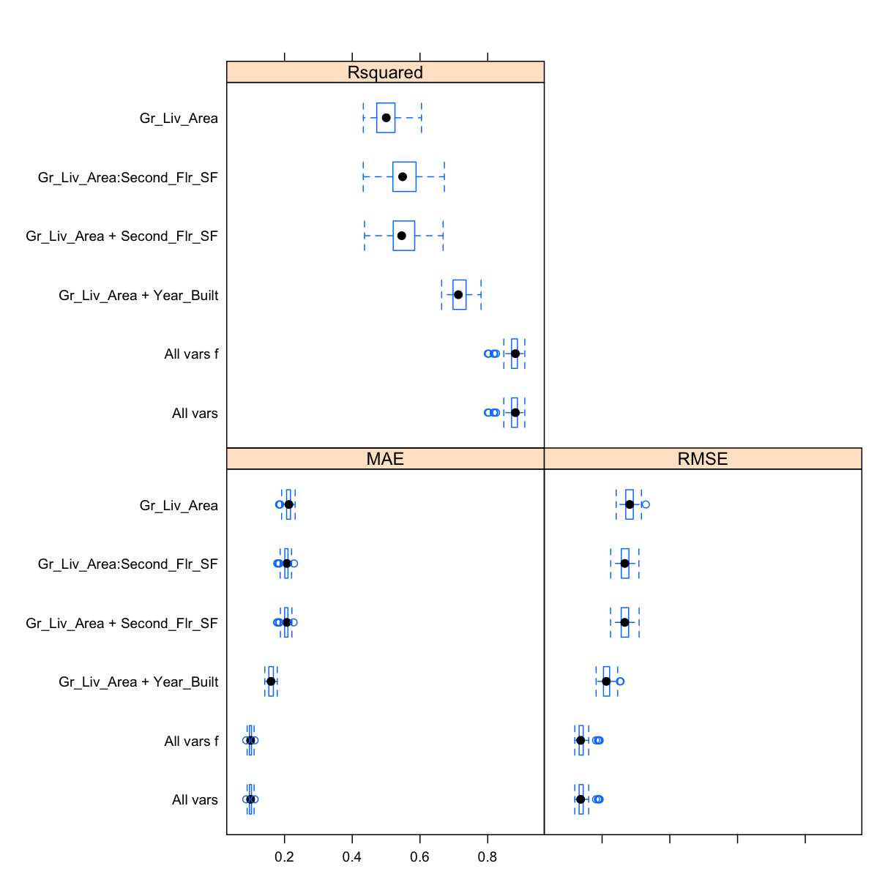
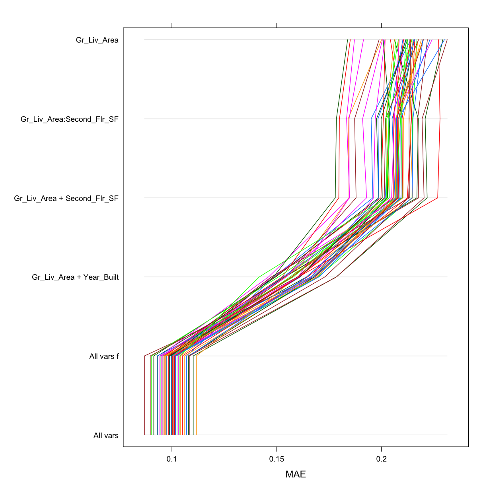
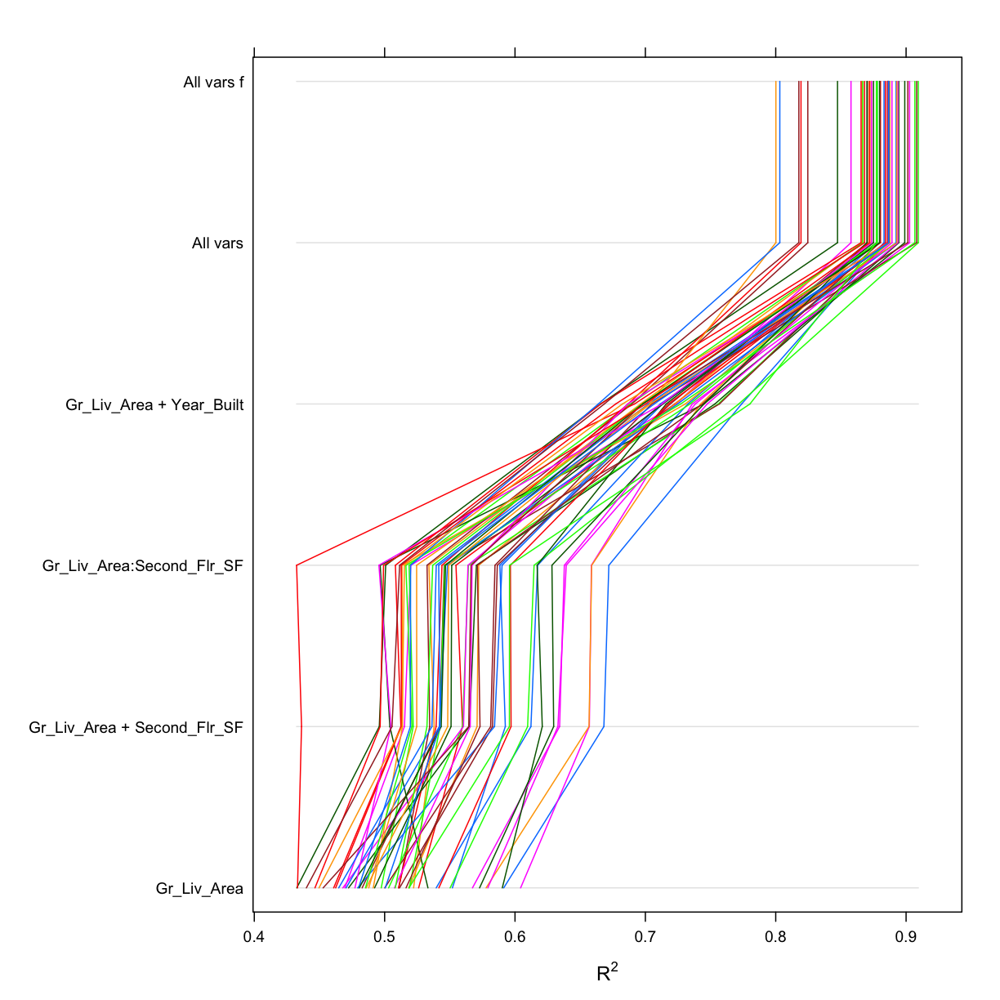
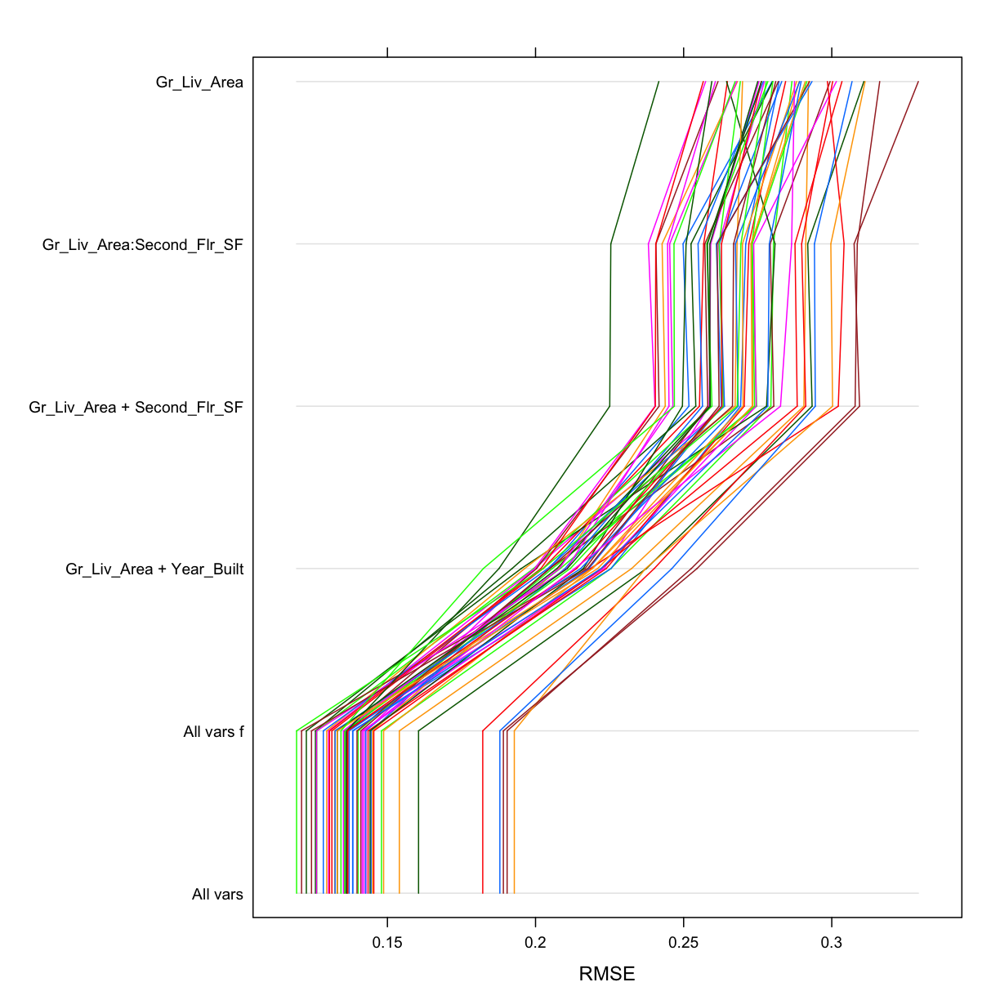

---
# Please do not edit this file directly; it is auto generated.
# Instead, please edit 10-LinReg.md in _episodes_rmd/
title: "Linear Regression. "
author: "Darya Vanichkina"
exercises: 0
keypoints: 
- Regression is the prediction of the value of a continuous variable based on one or more other continuous or categorical variables.
- Multiple types of regression can be implemented to fit the data
objectives: 
- Introduce several approaches to carrying out linear regression in R
- Introduce and explore the Ames Housing dataset
questions: 
- How do we predict one continuous variable based on others?
- What is the first step of any ML project (and often the most time consuming)?
source: Rmd
start: 0
teaching: 30
bibliography: references.bib
---

~~~
# set knitr options
# opts_knit$set(warning = FALSE, message = FALSE)
  
library(tidyverse)
~~~
{: .language-r}

~~~
── Attaching packages ────────────────────────────────── tidyverse 1.2.1 ──
~~~
{: .output}

~~~
✔ ggplot2 3.1.0       ✔ purrr   0.3.1  
✔ tibble  2.0.1       ✔ dplyr   0.8.0.1
✔ tidyr   0.8.3       ✔ stringr 1.4.0  
✔ readr   1.3.1       ✔ forcats 0.4.0  
~~~
{: .output}

~~~
Warning: package 'tibble' was built under R version 3.5.2
~~~
{: .error}

~~~
Warning: package 'tidyr' was built under R version 3.5.2
~~~
{: .error}

~~~
Warning: package 'purrr' was built under R version 3.5.2
~~~
{: .error}

~~~
Warning: package 'dplyr' was built under R version 3.5.2
~~~
{: .error}

~~~
Warning: package 'stringr' was built under R version 3.5.2
~~~
{: .error}

~~~
Warning: package 'forcats' was built under R version 3.5.2
~~~
{: .error}

~~~
── Conflicts ───────────────────────────────────── tidyverse_conflicts() ──
✖ dplyr::filter() masks stats::filter()
✖ dplyr::lag()    masks stats::lag()
~~~
{: .output}

~~~
library(caret)
~~~
{: .language-r}

~~~
Loading required package: lattice
~~~
{: .output}

~~~

Attaching package: 'caret'
~~~
{: .output}

~~~
The following object is masked from 'package:purrr':

    lift
~~~
{: .output}

~~~
library(tidymodels)
~~~
{: .language-r}

~~~
── Attaching packages ───────────────────────────────── tidymodels 0.0.2 ──
~~~
{: .output}

~~~
✔ broom     0.5.1     ✔ recipes   0.1.4
✔ dials     0.0.2     ✔ rsample   0.0.4
✔ infer     0.4.0     ✔ yardstick 0.0.3
✔ parsnip   0.0.1     
~~~
{: .output}

~~~
Warning: package 'rsample' was built under R version 3.5.2
~~~
{: .error}

~~~
Warning: package 'yardstick' was built under R version 3.5.2
~~~
{: .error}

~~~
── Conflicts ──────────────────────────────────── tidymodels_conflicts() ──
✖ scales::discard()      masks purrr::discard()
✖ dplyr::filter()        masks stats::filter()
✖ recipes::fixed()       masks stringr::fixed()
✖ dplyr::lag()           masks stats::lag()
✖ caret::lift()          masks purrr::lift()
✖ yardstick::precision() masks caret::precision()
✖ yardstick::recall()    masks caret::recall()
✖ yardstick::spec()      masks readr::spec()
✖ recipes::step()        masks stats::step()
~~~
{: .output}

~~~
library(AmesHousing)
old <- theme_set(theme_minimal())
rm(old)
~~~
{: .language-r}

## Use the (new, tidy) recipes package for feature engineering

~~~
engineer_features_allames <-
  recipe(Sale_Price ~ ., data = ameshousingFiltTrain) %>%
  step_log(Sale_Price) %>% # log(Sale_Price)
  step_other(all_nominal(), threshold = 0.1) %>%
  step_nzv(all_nominal()) %>% # removes variables that are highly sparse or unbalanced
  step_integer(matches("Qual|Cond|QC|Qu")) %>%
  step_center(all_numeric(), -all_outcomes()) %>%
  step_scale(all_numeric(), -all_outcomes()) %>%
  step_dummy(all_nominal(), -all_outcomes(), one_hot = TRUE)

# Train a Data Recipe
engineer_features_allames_prep <- prep(engineer_features_allames, training = ameshousingFiltTrain, verbose = TRUE)
~~~
{: .language-r}

~~~
oper 1 step log [training] 
oper 2 step other [training] 
oper 3 step nzv [training] 
oper 4 step integer [training] 
oper 5 step center [training] 
oper 6 step scale [training] 
oper 7 step dummy [training] 
The retained training set is ~ 2.02 Mb  in memory.
~~~
{: .output}

~~~
# get the transformed training dataset
ameshousingFiltTrain_engineered <- juice(engineer_features_allames_prep)
# apply the same transformation onto the test set (with the TRAINING parameters)
ameshousingFiltTest_engineered <- bake(engineer_features_allames_prep, new_data = ameshousingFiltTest)

# use caret to specify cross-validation
ames_resamplingCV <- trainControl(
  method = "repeatedcv", 
  number = 10, #  k = 10
  repeats = 5, # repeat 5 times,
  savePredictions = "final"
  )

saveRDS(ames_resamplingCV, "models/ames_resamplingCV.Rds")
saveRDS(ameshousingFiltTrain_engineered, "models/ameshousingFiltTrain_engineered.Rds")
saveRDS(ameshousingFiltTest_engineered, "models/ameshousingFiltTest_engineered.Rds")
saveRDS(ameshousingFiltTrain, "models/ameshousingFiltTrain.Rds")
saveRDS(ameshousingFiltTest, "models/ameshousingFiltTest.Rds")
~~~
{: .language-r}

> ## Challenge
>
> 1. Look at (and explore) the code for the recipe above. What are each of the steps doing?
> Use the ?help to assist you with this.
> 
> 2. 
> {: .source}
>
> > ## Solution
> > 
> > We will discuss this as a group.
> > 
> > {: .output}
> {: .solution}
{: .challenge}

## Fitting a model

There are currently 237 types of ML models than can be fit using the `caret` package. To see a list of these, and to explore what tuning parameters they might need, [see here](https://topepo.github.io/caret/available-models.html). You can also [define your own model](https://topepo.github.io/caret/available-models.html).

### Simple linear regression

~~~
# predict sale price based on Gr_Liv_Area
set.seed(42)
ames_lm1 <- train(
  Sale_Price ~ Gr_Liv_Area,
  data = ameshousingFiltTrain_engineered,
  method = "lm",
  trControl = ames_resamplingCV)
summary(ames_lm1)
~~~
{: .language-r}

~~~

Call:
lm(formula = .outcome ~ ., data = dat)

Residuals:
     Min       1Q   Median       3Q      Max 
-2.17403 -0.14979  0.02552  0.16382  0.90417 

Coefficients:
             Estimate Std. Error t value Pr(>|t|)    
(Intercept) 12.019913   0.006256 1921.35   <2e-16 ***
Gr_Liv_Area  0.284183   0.006258   45.41   <2e-16 ***
---
Signif. codes:  0 '***' 0.001 '**' 0.01 '*' 0.05 '.' 0.1 ' ' 1

Residual standard error: 0.2833 on 2048 degrees of freedom
Multiple R-squared:  0.5018,	Adjusted R-squared:  0.5015 
F-statistic:  2062 on 1 and 2048 DF,  p-value: < 2.2e-16
~~~
{: .output}

~~~
ames_lm1
~~~
{: .language-r}

~~~
Linear Regression 

2050 samples
   1 predictor

No pre-processing
Resampling: Cross-Validated (10 fold, repeated 5 times) 
Summary of sample sizes: 1845, 1846, 1846, 1844, 1845, 1845, ... 
Resampling results:

  RMSE       Rsquared   MAE      
  0.2828749  0.5047152  0.2113447

Tuning parameter 'intercept' was held constant at a value of TRUE
~~~
{: .output}

~~~
basicLm <- lm(Sale_Price ~ Gr_Liv_Area, data = ameshousingFiltTrain_engineered)

# implement as function

myLinearRegression <- function(formula, df){
set.seed(42)
tmp <-  train(
  formula,
  data = df,
  method = "lm",
  trControl = ames_resamplingCV)
print(summary(tmp))
return(tmp)
}
ames_lm1 <- myLinearRegression(Sale_Price ~ Gr_Liv_Area, df = ameshousingFiltTrain_engineered)
~~~
{: .language-r}

~~~

Call:
lm(formula = .outcome ~ ., data = dat)

Residuals:
     Min       1Q   Median       3Q      Max 
-2.17403 -0.14979  0.02552  0.16382  0.90417 

Coefficients:
             Estimate Std. Error t value Pr(>|t|)    
(Intercept) 12.019913   0.006256 1921.35   <2e-16 ***
Gr_Liv_Area  0.284183   0.006258   45.41   <2e-16 ***
---
Signif. codes:  0 '***' 0.001 '**' 0.01 '*' 0.05 '.' 0.1 ' ' 1

Residual standard error: 0.2833 on 2048 degrees of freedom
Multiple R-squared:  0.5018,	Adjusted R-squared:  0.5015 
F-statistic:  2062 on 1 and 2048 DF,  p-value: < 2.2e-16
~~~
{: .output}

Use Second_Flr_SF and Gr_Liv_Area to predict:

~~~
ames_lm2 <- myLinearRegression(Sale_Price ~ Gr_Liv_Area + Second_Flr_SF,  df = ameshousingFiltTrain_engineered)
~~~
{: .language-r}

~~~

Call:
lm(formula = .outcome ~ ., data = dat)

Residuals:
     Min       1Q   Median       3Q      Max 
-2.14131 -0.13960  0.05071  0.17640  0.82879 

Coefficients:
               Estimate Std. Error t value Pr(>|t|)    
(Intercept)   12.019913   0.005922 2029.68   <2e-16 ***
Gr_Liv_Area    0.373355   0.008272   45.13   <2e-16 ***
Second_Flr_SF -0.127746   0.008272  -15.44   <2e-16 ***
---
Signif. codes:  0 '***' 0.001 '**' 0.01 '*' 0.05 '.' 0.1 ' ' 1

Residual standard error: 0.2681 on 2047 degrees of freedom
Multiple R-squared:  0.5537,	Adjusted R-squared:  0.5533 
F-statistic:  1270 on 2 and 2047 DF,  p-value: < 2.2e-16
~~~
{: .output}

~~~
ames_lm2i <-  myLinearRegression(Sale_Price ~ Gr_Liv_Area + Second_Flr_SF +Gr_Liv_Area:Second_Flr_SF, df = ameshousingFiltTrain_engineered)
~~~
{: .language-r}

~~~

Call:
lm(formula = .outcome ~ ., data = dat)

Residuals:
     Min       1Q   Median       3Q      Max 
-2.12675 -0.13865  0.05232  0.17476  0.83003 

Coefficients:
                             Estimate Std. Error  t value Pr(>|t|)    
(Intercept)                 12.030335   0.007084 1698.306   <2e-16 ***
Gr_Liv_Area                  0.373879   0.008262   45.251   <2e-16 ***
Second_Flr_SF               -0.113593   0.009812  -11.576   <2e-16 ***
`Gr_Liv_Area:Second_Flr_SF` -0.014938   0.005590   -2.672   0.0076 ** 
---
Signif. codes:  0 '***' 0.001 '**' 0.01 '*' 0.05 '.' 0.1 ' ' 1

Residual standard error: 0.2677 on 2046 degrees of freedom
Multiple R-squared:  0.5553,	Adjusted R-squared:  0.5546 
F-statistic: 851.6 on 3 and 2046 DF,  p-value: < 2.2e-16
~~~
{: .output}

~~~
ames_lm2year <-  myLinearRegression(Sale_Price ~ Gr_Liv_Area + Year_Built, df = ameshousingFiltTrain_engineered)
~~~
{: .language-r}

~~~

Call:
lm(formula = .outcome ~ ., data = dat)

Residuals:
    Min      1Q  Median      3Q     Max 
-1.9346 -0.1216  0.0091  0.1268  0.6673 

Coefficients:
            Estimate Std. Error t value Pr(>|t|)    
(Intercept) 12.01991    0.00474 2535.93   <2e-16 ***
Gr_Liv_Area  0.23594    0.00490   48.15   <2e-16 ***
Year_Built   0.19107    0.00490   39.00   <2e-16 ***
---
Signif. codes:  0 '***' 0.001 '**' 0.01 '*' 0.05 '.' 0.1 ' ' 1

Residual standard error: 0.2146 on 2047 degrees of freedom
Multiple R-squared:  0.7141,	Adjusted R-squared:  0.7139 
F-statistic:  2557 on 2 and 2047 DF,  p-value: < 2.2e-16
~~~
{: .output}

All predictors

~~~
ames_lm_all <- myLinearRegression(Sale_Price ~. , df = ameshousingFiltTrain_engineered)
~~~
{: .language-r}

~~~
Warning in predict.lm(modelFit, newdata): prediction from a rank-deficient
fit may be misleading
Warning in predict.lm(modelFit, newdata): prediction from a rank-deficient
fit may be misleading
Warning in predict.lm(modelFit, newdata): prediction from a rank-deficient
fit may be misleading
Warning in predict.lm(modelFit, newdata): prediction from a rank-deficient
fit may be misleading
Warning in predict.lm(modelFit, newdata): prediction from a rank-deficient
fit may be misleading
Warning in predict.lm(modelFit, newdata): prediction from a rank-deficient
fit may be misleading
Warning in predict.lm(modelFit, newdata): prediction from a rank-deficient
fit may be misleading
Warning in predict.lm(modelFit, newdata): prediction from a rank-deficient
fit may be misleading
Warning in predict.lm(modelFit, newdata): prediction from a rank-deficient
fit may be misleading
Warning in predict.lm(modelFit, newdata): prediction from a rank-deficient
fit may be misleading
Warning in predict.lm(modelFit, newdata): prediction from a rank-deficient
fit may be misleading
Warning in predict.lm(modelFit, newdata): prediction from a rank-deficient
fit may be misleading
Warning in predict.lm(modelFit, newdata): prediction from a rank-deficient
fit may be misleading
Warning in predict.lm(modelFit, newdata): prediction from a rank-deficient
fit may be misleading
Warning in predict.lm(modelFit, newdata): prediction from a rank-deficient
fit may be misleading
Warning in predict.lm(modelFit, newdata): prediction from a rank-deficient
fit may be misleading
Warning in predict.lm(modelFit, newdata): prediction from a rank-deficient
fit may be misleading
Warning in predict.lm(modelFit, newdata): prediction from a rank-deficient
fit may be misleading
Warning in predict.lm(modelFit, newdata): prediction from a rank-deficient
fit may be misleading
Warning in predict.lm(modelFit, newdata): prediction from a rank-deficient
fit may be misleading
Warning in predict.lm(modelFit, newdata): prediction from a rank-deficient
fit may be misleading
Warning in predict.lm(modelFit, newdata): prediction from a rank-deficient
fit may be misleading
Warning in predict.lm(modelFit, newdata): prediction from a rank-deficient
fit may be misleading
Warning in predict.lm(modelFit, newdata): prediction from a rank-deficient
fit may be misleading
Warning in predict.lm(modelFit, newdata): prediction from a rank-deficient
fit may be misleading
Warning in predict.lm(modelFit, newdata): prediction from a rank-deficient
fit may be misleading
Warning in predict.lm(modelFit, newdata): prediction from a rank-deficient
fit may be misleading
Warning in predict.lm(modelFit, newdata): prediction from a rank-deficient
fit may be misleading
Warning in predict.lm(modelFit, newdata): prediction from a rank-deficient
fit may be misleading
Warning in predict.lm(modelFit, newdata): prediction from a rank-deficient
fit may be misleading
Warning in predict.lm(modelFit, newdata): prediction from a rank-deficient
fit may be misleading
Warning in predict.lm(modelFit, newdata): prediction from a rank-deficient
fit may be misleading
Warning in predict.lm(modelFit, newdata): prediction from a rank-deficient
fit may be misleading
Warning in predict.lm(modelFit, newdata): prediction from a rank-deficient
fit may be misleading
Warning in predict.lm(modelFit, newdata): prediction from a rank-deficient
fit may be misleading
Warning in predict.lm(modelFit, newdata): prediction from a rank-deficient
fit may be misleading
Warning in predict.lm(modelFit, newdata): prediction from a rank-deficient
fit may be misleading
Warning in predict.lm(modelFit, newdata): prediction from a rank-deficient
fit may be misleading
Warning in predict.lm(modelFit, newdata): prediction from a rank-deficient
fit may be misleading
Warning in predict.lm(modelFit, newdata): prediction from a rank-deficient
fit may be misleading
Warning in predict.lm(modelFit, newdata): prediction from a rank-deficient
fit may be misleading
Warning in predict.lm(modelFit, newdata): prediction from a rank-deficient
fit may be misleading
Warning in predict.lm(modelFit, newdata): prediction from a rank-deficient
fit may be misleading
Warning in predict.lm(modelFit, newdata): prediction from a rank-deficient
fit may be misleading
Warning in predict.lm(modelFit, newdata): prediction from a rank-deficient
fit may be misleading
Warning in predict.lm(modelFit, newdata): prediction from a rank-deficient
fit may be misleading
Warning in predict.lm(modelFit, newdata): prediction from a rank-deficient
fit may be misleading
Warning in predict.lm(modelFit, newdata): prediction from a rank-deficient
fit may be misleading
Warning in predict.lm(modelFit, newdata): prediction from a rank-deficient
fit may be misleading
Warning in predict.lm(modelFit, newdata): prediction from a rank-deficient
fit may be misleading
~~~
{: .error}

~~~

Call:
lm(formula = .outcome ~ ., data = dat)

Residuals:
     Min       1Q   Median       3Q      Max 
-1.75262 -0.06665  0.00672  0.07609  0.66457 

Coefficients: (26 not defined because of singularities)
                                                  Estimate Std. Error
(Intercept)                                     11.9383504  0.0632397
Lot_Frontage                                     0.0057295  0.0035404
Lot_Area                                         0.0074096  0.0037715
Condition_1                                     -0.0150801  0.0032081
Overall_Qual                                    -0.0174341  0.0038185
Overall_Cond                                    -0.0043960  0.0041270
Year_Built                                       0.0547379  0.0092095
Year_Remod_Add                                   0.0517375  0.0049924
Mas_Vnr_Area                                     0.0062012  0.0047458
Exter_Qual                                      -0.0047506  0.0043224
Exter_Cond                                      -0.0077413  0.0033108
Bsmt_Qual                                        0.0121668  0.0040474
Bsmt_Cond                                       -0.0033871  0.0035742
BsmtFin_SF_1                                    -0.0030077  0.0171358
BsmtFin_SF_2                                    -0.0056156  0.0051575
Bsmt_Unf_SF                                     -0.0188051  0.0062680
Total_Bsmt_SF                                    0.0693869  0.0081944
Heating_QC                                      -0.0229077  0.0041663
First_Flr_SF                                     0.0327202  0.0231290
Second_Flr_SF                                    0.0414227  0.0212907
Low_Qual_Fin_SF                                 -0.0063727  0.0037654
Gr_Liv_Area                                      0.1150347  0.0296602
Bsmt_Full_Bath                                   0.0033289  0.0047272
Bsmt_Half_Bath                                  -0.0012788  0.0033667
Full_Bath                                        0.0044626  0.0054544
Half_Bath                                        0.0015980  0.0046968
Bedroom_AbvGr                                   -0.0235788  0.0050543
Kitchen_AbvGr                                   -0.0147807  0.0046176
Kitchen_Qual                                     0.0112181  0.0039833
TotRms_AbvGrd                                    0.0113680  0.0066693
Fireplaces                                       0.0283755  0.0039371
Fireplace_Qu                                    -0.0194918  0.0033636
Garage_Cars                                      0.0324155  0.0077875
Garage_Area                                      0.0115652  0.0072840
Garage_Qual                                      0.0029119  0.0049441
Garage_Cond                                     -0.0321138  0.0052845
Wood_Deck_SF                                     0.0108100  0.0035195
Open_Porch_SF                                    0.0117964  0.0034800
Enclosed_Porch                                   0.0125621  0.0034894
Three_season_porch                               0.0035006  0.0031381
Screen_Porch                                     0.0121384  0.0032450
Pool_Area                                        0.0039358  0.0032710
Misc_Val                                         0.0002197  0.0031186
Mo_Sold                                         -0.0001357  0.0031584
Year_Sold                                       -0.0095606  0.0031652
Sale_Condition                                  -0.0242755  0.0039201
Longitude                                        0.0007253  0.0043056
Latitude                                         0.0161816  0.0036905
MS_SubClass_One_Story_1946_and_Newer_All_Styles -0.0093906  0.0149352
MS_SubClass_Two_Story_1946_and_Newer            -0.0803828  0.0190478
MS_SubClass_other                                       NA         NA
MS_Zoning_Residential_Low_Density                0.0084387  0.0146755
MS_Zoning_Residential_Medium_Density            -0.0625450  0.0164672
MS_Zoning_other                                         NA         NA
Alley_No_Alley_Access                           -0.0069096  0.0141760
Alley_other                                             NA         NA
Lot_Shape_Regular                               -0.0182066  0.0207449
Lot_Shape_Slightly_Irregular                    -0.0053676  0.0204830
Lot_Shape_other                                         NA         NA
Land_Contour_Lvl                                -0.0293276  0.0124508
Land_Contour_other                                      NA         NA
Lot_Config_Corner                               -0.0067066  0.0131305
Lot_Config_Inside                               -0.0110421  0.0115265
Lot_Config_other                                        NA         NA
Land_Slope_Gtl                                  -0.0045350  0.0174187
Land_Slope_other                                        NA         NA
Neighborhood_North_Ames                         -0.0310194  0.0125101
Neighborhood_other                                      NA         NA
Bldg_Type_OneFam                                 0.0711855  0.0157112
Bldg_Type_other                                         NA         NA
House_Style_One_and_Half_Fin                     0.0095694  0.0192060
House_Style_One_Story                           -0.0170326  0.0175726
House_Style_Two_Story                            0.0247091  0.0201492
House_Style_other                                       NA         NA
Roof_Style_Gable                                 0.0010078  0.0227777
Roof_Style_Hip                                   0.0191981  0.0240040
Roof_Style_other                                        NA         NA
Exterior_1st_HdBoard                            -0.0261602  0.0205112
Exterior_1st_MetalSd                             0.0157935  0.0383233
Exterior_1st_VinylSd                            -0.0200973  0.0328280
Exterior_1st_Wd.Sdng                            -0.0148348  0.0183429
Exterior_1st_other                                      NA         NA
Exterior_2nd_HdBoard                             0.0131665  0.0202696
Exterior_2nd_MetalSd                            -0.0143721  0.0379388
Exterior_2nd_VinylSd                             0.0066596  0.0326368
Exterior_2nd_Wd.Sdng                             0.0400796  0.0183306
Exterior_2nd_other                                      NA         NA
Mas_Vnr_Type_BrkFace                            -0.0278090  0.0124177
Mas_Vnr_Type_None                               -0.0136458  0.0133193
Mas_Vnr_Type_other                                      NA         NA
Foundation_BrkTil                               -0.0059383  0.0293948
Foundation_CBlock                                0.0043500  0.0272523
Foundation_PConc                                 0.0302098  0.0282159
Foundation_other                                        NA         NA
Bsmt_Exposure_Av                                 0.0086265  0.0138846
Bsmt_Exposure_Gd                                 0.0592364  0.0159815
Bsmt_Exposure_No                                -0.0217393  0.0110571
Bsmt_Exposure_other                                     NA         NA
BsmtFin_Type_1_ALQ                               0.0132958  0.0177451
BsmtFin_Type_1_GLQ                               0.0461181  0.0129033
BsmtFin_Type_1_Rec                               0.0011726  0.0279222
BsmtFin_Type_1_Unf                              -0.0002422  0.0340130
BsmtFin_Type_1_other                                    NA         NA
BsmtFin_Type_2_Unf                               0.0032725  0.0154858
BsmtFin_Type_2_other                                    NA         NA
Central_Air_Y                                    0.0706292  0.0155702
Central_Air_other                                       NA         NA
Electrical_SBrkr                                -0.0044047  0.0127440
Electrical_other                                        NA         NA
Functional_Typ                                   0.1164855  0.0131750
Functional_other                                        NA         NA
Garage_Type_Attchd                               0.0362395  0.0126960
Garage_Type_Detchd                               0.0214678  0.0151546
Garage_Type_other                                       NA         NA
Garage_Finish_Fin                               -0.0825322  0.0290088
Garage_Finish_RFn                               -0.0920349  0.0289244
Garage_Finish_Unf                               -0.0986331  0.0282101
Garage_Finish_other                                     NA         NA
Paved_Drive_Paved                                0.0438567  0.0135058
Paved_Drive_other                                       NA         NA
Fence_Minimum_Privacy                           -0.0044965  0.0141549
Fence_No_Fence                                  -0.0091962  0.0114591
Fence_other                                             NA         NA
Sale_Type_WD.                                   -0.0482232  0.0120433
Sale_Type_other                                         NA         NA
                                                t value Pr(>|t|)    
(Intercept)                                     188.779  < 2e-16 ***
Lot_Frontage                                      1.618 0.105758    
Lot_Area                                          1.965 0.049598 *  
Condition_1                                      -4.701 2.77e-06 ***
Overall_Qual                                     -4.566 5.29e-06 ***
Overall_Cond                                     -1.065 0.286925    
Year_Built                                        5.944 3.29e-09 ***
Year_Remod_Add                                   10.363  < 2e-16 ***
Mas_Vnr_Area                                      1.307 0.191478    
Exter_Qual                                       -1.099 0.271872    
Exter_Cond                                       -2.338 0.019478 *  
Bsmt_Qual                                         3.006 0.002681 ** 
Bsmt_Cond                                        -0.948 0.343430    
BsmtFin_SF_1                                     -0.176 0.860687    
BsmtFin_SF_2                                     -1.089 0.276367    
Bsmt_Unf_SF                                      -3.000 0.002733 ** 
Total_Bsmt_SF                                     8.468  < 2e-16 ***
Heating_QC                                       -5.498 4.34e-08 ***
First_Flr_SF                                      1.415 0.157321    
Second_Flr_SF                                     1.946 0.051849 .  
Low_Qual_Fin_SF                                  -1.692 0.090728 .  
Gr_Liv_Area                                       3.878 0.000109 ***
Bsmt_Full_Bath                                    0.704 0.481389    
Bsmt_Half_Bath                                   -0.380 0.704118    
Full_Bath                                         0.818 0.413365    
Half_Bath                                         0.340 0.733717    
Bedroom_AbvGr                                    -4.665 3.29e-06 ***
Kitchen_AbvGr                                    -3.201 0.001392 ** 
Kitchen_Qual                                      2.816 0.004907 ** 
TotRms_AbvGrd                                     1.705 0.088445 .  
Fireplaces                                        7.207 8.13e-13 ***
Fireplace_Qu                                     -5.795 7.95e-09 ***
Garage_Cars                                       4.162 3.28e-05 ***
Garage_Area                                       1.588 0.112505    
Garage_Qual                                       0.589 0.555957    
Garage_Cond                                      -6.077 1.47e-09 ***
Wood_Deck_SF                                      3.071 0.002160 ** 
Open_Porch_SF                                     3.390 0.000713 ***
Enclosed_Porch                                    3.600 0.000326 ***
Three_season_porch                                1.116 0.264756    
Screen_Porch                                      3.741 0.000189 ***
Pool_Area                                         1.203 0.229025    
Misc_Val                                          0.070 0.943840    
Mo_Sold                                          -0.043 0.965730    
Year_Sold                                        -3.021 0.002556 ** 
Sale_Condition                                   -6.193 7.20e-10 ***
Longitude                                         0.168 0.866237    
Latitude                                          4.385 1.22e-05 ***
MS_SubClass_One_Story_1946_and_Newer_All_Styles  -0.629 0.529584    
MS_SubClass_Two_Story_1946_and_Newer             -4.220 2.55e-05 ***
MS_SubClass_other                                    NA       NA    
MS_Zoning_Residential_Low_Density                 0.575 0.565345    
MS_Zoning_Residential_Medium_Density             -3.798 0.000150 ***
MS_Zoning_other                                      NA       NA    
Alley_No_Alley_Access                            -0.487 0.626022    
Alley_other                                          NA       NA    
Lot_Shape_Regular                                -0.878 0.380244    
Lot_Shape_Slightly_Irregular                     -0.262 0.793310    
Lot_Shape_other                                      NA       NA    
Land_Contour_Lvl                                 -2.355 0.018598 *  
Land_Contour_other                                   NA       NA    
Lot_Config_Corner                                -0.511 0.609571    
Lot_Config_Inside                                -0.958 0.338195    
Lot_Config_other                                     NA       NA    
Land_Slope_Gtl                                   -0.260 0.794622    
Land_Slope_other                                     NA       NA    
Neighborhood_North_Ames                          -2.480 0.013239 *  
Neighborhood_other                                   NA       NA    
Bldg_Type_OneFam                                  4.531 6.23e-06 ***
Bldg_Type_other                                      NA       NA    
House_Style_One_and_Half_Fin                      0.498 0.618364    
House_Style_One_Story                            -0.969 0.332532    
House_Style_Two_Story                             1.226 0.220232    
House_Style_other                                    NA       NA    
Roof_Style_Gable                                  0.044 0.964714    
Roof_Style_Hip                                    0.800 0.423931    
Roof_Style_other                                     NA       NA    
Exterior_1st_HdBoard                             -1.275 0.202316    
Exterior_1st_MetalSd                              0.412 0.680302    
Exterior_1st_VinylSd                             -0.612 0.540478    
Exterior_1st_Wd.Sdng                             -0.809 0.418758    
Exterior_1st_other                                   NA       NA    
Exterior_2nd_HdBoard                              0.650 0.516047    
Exterior_2nd_MetalSd                             -0.379 0.704861    
Exterior_2nd_VinylSd                              0.204 0.838334    
Exterior_2nd_Wd.Sdng                              2.186 0.028899 *  
Exterior_2nd_other                                   NA       NA    
Mas_Vnr_Type_BrkFace                             -2.239 0.025238 *  
Mas_Vnr_Type_None                                -1.025 0.305720    
Mas_Vnr_Type_other                                   NA       NA    
Foundation_BrkTil                                -0.202 0.839924    
Foundation_CBlock                                 0.160 0.873197    
Foundation_PConc                                  1.071 0.284452    
Foundation_other                                     NA       NA    
Bsmt_Exposure_Av                                  0.621 0.534473    
Bsmt_Exposure_Gd                                  3.707 0.000216 ***
Bsmt_Exposure_No                                 -1.966 0.049428 *  
Bsmt_Exposure_other                                  NA       NA    
BsmtFin_Type_1_ALQ                                0.749 0.453788    
BsmtFin_Type_1_GLQ                                3.574 0.000360 ***
BsmtFin_Type_1_Rec                                0.042 0.966506    
BsmtFin_Type_1_Unf                               -0.007 0.994320    
BsmtFin_Type_1_other                                 NA       NA    
BsmtFin_Type_2_Unf                                0.211 0.832659    
BsmtFin_Type_2_other                                 NA       NA    
Central_Air_Y                                     4.536 6.08e-06 ***
Central_Air_other                                    NA       NA    
Electrical_SBrkr                                 -0.346 0.729658    
Electrical_other                                     NA       NA    
Functional_Typ                                    8.841  < 2e-16 ***
Functional_other                                     NA       NA    
Garage_Type_Attchd                                2.854 0.004357 ** 
Garage_Type_Detchd                                1.417 0.156762    
Garage_Type_other                                    NA       NA    
Garage_Finish_Fin                                -2.845 0.004486 ** 
Garage_Finish_RFn                                -3.182 0.001486 ** 
Garage_Finish_Unf                                -3.496 0.000482 ***
Garage_Finish_other                                  NA       NA    
Paved_Drive_Paved                                 3.247 0.001185 ** 
Paved_Drive_other                                    NA       NA    
Fence_Minimum_Privacy                            -0.318 0.750772    
Fence_No_Fence                                   -0.803 0.422351    
Fence_other                                          NA       NA    
Sale_Type_WD.                                    -4.004 6.46e-05 ***
Sale_Type_other                                      NA       NA    
---
Signif. codes:  0 '***' 0.001 '**' 0.01 '*' 0.05 '.' 0.1 ' ' 1

Residual standard error: 0.1368 on 1951 degrees of freedom
Multiple R-squared:  0.8893,	Adjusted R-squared:  0.8838 
F-statistic: 159.9 on 98 and 1951 DF,  p-value: < 2.2e-16
~~~
{: .output}

~~~
saveRDS(ames_lm_all, "models/ames_lm_all.Rds")
~~~
{: .language-r}

~~~
ameshousingFiltTrain_engineeredF <- ameshousingFiltTrain_engineered %>% select(-ends_with("other"))
ames_lm_all2 <- myLinearRegression(Sale_Price ~. , df = ameshousingFiltTrain_engineeredF)
~~~
{: .language-r}

~~~

Call:
lm(formula = .outcome ~ ., data = dat)

Residuals:
     Min       1Q   Median       3Q      Max 
-1.75262 -0.06665  0.00672  0.07609  0.66457 

Coefficients:
                                                  Estimate Std. Error
(Intercept)                                     11.9383504  0.0632397
Lot_Frontage                                     0.0057295  0.0035404
Lot_Area                                         0.0074096  0.0037715
Condition_1                                     -0.0150801  0.0032081
Overall_Qual                                    -0.0174341  0.0038185
Overall_Cond                                    -0.0043960  0.0041270
Year_Built                                       0.0547379  0.0092095
Year_Remod_Add                                   0.0517375  0.0049924
Mas_Vnr_Area                                     0.0062012  0.0047458
Exter_Qual                                      -0.0047506  0.0043224
Exter_Cond                                      -0.0077413  0.0033108
Bsmt_Qual                                        0.0121668  0.0040474
Bsmt_Cond                                       -0.0033871  0.0035742
BsmtFin_SF_1                                    -0.0030077  0.0171358
BsmtFin_SF_2                                    -0.0056156  0.0051575
Bsmt_Unf_SF                                     -0.0188051  0.0062680
Total_Bsmt_SF                                    0.0693869  0.0081944
Heating_QC                                      -0.0229077  0.0041663
First_Flr_SF                                     0.0327202  0.0231290
Second_Flr_SF                                    0.0414227  0.0212907
Low_Qual_Fin_SF                                 -0.0063727  0.0037654
Gr_Liv_Area                                      0.1150347  0.0296602
Bsmt_Full_Bath                                   0.0033289  0.0047272
Bsmt_Half_Bath                                  -0.0012788  0.0033667
Full_Bath                                        0.0044626  0.0054544
Half_Bath                                        0.0015980  0.0046968
Bedroom_AbvGr                                   -0.0235788  0.0050543
Kitchen_AbvGr                                   -0.0147807  0.0046176
Kitchen_Qual                                     0.0112181  0.0039833
TotRms_AbvGrd                                    0.0113680  0.0066693
Fireplaces                                       0.0283755  0.0039371
Fireplace_Qu                                    -0.0194918  0.0033636
Garage_Cars                                      0.0324155  0.0077875
Garage_Area                                      0.0115652  0.0072840
Garage_Qual                                      0.0029119  0.0049441
Garage_Cond                                     -0.0321138  0.0052845
Wood_Deck_SF                                     0.0108100  0.0035195
Open_Porch_SF                                    0.0117964  0.0034800
Enclosed_Porch                                   0.0125621  0.0034894
Three_season_porch                               0.0035006  0.0031381
Screen_Porch                                     0.0121384  0.0032450
Pool_Area                                        0.0039358  0.0032710
Misc_Val                                         0.0002197  0.0031186
Mo_Sold                                         -0.0001357  0.0031584
Year_Sold                                       -0.0095606  0.0031652
Sale_Condition                                  -0.0242755  0.0039201
Longitude                                        0.0007253  0.0043056
Latitude                                         0.0161816  0.0036905
MS_SubClass_One_Story_1946_and_Newer_All_Styles -0.0093906  0.0149352
MS_SubClass_Two_Story_1946_and_Newer            -0.0803828  0.0190478
MS_Zoning_Residential_Low_Density                0.0084387  0.0146755
MS_Zoning_Residential_Medium_Density            -0.0625450  0.0164672
Alley_No_Alley_Access                           -0.0069096  0.0141760
Lot_Shape_Regular                               -0.0182066  0.0207449
Lot_Shape_Slightly_Irregular                    -0.0053676  0.0204830
Land_Contour_Lvl                                -0.0293276  0.0124508
Lot_Config_Corner                               -0.0067066  0.0131305
Lot_Config_Inside                               -0.0110421  0.0115265
Land_Slope_Gtl                                  -0.0045350  0.0174187
Neighborhood_North_Ames                         -0.0310194  0.0125101
Bldg_Type_OneFam                                 0.0711855  0.0157112
House_Style_One_and_Half_Fin                     0.0095694  0.0192060
House_Style_One_Story                           -0.0170326  0.0175726
House_Style_Two_Story                            0.0247091  0.0201492
Roof_Style_Gable                                 0.0010078  0.0227777
Roof_Style_Hip                                   0.0191981  0.0240040
Exterior_1st_HdBoard                            -0.0261602  0.0205112
Exterior_1st_MetalSd                             0.0157935  0.0383233
Exterior_1st_VinylSd                            -0.0200973  0.0328280
Exterior_1st_Wd.Sdng                            -0.0148348  0.0183429
Exterior_2nd_HdBoard                             0.0131665  0.0202696
Exterior_2nd_MetalSd                            -0.0143721  0.0379388
Exterior_2nd_VinylSd                             0.0066596  0.0326368
Exterior_2nd_Wd.Sdng                             0.0400796  0.0183306
Mas_Vnr_Type_BrkFace                            -0.0278090  0.0124177
Mas_Vnr_Type_None                               -0.0136458  0.0133193
Foundation_BrkTil                               -0.0059383  0.0293948
Foundation_CBlock                                0.0043500  0.0272523
Foundation_PConc                                 0.0302098  0.0282159
Bsmt_Exposure_Av                                 0.0086265  0.0138846
Bsmt_Exposure_Gd                                 0.0592364  0.0159815
Bsmt_Exposure_No                                -0.0217393  0.0110571
BsmtFin_Type_1_ALQ                               0.0132958  0.0177451
BsmtFin_Type_1_GLQ                               0.0461181  0.0129033
BsmtFin_Type_1_Rec                               0.0011726  0.0279222
BsmtFin_Type_1_Unf                              -0.0002422  0.0340130
BsmtFin_Type_2_Unf                               0.0032725  0.0154858
Central_Air_Y                                    0.0706292  0.0155702
Electrical_SBrkr                                -0.0044047  0.0127440
Functional_Typ                                   0.1164855  0.0131750
Garage_Type_Attchd                               0.0362395  0.0126960
Garage_Type_Detchd                               0.0214678  0.0151546
Garage_Finish_Fin                               -0.0825322  0.0290088
Garage_Finish_RFn                               -0.0920349  0.0289244
Garage_Finish_Unf                               -0.0986331  0.0282101
Paved_Drive_Paved                                0.0438567  0.0135058
Fence_Minimum_Privacy                           -0.0044965  0.0141549
Fence_No_Fence                                  -0.0091962  0.0114591
Sale_Type_WD.                                   -0.0482232  0.0120433
                                                t value Pr(>|t|)    
(Intercept)                                     188.779  < 2e-16 ***
Lot_Frontage                                      1.618 0.105758    
Lot_Area                                          1.965 0.049598 *  
Condition_1                                      -4.701 2.77e-06 ***
Overall_Qual                                     -4.566 5.29e-06 ***
Overall_Cond                                     -1.065 0.286925    
Year_Built                                        5.944 3.29e-09 ***
Year_Remod_Add                                   10.363  < 2e-16 ***
Mas_Vnr_Area                                      1.307 0.191478    
Exter_Qual                                       -1.099 0.271872    
Exter_Cond                                       -2.338 0.019478 *  
Bsmt_Qual                                         3.006 0.002681 ** 
Bsmt_Cond                                        -0.948 0.343430    
BsmtFin_SF_1                                     -0.176 0.860687    
BsmtFin_SF_2                                     -1.089 0.276367    
Bsmt_Unf_SF                                      -3.000 0.002733 ** 
Total_Bsmt_SF                                     8.468  < 2e-16 ***
Heating_QC                                       -5.498 4.34e-08 ***
First_Flr_SF                                      1.415 0.157321    
Second_Flr_SF                                     1.946 0.051849 .  
Low_Qual_Fin_SF                                  -1.692 0.090728 .  
Gr_Liv_Area                                       3.878 0.000109 ***
Bsmt_Full_Bath                                    0.704 0.481389    
Bsmt_Half_Bath                                   -0.380 0.704118    
Full_Bath                                         0.818 0.413365    
Half_Bath                                         0.340 0.733717    
Bedroom_AbvGr                                    -4.665 3.29e-06 ***
Kitchen_AbvGr                                    -3.201 0.001392 ** 
Kitchen_Qual                                      2.816 0.004907 ** 
TotRms_AbvGrd                                     1.705 0.088445 .  
Fireplaces                                        7.207 8.13e-13 ***
Fireplace_Qu                                     -5.795 7.95e-09 ***
Garage_Cars                                       4.162 3.28e-05 ***
Garage_Area                                       1.588 0.112505    
Garage_Qual                                       0.589 0.555957    
Garage_Cond                                      -6.077 1.47e-09 ***
Wood_Deck_SF                                      3.071 0.002160 ** 
Open_Porch_SF                                     3.390 0.000713 ***
Enclosed_Porch                                    3.600 0.000326 ***
Three_season_porch                                1.116 0.264756    
Screen_Porch                                      3.741 0.000189 ***
Pool_Area                                         1.203 0.229025    
Misc_Val                                          0.070 0.943840    
Mo_Sold                                          -0.043 0.965730    
Year_Sold                                        -3.021 0.002556 ** 
Sale_Condition                                   -6.193 7.20e-10 ***
Longitude                                         0.168 0.866237    
Latitude                                          4.385 1.22e-05 ***
MS_SubClass_One_Story_1946_and_Newer_All_Styles  -0.629 0.529584    
MS_SubClass_Two_Story_1946_and_Newer             -4.220 2.55e-05 ***
MS_Zoning_Residential_Low_Density                 0.575 0.565345    
MS_Zoning_Residential_Medium_Density             -3.798 0.000150 ***
Alley_No_Alley_Access                            -0.487 0.626022    
Lot_Shape_Regular                                -0.878 0.380244    
Lot_Shape_Slightly_Irregular                     -0.262 0.793310    
Land_Contour_Lvl                                 -2.355 0.018598 *  
Lot_Config_Corner                                -0.511 0.609571    
Lot_Config_Inside                                -0.958 0.338195    
Land_Slope_Gtl                                   -0.260 0.794622    
Neighborhood_North_Ames                          -2.480 0.013239 *  
Bldg_Type_OneFam                                  4.531 6.23e-06 ***
House_Style_One_and_Half_Fin                      0.498 0.618364    
House_Style_One_Story                            -0.969 0.332532    
House_Style_Two_Story                             1.226 0.220232    
Roof_Style_Gable                                  0.044 0.964714    
Roof_Style_Hip                                    0.800 0.423931    
Exterior_1st_HdBoard                             -1.275 0.202316    
Exterior_1st_MetalSd                              0.412 0.680302    
Exterior_1st_VinylSd                             -0.612 0.540478    
Exterior_1st_Wd.Sdng                             -0.809 0.418758    
Exterior_2nd_HdBoard                              0.650 0.516047    
Exterior_2nd_MetalSd                             -0.379 0.704861    
Exterior_2nd_VinylSd                              0.204 0.838334    
Exterior_2nd_Wd.Sdng                              2.186 0.028899 *  
Mas_Vnr_Type_BrkFace                             -2.239 0.025238 *  
Mas_Vnr_Type_None                                -1.025 0.305720    
Foundation_BrkTil                                -0.202 0.839924    
Foundation_CBlock                                 0.160 0.873197    
Foundation_PConc                                  1.071 0.284452    
Bsmt_Exposure_Av                                  0.621 0.534473    
Bsmt_Exposure_Gd                                  3.707 0.000216 ***
Bsmt_Exposure_No                                 -1.966 0.049428 *  
BsmtFin_Type_1_ALQ                                0.749 0.453788    
BsmtFin_Type_1_GLQ                                3.574 0.000360 ***
BsmtFin_Type_1_Rec                                0.042 0.966506    
BsmtFin_Type_1_Unf                               -0.007 0.994320    
BsmtFin_Type_2_Unf                                0.211 0.832659    
Central_Air_Y                                     4.536 6.08e-06 ***
Electrical_SBrkr                                 -0.346 0.729658    
Functional_Typ                                    8.841  < 2e-16 ***
Garage_Type_Attchd                                2.854 0.004357 ** 
Garage_Type_Detchd                                1.417 0.156762    
Garage_Finish_Fin                                -2.845 0.004486 ** 
Garage_Finish_RFn                                -3.182 0.001486 ** 
Garage_Finish_Unf                                -3.496 0.000482 ***
Paved_Drive_Paved                                 3.247 0.001185 ** 
Fence_Minimum_Privacy                            -0.318 0.750772    
Fence_No_Fence                                   -0.803 0.422351    
Sale_Type_WD.                                    -4.004 6.46e-05 ***
---
Signif. codes:  0 '***' 0.001 '**' 0.01 '*' 0.05 '.' 0.1 ' ' 1

Residual standard error: 0.1368 on 1951 degrees of freedom
Multiple R-squared:  0.8893,	Adjusted R-squared:  0.8838 
F-statistic: 159.9 on 98 and 1951 DF,  p-value: < 2.2e-16
~~~
{: .output}

~~~
rm(ameshousingFiltTrain_engineeredF)
~~~
{: .language-r}

Compare performance on training set:

~~~
allResamples <- resamples(list("Gr_Liv_Area" = ames_lm1, 
                               "Gr_Liv_Area + Year_Built" = ames_lm2year,
                               "Gr_Liv_Area + Second_Flr_SF" = ames_lm2,
                               "Gr_Liv_Area:Second_Flr_SF" = ames_lm2i,
                               "All vars" = ames_lm_all,
                               "All vars f" = ames_lm_all2
                               ))
bwplot(allResamples)
~~~
{: .language-r}

~~~
parallelplot(allResamples)
~~~
{: .language-r}

~~~
parallelplot(allResamples , metric = "Rsquared")
~~~
{: .language-r}

~~~
parallelplot(allResamples , metric = "RMSE")
~~~
{: .language-r}

~~~
summary(allResamples)$statistics$RMSE %>% 
  as.data.frame() %>% 
  rownames_to_column()  %>%
  arrange(Median)
~~~
{: .language-r}

~~~
                      rowname      Min.   1st Qu.    Median      Mean
1                    All vars 0.1193320 0.1322394 0.1366107 0.1416634
2                  All vars f 0.1193320 0.1322394 0.1366107 0.1416634
3    Gr_Liv_Area + Year_Built 0.1823837 0.2042507 0.2124721 0.2142374
4 Gr_Liv_Area + Second_Flr_SF 0.2250492 0.2568069 0.2669309 0.2679115
5   Gr_Liv_Area:Second_Flr_SF 0.2254152 0.2568542 0.2671688 0.2676230
6                 Gr_Liv_Area 0.2416172 0.2711766 0.2815259 0.2828749
    3rd Qu.      Max. NA's
1 0.1439775 0.1928341    0
2 0.1439775 0.1928341    0
3 0.2222044 0.2545095    0
4 0.2782977 0.3093785    0
5 0.2791281 0.3086133    0
6 0.2920051 0.3292256    0
~~~
{: .output}

## References

  
  
