---
# Please do not edit this file directly; it is auto generated.
# Instead, please edit 10-LinReg.md in _episodes_rmd/
title: "Linear Regression"
author: "Darya Vanichkina"
exercises: 0
keypoints: somepoint
objectives: someobjective
questions: What is the meaning of life FIXME?
source: Rmd
start: 0
teaching: 30
bibliography: references.bib
---

First, let's load the required libraries. We will use the `caret` library for our ML tasks, and the `tidyverse` for general data processing and visualisation.


```r
# set knitr options
opts_knit$set(warning = FALSE, message = FALSE)
  
library(tidyverse)
```

```
## ── Attaching packages ────────────────────────────────── tidyverse 1.2.1 ──
```

```
## ✔ ggplot2 3.1.0       ✔ purrr   0.3.1  
## ✔ tibble  2.0.1       ✔ dplyr   0.8.0.1
## ✔ tidyr   0.8.3       ✔ stringr 1.4.0  
## ✔ readr   1.3.1       ✔ forcats 0.4.0
```

```
## Warning: package 'tibble' was built under R version 3.5.2
```

```
## Warning: package 'tidyr' was built under R version 3.5.2
```

```
## Warning: package 'purrr' was built under R version 3.5.2
```

```
## Warning: package 'dplyr' was built under R version 3.5.2
```

```
## Warning: package 'stringr' was built under R version 3.5.2
```

```
## Warning: package 'forcats' was built under R version 3.5.2
```

```
## ── Conflicts ───────────────────────────────────── tidyverse_conflicts() ──
## ✖ dplyr::filter() masks stats::filter()
## ✖ dplyr::lag()    masks stats::lag()
```

```r
library(caret)
```

```
## Loading required package: lattice
```

```
## 
## Attaching package: 'caret'
```

```
## The following object is masked from 'package:purrr':
## 
##     lift
```

```r
library(naniar) # for visualising missing data
```

```
## Warning: package 'naniar' was built under R version 3.5.2
```

```r
library(GGally) # for EDA
```

```
## 
## Attaching package: 'GGally'
```

```
## The following object is masked from 'package:dplyr':
## 
##     nasa
```

```r
library(psych)
```

```
## Warning: package 'psych' was built under R version 3.5.2
```

```
## 
## Attaching package: 'psych'
```

```
## The following objects are masked from 'package:ggplot2':
## 
##     %+%, alpha
```

```r
library(corrplot)
```

```
## corrplot 0.84 loaded
```

We will use the Ames housing data to explore different ML approaches to regression. This dataset was designed by Dean De Cock [@de2011ames] as an alternative to the "classic" Boston housing dataset, and has been extensively used in  ML teaching. It is also available from kaggle as part of its [advanced regression practice competition](https://www.kaggle.com/c/house-prices-advanced-regression-techniques).

The Ames Housing Data Documentation file describes the independent variables presented in the data. This includes:
- 20 continuous variables relate to various area dimensions for each observation
- 14 discrete variables, which typically quantify the number of items occurring within the house
- 23 ordinal, 23 nominal categorical variables, with 2 (STREET: gravel or paved) - 28 (NEIGHBORHOOD) classes 


```r
ameshousing <- read_csv("data/AmesHousing.csv", guess_max=1500)
```

```
## Parsed with column specification:
## cols(
##   .default = col_character(),
##   Order = col_double(),
##   `Lot Frontage` = col_double(),
##   `Lot Area` = col_double(),
##   `Overall Qual` = col_double(),
##   `Overall Cond` = col_double(),
##   `Year Built` = col_double(),
##   `Year Remod/Add` = col_double(),
##   `Mas Vnr Area` = col_double(),
##   `BsmtFin SF 1` = col_double(),
##   `BsmtFin SF 2` = col_double(),
##   `Bsmt Unf SF` = col_double(),
##   `Total Bsmt SF` = col_double(),
##   `1st Flr SF` = col_double(),
##   `2nd Flr SF` = col_double(),
##   `Low Qual Fin SF` = col_double(),
##   `Gr Liv Area` = col_double(),
##   `Bsmt Full Bath` = col_double(),
##   `Bsmt Half Bath` = col_double(),
##   `Full Bath` = col_double(),
##   `Half Bath` = col_double()
##   # ... with 17 more columns
## )
```

```
## See spec(...) for full column specifications.
```

## Exploratory data analysis


```r
dim(ameshousing)
```

```
## [1] 2930   82
```


```r
str(ameshousing)
```

```
## Classes 'spec_tbl_df', 'tbl_df', 'tbl' and 'data.frame':	2930 obs. of  82 variables:
##  $ Order          : num  1 2 3 4 5 6 7 8 9 10 ...
##  $ PID            : chr  "0526301100" "0526350040" "0526351010" "0526353030" ...
##  $ MS SubClass    : chr  "020" "020" "020" "020" ...
##  $ MS Zoning      : chr  "RL" "RH" "RL" "RL" ...
##  $ Lot Frontage   : num  141 80 81 93 74 78 41 43 39 60 ...
##  $ Lot Area       : num  31770 11622 14267 11160 13830 ...
##  $ Street         : chr  "Pave" "Pave" "Pave" "Pave" ...
##  $ Alley          : chr  NA NA NA NA ...
##  $ Lot Shape      : chr  "IR1" "Reg" "IR1" "Reg" ...
##  $ Land Contour   : chr  "Lvl" "Lvl" "Lvl" "Lvl" ...
##  $ Utilities      : chr  "AllPub" "AllPub" "AllPub" "AllPub" ...
##  $ Lot Config     : chr  "Corner" "Inside" "Corner" "Corner" ...
##  $ Land Slope     : chr  "Gtl" "Gtl" "Gtl" "Gtl" ...
##  $ Neighborhood   : chr  "NAmes" "NAmes" "NAmes" "NAmes" ...
##  $ Condition 1    : chr  "Norm" "Feedr" "Norm" "Norm" ...
##  $ Condition 2    : chr  "Norm" "Norm" "Norm" "Norm" ...
##  $ Bldg Type      : chr  "1Fam" "1Fam" "1Fam" "1Fam" ...
##  $ House Style    : chr  "1Story" "1Story" "1Story" "1Story" ...
##  $ Overall Qual   : num  6 5 6 7 5 6 8 8 8 7 ...
##  $ Overall Cond   : num  5 6 6 5 5 6 5 5 5 5 ...
##  $ Year Built     : num  1960 1961 1958 1968 1997 ...
##  $ Year Remod/Add : num  1960 1961 1958 1968 1998 ...
##  $ Roof Style     : chr  "Hip" "Gable" "Hip" "Hip" ...
##  $ Roof Matl      : chr  "CompShg" "CompShg" "CompShg" "CompShg" ...
##  $ Exterior 1st   : chr  "BrkFace" "VinylSd" "Wd Sdng" "BrkFace" ...
##  $ Exterior 2nd   : chr  "Plywood" "VinylSd" "Wd Sdng" "BrkFace" ...
##  $ Mas Vnr Type   : chr  "Stone" "None" "BrkFace" "None" ...
##  $ Mas Vnr Area   : num  112 0 108 0 0 20 0 0 0 0 ...
##  $ Exter Qual     : chr  "TA" "TA" "TA" "Gd" ...
##  $ Exter Cond     : chr  "TA" "TA" "TA" "TA" ...
##  $ Foundation     : chr  "CBlock" "CBlock" "CBlock" "CBlock" ...
##  $ Bsmt Qual      : chr  "TA" "TA" "TA" "TA" ...
##  $ Bsmt Cond      : chr  "Gd" "TA" "TA" "TA" ...
##  $ Bsmt Exposure  : chr  "Gd" "No" "No" "No" ...
##  $ BsmtFin Type 1 : chr  "BLQ" "Rec" "ALQ" "ALQ" ...
##  $ BsmtFin SF 1   : num  639 468 923 1065 791 ...
##  $ BsmtFin Type 2 : chr  "Unf" "LwQ" "Unf" "Unf" ...
##  $ BsmtFin SF 2   : num  0 144 0 0 0 0 0 0 0 0 ...
##  $ Bsmt Unf SF    : num  441 270 406 1045 137 ...
##  $ Total Bsmt SF  : num  1080 882 1329 2110 928 ...
##  $ Heating        : chr  "GasA" "GasA" "GasA" "GasA" ...
##  $ Heating QC     : chr  "Fa" "TA" "TA" "Ex" ...
##  $ Central Air    : chr  "Y" "Y" "Y" "Y" ...
##  $ Electrical     : chr  "SBrkr" "SBrkr" "SBrkr" "SBrkr" ...
##  $ 1st Flr SF     : num  1656 896 1329 2110 928 ...
##  $ 2nd Flr SF     : num  0 0 0 0 701 678 0 0 0 776 ...
##  $ Low Qual Fin SF: num  0 0 0 0 0 0 0 0 0 0 ...
##  $ Gr Liv Area    : num  1656 896 1329 2110 1629 ...
##  $ Bsmt Full Bath : num  1 0 0 1 0 0 1 0 1 0 ...
##  $ Bsmt Half Bath : num  0 0 0 0 0 0 0 0 0 0 ...
##  $ Full Bath      : num  1 1 1 2 2 2 2 2 2 2 ...
##  $ Half Bath      : num  0 0 1 1 1 1 0 0 0 1 ...
##  $ Bedroom AbvGr  : num  3 2 3 3 3 3 2 2 2 3 ...
##  $ Kitchen AbvGr  : num  1 1 1 1 1 1 1 1 1 1 ...
##  $ Kitchen Qual   : chr  "TA" "TA" "Gd" "Ex" ...
##  $ TotRms AbvGrd  : num  7 5 6 8 6 7 6 5 5 7 ...
##  $ Functional     : chr  "Typ" "Typ" "Typ" "Typ" ...
##  $ Fireplaces     : num  2 0 0 2 1 1 0 0 1 1 ...
##  $ Fireplace Qu   : chr  "Gd" NA NA "TA" ...
##  $ Garage Type    : chr  "Attchd" "Attchd" "Attchd" "Attchd" ...
##  $ Garage Yr Blt  : num  1960 1961 1958 1968 1997 ...
##  $ Garage Finish  : chr  "Fin" "Unf" "Unf" "Fin" ...
##  $ Garage Cars    : num  2 1 1 2 2 2 2 2 2 2 ...
##  $ Garage Area    : num  528 730 312 522 482 470 582 506 608 442 ...
##  $ Garage Qual    : chr  "TA" "TA" "TA" "TA" ...
##  $ Garage Cond    : chr  "TA" "TA" "TA" "TA" ...
##  $ Paved Drive    : chr  "P" "Y" "Y" "Y" ...
##  $ Wood Deck SF   : num  210 140 393 0 212 360 0 0 237 140 ...
##  $ Open Porch SF  : num  62 0 36 0 34 36 0 82 152 60 ...
##  $ Enclosed Porch : num  0 0 0 0 0 0 170 0 0 0 ...
##  $ 3Ssn Porch     : num  0 0 0 0 0 0 0 0 0 0 ...
##  $ Screen Porch   : num  0 120 0 0 0 0 0 144 0 0 ...
##  $ Pool Area      : num  0 0 0 0 0 0 0 0 0 0 ...
##  $ Pool QC        : chr  NA NA NA NA ...
##  $ Fence          : chr  NA "MnPrv" NA NA ...
##  $ Misc Feature   : chr  NA NA "Gar2" NA ...
##  $ Misc Val       : num  0 0 12500 0 0 0 0 0 0 0 ...
##  $ Mo Sold        : num  5 6 6 4 3 6 4 1 3 6 ...
##  $ Yr Sold        : num  2010 2010 2010 2010 2010 2010 2010 2010 2010 2010 ...
##  $ Sale Type      : chr  "WD" "WD" "WD" "WD" ...
##  $ Sale Condition : chr  "Normal" "Normal" "Normal" "Normal" ...
##  $ SalePrice      : num  215000 105000 172000 244000 189900 ...
##  - attr(*, "spec")=
##   .. cols(
##   ..   Order = col_double(),
##   ..   PID = col_character(),
##   ..   `MS SubClass` = col_character(),
##   ..   `MS Zoning` = col_character(),
##   ..   `Lot Frontage` = col_double(),
##   ..   `Lot Area` = col_double(),
##   ..   Street = col_character(),
##   ..   Alley = col_character(),
##   ..   `Lot Shape` = col_character(),
##   ..   `Land Contour` = col_character(),
##   ..   Utilities = col_character(),
##   ..   `Lot Config` = col_character(),
##   ..   `Land Slope` = col_character(),
##   ..   Neighborhood = col_character(),
##   ..   `Condition 1` = col_character(),
##   ..   `Condition 2` = col_character(),
##   ..   `Bldg Type` = col_character(),
##   ..   `House Style` = col_character(),
##   ..   `Overall Qual` = col_double(),
##   ..   `Overall Cond` = col_double(),
##   ..   `Year Built` = col_double(),
##   ..   `Year Remod/Add` = col_double(),
##   ..   `Roof Style` = col_character(),
##   ..   `Roof Matl` = col_character(),
##   ..   `Exterior 1st` = col_character(),
##   ..   `Exterior 2nd` = col_character(),
##   ..   `Mas Vnr Type` = col_character(),
##   ..   `Mas Vnr Area` = col_double(),
##   ..   `Exter Qual` = col_character(),
##   ..   `Exter Cond` = col_character(),
##   ..   Foundation = col_character(),
##   ..   `Bsmt Qual` = col_character(),
##   ..   `Bsmt Cond` = col_character(),
##   ..   `Bsmt Exposure` = col_character(),
##   ..   `BsmtFin Type 1` = col_character(),
##   ..   `BsmtFin SF 1` = col_double(),
##   ..   `BsmtFin Type 2` = col_character(),
##   ..   `BsmtFin SF 2` = col_double(),
##   ..   `Bsmt Unf SF` = col_double(),
##   ..   `Total Bsmt SF` = col_double(),
##   ..   Heating = col_character(),
##   ..   `Heating QC` = col_character(),
##   ..   `Central Air` = col_character(),
##   ..   Electrical = col_character(),
##   ..   `1st Flr SF` = col_double(),
##   ..   `2nd Flr SF` = col_double(),
##   ..   `Low Qual Fin SF` = col_double(),
##   ..   `Gr Liv Area` = col_double(),
##   ..   `Bsmt Full Bath` = col_double(),
##   ..   `Bsmt Half Bath` = col_double(),
##   ..   `Full Bath` = col_double(),
##   ..   `Half Bath` = col_double(),
##   ..   `Bedroom AbvGr` = col_double(),
##   ..   `Kitchen AbvGr` = col_double(),
##   ..   `Kitchen Qual` = col_character(),
##   ..   `TotRms AbvGrd` = col_double(),
##   ..   Functional = col_character(),
##   ..   Fireplaces = col_double(),
##   ..   `Fireplace Qu` = col_character(),
##   ..   `Garage Type` = col_character(),
##   ..   `Garage Yr Blt` = col_double(),
##   ..   `Garage Finish` = col_character(),
##   ..   `Garage Cars` = col_double(),
##   ..   `Garage Area` = col_double(),
##   ..   `Garage Qual` = col_character(),
##   ..   `Garage Cond` = col_character(),
##   ..   `Paved Drive` = col_character(),
##   ..   `Wood Deck SF` = col_double(),
##   ..   `Open Porch SF` = col_double(),
##   ..   `Enclosed Porch` = col_double(),
##   ..   `3Ssn Porch` = col_double(),
##   ..   `Screen Porch` = col_double(),
##   ..   `Pool Area` = col_double(),
##   ..   `Pool QC` = col_character(),
##   ..   Fence = col_character(),
##   ..   `Misc Feature` = col_character(),
##   ..   `Misc Val` = col_double(),
##   ..   `Mo Sold` = col_double(),
##   ..   `Yr Sold` = col_double(),
##   ..   `Sale Type` = col_character(),
##   ..   `Sale Condition` = col_character(),
##   ..   SalePrice = col_double()
##   .. )
```


```r
numericVars <- ameshousing %>% 
  select_if( is.numeric) %>%
  names()

catVars <- ameshousing %>% 
  select_if(Negate(is.numeric)) %>%
  names()
```


```r
colSums(sapply(ameshousing, is.na)) %>% 
  as.data.frame() %>% 
  rename(Missing = ".") %>%
  tibble::rownames_to_column()%>% 
  arrange(desc(Missing))
```

```
##            rowname Missing
## 1          Pool QC    2917
## 2     Misc Feature    2824
## 3            Alley    2732
## 4            Fence    2358
## 5     Fireplace Qu    1422
## 6     Lot Frontage     490
## 7    Garage Yr Blt     159
## 8    Garage Finish     159
## 9      Garage Qual     159
## 10     Garage Cond     159
## 11     Garage Type     157
## 12   Bsmt Exposure      83
## 13  BsmtFin Type 2      81
## 14       Bsmt Qual      80
## 15       Bsmt Cond      80
## 16  BsmtFin Type 1      80
## 17    Mas Vnr Type      23
## 18    Mas Vnr Area      23
## 19  Bsmt Full Bath       2
## 20  Bsmt Half Bath       2
## 21    BsmtFin SF 1       1
## 22    BsmtFin SF 2       1
## 23     Bsmt Unf SF       1
## 24   Total Bsmt SF       1
## 25      Electrical       1
## 26     Garage Cars       1
## 27     Garage Area       1
## 28           Order       0
## 29             PID       0
## 30     MS SubClass       0
## 31       MS Zoning       0
## 32        Lot Area       0
## 33          Street       0
## 34       Lot Shape       0
## 35    Land Contour       0
## 36       Utilities       0
## 37      Lot Config       0
## 38      Land Slope       0
## 39    Neighborhood       0
## 40     Condition 1       0
## 41     Condition 2       0
## 42       Bldg Type       0
## 43     House Style       0
## 44    Overall Qual       0
## 45    Overall Cond       0
## 46      Year Built       0
## 47  Year Remod/Add       0
## 48      Roof Style       0
## 49       Roof Matl       0
## 50    Exterior 1st       0
## 51    Exterior 2nd       0
## 52      Exter Qual       0
## 53      Exter Cond       0
## 54      Foundation       0
## 55         Heating       0
## 56      Heating QC       0
## 57     Central Air       0
## 58      1st Flr SF       0
## 59      2nd Flr SF       0
## 60 Low Qual Fin SF       0
## 61     Gr Liv Area       0
## 62       Full Bath       0
## 63       Half Bath       0
## 64   Bedroom AbvGr       0
## 65   Kitchen AbvGr       0
## 66    Kitchen Qual       0
## 67   TotRms AbvGrd       0
## 68      Functional       0
## 69      Fireplaces       0
## 70     Paved Drive       0
## 71    Wood Deck SF       0
## 72   Open Porch SF       0
## 73  Enclosed Porch       0
## 74      3Ssn Porch       0
## 75    Screen Porch       0
## 76       Pool Area       0
## 77        Misc Val       0
## 78         Mo Sold       0
## 79         Yr Sold       0
## 80       Sale Type       0
## 81  Sale Condition       0
## 82       SalePrice       0
```

### Use the naniar library to visualise missing

Some new visualisation for missing data in the tidy context has been proposed [@tierney2018expanding]. See this [web page](http://naniar.njtierney.com/articles/naniar-visualisation.html) for more options for your own data.


```r
gg_miss_var(ameshousing)
```

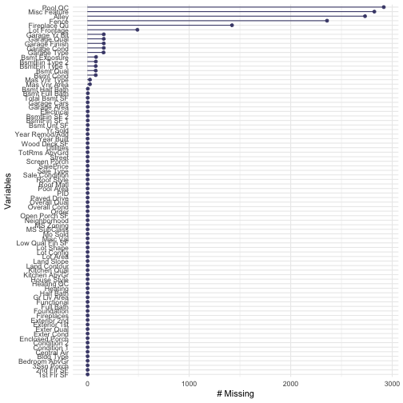


```r
gg_miss_upset(ameshousing)
```

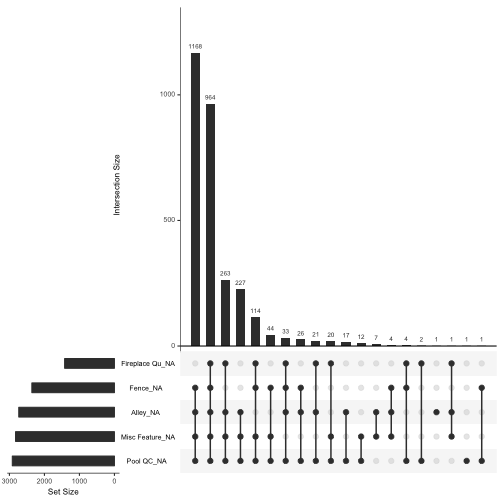


```r
# use some key ones to explore later FIXME
ggpairs(ameshousing, numericVars[c(16, 23, 27,37)], title = "Numeric variables")
```

```
## Warning in (function (data, mapping, alignPercent = 0.6, method =
## "pearson", : Removing 1 row that contained a missing value
```

```
## Warning in (function (data, mapping, alignPercent = 0.6, method =
## "pearson", : Removing 1 row that contained a missing value
```

```
## Warning: Removed 1 rows containing missing values (geom_point).

## Warning: Removed 1 rows containing missing values (geom_point).
```

```
## Warning: Removed 1 rows containing non-finite values (stat_density).
```

```
## Warning in (function (data, mapping, alignPercent = 0.6, method =
## "pearson", : Removing 1 row that contained a missing value
```

```
## Warning: Removed 1 rows containing missing values (geom_point).
```

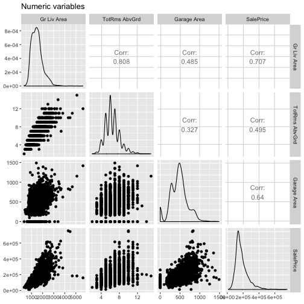

```r
ggpairs(ameshousing, c(catVars[3:10], "SalePrice"), title = "Some categorical variables")
```

```
## Warning: Removed 2732 rows containing missing values (stat_boxplot).
```

```
## `stat_bin()` using `bins = 30`. Pick better value with `binwidth`.
## `stat_bin()` using `bins = 30`. Pick better value with `binwidth`.
## `stat_bin()` using `bins = 30`. Pick better value with `binwidth`.
## `stat_bin()` using `bins = 30`. Pick better value with `binwidth`.
## `stat_bin()` using `bins = 30`. Pick better value with `binwidth`.
## `stat_bin()` using `bins = 30`. Pick better value with `binwidth`.
## `stat_bin()` using `bins = 30`. Pick better value with `binwidth`.
## `stat_bin()` using `bins = 30`. Pick better value with `binwidth`.
```

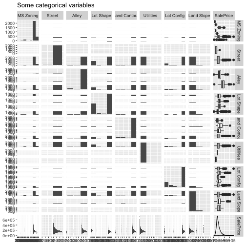


```r
# pairs.panels(ameshousing[ , names(ameshousing)[c(3, 16, 23, 27,37)]], scale=TRUE)
ameshousingCor <- cor(na.omit(ameshousing[,numericVars[2:37]]))
corrplot(ameshousingCor, order="hclust",method="square")
```

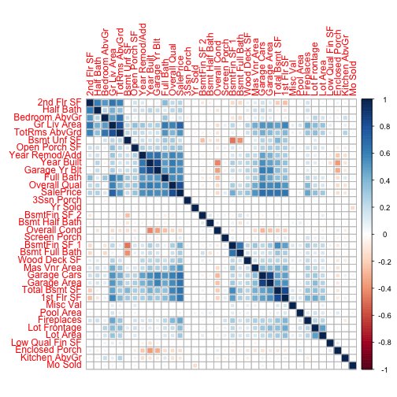

```r
# FIXME adapt below
# all_numVar <- all[, numericVars]
# cor_numVar <- cor(all_numVar, use="pairwise.complete.obs") #correlations of all numeric variables
# 
# #sort on decreasing correlations with SalePrice
# cor_sorted <- as.matrix(sort(cor_numVar[,'SalePrice'], decreasing = TRUE))
#  #select only high corelations
# CorHigh <- names(which(apply(cor_sorted, 1, function(x) abs(x)>0.5)))
# cor_numVar <- cor_numVar[CorHigh, CorHigh]
# 
# corrplot.mixed(cor_numVar, tl.col="black", tl.pos = "lt")
```

What variables are the most correlated with SalePrice?


```r
as.data.frame(ameshousingCor) %>% 
  rownames_to_column() %>%
  gather(pair, value, -rowname) %>%
  filter(rowname != pair) %>% #remove self correlation
  filter(rowname == "SalePrice") %>%
  arrange(desc(abs(value)))
```

```
##      rowname            pair       value
## 1  SalePrice    Overall Qual  0.80394423
## 2  SalePrice     Gr Liv Area  0.71417074
## 3  SalePrice     Garage Cars  0.66128772
## 4  SalePrice     Garage Area  0.64784713
## 5  SalePrice   Total Bsmt SF  0.64571475
## 6  SalePrice      1st Flr SF  0.63876168
## 7  SalePrice       Full Bath  0.55993541
## 8  SalePrice      Year Built  0.55962232
## 9  SalePrice   Garage Yr Blt  0.54185995
## 10 SalePrice  Year Remod/Add  0.53823967
## 11 SalePrice    Mas Vnr Area  0.52779416
## 12 SalePrice   TotRms AbvGrd  0.52327295
## 13 SalePrice      Fireplaces  0.46133312
## 14 SalePrice    BsmtFin SF 1  0.43578288
## 15 SalePrice    Lot Frontage  0.35140592
## 16 SalePrice    Wood Deck SF  0.33065046
## 17 SalePrice   Open Porch SF  0.33033867
## 18 SalePrice        Lot Area  0.30917674
## 19 SalePrice  Bsmt Full Bath  0.28292668
## 20 SalePrice       Half Bath  0.26906771
## 21 SalePrice      2nd Flr SF  0.25242517
## 22 SalePrice     Bsmt Unf SF  0.19966418
## 23 SalePrice    Overall Cond -0.16347134
## 24 SalePrice   Bedroom AbvGr  0.14714328
## 25 SalePrice  Enclosed Porch -0.14267155
## 26 SalePrice   Kitchen AbvGr -0.11092615
## 27 SalePrice    Screen Porch  0.10844590
## 28 SalePrice       Pool Area  0.06779051
## 29 SalePrice  Bsmt Half Bath -0.04992136
## 30 SalePrice         Mo Sold  0.03075789
## 31 SalePrice Low Qual Fin SF -0.02568644
## 32 SalePrice         Yr Sold -0.02208371
## 33 SalePrice    BsmtFin SF 2 -0.01660900
## 34 SalePrice      3Ssn Porch  0.01543270
## 35 SalePrice        Misc Val -0.01335990
```


```r
ameshousing %>%
  select(SalePrice, `Overall Qual`) %>%
  ggplot(aes(x = `Overall Qual`, y = SalePrice)) + geom_point() + theme_minimal() +
  geom_smooth(method= "lm")
```

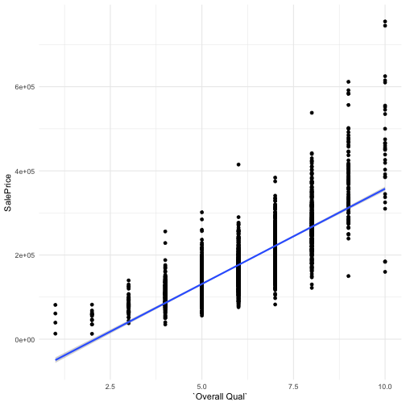

```r
ameshousing %>%
  select(SalePrice, `Overall Qual`) %>%
  ggplot(aes(x = as.factor(`Overall Qual`), y = SalePrice, fill = as.factor(`Overall Qual`))) + geom_boxplot() + theme_minimal() 
```

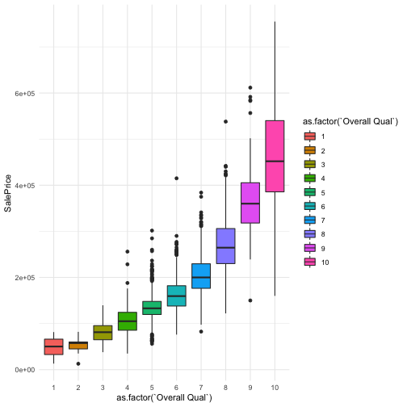

```r
ameshousing %>%
  select(SalePrice, `Gr Liv Area`) %>%
  ggplot(aes(x = `Gr Liv Area`, y = SalePrice)) + geom_point() + theme_minimal() +
  geom_smooth(method= "lm")
```

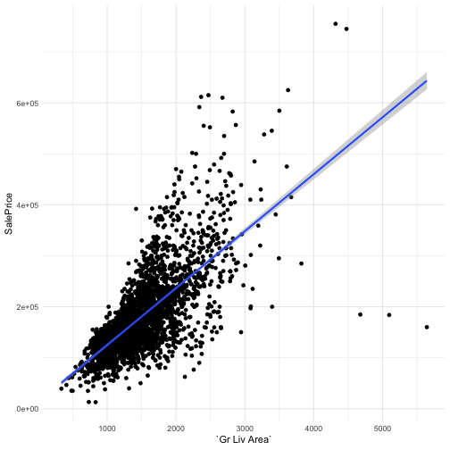

## EDA of outcome variable


```r
ameshousing %>% 
  select(SalePrice) %>%
  ggplot(aes(x = SalePrice)) + geom_histogram(bins = 50) + theme_minimal() 
```

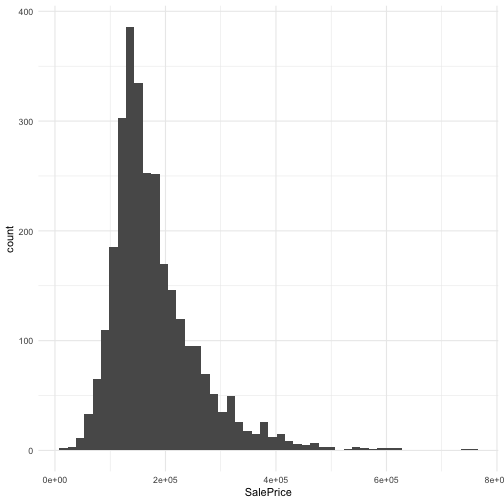


```r
# remove 5 observations
ameshousingFilt <- 
  ameshousing %>% 
  filter(`Gr Liv Area` <= 4000)
```


```r
ameshousingFilt%>%
  select(SalePrice) %>%
  ggplot(aes( sample = SalePrice)) +
  stat_qq() + stat_qq_line(col = "blue") +
  theme_minimal()
```

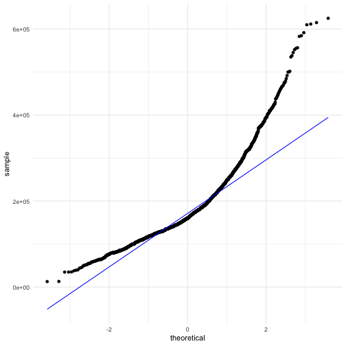

```r
ameshousingFilt %>%
  select(SalePrice) %>%
  ggplot(aes( sample = sqrt(SalePrice))) +
  stat_qq() + stat_qq_line(col = "blue") +
  theme_minimal()
```

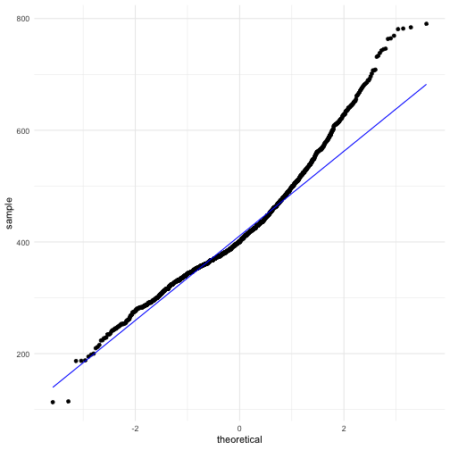

```r
ameshousingFilt %>%
  select(SalePrice) %>%
  ggplot(aes( sample = log(SalePrice))) +
  stat_qq() + stat_qq_line(col = "blue") +
  theme_minimal()
```

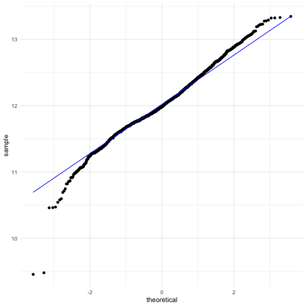

```r
ameshousingFilt <- ameshousingFilt %>%
  mutate(SalePriceLog = log(SalePrice))
```


## Splitting into testing and training datasets

We use the  `caret` function `createDataPartition()` to split the data into training and testing sets here. See the [documentation](https://topepo.github.io/caret/data-splitting.html) if you'd like to learn about other approaches to generate a test set, for example based on maximum dissimilarity.


```r
set.seed(1234) # so we all get the same results
train <- createDataPartition(ameshousingFilt$SalePrice, 
                             p = 0.7, #70/30 split
                             list = FALSE,
                             times = 1 #this is not for CV
                             )
# training set
ameshousingFiltTrain <- ameshousingFilt[train,]
# testing set
ameshousingFiltTest <- ameshousingFilt[-train,]
```


## Fitting a model

There are currently 237 types of ML models than can be fit using the caret package. To see a list of these, and to explore what tuning parameters they might need, [see here](https://topepo.github.io/caret/available-models.html). You can also [define your own model](https://topepo.github.io/caret/available-models.html).

### Simple linear regression


### Tmp

```r
# set.seed(1234)
# svmFit <- train(SalePriceLog ~,
#                 data = ameshousingFiltTrain,
#                 method = "svmRadial",
#                 preProc = c("center", "scale"),
#                 trControl = trainControl(method = "repeatedcv",
#                                          repeats = 10,
#                                          classProbs = TRUE)
#                 )
# predict
```


## References


  
  
