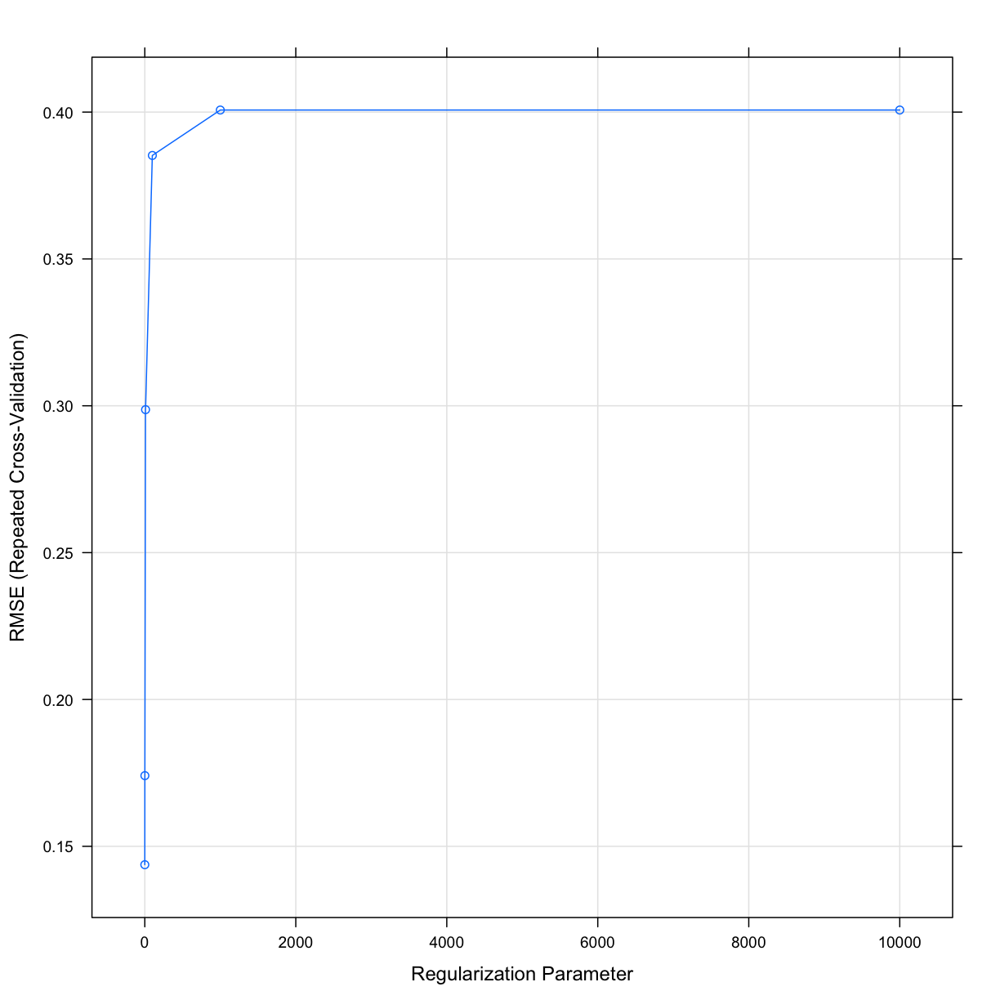
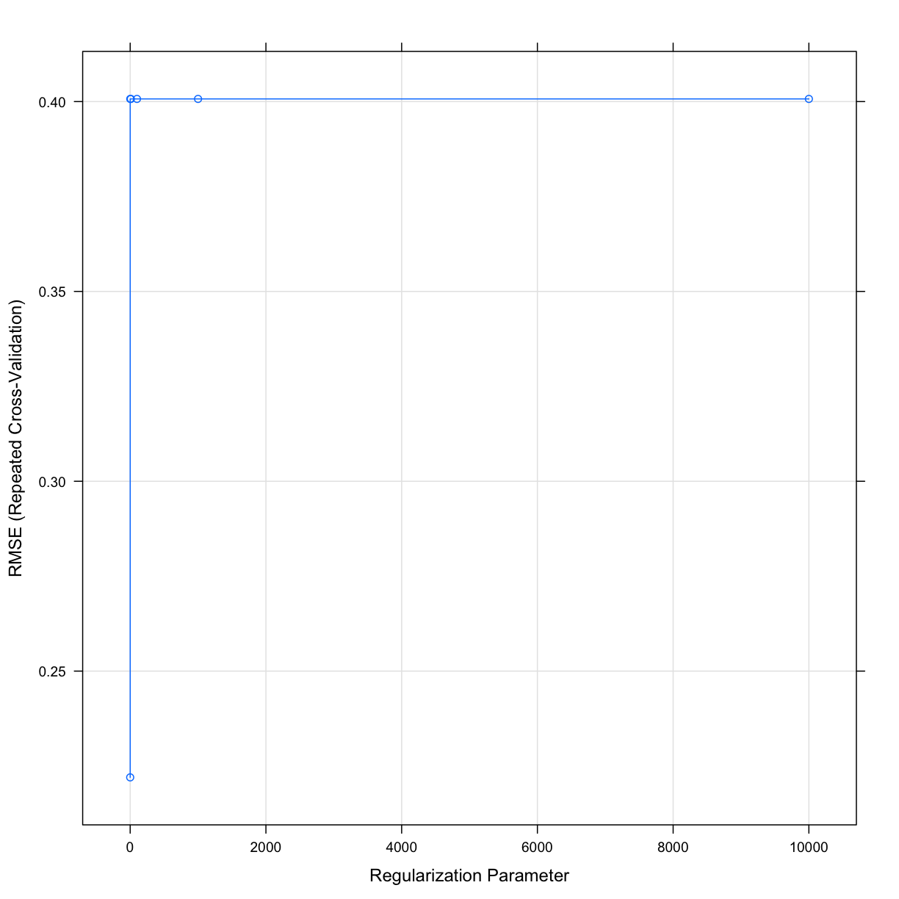
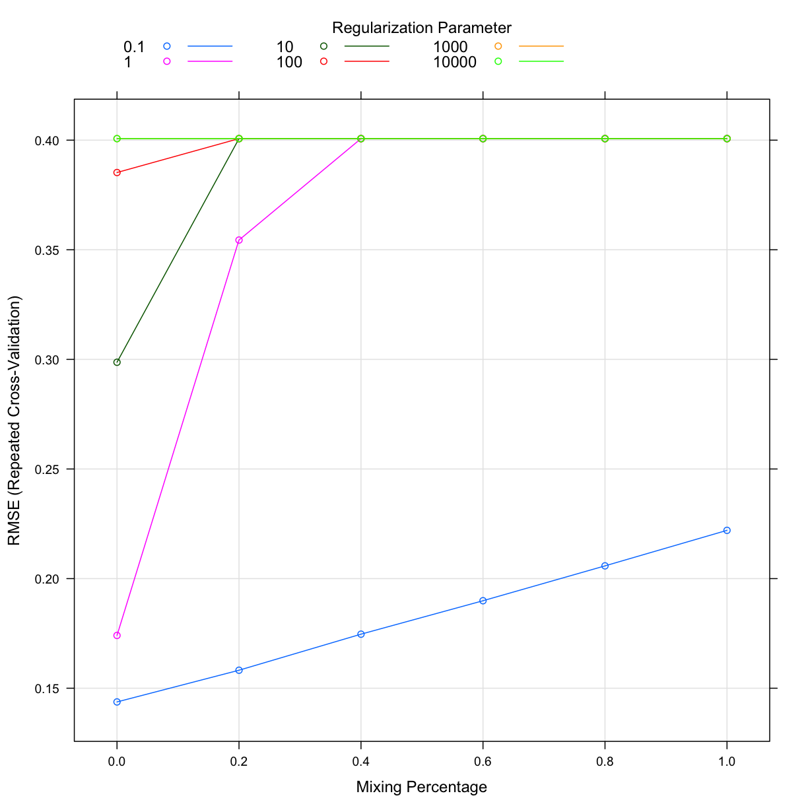
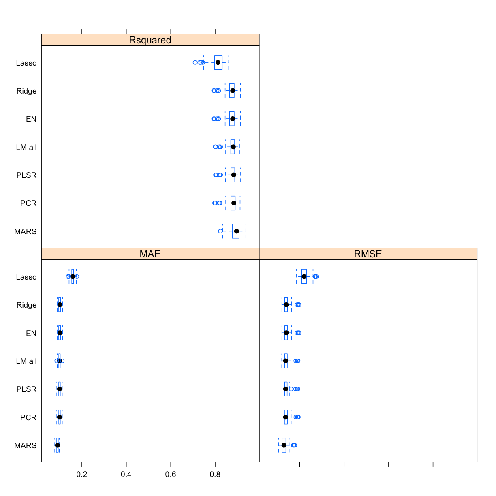
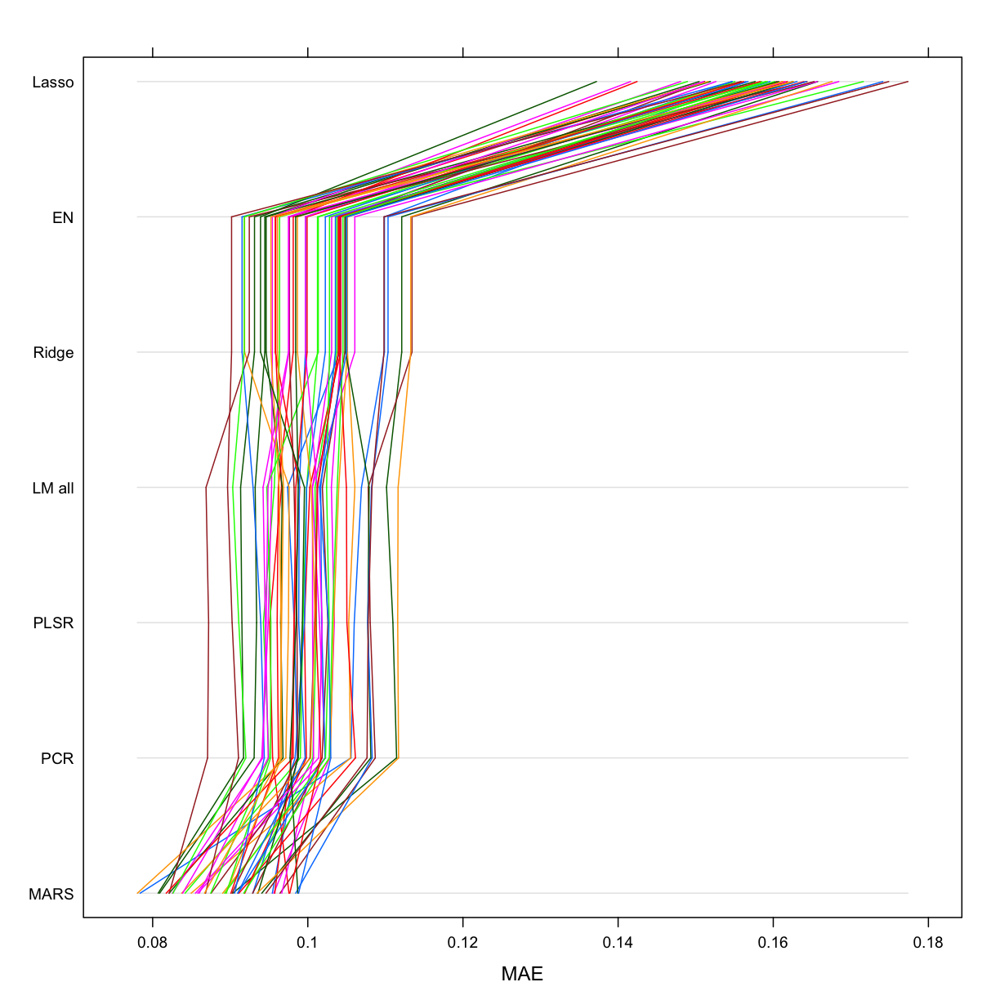
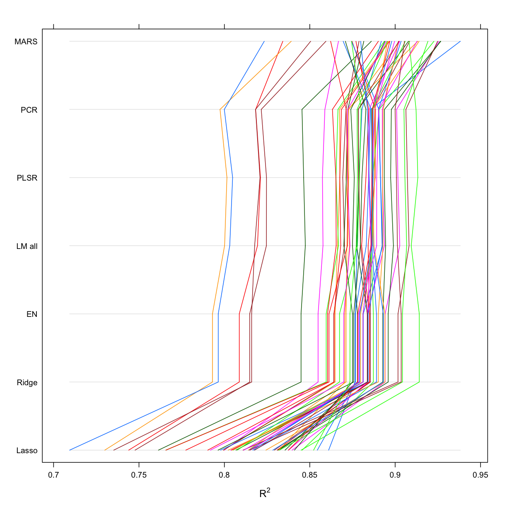
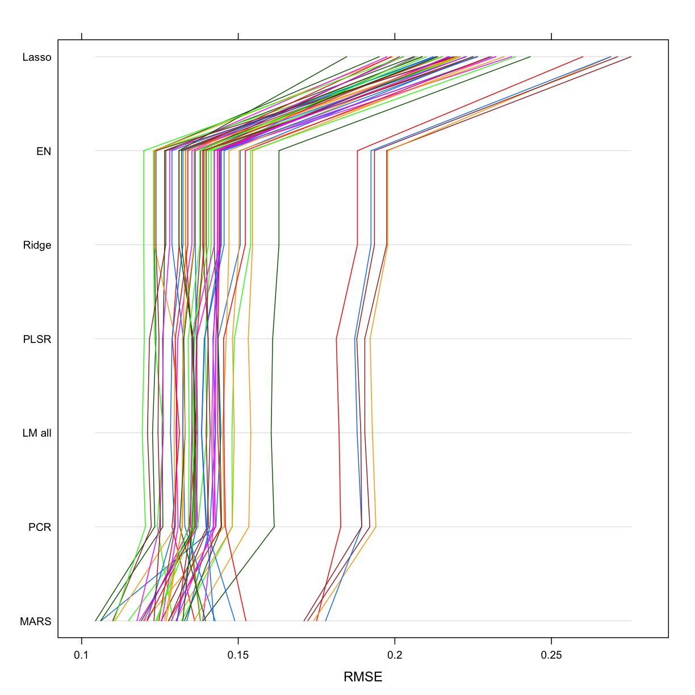

---
# Please do not edit this file directly; it is auto generated.
# Instead, please edit 11-RidgeLassoElasticNet.md in _episodes_rmd/
title: "Regularised Regression. Principle components Regression. Partial Least Squares Regression."
author: "Darya Vanichkina"
keypoints:
- Regularisation helps us improve the performance of regression
objectives:
- To understand additional regression methods that can help us improve our model fit
questions:
- How do we prevent all variables from being incorporated into a regression model?
source: Rmd
start: 0
teaching: 30
exercises: 0
---

~~~
library(tidyverse)
~~~
{: .language-r}

~~~
── Attaching packages ────────────────────────────────── tidyverse 1.2.1 ──
~~~
{: .output}

~~~
✔ ggplot2 3.1.0       ✔ purrr   0.3.1  
✔ tibble  2.0.1       ✔ dplyr   0.8.0.1
✔ tidyr   0.8.3       ✔ stringr 1.4.0  
✔ readr   1.3.1       ✔ forcats 0.4.0  
~~~
{: .output}

~~~
Warning: package 'tibble' was built under R version 3.5.2
~~~
{: .error}

~~~
Warning: package 'tidyr' was built under R version 3.5.2
~~~
{: .error}

~~~
Warning: package 'purrr' was built under R version 3.5.2
~~~
{: .error}

~~~
Warning: package 'dplyr' was built under R version 3.5.2
~~~
{: .error}

~~~
Warning: package 'stringr' was built under R version 3.5.2
~~~
{: .error}

~~~
Warning: package 'forcats' was built under R version 3.5.2
~~~
{: .error}

~~~
── Conflicts ───────────────────────────────────── tidyverse_conflicts() ──
✖ dplyr::filter() masks stats::filter()
✖ dplyr::lag()    masks stats::lag()
~~~
{: .output}

~~~
library(caret)
~~~
{: .language-r}

~~~
Loading required package: lattice
~~~
{: .output}

~~~

Attaching package: 'caret'
~~~
{: .output}

~~~
The following object is masked from 'package:purrr':

    lift
~~~
{: .output}

~~~
library(tidymodels)
~~~
{: .language-r}

~~~
── Attaching packages ───────────────────────────────── tidymodels 0.0.2 ──
~~~
{: .output}

~~~
✔ broom     0.5.1     ✔ recipes   0.1.4
✔ dials     0.0.2     ✔ rsample   0.0.4
✔ infer     0.4.0     ✔ yardstick 0.0.3
✔ parsnip   0.0.1     
~~~
{: .output}

~~~
Warning: package 'rsample' was built under R version 3.5.2
~~~
{: .error}

~~~
Warning: package 'yardstick' was built under R version 3.5.2
~~~
{: .error}

~~~
── Conflicts ──────────────────────────────────── tidymodels_conflicts() ──
✖ scales::discard()      masks purrr::discard()
✖ dplyr::filter()        masks stats::filter()
✖ recipes::fixed()       masks stringr::fixed()
✖ dplyr::lag()           masks stats::lag()
✖ caret::lift()          masks purrr::lift()
✖ yardstick::precision() masks caret::precision()
✖ yardstick::recall()    masks caret::recall()
✖ yardstick::spec()      masks readr::spec()
✖ recipes::step()        masks stats::step()
~~~
{: .output}

~~~
library(AmesHousing)
theme_set(theme_minimal())
~~~
{: .language-r}

~~~
ameshousingFiltTrain <- readRDS("models/ameshousingFiltTrain.Rds")
ameshousingFiltTest <- readRDS("models/ameshousingFiltTest.Rds")
ameshousingFiltTrain_engineered <- readRDS("models/ameshousingFiltTrain_engineered.Rds")
ameshousingFiltTest_engineered <-readRDS("models/ameshousingFiltTest_engineered.Rds")
ames_resamplingCV <- readRDS("models/ames_resamplingCV.Rds")
~~~
{: .language-r}

~~~
param_search <- expand.grid(ncomp = seq(2, 
                                        dim(ameshousingFiltTest_engineered)[2] - 1,
                                        length.out = 20))
~~~
{: .language-r}

## Regularised Regression. 
### Ridge (alpha = 0 )

~~~
# lambda_search  <- expand.grid( alpha = 0, lambda = c(0.1,1, 10, 100, 1000, 10000))
# set.seed(42)
# ames_ridge <- train(
#   Sale_Price ~ ., 
#   data = ameshousingFiltTrain_engineered,
#   preProcess = c("zv", "center", "scale"),
#   trControl = ames_resamplingCV,
#   method = "glmnet", 
#   tuneGrid = lambda_search,
#   metric = "RMSE"
#   )
# saveRDS(ames_ridge, "models/ames_ridge.Rds")

ames_ridge <- readRDS("models/ames_ridge.Rds")

# best model
ames_ridge$results %>%
  filter(
    alpha == ames_ridge$bestTune$alpha,
    lambda == ames_ridge$bestTune$lambda
  )
~~~
{: .language-r}

~~~
  alpha lambda     RMSE  Rsquared       MAE     RMSESD RsquaredSD
1     0    0.1 0.143738 0.8726268 0.1008568 0.01916558 0.02622581
        MAESD
1 0.005953891
~~~
{: .output}

~~~
# plot results
plot(ames_ridge)
~~~
{: .language-r}

### Lasso (alpha = 1)

~~~
# lambda_search  <- expand.grid( alpha = 1, lambda = c(0.1,1, 10, 100, 1000, 10000))
# set.seed(42)
# ames_lasso <- train(
#   Sale_Price ~ ., 
#   data = ameshousingFiltTrain_engineered,
#   preProcess = c("zv", "center", "scale"),
#   trControl = ames_resamplingCV,
#   method = "glmnet", 
#   tuneGrid = lambda_search,
#   metric = "RMSE"
#   )
# saveRDS(ames_lasso, "models/ames_lasso.Rds")

ames_lasso <- readRDS("models/ames_lasso.Rds")

# best model
ames_lasso$results %>%
  filter(
    alpha == ames_lasso$bestTune$alpha,
    lambda == ames_lasso$bestTune$lambda
  )
~~~
{: .language-r}

~~~
  alpha lambda      RMSE  Rsquared      MAE     RMSESD RsquaredSD
1     1    0.1 0.2220084 0.8073484 0.158704 0.01985766  0.0335873
        MAESD
1 0.008077922
~~~
{: .output}

~~~
# plot results
plot(ames_lasso)
~~~
{: .language-r}

### Elastic net - mix of the two

~~~
# lambda_search  <- expand.grid( alpha = seq(0,1,0.2), lambda = c(0.1,1, 10, 100, 1000, 10000))
# set.seed(42)
# ames_en <- train(
#   Sale_Price ~ ., 
#   data = ameshousingFiltTrain_engineered,
#   preProcess = c("zv", "center", "scale"),
#   trControl = ames_resamplingCV,
#   method = "glmnet", 
#   tuneGrid = lambda_search,
#   metric = "RMSE"
#   )
# saveRDS(ames_en, "models/ames_en.Rds")

ames_en <- readRDS("models/ames_en.Rds")

# best model
ames_en$results %>%
  filter(
    alpha == ames_en$bestTune$alpha,
    lambda == ames_en$bestTune$lambda
  )
~~~
{: .language-r}

~~~
  alpha lambda     RMSE  Rsquared       MAE     RMSESD RsquaredSD
1     0    0.1 0.143738 0.8726268 0.1008568 0.01916558 0.02622581
        MAESD
1 0.005953891
~~~
{: .output}

~~~
# plot results
plot(ames_en)
~~~
{: .language-r}

> ## Challenge
>
> Work with the grid search for the model above to identify which value of ncomp is optimal for this model?
> Do you think the performance of this model will be very good?
> 
> {: .source}
>
> > ## Solution
> > 
> >
> 
{: .challenge}

## Principal components regression

~~~
set.seed(42)

flnm = "models/ames_pcr.Rds"

if (!file.exists(flnm)){
  
  ames_pcr <- train(
    Sale_Price ~ .,
    data = ameshousingFiltTrain_engineered,
    trControl = ames_resamplingCV,
    method = "pcr",
    tuneGrid = param_search,
    metric = "RMSE"
  )
  
  saveRDS(ames_pcr, flnm)
  
} else {
  
  ames_pcr <- readRDS(flnm)
} 

# model with lowest RMSE
ames_pcr$bestTune
~~~
{: .language-r}

~~~
      ncomp
15 91.89474
~~~
{: .output}

~~~
ames_pcr$results %>%
  filter(ncomp == as.numeric(ames_pcr$bestTune))
~~~
{: .language-r}

~~~
     ncomp      RMSE  Rsquared        MAE     RMSESD RsquaredSD      MAESD
1 91.89474 0.1416076 0.8759045 0.09972708 0.01806862 0.02525519 0.00532785
~~~
{: .output}

## Partial Least Squares Regression.

~~~
set.seed(42)

flnm = "models/ames_plsr.Rds"

if (!file.exists(flnm)){
  
  ames_plsr <- train(
    Sale_Price ~ .,
    data = ameshousingFiltTrain_engineered,
    trControl = ames_resamplingCV,
    method = "pls",
    tuneGrid = param_search,
    metric = "RMSE"
  )
  
  saveRDS(ames_plsr, flnm)
  
} else {
  
  ames_plsr <- readRDS(flnm)
  
}

# model with lowest RMSE
ames_plsr$bestTune
~~~
{: .language-r}

~~~
     ncomp
3 14.84211
~~~
{: .output}

~~~
ames_plsr$results %>%
  filter(ncomp == as.numeric(ames_plsr$bestTune))
~~~
{: .language-r}

~~~
     ncomp     RMSE  Rsquared        MAE     RMSESD RsquaredSD     MAESD
1 14.84211 0.141515 0.8760864 0.09970893 0.01757506 0.02433346 0.0053065
~~~
{: .output}

~~~
# coef(ames_plsr$finalModel, ames_plsr$bestTune$ncomp)
~~~
{: .language-r}

## MARS

~~~
flnm = "models/ames_mars.Rds"

if (!file.exists(flnm)){

grid_search <- expand.grid(
  nprune = seq(2, 80, length.out = 10) %>% floor(),
  degree = 1:3
)

# perform resampling
set.seed(42)

ames_mars <- train(
  Sale_Price ~ .,
  data = ameshousingFiltTrain_engineered,
  trControl = ames_resamplingCV,
  method = "earth",
  tuneGrid = grid_search,
  metric = "RMSE"
  )

saveRDS(ames_mars, flnm)

} else {

ames_mars <- readRDS(flnm)

}

# best model
ames_mars$results %>%
  filter(
    nprune == ames_mars$bestTune$nprune,
    degree == ames_mars$bestTune$degree
  )
~~~
{: .language-r}

~~~
  degree nprune      RMSE  Rsquared        MAE     RMSESD RsquaredSD
1      2     45 0.1317219 0.8924146 0.08942624 0.01772713 0.02453256
        MAESD
1 0.005662895
~~~
{: .output}

~~~
ames_lm_all <- readRDS("models/ames_lm_all.Rds")

allResamples <- resamples(list(
  "Ridge" = ames_ridge,
  "Lasso" = ames_lasso,
  "EN" = ames_en,
  "PLSR" = ames_plsr, 
  "PCR" = ames_pcr,
  "MARS" = ames_mars,
  "LM all" = ames_lm_all
))
bwplot(allResamples)
~~~
{: .language-r}

~~~
parallelplot(allResamples)
~~~
{: .language-r}

~~~
parallelplot(allResamples , metric = "Rsquared")
~~~
{: .language-r}

~~~
parallelplot(allResamples , metric = "RMSE")
~~~
{: .language-r}

~~~
summary(allResamples)$statistics$RMSE %>% as.data.frame() %>% rownames_to_column()  %>% arrange(Median)
~~~
{: .language-r}

~~~
  rowname      Min.   1st Qu.    Median      Mean   3rd Qu.      Max. NA's
1    MARS 0.1044245 0.1209309 0.1288786 0.1317219 0.1379503 0.1778900    0
2     PCR 0.1203772 0.1315098 0.1364857 0.1416076 0.1441149 0.1939475    0
3  LM all 0.1193320 0.1322394 0.1366107 0.1416634 0.1439775 0.1928341    0
4    PLSR 0.1200169 0.1322344 0.1366309 0.1415150 0.1434831 0.1920911    0
5   Ridge 0.1198476 0.1325558 0.1396472 0.1437380 0.1452600 0.1977365    0
6      EN 0.1198476 0.1325558 0.1396472 0.1437380 0.1452600 0.1977365    0
7   Lasso 0.1846198 0.2090732 0.2196389 0.2220084 0.2293391 0.2753984    0
~~~
{: .output}

