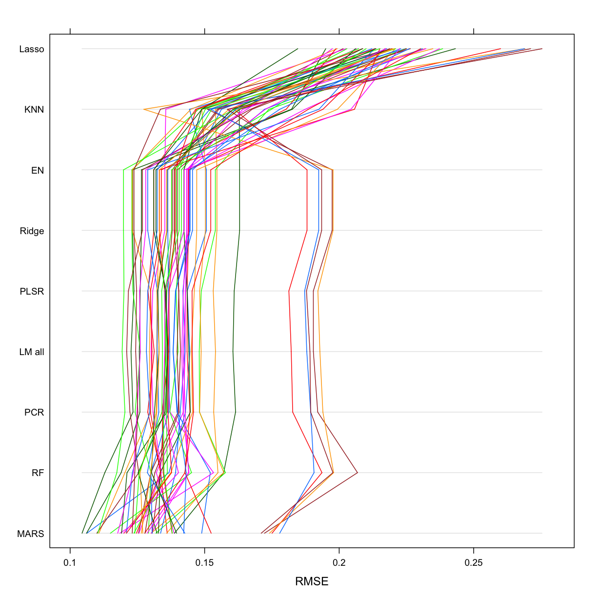

---
# Please do not edit this file directly; it is auto generated.
# Instead, please edit 30-RF_knn.md in _episodes_rmd/
title: "Random forest and kNN regression."
author: "Darya Vanichkina"
source: Rmd
start: 0
teaching: 30
exercises: 0
---

~~~
library(tidyverse)
~~~
{: .language-r}

~~~
── Attaching packages ────────────────────────────────── tidyverse 1.2.1 ──
~~~
{: .output}

~~~
✔ ggplot2 3.1.0       ✔ purrr   0.3.1  
✔ tibble  2.0.1       ✔ dplyr   0.8.0.1
✔ tidyr   0.8.3       ✔ stringr 1.4.0  
✔ readr   1.3.1       ✔ forcats 0.4.0  
~~~
{: .output}

~~~
Warning: package 'tibble' was built under R version 3.5.2
~~~
{: .error}

~~~
Warning: package 'tidyr' was built under R version 3.5.2
~~~
{: .error}

~~~
Warning: package 'purrr' was built under R version 3.5.2
~~~
{: .error}

~~~
Warning: package 'dplyr' was built under R version 3.5.2
~~~
{: .error}

~~~
Warning: package 'stringr' was built under R version 3.5.2
~~~
{: .error}

~~~
Warning: package 'forcats' was built under R version 3.5.2
~~~
{: .error}

~~~
── Conflicts ───────────────────────────────────── tidyverse_conflicts() ──
✖ dplyr::filter() masks stats::filter()
✖ dplyr::lag()    masks stats::lag()
~~~
{: .output}

~~~
library(caret)
~~~
{: .language-r}

~~~
Loading required package: lattice
~~~
{: .output}

~~~

Attaching package: 'caret'
~~~
{: .output}

~~~
The following object is masked from 'package:purrr':

    lift
~~~
{: .output}

~~~
library(ranger)
~~~
{: .language-r}

~~~
Warning: package 'ranger' was built under R version 3.5.2
~~~
{: .error}

~~~
library(tidymodels)
~~~
{: .language-r}

~~~
── Attaching packages ───────────────────────────────── tidymodels 0.0.2 ──
~~~
{: .output}

~~~
✔ broom     0.5.1     ✔ recipes   0.1.4
✔ dials     0.0.2     ✔ rsample   0.0.4
✔ infer     0.4.0     ✔ yardstick 0.0.3
✔ parsnip   0.0.1     
~~~
{: .output}

~~~
Warning: package 'rsample' was built under R version 3.5.2
~~~
{: .error}

~~~
Warning: package 'yardstick' was built under R version 3.5.2
~~~
{: .error}

~~~
── Conflicts ──────────────────────────────────── tidymodels_conflicts() ──
✖ scales::discard()      masks purrr::discard()
✖ dplyr::filter()        masks stats::filter()
✖ recipes::fixed()       masks stringr::fixed()
✖ dplyr::lag()           masks stats::lag()
✖ caret::lift()          masks purrr::lift()
✖ yardstick::precision() masks caret::precision()
✖ yardstick::recall()    masks caret::recall()
✖ yardstick::spec()      masks readr::spec()
✖ recipes::step()        masks stats::step()
~~~
{: .output}

~~~
library(AmesHousing)
theme_set(theme_minimal())
~~~
{: .language-r}

~~~
ameshousingFiltTrain <- readRDS("models/ameshousingFiltTrain.Rds")
ameshousingFiltTest <- readRDS("models/ameshousingFiltTest.Rds")

ameshousingFiltTrain_engineered <- readRDS("models/ameshousingFiltTrain_engineered.Rds")
ameshousingFiltTest_engineered <-readRDS("models/ameshousingFiltTest_engineered.Rds")

ames_resamplingCV <- readRDS("models/ames_resamplingCV.Rds")

ames_lm_all <- readRDS("models/ames_lm_all.Rds")
ames_mars <- readRDS("models/ames_mars.Rds")
ames_ridge <- readRDS("models/ames_ridge.Rds")
ames_lasso <- readRDS("models/ames_lasso.Rds")
ames_en <- readRDS("models/ames_en.Rds")
ames_plsr <- readRDS("models/ames_plsr.Rds")
ames_pcr <- readRDS("models/ames_pcr.Rds")
~~~
{: .language-r}

~~~
flnm = "models/ames_rf.Rds"

if (!file.exists(flnm)){
  
  
  # tuning grid
  grid_search <- expand.grid(
    mtry = floor(dim(ameshousingFiltTrain)[2] * c(.15, .20, .25)),
    min.node.size = c(2,4,6),
    splitrule = c("variance", "extratrees")
  )
  # perform resampling
  set.seed(42)
  ames_rf <- train(
    log(Sale_Price) ~ .,
    data = ameshousingFiltTrain,
    trControl = ames_resamplingCV,
    method = "ranger",
    tuneGrid = grid_search,
    metric = "RMSE",
    num.trees = 1000,
    respect.unordered.factors = 'order'
  )
  saveRDS(ames_rf, flnm)
  
} else {
  
  ames_rf <- readRDS(flnm)
  
}

summary(ames_rf)
~~~
{: .language-r}

~~~
                          Length Class         Mode     
predictions               2050   -none-        numeric  
num.trees                    1   -none-        numeric  
num.independent.variables    1   -none-        numeric  
mtry                         1   -none-        numeric  
min.node.size                1   -none-        numeric  
prediction.error             1   -none-        numeric  
forest                       9   ranger.forest list     
splitrule                    1   -none-        character
treetype                     1   -none-        character
r.squared                    1   -none-        numeric  
call                         9   -none-        call     
importance.mode              1   -none-        character
num.samples                  1   -none-        numeric  
replace                      1   -none-        logical  
xNames                     307   -none-        character
problemType                  1   -none-        character
tuneValue                    3   data.frame    list     
obsLevels                    1   -none-        logical  
param                        2   -none-        list     
~~~
{: .output}

~~~
ames_rf$results %>%
  filter(
    mtry == ames_rf$bestTune$mtry,
    min.node.size == ames_rf$bestTune$min.node.size,
    splitrule == ames_rf$bestTune$splitrule
  )
~~~
{: .language-r}

~~~
  mtry min.node.size splitrule      RMSE  Rsquared        MAE    RMSESD
1   20             2  variance 0.1410489 0.8865463 0.09239487 0.0217513
  RsquaredSD       MAESD
1 0.02948323 0.006278048
~~~
{: .output}

~~~
summary(ames_rf)
~~~
{: .language-r}

~~~
                          Length Class         Mode     
predictions               2050   -none-        numeric  
num.trees                    1   -none-        numeric  
num.independent.variables    1   -none-        numeric  
mtry                         1   -none-        numeric  
min.node.size                1   -none-        numeric  
prediction.error             1   -none-        numeric  
forest                       9   ranger.forest list     
splitrule                    1   -none-        character
treetype                     1   -none-        character
r.squared                    1   -none-        numeric  
call                         9   -none-        call     
importance.mode              1   -none-        character
num.samples                  1   -none-        numeric  
replace                      1   -none-        logical  
xNames                     307   -none-        character
problemType                  1   -none-        character
tuneValue                    3   data.frame    list     
obsLevels                    1   -none-        logical  
param                        2   -none-        list     
~~~
{: .output}

~~~
ames_rf$results %>%
  filter(
    mtry == ames_rf$bestTune$mtry,
    min.node.size == ames_rf$bestTune$min.node.size,
    splitrule == ames_rf$bestTune$splitrule
    )
~~~
{: .language-r}

~~~
  mtry min.node.size splitrule      RMSE  Rsquared        MAE    RMSESD
1   20             2  variance 0.1410489 0.8865463 0.09239487 0.0217513
  RsquaredSD       MAESD
1 0.02948323 0.006278048
~~~
{: .output}

~~~
ames_rfOpt <- ranger(
  formula         = Sale_Price ~ ., 
  data            = ameshousingFiltTrain, 
  num.trees       = 2000,
  mtry            = 20,
  min.node.size   = 2,
  sample.fraction = .8,
  replace         = FALSE,
  importance      = 'permutation',
  respect.unordered.factors = 'order',
  splitrule       = "variance",
  verbose         = FALSE,
  seed            = 42
  )
~~~
{: .language-r}

~~~
flnm = "models/ames_knn.Rds"

if (!file.exists(flnm)){
  
  
  hyper_grid <- expand.grid(k = seq(2, 26, by = 2))
  ames_knn <- train(
    Sale_Price ~ .,
    data = ameshousingFiltTrain_engineered,
    method = "knn",
    trControl = ames_resamplingCV,
    tuneGrid = hyper_grid,
    metric = "RMSE"
  )
  
  saveRDS(ames_knn, "models/ames_knn.Rds")
  
} else {
  
ames_knn <- readRDS("models/ames_knn.Rds")

}

ames_knn
~~~
{: .language-r}

~~~
k-Nearest Neighbors 

2050 samples
 124 predictor

No pre-processing
Resampling: Cross-Validated (10 fold, repeated 5 times) 
Summary of sample sizes: 1843, 1844, 1845, 1845, 1846, 1846, ... 
Resampling results across tuning parameters:

  k   RMSE       Rsquared   MAE      
   2  0.1792802  0.8044492  0.1250526
   4  0.1653743  0.8358100  0.1161656
   6  0.1642104  0.8405249  0.1151231
   8  0.1638268  0.8427067  0.1147836
  10  0.1635367  0.8449856  0.1147688
  12  0.1640329  0.8452854  0.1150865
  14  0.1648132  0.8448565  0.1159412
  16  0.1652543  0.8451087  0.1162641
  18  0.1658776  0.8448222  0.1168293
  20  0.1663201  0.8447970  0.1174417
  22  0.1666016  0.8450611  0.1179336
  24  0.1669899  0.8450643  0.1183388
  26  0.1675537  0.8446751  0.1186870

RMSE was used to select the optimal model using the smallest value.
The final value used for the model was k = 10.
~~~
{: .output}

~~~
allResamples <- resamples(list(
                               "Ridge" = ames_ridge,
                               "Lasso" = ames_lasso,
                               "EN" = ames_en,
                               "PLSR" = ames_plsr, 
                               "PCR" = ames_pcr,
                               "MARS" = ames_mars,
                               "LM all" = ames_lm_all,
                               "RF" = ames_rf, 
                               "KNN" = ames_knn
                               ))

bwplot(allResamples)
~~~
{: .language-r}

~~~
parallelplot(allResamples)
~~~
{: .language-r}

~~~
parallelplot(allResamples , metric = "Rsquared")
~~~
{: .language-r}

~~~
parallelplot(allResamples , metric = "RMSE")
~~~
{: .language-r}

~~~
summary(allResamples)$statistics$RMSE %>% 
  as.data.frame() %>% 
  rownames_to_column()  %>% 
  arrange(Median)
~~~
{: .language-r}

~~~
  rowname      Min.   1st Qu.    Median      Mean   3rd Qu.      Max. NA's
1    MARS 0.1044245 0.1209309 0.1288786 0.1317219 0.1379503 0.1778900    0
2      RF 0.1128990 0.1290365 0.1342437 0.1410489 0.1441336 0.2068149    0
3     PCR 0.1203772 0.1315098 0.1364857 0.1416076 0.1441149 0.1939475    0
4  LM all 0.1193320 0.1322394 0.1366107 0.1416634 0.1439775 0.1928341    0
5    PLSR 0.1200169 0.1322344 0.1366309 0.1415150 0.1434831 0.1920911    0
6   Ridge 0.1198476 0.1325558 0.1396472 0.1437380 0.1452600 0.1977365    0
7      EN 0.1198476 0.1325558 0.1396472 0.1437380 0.1452600 0.1977365    0
8     KNN 0.1273960 0.1512841 0.1609557 0.1635367 0.1735613 0.2056930    0
9   Lasso 0.1846198 0.2090732 0.2196389 0.2220084 0.2293391 0.2753984    0
~~~
{: .output}
