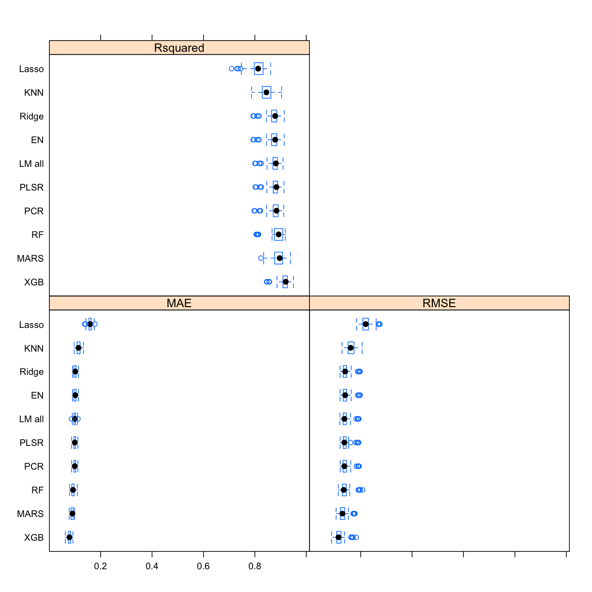
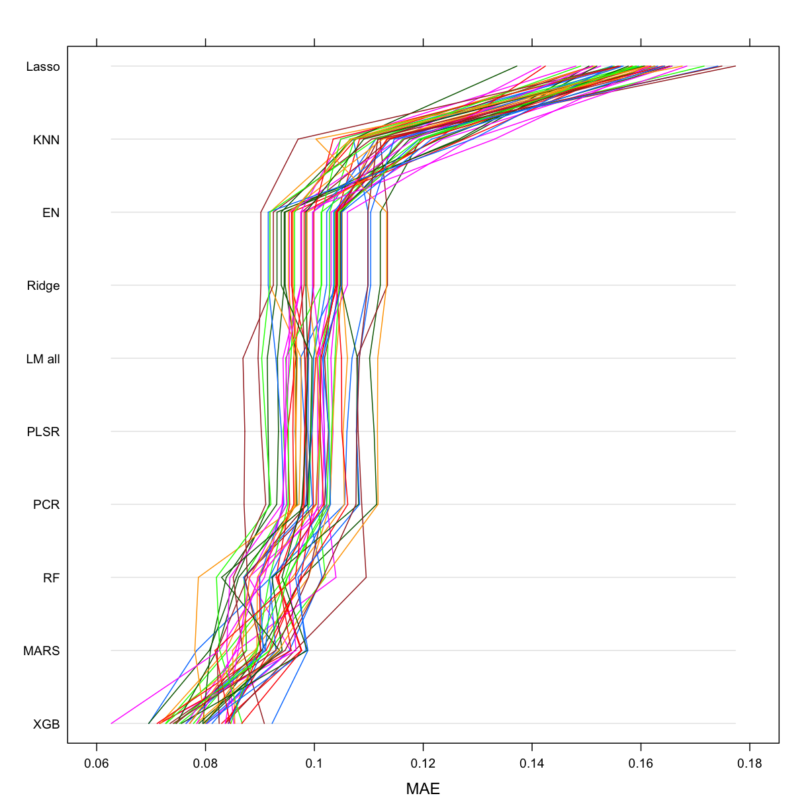
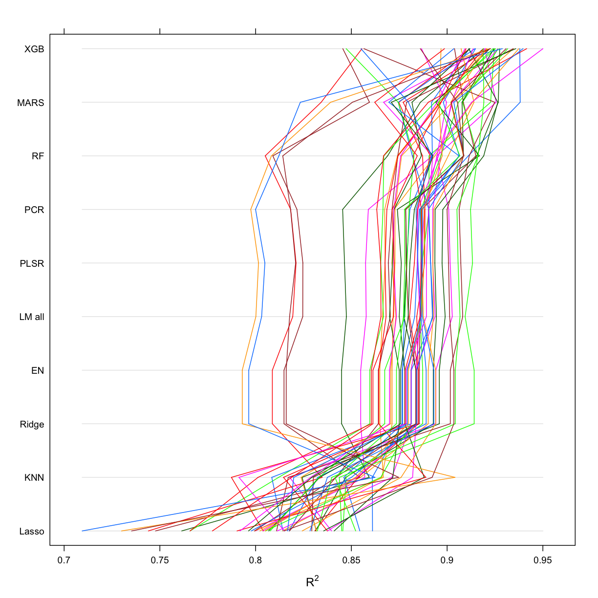
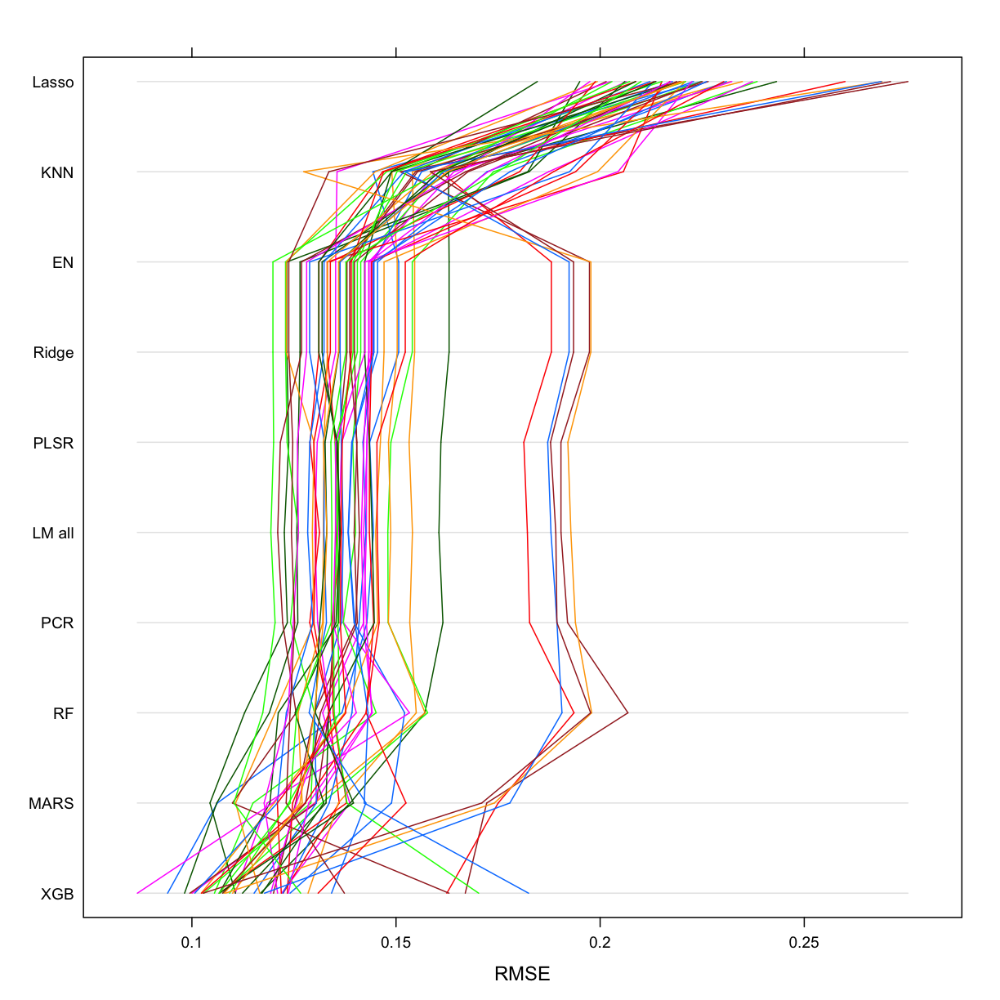

---
# Please do not edit this file directly; it is auto generated.
# Instead, please edit 45-Xgboost.md in _episodes_rmd/
title: "Gradient boosting. XGBoost."
author: "Darya Vanichkina"
source: Rmd
start: 0
teaching: 30
exercises: 0
---

~~~
library(tidyverse)
~~~
{: .language-r}

~~~
── Attaching packages ────────────────────────────────── tidyverse 1.2.1 ──
~~~
{: .output}

~~~
✔ ggplot2 3.1.0       ✔ purrr   0.3.1  
✔ tibble  2.0.1       ✔ dplyr   0.8.0.1
✔ tidyr   0.8.3       ✔ stringr 1.4.0  
✔ readr   1.3.1       ✔ forcats 0.4.0  
~~~
{: .output}

~~~
Warning: package 'tibble' was built under R version 3.5.2
~~~
{: .error}

~~~
Warning: package 'tidyr' was built under R version 3.5.2
~~~
{: .error}

~~~
Warning: package 'purrr' was built under R version 3.5.2
~~~
{: .error}

~~~
Warning: package 'dplyr' was built under R version 3.5.2
~~~
{: .error}

~~~
Warning: package 'stringr' was built under R version 3.5.2
~~~
{: .error}

~~~
Warning: package 'forcats' was built under R version 3.5.2
~~~
{: .error}

~~~
── Conflicts ───────────────────────────────────── tidyverse_conflicts() ──
✖ dplyr::filter() masks stats::filter()
✖ dplyr::lag()    masks stats::lag()
~~~
{: .output}

~~~
library(caret)
~~~
{: .language-r}

~~~
Loading required package: lattice
~~~
{: .output}

~~~

Attaching package: 'caret'
~~~
{: .output}

~~~
The following object is masked from 'package:purrr':

    lift
~~~
{: .output}

~~~
library(tidymodels)
~~~
{: .language-r}

~~~
── Attaching packages ───────────────────────────────── tidymodels 0.0.2 ──
~~~
{: .output}

~~~
✔ broom     0.5.1     ✔ recipes   0.1.4
✔ dials     0.0.2     ✔ rsample   0.0.4
✔ infer     0.4.0     ✔ yardstick 0.0.3
✔ parsnip   0.0.1     
~~~
{: .output}

~~~
Warning: package 'rsample' was built under R version 3.5.2
~~~
{: .error}

~~~
Warning: package 'yardstick' was built under R version 3.5.2
~~~
{: .error}

~~~
── Conflicts ──────────────────────────────────── tidymodels_conflicts() ──
✖ scales::discard()      masks purrr::discard()
✖ dplyr::filter()        masks stats::filter()
✖ recipes::fixed()       masks stringr::fixed()
✖ dplyr::lag()           masks stats::lag()
✖ caret::lift()          masks purrr::lift()
✖ yardstick::precision() masks caret::precision()
✖ yardstick::recall()    masks caret::recall()
✖ yardstick::spec()      masks readr::spec()
✖ recipes::step()        masks stats::step()
~~~
{: .output}

~~~
library(AmesHousing)
~~~
{: .language-r}

~~~
ameshousingFiltTrain <- readRDS("models/ameshousingFiltTrain.Rds")
ameshousingFiltTest <- readRDS("models/ameshousingFiltTest.Rds")

ameshousingFiltTrain_engineered <- readRDS("models/ameshousingFiltTrain_engineered.Rds")
ameshousingFiltTest_engineered <-readRDS("models/ameshousingFiltTest_engineered.Rds")

ames_resamplingCV <- readRDS("models/ames_resamplingCV.Rds")

# predict(ames_mars, newdata = ameshousingFiltTest_engineered)

ames_lm_all <- readRDS("models/ames_lm_all.Rds")
ames_mars <- readRDS("models/ames_mars.Rds")
ames_ridge <- readRDS("models/ames_ridge.Rds")
ames_lasso <- readRDS("models/ames_lasso.Rds")
ames_en <- readRDS("models/ames_en.Rds")
ames_plsr <- readRDS("models/ames_plsr.Rds")
ames_pcr <- readRDS("models/ames_pcr.Rds")
ames_knn <- readRDS("models/ames_knn.Rds")
ames_rf <- readRDS("models/ames_rf.Rds")
~~~
{: .language-r}

## Gradient boosting

~~~
library(gbm)
~~~
{: .language-r}

~~~
Warning: package 'gbm' was built under R version 3.5.2
~~~
{: .error}

~~~
Loaded gbm 2.1.5
~~~
{: .output}

~~~
# hyper_grid <- expand.grid(
#   shrinkage = c(.01, .1, .3),
#   interaction.depth = c(1, 3, 5),
#   n.minobsinnode = c(5, 10, 15),
#   bag.fraction = c(.65, .8, 1), 
#   optimal_trees = 0,              
#   min_RMSE = 0                   
# )

# randomize data
random_index <- sample(1:nrow(ameshousingFiltTrain), nrow(ameshousingFiltTrain))
random_ames_train <- ameshousingFiltTrain[random_index, ]
random_ames_train <- random_ames_train %>% select(-Utilities)

# gbm_optimise <- function(hyper_grid){
# for(i in 1:nrow(hyper_grid)) {
#   
#   # reproducibility
#   set.seed(42)
#   
#   # train model
#   gbm.tune <- gbm(
#     formula = Sale_Price ~ .,
#     distribution = "gaussian",
#     data = random_ames_train,
#     n.trees = 5000,
#     interaction.depth = hyper_grid$interaction.depth[i],
#     shrinkage = hyper_grid$shrinkage[i],
#     n.minobsinnode = hyper_grid$n.minobsinnode[i],
#     bag.fraction = hyper_grid$bag.fraction[i],
#     train.fraction = .75,
#     n.cores = NULL, # will use all cores by default
#     verbose = FALSE
#   )
#   
#   # add min training error and trees to grid
#   hyper_grid$optimal_trees[i] <- which.min(gbm.tune$valid.error)
#   hyper_grid$min_RMSE[i] <- sqrt(min(gbm.tune$valid.error))
# }
# return(hyper_grid)
# }
# 
# # saveRDS(hyper_grid, "models/gbm_hyper_grid1.Rds")
# hyper_grid1 <- read_rds("models/gbm_hyper_grid1.Rds")
# 
# hyper_grid2 <- expand.grid(
#   shrinkage = c(.01, .05, .1),
#   interaction.depth = c(3, 5, 7),
#   n.minobsinnode = c(5, 7, 10),
#   bag.fraction = c(.65, .8, 1), 
#   optimal_trees = 0,             
#   min_RMSE = 0                  
# )

#hyper_grid2 <- gbm_optimise(hyper_grid2)
# saveRDS(hyper_grid2, "models/gbm_hyper_grid2.Rds")
hyper_grid2 <- read_rds("models/gbm_hyper_grid2.Rds")

hyper_grid2 %>%
  dplyr::arrange(min_RMSE) %>%
  head(10)
~~~
{: .language-r}

~~~
   shrinkage interaction.depth n.minobsinnode bag.fraction optimal_trees
1       0.01                 3              5         0.65          4755
2       0.01                 3              7         0.80          4945
3       0.01                 3              7         0.65          4460
4       0.01                 3              5         0.80          4983
5       0.05                 3              7         0.65           950
6       0.05                 3              7         0.80          1347
7       0.01                 3             10         0.80          4987
8       0.01                 5              5         0.80          3941
9       0.01                 5              7         0.80          3368
10      0.01                 5              5         0.65          3532
   min_RMSE
1  19763.76
2  19836.14
3  19948.46
4  20035.70
5  20087.31
6  20113.89
7  20162.16
8  20206.30
9  20244.55
10 20276.48
~~~
{: .output}

## Train final model

~~~
# set.seed(42)
# # train GBM model
# ames_gbm <- gbm(
#   formula = Sale_Price ~ .,
#   distribution = "gaussian",
#   data = ameshousingFiltTrain,
#   n.trees = 483,
#   interaction.depth = 5,
#   shrinkage = 0.1,
#   n.minobsinnode = 5,
#   bag.fraction = .65, 
#   train.fraction = 1,
#   n.cores = NULL, # will use all cores by default
#   verbose = FALSE
#   )  
# 
# saveRDS(hyper_grid2, "models/gbm_hyper_grid2.Rds")
# hyper_grid2 <- read_rds("models/gbm_hyper_grid2.Rds")
~~~
{: .language-r}

~~~
library(xgboost)
~~~
{: .language-r}

~~~
Warning: package 'xgboost' was built under R version 3.5.2
~~~
{: .error}

~~~

Attaching package: 'xgboost'
~~~
{: .output}

~~~
The following object is masked from 'package:dplyr':

    slice
~~~
{: .output}

~~~
# Prepare the training data
ames_features_train <- ameshousingFiltTrain_engineered %>% select(-Sale_Price) %>% as.matrix()
ames_price_train <- ameshousingFiltTrain_engineered %>% select(Sale_Price) %>% as.matrix()

# ran this on HPC
# # create hyperparameter grid
# 
# hyper_grid <- expand.grid(
#   eta = c(0.005, .01, 0.05, .1, .3),
#   max_depth = c(1, 3, 5, 7),
#   min_child_weight = c(3, 5, 7),
#   subsample = c(.5, .65, .8, 1),
#   colsample_bytree = c(.8, .9, 1),
#   optimal_trees = 0,               # a place to dump results
#   min_RMSE = 0                     # a place to dump results
# )
# 
# 
# # grid search
# for(i in 1:nrow(hyper_grid)) {
# 
#   # create parameter list
#   params <- list(
#     eta = hyper_grid$eta[i],
#     max_depth = hyper_grid$max_depth[i],
#     min_child_weight = hyper_grid$min_child_weight[i],
#     subsample = hyper_grid$subsample[i],
#     colsample_bytree = hyper_grid$colsample_bytree[i]
#   )
# 
#   # reproducibility
#   set.seed(42)
# 
#   # train model
#   xgb.tune <- xgb.cv(
#     params = params,
#     data = ames_features_train,
#     label = ames_price_train,
#     nrounds = 5000,
#     nfold = 5,
#     objective = "reg:linear",  # for regression models
#     verbose = 0,               # silent,
#     early_stopping_rounds = 10 # stop if no improvement for 10 consecutive trees
#   )
# 
#   # add min training error and trees to grid
#   hyper_grid$optimal_trees[i] <- which.min(xgb.tune$evaluation_log$test_rmse_mean)
#   hyper_grid$min_RMSE[i] <- min(xgb.tune$evaluation_log$test_rmse_mean)
# }

# optimal model:
# eta	max_depth	min_child_weight	subsample	colsample_bytree	optimal_trees	min_RMSE
# grid_0.005_5.csv:0.005	5	7	0.65	0.9	2989	0.1197378

ames_xgb <- readRDS("models/grid_0.005_5.Rds")

# #
# params <- list(
#   eta = 0.005,
#   max_depth = 5,
#   min_child_weight = 7,
#   subsample = 0.65,
#   colsample_bytree = 0.9,
#   nrounds = 2989
# )
# 
# # 
# # # train final model
# # ames_xgb2 <- xgboost(
# #   params = params,
# #   data = ames_features_train,
# #   label = ames_price_train,
# #   nrounds = 2989,
# #   objective = "reg:linear",
# #   verbose = 0
# # )
# 
# ames_xgb2 <- readRDS("models/ames_xgb2.Rds")
# 
# 
# ames_xgb_4caret <- caret::train(
#   x = ames_features_train, # tr_x is data frame, xgbTree needs matrix
#   y = as.vector(ames_price_train),
#   trControl = ames_resamplingCV,
#   tuneGrid = expand.grid(nrounds = 2989, eta = 0.005,  max_depth = 5,  min_child_weight = 7,  subsample = 0.65,  colsample_bytree = 0.9 , gamma = 0),
#   method = "xgbTree",
#   verbose = TRUE
# )
# saveRDS(ames_xgb_4caret, "models/ames_xgb_4caret.Rds")

ames_xgb_4caret <- readRDS("models/ames_xgb_4caret.Rds")
~~~
{: .language-r}

~~~
allResamples <- resamples(list(
                               "Ridge" = ames_ridge,
                               "Lasso" = ames_lasso,
                               "EN" = ames_en,
                               "PLSR" = ames_plsr, 
                               "PCR" = ames_pcr,
                               "MARS" = ames_mars,
                               "LM all" = ames_lm_all,
                               "RF" = ames_rf, 
                               "KNN" = ames_knn, 
                               "XGB" = ames_xgb_4caret
                               ))

bwplot(allResamples)
~~~
{: .language-r}

~~~
parallelplot(allResamples)
~~~
{: .language-r}

~~~
parallelplot(allResamples , metric = "Rsquared")
~~~
{: .language-r}

~~~
parallelplot(allResamples , metric = "RMSE")
~~~
{: .language-r}

~~~
summary(allResamples)$statistics$RMSE %>% as.data.frame() %>% rownames_to_column()  %>% arrange(Median)
~~~
{: .language-r}

~~~
   rowname       Min.   1st Qu.    Median      Mean   3rd Qu.      Max.
1      XGB 0.08664417 0.1066715 0.1138181 0.1182360 0.1231135 0.1824675
2     MARS 0.10442454 0.1209309 0.1288786 0.1317219 0.1379503 0.1778900
3       RF 0.11289905 0.1290365 0.1342437 0.1410489 0.1441336 0.2068149
4      PCR 0.12037718 0.1315098 0.1364857 0.1416076 0.1441149 0.1939475
5   LM all 0.11933204 0.1322394 0.1366107 0.1416634 0.1439775 0.1928341
6     PLSR 0.12001693 0.1322344 0.1366309 0.1415150 0.1434831 0.1920911
7    Ridge 0.11984758 0.1325558 0.1396472 0.1437380 0.1452600 0.1977365
8       EN 0.11984758 0.1325558 0.1396472 0.1437380 0.1452600 0.1977365
9      KNN 0.12739601 0.1512841 0.1609557 0.1635367 0.1735613 0.2056930
10   Lasso 0.18461976 0.2090732 0.2196389 0.2220084 0.2293391 0.2753984
   NA's
1     0
2     0
3     0
4     0
5     0
6     0
7     0
8     0
9     0
10    0
~~~
{: .output}

