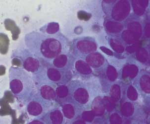
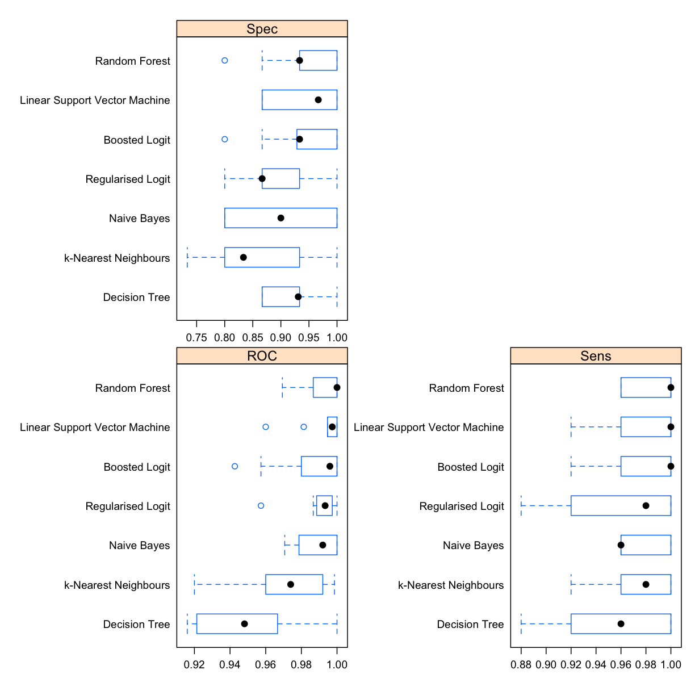

---
# Please do not edit this file directly; it is auto generated.
# Instead, please edit 50-Classification.md in _episodes_rmd/
title: "Classification"
author: "Gordon McDonald"
keypoints:
- Classification attempts to predict the class to which a particular observation belongs
- If you use caret it's cats all the way down
objectives: Learn how to build and evaluate classifiers
questions: How to classify?
source: Rmd
start: 0
teaching: 30
exercises: 0
---

# What is a classifier?

A classifier is some kind of rule / black box / widget that you can feed a new example and it will spit out whether or not it is part of a given class. E.g. below, we are classifying the animals to be either *cat* or *not cat*.

You can have classifiers for anything you can have a yes/no answer to, e.g.

- Is this a cat? 🐱
- Do these test results indicate cancer? 🚑
- Is this email spam or not spam? 📧

You can also have classifiers that categorise things into multiple (more than two) categories e.g.

- Which animal is this, out of the 12 animals I have trained my model on? 🐱
- Do these test results indicate {none, stage 1, stage 2, stage 3, stage 4} cancer? 🚑
- Is this email important, not important but not spam, or spam? 📧

It is clear that in some of these examples we are more concerned with being wrong in one direction than the other, e.g. it's better to let some spam email through accidentally than to block all of it but also junk important emails from people you know. Likewise, we would prefer our medical tests to err on the side of caution and not give a negative test result to someone who needs treatment. So we will need to adjust a parameter to decide how much we want to trade this off.

## Model evaluation (classification)

For now, let's imagine we have a classifier already. How can we test it to see how good it is?
A good start is a confusion matrix - a table of what test data it labels correctly and incorrectly.

### Confusion Matrix

When applying classification models, we often use a confusion matrix to evaluate certain performance measures. A confusion matrix is simply a matrix that compares "the truth" to the labels generated by your classifier. When we label a cat correctly, we refer to this as a true positive. When we fail to label a cat as a cat, this is called a false negative.  However, if we label something which is not a cat as a cat, this is called a false positive; and of course if we correctly label something which is not a cat, as not a cat, then this is a true negative.

### Some common metrics

#### Accuracy:
How often does the classifier label examples correctly? Objective: maximize. Example:
$$\frac{TP+TN}{TP+TN+FP+FN} = \frac{\text{Correctly labelled examples}}{\text{All examples}}=\frac{31+52}{31+52+10+7}=83
\%$$
Accuracy is the opposite of the misclassification rate. So,
$$\text{Misclassification rate} = 1 - \text{Accuracy} = \frac{\text{Incorrectly labelled examples}}{\text{All examples}} $$

#### Precision:
What fraction of things labelled as a cat were actually cats? Objective: maximize. Example:

$$\frac{TP}{TP+FP} = \frac{\text{Correctly labelled cats}}{\text{All things labelled as cats}}=\frac{31}{31+10}=76\%$$

#### Sensitivity / Recall:
How often does the classifier label a cat as a cat? Objective: maximize. Example:

$$\frac{TP}{TP+FN} = \frac{\text{Correctly labelled cats}}{\text{All true cats}}=\frac{31}{31+7}=81\%$$

#### Specificity:
How often does it label a not-cat as a not-cat? Objective: maximize. Example:

$$\frac{TN}{TN+FP} = \frac{\text{Correctly labelled not-cats}}{\text{All true not-cats}}=\frac{52}{52+10}=84\%$$

#### F1-score:

This is a commonly used overall measure of classifier performance (but not the only one and not always the best depending upon the problem). It is defined as the harmonic mean of precision and sensitivity;

$$\frac{1}{F_1} = \frac{1}{2}\left(\frac{1}{\text{Precision}}+\frac{1}{\text{Sensitivity}}\right) $$
So that
$$F_1 = 2\cdot\left(\frac{1}{\frac{1}{81\%}+\frac{1}{83\%}}\right) = 82\%$$

#### Mean-square error (MSE)

Define a loss function $L_i = 1$ if the $i$th example is classified incorrectly and $L_i = 0$ if it is classified correctly. If there are $N$ examples in total then the mean-square error is
$$\text{MSE} = \frac{1}{N}\sum_i L_i = \frac{\text{Incorrectly labelled examples}}{\text{All examples}}=\text{Misclassification Rate}$$

Which is actually just the misclassification rate above.

#### AUC: Area under the curve

A good classifier will have high precision and high specificity, minimizing both false positives and false negatives. In practice, and with an imperfect classifier, you can tune a knob to say which of those two you care more about. There will be some kind of a trade-off between the two.

To capture this balance, we often use a Reciever Operator Characteristic (ROC) curve that plots the false positive rate along the x-axis and the true positive rate along the y-axis, for all possible trade-offs. A line that is diagonal from the lower left corner to the upper right corner represents a random guess at labelling each example. The higher the line is in the upper left-hand corner, the better the classifier in general. AUC computes the area under this curve. For a perfect classifier, AUC = 1, for a random guess, AUC=0.5. Objective: maximize.

# Wisconsin Diagnositc Braist Cancer Dataset

Today we're going to be classifying patient's biopsy to see whether their breast tumor is malignant or benign. First, a fine needle aspirate (FNA) of a breast mass is taken. Basically they stick a needle in you and take a chunk out then put it under the microscope. It looks like this:

Features are computed from the digitized image, which describe the characteristics of the cell nuclei present in the image.

## Attribute Information:

1) ID number
2) Diagnosis (M = malignant, B = benign)
3-32)

Ten real-valued features are computed for each cell nucleus, each has
- a *mean* across cells
- a *standard deviation* across cells and
- the *worst* value across cells:

a) radius (mean of distances from center to points on the perimeter)
b) texture (standard deviation of gray-scale values)
c) perimeter
d) area
e) smoothness (local variation in radius lengths)
f) compactness (perimeter^2 / area - 1.0)
g) concavity (severity of concave portions of the contour)
h) concave points (number of concave portions of the contour)
i) symmetry
j) fractal dimension ("coastline approximation" - 1)

## Let's Explore our data

~~~
#for data manipulation
library(data.table)
library(tidyverse)
# for plotting
library(ggplot2)
library(corrplot)
library(GGally)
library(pROC)
library(plotROC)
library(lattice)
# for machine learning
library(caret)
library(mlbench)
library(e1071)
library(LiblineaR)
~~~
{: .language-r}

Load data:

~~~
wdbcn<-fread(here::here("data/breast-cancer-wisconsin.csv")) #read in the csv
names(wdbcn)<-make.names(names(wdbcn),unique = TRUE) #fix up variable names with whitespace so they  don't  have whitespace  anymore.
names(wdbcn)
~~~
{: .language-r}

~~~
 [1] "id"                      "diagnosis"              
 [3] "radius_mean"             "texture_mean"           
 [5] "perimeter_mean"          "area_mean"              
 [7] "smoothness_mean"         "compactness_mean"       
 [9] "concavity_mean"          "concave.points_mean"    
[11] "symmetry_mean"           "fractal_dimension_mean"
[13] "radius_se"               "texture_se"             
[15] "perimeter_se"            "area_se"                
[17] "smoothness_se"           "compactness_se"         
[19] "concavity_se"            "concave.points_se"      
[21] "symmetry_se"             "fractal_dimension_se"   
[23] "radius_worst"            "texture_worst"          
[25] "perimeter_worst"         "area_worst"             
[27] "smoothness_worst"        "compactness_worst"      
[29] "concavity_worst"         "concave.points_worst"   
[31] "symmetry_worst"          "fractal_dimension_worst"
~~~
{: .output}

Turn the diagnosis into a factor

~~~
wdbc<-copy(wdbcn)
#make diagnosis a factor in wdbc
wdbc$diagnosis<-factor(wdbc$diagnosis)
#make diagnosis numeric in wdbcn
wdbcn$diagnosis<-recode(wdbcn$diagnosis, "M"=1, "B"=-1)
~~~
{: .language-r}

Look for NAs

~~~
anyNA(wdbc)
~~~
{: .language-r}

~~~
[1] FALSE
~~~
{: .output}

Get a summary of the data frame

~~~
summary(wdbc)
~~~
{: .language-r}

~~~
       id            diagnosis  radius_mean      texture_mean  
 Min.   :     8670   B:357     Min.   : 6.981   Min.   : 9.71  
 1st Qu.:   869218   M:212     1st Qu.:11.700   1st Qu.:16.17  
 Median :   906024             Median :13.370   Median :18.84  
 Mean   : 30371831             Mean   :14.127   Mean   :19.29  
 3rd Qu.:  8813129             3rd Qu.:15.780   3rd Qu.:21.80  
 Max.   :911320502             Max.   :28.110   Max.   :39.28  
 perimeter_mean     area_mean      smoothness_mean   compactness_mean
 Min.   : 43.79   Min.   : 143.5   Min.   :0.05263   Min.   :0.01938  
 1st Qu.: 75.17   1st Qu.: 420.3   1st Qu.:0.08637   1st Qu.:0.06492  
 Median : 86.24   Median : 551.1   Median :0.09587   Median :0.09263  
 Mean   : 91.97   Mean   : 654.9   Mean   :0.09636   Mean   :0.10434  
 3rd Qu.:104.10   3rd Qu.: 782.7   3rd Qu.:0.10530   3rd Qu.:0.13040  
 Max.   :188.50   Max.   :2501.0   Max.   :0.16340   Max.   :0.34540  
 concavity_mean    concave.points_mean symmetry_mean   
 Min.   :0.00000   Min.   :0.00000     Min.   :0.1060  
 1st Qu.:0.02956   1st Qu.:0.02031     1st Qu.:0.1619  
 Median :0.06154   Median :0.03350     Median :0.1792  
 Mean   :0.08880   Mean   :0.04892     Mean   :0.1812  
 3rd Qu.:0.13070   3rd Qu.:0.07400     3rd Qu.:0.1957  
 Max.   :0.42680   Max.   :0.20120     Max.   :0.3040  
 fractal_dimension_mean   radius_se        texture_se      perimeter_se   
 Min.   :0.04996        Min.   :0.1115   Min.   :0.3602   Min.   : 0.757  
 1st Qu.:0.05770        1st Qu.:0.2324   1st Qu.:0.8339   1st Qu.: 1.606  
 Median :0.06154        Median :0.3242   Median :1.1080   Median : 2.287  
 Mean   :0.06280        Mean   :0.4052   Mean   :1.2169   Mean   : 2.866  
 3rd Qu.:0.06612        3rd Qu.:0.4789   3rd Qu.:1.4740   3rd Qu.: 3.357  
 Max.   :0.09744        Max.   :2.8730   Max.   :4.8850   Max.   :21.980  
    area_se        smoothness_se      compactness_se      concavity_se    
 Min.   :  6.802   Min.   :0.001713   Min.   :0.002252   Min.   :0.00000  
 1st Qu.: 17.850   1st Qu.:0.005169   1st Qu.:0.013080   1st Qu.:0.01509  
 Median : 24.530   Median :0.006380   Median :0.020450   Median :0.02589  
 Mean   : 40.337   Mean   :0.007041   Mean   :0.025478   Mean   :0.03189  
 3rd Qu.: 45.190   3rd Qu.:0.008146   3rd Qu.:0.032450   3rd Qu.:0.04205  
 Max.   :542.200   Max.   :0.031130   Max.   :0.135400   Max.   :0.39600  
 concave.points_se   symmetry_se       fractal_dimension_se
 Min.   :0.000000   Min.   :0.007882   Min.   :0.0008948   
 1st Qu.:0.007638   1st Qu.:0.015160   1st Qu.:0.0022480   
 Median :0.010930   Median :0.018730   Median :0.0031870   
 Mean   :0.011796   Mean   :0.020542   Mean   :0.0037949   
 3rd Qu.:0.014710   3rd Qu.:0.023480   3rd Qu.:0.0045580   
 Max.   :0.052790   Max.   :0.078950   Max.   :0.0298400   
  radius_worst   texture_worst   perimeter_worst    area_worst    
 Min.   : 7.93   Min.   :12.02   Min.   : 50.41   Min.   : 185.2  
 1st Qu.:13.01   1st Qu.:21.08   1st Qu.: 84.11   1st Qu.: 515.3  
 Median :14.97   Median :25.41   Median : 97.66   Median : 686.5  
 Mean   :16.27   Mean   :25.68   Mean   :107.26   Mean   : 880.6  
 3rd Qu.:18.79   3rd Qu.:29.72   3rd Qu.:125.40   3rd Qu.:1084.0  
 Max.   :36.04   Max.   :49.54   Max.   :251.20   Max.   :4254.0  
 smoothness_worst  compactness_worst concavity_worst  concave.points_worst
 Min.   :0.07117   Min.   :0.02729   Min.   :0.0000   Min.   :0.00000     
 1st Qu.:0.11660   1st Qu.:0.14720   1st Qu.:0.1145   1st Qu.:0.06493     
 Median :0.13130   Median :0.21190   Median :0.2267   Median :0.09993     
 Mean   :0.13237   Mean   :0.25427   Mean   :0.2722   Mean   :0.11461     
 3rd Qu.:0.14600   3rd Qu.:0.33910   3rd Qu.:0.3829   3rd Qu.:0.16140     
 Max.   :0.22260   Max.   :1.05800   Max.   :1.2520   Max.   :0.29100     
 symmetry_worst   fractal_dimension_worst
 Min.   :0.1565   Min.   :0.05504        
 1st Qu.:0.2504   1st Qu.:0.07146        
 Median :0.2822   Median :0.08004        
 Mean   :0.2901   Mean   :0.08395        
 3rd Qu.:0.3179   3rd Qu.:0.09208        
 Max.   :0.6638   Max.   :0.20750        
~~~
{: .output}

### Plot some things:

Plot mean radius of cell nucleii vs. mean concavity, coloured by diagnosis:

~~~
ggplot(wdbc,
       aes(x = radius_mean,
           y = concavity_mean,
           color = diagnosis))+
  geom_point(alpha = 0.5)
~~~
{: .language-r}

If we wanted to look at all possible scatterplot pairs we would do something like:

~~~
ggpairs(wdbc,
        columns = 2:10,
        mapping = aes(color = diagnosis))
~~~
{: .language-r}

But it's easier to look at a correlation plot:

~~~
M<-cor(wdbcn[, -c("id")])
cp<-corrplot(M, order = "hclust",tl.col = "black")
#draw lines on the corrplot to highlight the diagnosis column
dc <- which(colnames(cp)=="diagnosis") #column  of diagnosis
tc <- dim(M)[1] #total columns
dr <- tc-dc+1 #row of diagnosis, counting from the bottoem of the corrplot
segments(c(-0.5,0.5)+dc, rep(0.5,2), c(-0.5,0.5)+dc, rep(tc+0.5,2), lwd=1) #vertical
segments(rep(0.5,2), c(-0.5,0.5)+dr, rep(tc+0.5,2), c(-0.5,0.5)+dr, lwd=1) #horizontal
~~~
{: .language-r}

# Aim

To create a classifier for predicting whether a breast cancer patient's tumor is malignant or benign.

### Train Test Split

We're going to split our data into 70% training and 30% testing.

~~~
set.seed(3033)
intrain <- createDataPartition(y = wdbc$diagnosis, p= 0.7, list = FALSE)
training <- wdbc[intrain,]
testing <- wdbc[-intrain,]
~~~
{: .language-r}

### Some standard checks on the test/train split

Look how many examples we have in the training and testing sets.

~~~
dim(training)
~~~
{: .language-r}

~~~
[1] 399  32
~~~
{: .output}

~~~
dim(testing)
~~~
{: .language-r}

~~~
[1] 170  32
~~~
{: .output}

Create respose and feature data in test and train sets

~~~
# create response and feature data

features <- setdiff(names(training), c("diagnosis","id")) #makes character vector of column names except these two

x_train <- training[, ..features]
y_train <- training$diagnosis

x_test <- testing[, ..features]
y_test <- testing$diagnosis
~~~
{: .language-r}

Set up caret for 10-fold Cross Validation repeated 3 times

~~~
# set up 10-fold cross validation procedure
train_control <- trainControl(
  method = "cv",
  number = 10,
  repeats = 3,
  summaryFunction = twoClassSummary,
  classProbs = T,
  savePredictions = T
)
~~~
{: .language-r}

Make a function to evaluate our models

(get this from https://tinyurl.com/evaluate-classifiers)

~~~
eval_classifier<-function(trained_model, x_test, y_test){

  #make predictions and probailities on the test set
  y_pred<-predict(trained_model,x_test,type = "raw")
  y_pred_prob<-predict(trained_model,x_test,type = "prob")

  #spit out the confusion matrix on the test set
  print(confusionMatrix(data = y_pred , y_test ))

  #make test predictions data frame
  tdf<-tibble(y_pred,
              B=y_pred_prob$B,
              M=y_pred_prob$M,
              y_test=y_test)

  # Select a parameter setting if random forest
  if (trained_model$method=="rf"){
    selectedIndices <- trained_model$pred$mtry == 2
    selected_pred <- trained_model$pred[selectedIndices, ]
  } else {
    selected_pred <- trained_model$pred
  }

  # Get the test set AUC:
  test_auc=auc(y_test, y_pred_prob$B)

  #plot train ROC in red
  p<-ggplot(selected_pred,
            aes(m = M, d = obs)) +
    geom_roc(hjust = -0.4,
             vjust = 1.5,
             color = 'red') +
    #add test ROC in blue
    geom_roc(hjust = -0.4,
             vjust = 1.5,
             color = 'blue',
             data = tdf,
             mapping = aes(m = M, d = y_test)) +
    #make it look prettier
    theme_classic()+
    coord_equal()+
    scale_x_continuous(expand=c(0.01,0.01))+
    scale_y_continuous(expand=c(0.01,0.01))+
    labs(title = paste0("Test AUC = ", format(round(test_auc,3), nsmall = 3),", train = red, test = blue"))

  print(p)

  return(invisible(tdf))
}
~~~
{: .language-r}

# Let's classify

## k-Nearest Neighbours Classifier

This takes the nearest k things and and says what is the majority vote? E.g. in the example below we look at the seven nearest neighbours, 4 of which are cats so we say that the new example is probably a cat as well.

~~~
# train knn model
knn_model <- train(
  x = x_train,
  y = y_train,
  method = "knn",
  trControl = train_control
)

#evaluate
eval_classifier(trained_model = knn_model,
                x_test,
                y_test)
~~~
{: .language-r}

~~~
Confusion Matrix and Statistics

          Reference
Prediction   B   M
         B 102  12
         M   5  51

               Accuracy : 0.9             
                 95% CI : (0.8447, 0.9407)
    No Information Rate : 0.6294          
    P-Value [Acc > NIR] : 1.01e-15        

                  Kappa : 0.7806          
 Mcnemar's Test P-Value : 0.1456          

            Sensitivity : 0.9533          
            Specificity : 0.8095          
         Pos Pred Value : 0.8947          
         Neg Pred Value : 0.9107          
             Prevalence : 0.6294          
         Detection Rate : 0.6000          
   Detection Prevalence : 0.6706          
      Balanced Accuracy : 0.8814          

       'Positive' Class : B               

~~~
{: .output}

~~~
plot(knn_model)
~~~
{: .language-r}

## Naive Bayes Classifier

A Naïve Bayes classifier assumes that each of your columns are independent (uncorrelated with each other). It works out a probability that your example is a cat by counting the fraction of cats that had that value in each column, multiplying the values together and then multiplying again by what fraction of your training examples were cats. This is just writing out bayes rule of conditional probability and simplifying it for independent columns.

$$p(\text{Cat}| x_\text{new})=\frac{p(\text{Cat})p(x_\text{new}|\text{Cat})}{p(\text{Cat})p(x_\text{new}|\text{Cat})+p(\text{Not Cat})p(x_\text{new}|\text{Not Cat})}$$

In practice your columns are probably not independent, but we still use it anyway and it's usually ok, providing we only care about the label and not the probability it spits out.  

Continuous variables have to be somehow turned into discrete variables before you can use this technique, but most algorithms do this for you automatically.

~~~
# train Naive Bayes Classifier model
nb_model <- train(
  x = x_train,
  y = y_train,
  method = "nb",
  trControl = train_control
)
#
# #predict results on test set
# y_pred_nb<-predict(nb_model, newdata = x_test)
#
# # results on test set
# confusionMatrix(data = y_pred_nb , y_test )

#evaluate
eval_classifier(trained_model = nb_model,
                x_test,
                y_test)
~~~
{: .language-r}

~~~
Confusion Matrix and Statistics

          Reference
Prediction   B   M
         B 101   7
         M   6  56

               Accuracy : 0.9235          
                 95% CI : (0.8728, 0.9587)
    No Information Rate : 0.6294          
    P-Value [Acc > NIR] : <2e-16          

                  Kappa : 0.8355          
 Mcnemar's Test P-Value : 1               

            Sensitivity : 0.9439          
            Specificity : 0.8889          
         Pos Pred Value : 0.9352          
         Neg Pred Value : 0.9032          
             Prevalence : 0.6294          
         Detection Rate : 0.5941          
   Detection Prevalence : 0.6353          
      Balanced Accuracy : 0.9164          

       'Positive' Class : B               

~~~
{: .output}

## Regularized Logistic  Classifier

This fits a logistic regression to the probability of recieving a class label of 1 or 0. Regularisation (hopefully) stops it from overfitting.

~~~
# train Regularized Logistic Classifier model
regLogistic_model <- train(
  x = x_train,
  y = y_train,
  method = "regLogistic",
  trControl = train_control
)

#evaluate
eval_classifier(trained_model = regLogistic_model,
                x_test,
                y_test)
~~~
{: .language-r}

~~~
Confusion Matrix and Statistics

          Reference
Prediction   B   M
         B 105   4
         M   2  59
                                          
               Accuracy : 0.9647          
                 95% CI : (0.9248, 0.9869)
    No Information Rate : 0.6294          
    P-Value [Acc > NIR] : <2e-16          
                                          
                  Kappa : 0.9238          
 Mcnemar's Test P-Value : 0.6831          
                                          
            Sensitivity : 0.9813          
            Specificity : 0.9365          
         Pos Pred Value : 0.9633          
         Neg Pred Value : 0.9672          
             Prevalence : 0.6294          
         Detection Rate : 0.6176          
   Detection Prevalence : 0.6412          
      Balanced Accuracy : 0.9589          
                                          
       'Positive' Class : B               
                                          
~~~
{: .output}

~~~
# plot(regLogistic_model)
~~~
{: .language-r}

## Boosted Logistic Classifier

Boosting is where you train  a bunch of not-so good learners (but still better than chance) and then add all their results up to get quite a good learner.

This is like getting everyone to guess  the number of jellybeans in the jar. You guess is probably terrible but if you average everyone's guess you get a pretty good estimate.

The best example I have seen is [pigeon boost](https://www.scientificamerican.com/article/using-pigeons-to-diagnose-cancer/)

Pigeons suck at identifying cancerous tissue but miraculously they are better than chance. So if you get a whole flock of pigeons and average the result you get a decent classifier from birds. 🐥

Here we are not using pigeons, we are using logistic regression classifiers but same deal. To make them all a bit different it only gives some of the features to each learner (otherwise they would all be the same and averaging them wouldn't help).

~~~
# train Boosted Logistic Classifier model
logitb_model <- train(
  x = x_train,
  y = y_train,
  method = "LogitBoost",
  trControl = train_control
)

#evaluate
eval_classifier(trained_model = logitb_model,
                x_test,
                y_test)
~~~
{: .language-r}

~~~
Confusion Matrix and Statistics

          Reference
Prediction   B   M
         B 101   6
         M   6  57

               Accuracy : 0.9294         
                 95% CI : (0.8799, 0.963)
    No Information Rate : 0.6294         
    P-Value [Acc > NIR] : <2e-16         

                  Kappa : 0.8487         
 Mcnemar's Test P-Value : 1              

            Sensitivity : 0.9439         
            Specificity : 0.9048         
         Pos Pred Value : 0.9439         
         Neg Pred Value : 0.9048         
             Prevalence : 0.6294         
         Detection Rate : 0.5941         
   Detection Prevalence : 0.6294         
      Balanced Accuracy : 0.9243         

       'Positive' Class : B              

~~~
{: .output}

## Decision Tree Classifier

A decision tree 🌳 picks the best split in the data greedily for each feature and basically makes a flowchart to follow with a new data point to say what you should classify it as. This makes them easy to understsand, but also usually not very accurate.

~~~
tree_model <- train(x = x_train,
                  y = y_train,
                  method="rpart",
                  preProc=c("center", "scale"),
                  trControl=train_control)

#eval tree
eval_classifier(tree_model, x_test = x_test, y_test = y_test)
~~~
{: .language-r}

~~~
Confusion Matrix and Statistics

          Reference
Prediction   B   M
         B 101   9
         M   6  54

               Accuracy : 0.9118          
                 95% CI : (0.8586, 0.9498)
    No Information Rate : 0.6294          
    P-Value [Acc > NIR] : <2e-16          

                  Kappa : 0.809           
 Mcnemar's Test P-Value : 0.6056          

            Sensitivity : 0.9439          
            Specificity : 0.8571          
         Pos Pred Value : 0.9182          
         Neg Pred Value : 0.9000          
             Prevalence : 0.6294          
         Detection Rate : 0.5941          
   Detection Prevalence : 0.6471          
      Balanced Accuracy : 0.9005          

       'Positive' Class : B               

~~~
{: .output}

~~~
#plot the decision tree
# plot(tree_model$finalModel, uniform=TRUE,
#    main="Classification Tree for Cats",
#    sub="Just joking its actually cancer again")
# text(tree_model$finalModel, use.n=TRUE, all=TRUE, cex=.8)
~~~
{: .language-r}

## Random Forest Classifier

A random decision tree is where you make a decision tree but only train it on either (a) a random sample of the available data or (b) a random sample of the available features or (c) both.

A random forest is a whole bunch of these averaged together.

Turns out these do pretty good and are used all over the place. But because they're the average of so many different models it's hard to get an understanding about it. It's basically a black box that predicts well.

~~~
rf_model <- train(x = x_train,
                  y = y_train,
                  method="rf",
                  preProc=c("center", "scale"),
                  trControl=train_control)

#eval rf
eval_classifier(rf_model, x_test = x_test, y_test = y_test)
~~~
{: .language-r}

~~~
Confusion Matrix and Statistics

          Reference
Prediction   B   M
         B 102   5
         M   5  58

               Accuracy : 0.9412          
                 95% CI : (0.8945, 0.9714)
    No Information Rate : 0.6294          
    P-Value [Acc > NIR] : <2e-16          

                  Kappa : 0.8739          
 Mcnemar's Test P-Value : 1               

            Sensitivity : 0.9533          
            Specificity : 0.9206          
         Pos Pred Value : 0.9533          
         Neg Pred Value : 0.9206          
             Prevalence : 0.6294          
         Detection Rate : 0.6000          
   Detection Prevalence : 0.6294          
      Balanced Accuracy : 0.9370          

       'Positive' Class : B               

~~~
{: .output}

# Support Vector Machine

A support vector machine tries to find the data points right on the boudary between the two classes (the "support vectors") and then uses them to define a maximum margin boundary.

# Support Vector Machine with caret and e1071

~~~
svm_Linear_bc <- train(x_train,
                       y_train,
                       method = "svmLinearWeights",
                       trControl=train_control,
                       preProcess = c("center", "scale"),
                       tuneLength = 10)

eval_classifier(svm_Linear_bc,x_test = x_test, y_test = y_test)
~~~
{: .language-r}

~~~
Confusion Matrix and Statistics

          Reference
Prediction   B   M
         B 107   2
         M   0  61

               Accuracy : 0.9882          
                 95% CI : (0.9581, 0.9986)
    No Information Rate : 0.6294          
    P-Value [Acc > NIR] : <2e-16          

                  Kappa : 0.9746          
 Mcnemar's Test P-Value : 0.4795          

            Sensitivity : 1.0000          
            Specificity : 0.9683          
         Pos Pred Value : 0.9817          
         Neg Pred Value : 1.0000          
             Prevalence : 0.6294          
         Detection Rate : 0.6294          
   Detection Prevalence : 0.6412          
      Balanced Accuracy : 0.9841          

       'Positive' Class : B               

~~~
{: .output}

# Support Vector Machine with e1071, linear kernel to plot

~~~
fulldata <- data.frame("diagnosis" = y_train,x_train)

#train the svm
my.svm <- svm(diagnosis ~ .,
              probability=TRUE,
              na.rm=TRUE,
              kernel="linear",
              data = fulldata,
              scale = T,
              cross=10)

#work out the mean of the training data for the dimensions we don't want to plot
cm_train<-colMeans(x_train[,-c("radius_mean","concave.points_worst")])

#plot!
plot(my.svm,
     data = fulldata,
     formula = radius_mean~concave.points_worst,
     slice = as.list(cm_train))
~~~
{: .language-r}

~~~
y_pred<-predict(my.svm,x_test)

confusionMatrix(y_pred, y_test)
~~~
{: .language-r}

~~~
Confusion Matrix and Statistics

          Reference
Prediction   B   M
         B 107   2
         M   0  61

               Accuracy : 0.9882          
                 95% CI : (0.9581, 0.9986)
    No Information Rate : 0.6294          
    P-Value [Acc > NIR] : <2e-16          

                  Kappa : 0.9746          
 Mcnemar's Test P-Value : 0.4795          

            Sensitivity : 1.0000          
            Specificity : 0.9683          
         Pos Pred Value : 0.9817          
         Neg Pred Value : 1.0000          
             Prevalence : 0.6294          
         Detection Rate : 0.6294          
   Detection Prevalence : 0.6412          
      Balanced Accuracy : 0.9841          

       'Positive' Class : B               

~~~
{: .output}

~~~
#note this result is the same
~~~
{: .language-r}

# Support Vector Machine with e1071, radial kernel to plot

~~~
library(e1071)
fulldata <- data.frame("diagnosis" = y_train,x_train)

#train the svm
my.svm <- svm(diagnosis ~ .,
              probability=TRUE,
              na.rm=TRUE,
              kernel="radial",
              data = fulldata,
              scale = T,
              cross=10)

#work out the mean of the training data for the dimensions we don't want to plot
cm_train<-colMeans(x_train[,-c("radius_mean","concave.points_worst")])

#plot!
# plot(my.svm,
#      data = fulldata,
#      formula = radius_mean~concave.points_worst,
#      slice = as.list(cm_train))

y_pred<-predict(my.svm,x_test)

confusionMatrix(y_pred, y_test)
~~~
{: .language-r}

~~~
Confusion Matrix and Statistics

          Reference
Prediction   B   M
         B 104   2
         M   3  61

               Accuracy : 0.9706          
                 95% CI : (0.9327, 0.9904)
    No Information Rate : 0.6294          
    P-Value [Acc > NIR] : <2e-16          

                  Kappa : 0.9372          
 Mcnemar's Test P-Value : 1               

            Sensitivity : 0.9720          
            Specificity : 0.9683          
         Pos Pred Value : 0.9811          
         Neg Pred Value : 0.9531          
             Prevalence : 0.6294          
         Detection Rate : 0.6118          
   Detection Prevalence : 0.6235          
      Balanced Accuracy : 0.9701          

       'Positive' Class : B               

~~~
{: .output}

~~~
#note this result is the same
~~~
{: .language-r}

# Compare them all

~~~
allResamples <- resamples(list("k-Nearest Neighbours" = knn_model,
                               "Naive Bayes" = nb_model,
                               "Regularised Logit" = regLogistic_model,
                               "Boosted Logit" = logitb_model,
                               "Decision Tree" = tree_model,
                               "Random Forest" = rf_model,
                               "Linear Support Vector Machine" = svm_Linear_bc
                               ))

bwplot(allResamples, scale = "free")
~~~
{: .language-r}

