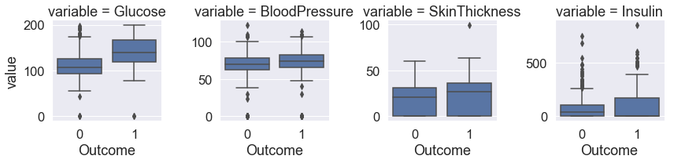
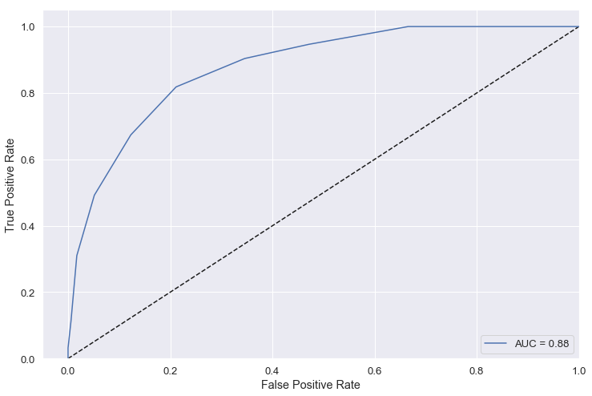

## Classification

## What is a classifier?

A classifier is some kind of rule / black box / widget that you can feed a new observation/data/record and it will decide whether or not it is part of a given class. E.g. below, we are classifying the animals to be either *cat* or *not cat*.


You can have classifiers for anything you can have a yes/no answer to, e.g.

- Is this a cat? 🐱
- Do these test results indicate cancer? 🚑
- Is this email spam or not spam? 📧

You can also have classifiers that categorise things into multiple (more than two) categories e.g.

- Which animal is this, out of the 12 animals I have trained my model on? 🐱
- Do these test results indicate {none, stage 1, stage 2, stage 3, stage 4} cancer? 🚑
- Is this email important, not important but not spam, or spam? 📧

It is clear that in some of these examples we are more concerned with being wrong in one direction than the other, e.g. it's better to let some spam email through accidentally than to block all of it but also junk important emails from people you know. Likewise, we would prefer our medical tests to err on the side of caution and not give a negative test result to someone who needs treatment. So we will need to adjust a parameter to decide how much we want to trade this off.

## Model evaluation (classification)

For now, let's imagine we have a classifier already. How can we test it to see how good it is?
A good start is a confusion matrix - a table of what test data it labels correctly and incorrectly.


### Confusion Matrix

When applying classification models, we often use a confusion matrix to evaluate certain performance measures. A confusion matrix is simply a matrix that compares "the truth" to the labels generated by your classifier. When we label a cat correctly, we refer to this as a true positive. When we fail to label a cat as a cat, this is called a false negative.  However, if we label something which is not a cat as a cat, this is called a false positive; and of course if we correctly label something which is not a cat, as not a cat, then this is a true negative.

### Some common metrics


#### AUC: Area under the curve

A good classifier will have high precision and high specificity, minimizing both false positives and false negatives. In practice, and with an imperfect classifier, you can tune a knob to say which of those two you care more about. There will be some kind of a trade-off between the two.

To capture this balance, we often use a Receiver Operator Characteristic (ROC) curve that plots the false positive rate along the x-axis and the true positive rate along the y-axis, for all possible trade-offs. A line that is diagonal from the lower left corner to the upper right corner represents a random guess at labelling each example. The higher the line is in the upper left-hand corner, the better the classifier in general. AUC computes the area under this curve. For a perfect classifier, AUC = 1, for a random guess, AUC=0.5. Objective: maximize.


# Pima Indians Diabetes
Today, we are going to be working with the [Pima Indians Diabetes Dataset](). This is a classic dataset from the UCI machine learning repository, which is now hosted on kaggle. We have downloaded the .csv file of this dataset from kaggle. It contains the following variables:


1) Pregnancies - Number of times pregnant
2) Glucose - Plasma glucose concentration a 2 hours in an [oral glucose tolerance test](https://en.wikipedia.org/wiki/Glucose_tolerance_test)
3) BloodPressure - Diastolic blood pressure (mm Hg)
4) SkinThickness - Triceps skin fold thickness (mm) - [a measure correlated with body fat](https://en.wikipedia.org/wiki/Anthropometry_of_the_upper_arm)
5) Insulin - 2-Hour serum insulin (mu U/ml)
6) BMI - Body mass index (weight in kg/(height in m)^2)
7) DiabetesPedigreeFunction - Diabetes pedigree function
8) Age - Age (years)
9) Outcome - diabetes status (1 - diabetic; 0 - non-diabetic)


The diabetes pedigree function was developed by [Smith 1988](https://www.ncbi.nlm.nih.gov/pmc/articles/PMC2245318/) to provide a synthesis ofthe diabetes mellitus history in relatives and the genetic relationship of those relatives to the subject. It uses information from parents, grandparents, siblings, aunts and uncles, and first cousin to provide a measure of the expected genetic influence of affected and unaffected relatives on the subject’s eventual diabetes risk:


- i - ranges across all relatives who HAD developed diabetes by subject's examination date
- j - ranges across all relatives who HAD NOT developed diabetes by subject's examination date
- Kx - percentage of genes shared by relative and subject. Equal to:
  - 0.5 when relative is parent or full sibling
  - 0.25 when relative is half-sibling, grandparent, aunt or uncle
  - 0.125 when relative is half aunt, half uncle or first cousin
- ADMi - age when diabetes was diagnosed
- ALC - age of relative when last "non-diabetic" assessment was made
- 88 and 14 - constants - maximum and minimum age at which patients in study were diagnosed with diabetes
- Constants 20 and 50 chosen so that:
  - A subject with no relatives has DPF slighly lower than average
  - DPF value decreases as young relatives free of diabetes join the database
  - DPF increases quickly as known relatives develop diabetes
  
DPF increases as:

- the number of relatives with diabetes increases
- the age at which those relatives develop diabetes decreases
- percentage of genes these relatives share with subject increase

DPF decreases as:

- the number of relatives who never develop diabetes increases
- their ages at last examination increase
- percentage of genes these relatives share with subject increase


## Let's Explore our data


```python
websiterendering = True
import numpy as np
import pandas as pd

import statsmodels.api as sm

# plotting libraries
import matplotlib.pyplot as plt
import seaborn as sns

# sklearn libraries
from sklearn.preprocessing import StandardScaler
from sklearn.metrics import roc_curve, auc, roc_auc_score, confusion_matrix, accuracy_score, recall_score, precision_score 
from sklearn.model_selection import GridSearchCV
from sklearn.utils.multiclass import unique_labels
from sklearn.model_selection import train_test_split
from sklearn.impute import SimpleImputer
from sklearn.neighbors import KNeighborsClassifier

%matplotlib inline
sns.set(font_scale = 1.5)
```

### Load Data


```python
diabetes = pd.read_csv('../data/diabetes.csv') # read csv
```

Explore the variables:


```python
print(diabetes.columns)
```

    Index(['Pregnancies', 'Glucose', 'BloodPressure', 'SkinThickness', 'Insulin',
           'BMI', 'DiabetesPedigreeFunction', 'Age', 'Outcome'],
          dtype='object')


Recode Outcome into integers


```python
print(diabetes.info())
```

    <class 'pandas.core.frame.DataFrame'>
    RangeIndex: 768 entries, 0 to 767
    Data columns (total 9 columns):
    Pregnancies                 768 non-null int64
    Glucose                     768 non-null int64
    BloodPressure               768 non-null int64
    SkinThickness               768 non-null int64
    Insulin                     768 non-null int64
    BMI                         768 non-null float64
    DiabetesPedigreeFunction    768 non-null float64
    Age                         768 non-null int64
    Outcome                     768 non-null int64
    dtypes: float64(2), int64(7)
    memory usage: 54.1 KB
    None


### Summary info
Shape of data frame


```python
diabetes.shape
```


    (768, 9)


Look for missing data:


```python
diabetes.count()
```


    Pregnancies                 768
    Glucose                     768
    BloodPressure               768
    SkinThickness               768
    Insulin                     768
    BMI                         768
    DiabetesPedigreeFunction    768
    Age                         768
    Outcome                     768
    dtype: int64


It seems like there is no missing data.
Get a summary of the data frame:


```python
diabetes.describe()
```


<div>
<style scoped>
    .dataframe tbody tr th:only-of-type {
        vertical-align: middle;
    }

    .dataframe tbody tr th {
        vertical-align: top;
    }

    .dataframe thead th {
        text-align: right;
    }
</style>
<table border="1" class="dataframe">
  <thead>
    <tr style="text-align: right;">
      <th></th>
      <th>Pregnancies</th>
      <th>Glucose</th>
      <th>BloodPressure</th>
      <th>SkinThickness</th>
      <th>Insulin</th>
      <th>BMI</th>
      <th>DiabetesPedigreeFunction</th>
      <th>Age</th>
      <th>Outcome</th>
    </tr>
  </thead>
  <tbody>
    <tr>
      <th>count</th>
      <td>768.000000</td>
      <td>768.000000</td>
      <td>768.000000</td>
      <td>768.000000</td>
      <td>768.000000</td>
      <td>768.000000</td>
      <td>768.000000</td>
      <td>768.000000</td>
      <td>768.000000</td>
    </tr>
    <tr>
      <th>mean</th>
      <td>3.845052</td>
      <td>120.894531</td>
      <td>69.105469</td>
      <td>20.536458</td>
      <td>79.799479</td>
      <td>31.992578</td>
      <td>0.471876</td>
      <td>33.240885</td>
      <td>0.348958</td>
    </tr>
    <tr>
      <th>std</th>
      <td>3.369578</td>
      <td>31.972618</td>
      <td>19.355807</td>
      <td>15.952218</td>
      <td>115.244002</td>
      <td>7.884160</td>
      <td>0.331329</td>
      <td>11.760232</td>
      <td>0.476951</td>
    </tr>
    <tr>
      <th>min</th>
      <td>0.000000</td>
      <td>0.000000</td>
      <td>0.000000</td>
      <td>0.000000</td>
      <td>0.000000</td>
      <td>0.000000</td>
      <td>0.078000</td>
      <td>21.000000</td>
      <td>0.000000</td>
    </tr>
    <tr>
      <th>25%</th>
      <td>1.000000</td>
      <td>99.000000</td>
      <td>62.000000</td>
      <td>0.000000</td>
      <td>0.000000</td>
      <td>27.300000</td>
      <td>0.243750</td>
      <td>24.000000</td>
      <td>0.000000</td>
    </tr>
    <tr>
      <th>50%</th>
      <td>3.000000</td>
      <td>117.000000</td>
      <td>72.000000</td>
      <td>23.000000</td>
      <td>30.500000</td>
      <td>32.000000</td>
      <td>0.372500</td>
      <td>29.000000</td>
      <td>0.000000</td>
    </tr>
    <tr>
      <th>75%</th>
      <td>6.000000</td>
      <td>140.250000</td>
      <td>80.000000</td>
      <td>32.000000</td>
      <td>127.250000</td>
      <td>36.600000</td>
      <td>0.626250</td>
      <td>41.000000</td>
      <td>1.000000</td>
    </tr>
    <tr>
      <th>max</th>
      <td>17.000000</td>
      <td>199.000000</td>
      <td>122.000000</td>
      <td>99.000000</td>
      <td>846.000000</td>
      <td>67.100000</td>
      <td>2.420000</td>
      <td>81.000000</td>
      <td>1.000000</td>
    </tr>
  </tbody>
</table>
</div>


> ## Challenge
>
> Look at the output of summary above and the table that explains what each of the variables are. Do the 
> values for all 
> - (a) Pregnancies and Glucose
> - (b) Blood pressure and Skin thickness
> - (c) Insulin and DiabetesPedigreeFunction, and
> - (d) BMI and Age 
> make sense?
>
> If not, how do you think we should deal with them? 
> Can you hypothesise what the consequences of this approach would be?
>
> {: .source}
>
> > ## Solution
> > 
> > ~~~
> >
> > # possibly missing
> > diabetes[diabetes == 0].count()
> > 
> > # not missing
> > diabetes[diabetes != 0].count()
> > 
> > ~~~
> > 
> > It is clear that the values of several variables are zero when it is impossible for them to be so (i.e. this value could not be zero if it was measured). Hence, we are dealing with "hidden" missing data, and should recode it as NA.
> > 
> > The following variables have zero "values" that are actually likely to be missing:
> > 
> > 1. Glucose (a)
> > 2. BloodPressure (b)
> > 3. SkinThickness (b)
> > 4. Insulin (c)
> > 5. BMI (d)
> > 
> > {: .output}
> {: .solution}
{: .challenge}

### Let’s use visualisation to further explore the dataset:


```python
_ = sns.countplot(x="Pregnancies",
                hue="Outcome", 
                data=diabetes)

```


If we wanted to look at all possible scatterplot pairs we would do something like:


```python
#catVars = diabetes.select_dtypes(include = ['object']).columns
numVars = diabetes.select_dtypes(exclude = ['object']).columns
```


```python
diabetes['Outcome'].value_counts()
```


    0    500
    1    268
    Name: Outcome, dtype: int64


If we wanted to look at all possible scatterplot pairs we would do something like:


```python
_ = sns.pairplot(data=diabetes,
                 vars=numVars,
                 hue='Outcome',
                 palette={0:'k',1:'r'},
                 # use kernel density estimates for univariate plots
                 diag_kind='kde',
                 # make the shape of points circular and diamond, respectively
                 markers=["o", "d"])
```

    C:\Users\dvanichkina\AppData\Local\Continuum\anaconda3\lib\site-packages\scipy\stats\stats.py:1713: FutureWarning: Using a non-tuple sequence for multidimensional indexing is deprecated; use `arr[tuple(seq)]` instead of `arr[seq]`. In the future this will be interpreted as an array index, `arr[np.array(seq)]`, which will result either in an error or a different result.
      return np.add.reduce(sorted[indexer] * weights, axis=axis) / sumval
    C:\Users\dvanichkina\AppData\Local\Continuum\anaconda3\lib\site-packages\statsmodels\nonparametric\kde.py:488: RuntimeWarning: invalid value encountered in true_divide
      binned = fast_linbin(X, a, b, gridsize) / (delta * nobs)
    C:\Users\dvanichkina\AppData\Local\Continuum\anaconda3\lib\site-packages\statsmodels\nonparametric\kdetools.py:34: RuntimeWarning: invalid value encountered in double_scalars
      FAC1 = 2*(np.pi*bw/RANGE)**2
    C:\Users\dvanichkina\AppData\Local\Continuum\anaconda3\lib\site-packages\numpy\core\fromnumeric.py:83: RuntimeWarning: invalid value encountered in reduce
      return ufunc.reduce(obj, axis, dtype, out, **passkwargs)


Generate a boxplot by possible prediction variables. Which do you hypothesize would me it easiest for us to separate the data?


```python
# copy the original dataframe
diabetes2 = diabetes.copy()
# create a new patient id column
diabetes2['PatientID'] = range(1, len(diabetes2) + 1)
# melt that dataframe
diabetes2 = diabetes2.melt(id_vars=['PatientID','Outcome'])

grid = sns.axisgrid.FacetGrid(diabetes2[diabetes2.variable.isin(numVars[1:5])], 
                              col='variable', 
                              # y axis scale different for each boxplot
                              sharey=False)
grid.map(sns.boxplot, 'Outcome','value')
```

    C:\Users\dvanichkina\AppData\Local\Continuum\anaconda3\lib\site-packages\seaborn\axisgrid.py:715: UserWarning: Using the boxplot function without specifying `order` is likely to produce an incorrect plot.
      warnings.warn(warning)


    <seaborn.axisgrid.FacetGrid at 0x1fb26d55ef0>





```python
grid = sns.axisgrid.FacetGrid(diabetes2[diabetes2.variable.isin(numVars[5:])], 
                              col='variable', 
                               # y axis scale different for each boxplot
                              sharey=False)
grid.map(sns.boxplot, 'Outcome','value')
```

    C:\Users\dvanichkina\AppData\Local\Continuum\anaconda3\lib\site-packages\seaborn\axisgrid.py:715: UserWarning: Using the boxplot function without specifying `order` is likely to produce an incorrect plot.
      warnings.warn(warning)


    <seaborn.axisgrid.FacetGrid at 0x1fb28cdc128>


Make a correlation plot betwee all numeric variables


```python
corr = diabetes.corr()

# Generate a mask for the upper triangle
mask = np.zeros_like(corr, dtype=np.bool)
mask[np.triu_indices_from(mask)] = True

# Generate a custom diverging colormap
# hue_negative, hue_positive
cmap = sns.diverging_palette(10,260, as_cmap=True)

# Draw the heatmap with the mask and correct aspect ratio
sns.set(rc={'figure.figsize':(12,8)})
sns.set(font_scale = 1.2)
_ = sns.heatmap(corr, mask=mask, cmap=cmap, vmax=.3, center=0., square=True, linewidths=.5)
```


## Prepare Data

Let’s replace the missing values in the diabetes data frame with NaN.


```python
# get the column names
diabetes.columns
```


    Index(['Pregnancies', 'Glucose', 'BloodPressure', 'SkinThickness', 'Insulin',
           'BMI', 'DiabetesPedigreeFunction', 'Age', 'Outcome'],
          dtype='object')


```python
replaceVars = ['Glucose', 'BloodPressure', 'SkinThickness', 'Insulin','BMI']
```


```python
# mark zero values as missing or NaN
diabetes[replaceVars] = diabetes[replaceVars].replace(0, np.NaN)
```


```python
print(diabetes.isnull().sum())
```

    Pregnancies                   0
    Glucose                       5
    BloodPressure                35
    SkinThickness               227
    Insulin                     374
    BMI                          11
    DiabetesPedigreeFunction      0
    Age                           0
    Outcome                       0
    dtype: int64


Let’s generate a newcorrelation plot where the missing data has been properly recoded as NaN. Which correlations change?


```python
corr = diabetes.corr()

# Generate a mask for the upper triangle
mask = np.zeros_like(corr, dtype=np.bool)
mask[np.triu_indices_from(mask)] = True

# Generate a custom diverging colormap
# hue_negative, hue_positive
cmap = sns.diverging_palette(10,260, as_cmap=True)

# Draw the heatmap with the mask and correct aspect ratio
sns.set(rc={'figure.figsize':(12,8)})
sns.set(font_scale = 1.2)
_ = sns.heatmap(corr, mask=mask, cmap=cmap, vmax=.3, center=0., square=True, linewidths=.5)
```


***
## Aim

To create a classifier for predicting whether a person has diabetes or not.

## Train-Test split

We’re going to split our data into 70% training and 30% testing sets.


```python
features_train, features_test, outcome_train, outcome_test = train_test_split(diabetes[diabetes.columns.difference(['Outcome'])],diabetes['Outcome'], train_size=0.7, test_size=0.3, random_state = 42, stratify = diabetes['Outcome'])
```

How many examples do we have in the training and testing sets?


```python
features_train.shape
```


    (537, 8)


```python
features_test.shape
```


    (231, 8)


## Impute missing values using median values


```python
## Impute missing information
imp_median = SimpleImputer(strategy='median') 
imp_median.fit(features_train)
features_train_imp = pd.DataFrame(imp_median.transform(features_train))
features_test_imp = pd.DataFrame(imp_median.transform(features_test))
features_train_imp.columns = features_train.columns
features_test_imp.columns = features_test.columns
```

Confirm that we have imputed the values for BOTH training and testing datasets using the TRAINING data median!


```python
features_train.head()
```


<div>
<style scoped>
    .dataframe tbody tr th:only-of-type {
        vertical-align: middle;
    }

    .dataframe tbody tr th {
        vertical-align: top;
    }

    .dataframe thead th {
        text-align: right;
    }
</style>
<table border="1" class="dataframe">
  <thead>
    <tr style="text-align: right;">
      <th></th>
      <th>Age</th>
      <th>BMI</th>
      <th>BloodPressure</th>
      <th>DiabetesPedigreeFunction</th>
      <th>Glucose</th>
      <th>Insulin</th>
      <th>Pregnancies</th>
      <th>SkinThickness</th>
    </tr>
  </thead>
  <tbody>
    <tr>
      <th>209</th>
      <td>41</td>
      <td>35.5</td>
      <td>84.0</td>
      <td>0.355</td>
      <td>184.0</td>
      <td>NaN</td>
      <td>7</td>
      <td>33.0</td>
    </tr>
    <tr>
      <th>176</th>
      <td>42</td>
      <td>31.2</td>
      <td>78.0</td>
      <td>0.382</td>
      <td>85.0</td>
      <td>NaN</td>
      <td>6</td>
      <td>NaN</td>
    </tr>
    <tr>
      <th>147</th>
      <td>34</td>
      <td>30.5</td>
      <td>64.0</td>
      <td>1.400</td>
      <td>106.0</td>
      <td>119.0</td>
      <td>2</td>
      <td>35.0</td>
    </tr>
    <tr>
      <th>454</th>
      <td>24</td>
      <td>37.8</td>
      <td>54.0</td>
      <td>0.498</td>
      <td>100.0</td>
      <td>105.0</td>
      <td>2</td>
      <td>28.0</td>
    </tr>
    <tr>
      <th>636</th>
      <td>48</td>
      <td>28.8</td>
      <td>74.0</td>
      <td>0.153</td>
      <td>104.0</td>
      <td>NaN</td>
      <td>5</td>
      <td>NaN</td>
    </tr>
  </tbody>
</table>
</div>


```python
features_train_imp.head()
```


<div>
<style scoped>
    .dataframe tbody tr th:only-of-type {
        vertical-align: middle;
    }

    .dataframe tbody tr th {
        vertical-align: top;
    }

    .dataframe thead th {
        text-align: right;
    }
</style>
<table border="1" class="dataframe">
  <thead>
    <tr style="text-align: right;">
      <th></th>
      <th>Age</th>
      <th>BMI</th>
      <th>BloodPressure</th>
      <th>DiabetesPedigreeFunction</th>
      <th>Glucose</th>
      <th>Insulin</th>
      <th>Pregnancies</th>
      <th>SkinThickness</th>
    </tr>
  </thead>
  <tbody>
    <tr>
      <th>0</th>
      <td>41.0</td>
      <td>35.5</td>
      <td>84.0</td>
      <td>0.355</td>
      <td>184.0</td>
      <td>126.0</td>
      <td>7.0</td>
      <td>33.0</td>
    </tr>
    <tr>
      <th>1</th>
      <td>42.0</td>
      <td>31.2</td>
      <td>78.0</td>
      <td>0.382</td>
      <td>85.0</td>
      <td>126.0</td>
      <td>6.0</td>
      <td>29.0</td>
    </tr>
    <tr>
      <th>2</th>
      <td>34.0</td>
      <td>30.5</td>
      <td>64.0</td>
      <td>1.400</td>
      <td>106.0</td>
      <td>119.0</td>
      <td>2.0</td>
      <td>35.0</td>
    </tr>
    <tr>
      <th>3</th>
      <td>24.0</td>
      <td>37.8</td>
      <td>54.0</td>
      <td>0.498</td>
      <td>100.0</td>
      <td>105.0</td>
      <td>2.0</td>
      <td>28.0</td>
    </tr>
    <tr>
      <th>4</th>
      <td>48.0</td>
      <td>28.8</td>
      <td>74.0</td>
      <td>0.153</td>
      <td>104.0</td>
      <td>126.0</td>
      <td>5.0</td>
      <td>29.0</td>
    </tr>
  </tbody>
</table>
</div>


```python
features_test.tail()
```


<div>
<style scoped>
    .dataframe tbody tr th:only-of-type {
        vertical-align: middle;
    }

    .dataframe tbody tr th {
        vertical-align: top;
    }

    .dataframe thead th {
        text-align: right;
    }
</style>
<table border="1" class="dataframe">
  <thead>
    <tr style="text-align: right;">
      <th></th>
      <th>Age</th>
      <th>BMI</th>
      <th>BloodPressure</th>
      <th>DiabetesPedigreeFunction</th>
      <th>Glucose</th>
      <th>Insulin</th>
      <th>Pregnancies</th>
      <th>SkinThickness</th>
    </tr>
  </thead>
  <tbody>
    <tr>
      <th>94</th>
      <td>21</td>
      <td>24.7</td>
      <td>82.0</td>
      <td>0.761</td>
      <td>142.0</td>
      <td>64.0</td>
      <td>2</td>
      <td>18.0</td>
    </tr>
    <tr>
      <th>437</th>
      <td>28</td>
      <td>29.9</td>
      <td>75.0</td>
      <td>0.434</td>
      <td>147.0</td>
      <td>NaN</td>
      <td>5</td>
      <td>NaN</td>
    </tr>
    <tr>
      <th>86</th>
      <td>45</td>
      <td>36.6</td>
      <td>72.0</td>
      <td>0.178</td>
      <td>106.0</td>
      <td>NaN</td>
      <td>13</td>
      <td>54.0</td>
    </tr>
    <tr>
      <th>221</th>
      <td>66</td>
      <td>31.6</td>
      <td>90.0</td>
      <td>0.805</td>
      <td>158.0</td>
      <td>NaN</td>
      <td>2</td>
      <td>NaN</td>
    </tr>
    <tr>
      <th>19</th>
      <td>32</td>
      <td>34.6</td>
      <td>70.0</td>
      <td>0.529</td>
      <td>115.0</td>
      <td>96.0</td>
      <td>1</td>
      <td>30.0</td>
    </tr>
  </tbody>
</table>
</div>


```python
features_test_imp.tail()
```


<div>
<style scoped>
    .dataframe tbody tr th:only-of-type {
        vertical-align: middle;
    }

    .dataframe tbody tr th {
        vertical-align: top;
    }

    .dataframe thead th {
        text-align: right;
    }
</style>
<table border="1" class="dataframe">
  <thead>
    <tr style="text-align: right;">
      <th></th>
      <th>Age</th>
      <th>BMI</th>
      <th>BloodPressure</th>
      <th>DiabetesPedigreeFunction</th>
      <th>Glucose</th>
      <th>Insulin</th>
      <th>Pregnancies</th>
      <th>SkinThickness</th>
    </tr>
  </thead>
  <tbody>
    <tr>
      <th>226</th>
      <td>21.0</td>
      <td>24.7</td>
      <td>82.0</td>
      <td>0.761</td>
      <td>142.0</td>
      <td>64.0</td>
      <td>2.0</td>
      <td>18.0</td>
    </tr>
    <tr>
      <th>227</th>
      <td>28.0</td>
      <td>29.9</td>
      <td>75.0</td>
      <td>0.434</td>
      <td>147.0</td>
      <td>126.0</td>
      <td>5.0</td>
      <td>29.0</td>
    </tr>
    <tr>
      <th>228</th>
      <td>45.0</td>
      <td>36.6</td>
      <td>72.0</td>
      <td>0.178</td>
      <td>106.0</td>
      <td>126.0</td>
      <td>13.0</td>
      <td>54.0</td>
    </tr>
    <tr>
      <th>229</th>
      <td>66.0</td>
      <td>31.6</td>
      <td>90.0</td>
      <td>0.805</td>
      <td>158.0</td>
      <td>126.0</td>
      <td>2.0</td>
      <td>29.0</td>
    </tr>
    <tr>
      <th>230</th>
      <td>32.0</td>
      <td>34.6</td>
      <td>70.0</td>
      <td>0.529</td>
      <td>115.0</td>
      <td>96.0</td>
      <td>1.0</td>
      <td>30.0</td>
    </tr>
  </tbody>
</table>
</div>


```python
features_train.median()
```


    Age                          30.000
    BMI                          32.400
    BloodPressure                72.000
    DiabetesPedigreeFunction      0.385
    Glucose                     117.000
    Insulin                     126.000
    Pregnancies                   3.000
    SkinThickness                29.000
    dtype: float64


```python
features_test.median()
```


    Age                          28.000
    BMI                          31.600
    BloodPressure                72.000
    DiabetesPedigreeFunction      0.342
    Glucose                     118.000
    Insulin                     120.000
    Pregnancies                   3.000
    SkinThickness                30.000
    dtype: float64


### Standardize data ranges


```python
StSc = StandardScaler()
StSc.fit(features_train_imp)
features_train_sc = StSc.transform(features_train_imp)
features_test_sc  = StSc.transform(features_test_imp)
```

### Recode outcome


```python
training_true = outcome_train.astype("category").cat.codes.values
test_true = outcome_test.astype("category").cat.codes.values 
# code into 0's and 1's
# 0 is normal 
# 1 is diabetes
print((test_true == 0).sum())
print((test_true != 0).sum())

# 
print((training_true == 0).sum())
print((training_true != 0).sum())

# is our train/test balanced?
print((test_true != 0).sum()/(test_true == 0).sum())
print((training_true != 0).sum()/(training_true == 0).sum())
```

    150
    81
    350
    187
    0.54
    0.5342857142857143


# Classifiers

## k-Nearest Neighbours Classifier

This takes the nearest k things and and says what is the majority vote? E.g. in the example below we look at the seven nearest neighbours, 4 of which are cats so we say that the new example is probably a cat as well.


### Let's Classify!

Train KNN classifier.

Link to [Minkowski distance](https://en.wikipedia.org/wiki/Minkowski_distance) for students, if you'd like to look at the formulas to understand how one function can generalise two distance metrics.


```python
# the default settings are metric='minkowski' and p = 2
# , which is the same as the standard Euclidean metric
# p = 1 gets us manhattan distance

cf_knn= KNeighborsClassifier(metric='minkowski')

# use GridSeachCV to test how many neighbors are optimal
cf_knn_gscv = GridSearchCV(cf_knn, 
                           # test from 1 to 50 neighbors 
                           {'n_neighbors': np.arange(1, 51)},
                           # use 5xfold cross-validation
                           cv=5,
                           # use f1 as error metric
                           scoring = 'f1',
                           iid = False,
                           return_train_score=True)

fit_knn = cf_knn_gscv.fit(features_train_sc, outcome_train)
```

Explore the [documentation](https://scikit-learn.org/stable/modules/model_evaluation.html#scoring-parameter) for other error metrics we could have used.


```python
# Look at the cross-validation results
fit_knn.cv_results_
```


    {'mean_fit_time': array([0.00039911, 0.00060048, 0.00059729, 0.00099225, 0.00020218,
            0.00079856, 0.00040102, 0.00079627, 0.00059185, 0.00039887,
            0.00059872, 0.00039883, 0.00039983, 0.00039868, 0.00039711,
            0.00059347, 0.00039892, 0.        , 0.00059261, 0.00039926,
            0.00040622, 0.000598  , 0.00039868, 0.00039859, 0.00040059,
            0.00059786, 0.00060039, 0.00060005, 0.00019803, 0.00040698,
            0.        , 0.        , 0.00059757, 0.00059619, 0.00039921,
            0.00059586, 0.00059886, 0.00059705, 0.00059824, 0.00039744,
            0.00019975, 0.00059919, 0.00079737, 0.        , 0.00079565,
            0.        , 0.00081515, 0.00079618, 0.00039067, 0.00039997]),
     'std_fit_time': array([4.88811327e-04, 4.90661488e-04, 4.87714990e-04, 1.47814904e-05,
            4.04357910e-04, 3.99289343e-04, 4.91155606e-04, 3.98150158e-04,
            4.83450909e-04, 4.88519238e-04, 4.88850385e-04, 4.88461041e-04,
            4.89687710e-04, 4.88285916e-04, 4.86359563e-04, 4.84644053e-04,
            4.88578005e-04, 0.00000000e+00, 4.83944769e-04, 4.88989510e-04,
            4.97660950e-04, 4.88267103e-04, 4.88286335e-04, 4.88169115e-04,
            4.90628743e-04, 4.88149953e-04, 4.90232532e-04, 4.89954981e-04,
            3.96060944e-04, 4.98659648e-04, 0.00000000e+00, 0.00000000e+00,
            4.87921408e-04, 4.86815210e-04, 4.88928244e-04, 4.86523040e-04,
            4.88970720e-04, 4.87882723e-04, 4.88503725e-04, 4.86781240e-04,
            3.99494171e-04, 4.89244066e-04, 7.45168817e-04, 0.00000000e+00,
            3.97996738e-04, 0.00000000e+00, 4.07834057e-04, 3.98105189e-04,
            4.78652113e-04, 4.89864762e-04]),
     'mean_score_time': array([0.00119696, 0.001195  , 0.00140681, 0.00099778, 0.00138593,
            0.00119476, 0.00158777, 0.00119824, 0.00120673, 0.00138149,
            0.00119605, 0.00159268, 0.00119805, 0.00159593, 0.00218749,
            0.00161009, 0.00160699, 0.00199261, 0.00139832, 0.00159464,
            0.00139399, 0.00139518, 0.00159602, 0.00159483, 0.00159278,
            0.00139689, 0.00159602, 0.00159316, 0.00199318, 0.00159612,
            0.00199509, 0.00199447, 0.00179391, 0.0013948 , 0.00160131,
            0.00159473, 0.00139384, 0.00199375, 0.00179067, 0.001788  ,
            0.00200334, 0.00179076, 0.00259061, 0.00199485, 0.00199361,
            0.00199351, 0.00179572, 0.00219336, 0.00199757, 0.00199389]),
     'std_score_time': array([3.99184551e-04, 3.99357750e-04, 4.81781800e-04, 2.00044412e-06,
            4.96154895e-04, 3.99824201e-04, 4.83192120e-04, 3.97511756e-04,
            3.94811740e-04, 4.85410311e-04, 3.95944674e-04, 4.86130148e-04,
            3.99247412e-04, 4.88188537e-04, 4.00182982e-04, 4.87633094e-04,
            4.93462356e-04, 4.49493324e-06, 4.81542781e-04, 4.89862650e-04,
            4.87490998e-04, 4.88657601e-04, 4.88558435e-04, 4.88558971e-04,
            4.90594660e-04, 4.89105636e-04, 4.88364512e-04, 4.91195680e-04,
            1.85292809e-06, 4.84417238e-04, 6.21719590e-07, 3.35687941e-06,
            3.97826741e-04, 4.90337551e-04, 4.95091518e-04, 4.86826368e-04,
            4.88874175e-04, 6.30656281e-04, 4.03023590e-04, 3.96450959e-04,
            1.09398541e-05, 3.96782672e-04, 1.19856015e-03, 5.22348936e-07,
            1.75398312e-05, 2.47128649e-06, 3.99762778e-04, 3.96435101e-04,
            1.40813170e-05, 1.67911690e-06]),
     'param_n_neighbors': masked_array(data=[1, 2, 3, 4, 5, 6, 7, 8, 9, 10, 11, 12, 13, 14, 15, 16,
                        17, 18, 19, 20, 21, 22, 23, 24, 25, 26, 27, 28, 29, 30,
                        31, 32, 33, 34, 35, 36, 37, 38, 39, 40, 41, 42, 43, 44,
                        45, 46, 47, 48, 49, 50],
                  mask=[False, False, False, False, False, False, False, False,
                        False, False, False, False, False, False, False, False,
                        False, False, False, False, False, False, False, False,
                        False, False, False, False, False, False, False, False,
                        False, False, False, False, False, False, False, False,
                        False, False, False, False, False, False, False, False,
                        False, False],
            fill_value='?',
                 dtype=object),
     'params': [{'n_neighbors': 1},
      {'n_neighbors': 2},
      {'n_neighbors': 3},
      {'n_neighbors': 4},
      {'n_neighbors': 5},
      {'n_neighbors': 6},
      {'n_neighbors': 7},
      {'n_neighbors': 8},
      {'n_neighbors': 9},
      {'n_neighbors': 10},
      {'n_neighbors': 11},
      {'n_neighbors': 12},
      {'n_neighbors': 13},
      {'n_neighbors': 14},
      {'n_neighbors': 15},
      {'n_neighbors': 16},
      {'n_neighbors': 17},
      {'n_neighbors': 18},
      {'n_neighbors': 19},
      {'n_neighbors': 20},
      {'n_neighbors': 21},
      {'n_neighbors': 22},
      {'n_neighbors': 23},
      {'n_neighbors': 24},
      {'n_neighbors': 25},
      {'n_neighbors': 26},
      {'n_neighbors': 27},
      {'n_neighbors': 28},
      {'n_neighbors': 29},
      {'n_neighbors': 30},
      {'n_neighbors': 31},
      {'n_neighbors': 32},
      {'n_neighbors': 33},
      {'n_neighbors': 34},
      {'n_neighbors': 35},
      {'n_neighbors': 36},
      {'n_neighbors': 37},
      {'n_neighbors': 38},
      {'n_neighbors': 39},
      {'n_neighbors': 40},
      {'n_neighbors': 41},
      {'n_neighbors': 42},
      {'n_neighbors': 43},
      {'n_neighbors': 44},
      {'n_neighbors': 45},
      {'n_neighbors': 46},
      {'n_neighbors': 47},
      {'n_neighbors': 48},
      {'n_neighbors': 49},
      {'n_neighbors': 50}],
     'split0_test_score': array([0.57142857, 0.55072464, 0.62790698, 0.56338028, 0.61728395,
            0.54794521, 0.62650602, 0.59459459, 0.65060241, 0.54794521,
            0.6       , 0.61333333, 0.60759494, 0.52941176, 0.58666667,
            0.55072464, 0.52777778, 0.51515152, 0.60273973, 0.57142857,
            0.58666667, 0.54285714, 0.60273973, 0.6       , 0.62162162,
            0.56338028, 0.60526316, 0.55882353, 0.60273973, 0.55072464,
            0.56338028, 0.56716418, 0.58333333, 0.57575758, 0.55882353,
            0.58461538, 0.57971014, 0.58823529, 0.58823529, 0.57575758,
            0.6       , 0.55384615, 0.57971014, 0.5625    , 0.60606061,
            0.58064516, 0.59375   , 0.6031746 , 0.61538462, 0.57142857]),
     'split1_test_score': array([0.64      , 0.47457627, 0.64102564, 0.52307692, 0.61971831,
            0.54545455, 0.58333333, 0.58823529, 0.5915493 , 0.54545455,
            0.6       , 0.55882353, 0.58333333, 0.55882353, 0.55555556,
            0.57575758, 0.57971014, 0.58461538, 0.61764706, 0.55384615,
            0.57971014, 0.51515152, 0.55882353, 0.53125   , 0.53731343,
            0.5       , 0.49230769, 0.51612903, 0.50793651, 0.51612903,
            0.51612903, 0.52459016, 0.53125   , 0.45614035, 0.49180328,
            0.5       , 0.50793651, 0.49180328, 0.50793651, 0.52459016,
            0.50793651, 0.5       , 0.53125   , 0.5       , 0.49180328,
            0.5       , 0.51612903, 0.46666667, 0.51612903, 0.49180328]),
     'split2_test_score': array([0.62337662, 0.55737705, 0.64      , 0.59375   , 0.60526316,
            0.61764706, 0.5915493 , 0.59375   , 0.68571429, 0.68656716,
            0.68571429, 0.70588235, 0.68571429, 0.70588235, 0.68571429,
            0.66666667, 0.67647059, 0.68656716, 0.67647059, 0.6875    ,
            0.6969697 , 0.6875    , 0.67692308, 0.64516129, 0.66666667,
            0.66666667, 0.65625   , 0.64516129, 0.61538462, 0.63492063,
            0.63492063, 0.63492063, 0.625     , 0.64516129, 0.625     ,
            0.63492063, 0.63492063, 0.63492063, 0.625     , 0.63492063,
            0.63492063, 0.64516129, 0.63492063, 0.63492063, 0.63492063,
            0.63492063, 0.63492063, 0.63492063, 0.63492063, 0.63492063]),
     'split3_test_score': array([0.5       , 0.43636364, 0.60606061, 0.45614035, 0.55882353,
            0.46428571, 0.60869565, 0.46428571, 0.625     , 0.6       ,
            0.61538462, 0.57627119, 0.65671642, 0.61290323, 0.64615385,
            0.64516129, 0.67692308, 0.64516129, 0.63636364, 0.63636364,
            0.64705882, 0.625     , 0.66666667, 0.625     , 0.66666667,
            0.6031746 , 0.64615385, 0.64516129, 0.64516129, 0.64516129,
            0.625     , 0.61290323, 0.59375   , 0.59375   , 0.61538462,
            0.6031746 , 0.61538462, 0.6       , 0.6031746 , 0.6       ,
            0.6       , 0.5862069 , 0.62295082, 0.5862069 , 0.61290323,
            0.59016393, 0.61290323, 0.57627119, 0.62295082, 0.61016949]),
     'split4_test_score': array([0.44776119, 0.31111111, 0.56666667, 0.53571429, 0.55737705,
            0.54545455, 0.59375   , 0.52631579, 0.57142857, 0.56140351,
            0.59016393, 0.54237288, 0.53333333, 0.48275862, 0.46666667,
            0.47457627, 0.5       , 0.47457627, 0.49180328, 0.48275862,
            0.48387097, 0.50847458, 0.47619048, 0.49180328, 0.47619048,
            0.49180328, 0.48387097, 0.48387097, 0.47619048, 0.48387097,
            0.47619048, 0.49180328, 0.49180328, 0.5       , 0.49180328,
            0.50847458, 0.49180328, 0.46666667, 0.49180328, 0.49180328,
            0.49180328, 0.49180328, 0.49180328, 0.46666667, 0.46666667,
            0.47457627, 0.46666667, 0.47457627, 0.47457627, 0.47457627]),
     'mean_test_score': array([0.55651328, 0.46603054, 0.61633198, 0.53441237, 0.5916932 ,
            0.54415741, 0.60076686, 0.55343628, 0.62485891, 0.58827408,
            0.61825257, 0.59933666, 0.61333846, 0.5779559 , 0.5881514 ,
            0.58257729, 0.59217632, 0.58121433, 0.60500486, 0.5863794 ,
            0.59885526, 0.57579665, 0.5962687 , 0.57864291, 0.59369177,
            0.56500497, 0.57676913, 0.56982922, 0.56948252, 0.56616131,
            0.56312409, 0.5662763 , 0.56502732, 0.55416184, 0.55656294,
            0.56623704, 0.56595104, 0.55632517, 0.56322994, 0.56541433,
            0.56693208, 0.55540352, 0.57212698, 0.55005884, 0.56247088,
            0.5560612 , 0.56487391, 0.55112187, 0.57279227, 0.55657965]),
     'std_test_score': array([0.07305337, 0.08996717, 0.02784269, 0.04607991, 0.02786557,
            0.04857557, 0.01525449, 0.05140723, 0.04081778, 0.05287908,
            0.03468311, 0.05825134, 0.0537662 , 0.07664411, 0.07577075,
            0.06886668, 0.07360243, 0.07865872, 0.06175804, 0.07034629,
            0.07167498, 0.06956107, 0.07392401, 0.05799484, 0.07538676,
            0.06538929, 0.0744408 , 0.06594467, 0.06547005, 0.06400322,
            0.06123631, 0.05323696, 0.04745417, 0.06761097, 0.05750888,
            0.05318539, 0.05701469, 0.0652759 , 0.05328324, 0.05141882,
            0.05645216, 0.05678428, 0.05423363, 0.06020487, 0.06908663,
            0.05961347, 0.06335284, 0.06834635, 0.06487993, 0.0634826 ]),
     'rank_test_score': array([40, 50,  3, 49, 12, 48,  6, 45,  1, 13,  2,  7,  4, 19, 14, 16, 11,
            17,  5, 15,  8, 21,  9, 18, 10, 33, 20, 24, 25, 29, 36, 27, 32, 44,
            39, 28, 30, 41, 35, 31, 26, 43, 23, 47, 37, 42, 34, 46, 22, 38]),
     'split0_train_score': array([1.        , 0.69298246, 0.79322034, 0.68825911, 0.74468085,
            0.68525896, 0.73381295, 0.69047619, 0.73260073, 0.6746988 ,
            0.7063197 , 0.68235294, 0.70072993, 0.6796875 , 0.69818182,
            0.640625  , 0.68888889, 0.62204724, 0.67407407, 0.6374502 ,
            0.64864865, 0.60408163, 0.63035019, 0.60162602, 0.640625  ,
            0.6090535 , 0.61111111, 0.57740586, 0.592     , 0.57959184,
            0.60869565, 0.5785124 , 0.60240964, 0.58196721, 0.61660079,
            0.56431535, 0.59677419, 0.55833333, 0.58536585, 0.56903766,
            0.59760956, 0.53617021, 0.56790123, 0.54700855, 0.55230126,
            0.55319149, 0.56431535, 0.53679654, 0.54008439, 0.53679654]),
     'split1_train_score': array([1.        , 0.74789916, 0.83108108, 0.71146245, 0.75958188,
            0.69019608, 0.74911661, 0.70498084, 0.72535211, 0.70411985,
            0.70877193, 0.67924528, 0.70967742, 0.6744186 , 0.69117647,
            0.65882353, 0.69372694, 0.6640625 , 0.68656716, 0.66666667,
            0.6641791 , 0.64822134, 0.64638783, 0.64      , 0.66153846,
            0.624     , 0.63117871, 0.61417323, 0.62790698, 0.624     ,
            0.64313725, 0.62650602, 0.63779528, 0.63114754, 0.64285714,
            0.63157895, 0.624     , 0.61788618, 0.61354582, 0.6097561 ,
            0.61904762, 0.60408163, 0.60557769, 0.60728745, 0.608     ,
            0.60162602, 0.608     , 0.59016393, 0.6       , 0.59349593]),
     'split2_train_score': array([1.        , 0.71794872, 0.78456592, 0.671875  , 0.72413793,
            0.64885496, 0.71724138, 0.65637066, 0.6971831 , 0.66415094,
            0.6971831 , 0.67669173, 0.71014493, 0.66923077, 0.70072993,
            0.66412214, 0.6884058 , 0.66923077, 0.68592058, 0.6539924 ,
            0.68100358, 0.66415094, 0.66909091, 0.64684015, 0.66666667,
            0.6490566 , 0.64944649, 0.62068966, 0.63670412, 0.61478599,
            0.63878327, 0.63529412, 0.63878327, 0.62992126, 0.63320463,
            0.62698413, 0.61960784, 0.60483871, 0.60392157, 0.59437751,
            0.60700389, 0.608     , 0.61176471, 0.60483871, 0.5984252 ,
            0.59016393, 0.60629921, 0.60240964, 0.60079051, 0.58299595]),
     'split3_train_score': array([1.        , 0.7394958 , 0.8       , 0.69201521, 0.76      ,
            0.6969697 , 0.71186441, 0.6641791 , 0.70508475, 0.7032967 ,
            0.71477663, 0.69090909, 0.69204152, 0.66917293, 0.68100358,
            0.6490566 , 0.66425993, 0.63846154, 0.63970588, 0.62548263,
            0.63432836, 0.6328125 , 0.63636364, 0.62256809, 0.63909774,
            0.61478599, 0.60769231, 0.6015625 , 0.61538462, 0.5984252 ,
            0.60465116, 0.608     , 0.62307692, 0.6       , 0.61111111,
            0.59349593, 0.60869565, 0.59109312, 0.5859375 , 0.59591837,
            0.6031746 , 0.58299595, 0.59760956, 0.59349593, 0.59760956,
            0.59109312, 0.5952381 , 0.592     , 0.5952381 , 0.58064516]),
     'split4_train_score': array([1.        , 0.74476987, 0.80405405, 0.734375  , 0.76551724,
            0.7027027 , 0.70138889, 0.67680608, 0.69257951, 0.68679245,
            0.69039146, 0.68148148, 0.69257951, 0.67883212, 0.70877193,
            0.66914498, 0.68571429, 0.65917603, 0.65949821, 0.64925373,
            0.66903915, 0.6394052 , 0.66906475, 0.64150943, 0.67391304,
            0.66165414, 0.67153285, 0.65151515, 0.65925926, 0.65671642,
            0.65934066, 0.64150943, 0.65185185, 0.64638783, 0.65917603,
            0.64393939, 0.64444444, 0.62068966, 0.64179104, 0.63117871,
            0.63197026, 0.62307692, 0.6394052 , 0.62068966, 0.62641509,
            0.61478599, 0.6259542 , 0.62015504, 0.6259542 , 0.62015504]),
     'mean_train_score': array([1.        , 0.7286192 , 0.80258428, 0.69959735, 0.75078358,
            0.68479648, 0.72268485, 0.67856258, 0.71056004, 0.68661175,
            0.70348856, 0.68213611, 0.70103466, 0.67426838, 0.69597275,
            0.65635445, 0.68419917, 0.65059562, 0.66915318, 0.64656912,
            0.65943977, 0.63773432, 0.65025146, 0.63050874, 0.65636818,
            0.63171005, 0.63419229, 0.61306928, 0.62625099, 0.61470389,
            0.6309216 , 0.61796439, 0.63078339, 0.61788477, 0.63258994,
            0.61206275, 0.61870443, 0.5985682 , 0.60611236, 0.60005367,
            0.61176119, 0.59086494, 0.60445168, 0.59466406, 0.59655022,
            0.59017211, 0.59996137, 0.58830503, 0.59241344, 0.58281772]),
     'std_train_score': array([0.        , 0.02066252, 0.0157051 , 0.02147016, 0.01501111,
            0.01892079, 0.01686834, 0.01756309, 0.0157278 , 0.01569306,
            0.00865613, 0.00480497, 0.00787595, 0.00450684, 0.00936387,
            0.01030248, 0.0102989 , 0.01768895, 0.01771423, 0.01409978,
            0.01628888, 0.019836  , 0.01620324, 0.01658361, 0.01404798,
            0.02028171, 0.0239628 , 0.02425555, 0.0223283 , 0.02588177,
            0.02098952, 0.02273058, 0.01686122, 0.0234228 , 0.01749061,
            0.02913483, 0.01595317, 0.02270059, 0.02083491, 0.02036771,
            0.01231364, 0.03019714, 0.02306186, 0.02534805, 0.02443611,
            0.02052048, 0.02036351, 0.02786968, 0.02828081, 0.02694736])}


```python
print(fit_knn.best_estimator_.n_neighbors)
```

    9


```python
# lets make a pandas dataframe to enable plotting
cvresults = pd.DataFrame.from_dict({k: v for k, v in fit_knn.cv_results_.items() if (k.startswith('split') and k.endswith('test_score'))})
cvparams = pd.DataFrame.from_dict(fit_knn.cv_results_['params'])
knn_cv_results = pd.concat([cvresults, cvparams], axis=1).melt(id_vars=['n_neighbors'])
```

Let's make a plot to see performance of the algorithm with various numbers of neighbors


```python
_ = sns.pointplot(x="n_neighbors",
                  y="value",
                 data = knn_cv_results)
# need to subtract 1 for x due to zero-based indexing
plt.scatter(x = fit_knn.best_estimator_.n_neighbors-1,
            y = knn_cv_results[knn_cv_results['n_neighbors'] == fit_knn.best_estimator_.n_neighbors]['value'].mean(),
            color = 'r',
            # plots point on top of other plot
            zorder = 10)
```

    C:\Users\dvanichkina\AppData\Local\Continuum\anaconda3\lib\site-packages\scipy\stats\stats.py:1713: FutureWarning: Using a non-tuple sequence for multidimensional indexing is deprecated; use `arr[tuple(seq)]` instead of `arr[seq]`. In the future this will be interpreted as an array index, `arr[np.array(seq)]`, which will result either in an error or a different result.
      return np.add.reduce(sorted[indexer] * weights, axis=axis) / sumval


    <matplotlib.collections.PathCollection at 0x1fb2aa56748>


> ## Challenge
>
> Do you think this is the optimal solution?
>
> 
> {: .source}
>
> > ## Solution
> > 
> > Probably not, since the performance of the classifier after a certain number of neighbors (~9 - 30) doesn't really seem to improve that much
> > 
> > {: .output}
> {: .solution}
{: .challenge}


```python
# Use trained classifier to predict outcome for training and test
knn_outcome_pred_class_train = fit_knn.predict(features_train_sc)
knn_outcome_pred_class_test = fit_knn.predict(features_test_sc)


# get probabilities out
def model_probabilities(model = fit_knn, dataset = features_train_sc):
    probs1 = model.predict_proba(dataset)
    probs2 = [p[1] for p in probs1] 
    # hopefully close to 1 for true 1's
    return(probs2)

knn_outcome_pred_prob_train = model_probabilities(model = fit_knn, dataset = features_train_sc)
knn_outcome_pred_prob_test = model_probabilities(model = fit_knn, dataset = features_test_sc)

```

### Classifier Diagnostics/evaluation
So how well did the classifier do? Let's define a function to generate a confusion matrix:


```python
# define custom confusion matrix function
def confmatrix(truth = outcome_train, prediction = knn_outcome_pred_class_train):
    df = pd.DataFrame(confusion_matrix(truth, prediction))
    #Total sum per row: 
    df.loc['Predictions',:]= df.sum(axis=0)
    #Total sum per column: 
    df.loc[:,'Truth'] = df.sum(axis=1)
    return(df)
```

Assess performance on the training set:


```python
confmatrix(truth = outcome_train, prediction = knn_outcome_pred_class_train)
```


<div>
<style scoped>
    .dataframe tbody tr th:only-of-type {
        vertical-align: middle;
    }

    .dataframe tbody tr th {
        vertical-align: top;
    }

    .dataframe thead th {
        text-align: right;
    }
</style>
<table border="1" class="dataframe">
  <thead>
    <tr style="text-align: right;">
      <th></th>
      <th>0</th>
      <th>1</th>
      <th>Truth</th>
    </tr>
  </thead>
  <tbody>
    <tr>
      <th>0</th>
      <td>307.0</td>
      <td>43.0</td>
      <td>350.0</td>
    </tr>
    <tr>
      <th>1</th>
      <td>61.0</td>
      <td>126.0</td>
      <td>187.0</td>
    </tr>
    <tr>
      <th>Predictions</th>
      <td>368.0</td>
      <td>169.0</td>
      <td>537.0</td>
    </tr>
  </tbody>
</table>
</div>


```python
confmatrix(truth = outcome_test, prediction = knn_outcome_pred_class_test)
```


<div>
<style scoped>
    .dataframe tbody tr th:only-of-type {
        vertical-align: middle;
    }

    .dataframe tbody tr th {
        vertical-align: top;
    }

    .dataframe thead th {
        text-align: right;
    }
</style>
<table border="1" class="dataframe">
  <thead>
    <tr style="text-align: right;">
      <th></th>
      <th>0</th>
      <th>1</th>
      <th>Truth</th>
    </tr>
  </thead>
  <tbody>
    <tr>
      <th>0</th>
      <td>127.0</td>
      <td>23.0</td>
      <td>150.0</td>
    </tr>
    <tr>
      <th>1</th>
      <td>36.0</td>
      <td>45.0</td>
      <td>81.0</td>
    </tr>
    <tr>
      <th>Predictions</th>
      <td>163.0</td>
      <td>68.0</td>
      <td>231.0</td>
    </tr>
  </tbody>
</table>
</div>


```python
# define a function to plot an ROC curve
def plot_ROC(truth = outcome_train, prediction1 = knn_outcome_pred_prob_train, col = 'b'):
    fpr, tpr, _ = roc_curve(truth, prediction1)
    AUC = roc_auc_score(truth, prediction1)
    plt.xlim([-0.05, 1.0])
    plt.ylim([0.0, 1.05])
    plt.xlabel('False Positive Rate')
    plt.ylabel('True Positive Rate')
    plt.plot([0, 1], [0, 1], 'k--')
    plt.plot(fpr, tpr, label='AUC = %4.2f'%AUC, color = col)
    _ = plt.legend(loc="lower right")


# plot the roc curves
# training in blue
plot_ROC(truth = outcome_train, prediction1 = knn_outcome_pred_prob_train, col = 'b')
# test in red
plot_ROC(truth = outcome_test, prediction1 = knn_outcome_pred_prob_test, col = 'r')
```





> ## Challenge
>
> How well do you think this model generalised?
>
> 
> {: .source}
>
> > ## Solution
> > 
> > While the overall performance of the model is not very good, it does generalise well, as the difference between the 
> > 
> > 
> > {: .output}
> {: .solution}
{: .challenge}

## Naive Bayes Classifier

A Naïve Bayes classifier assumes that each of your columns are independent (uncorrelated with each other). It works out a probability that your example is a cat by counting the fraction of cats that had that value in each column, multiplying the values together and then multiplying again by what fraction of your training examples were cats. This is just writing out bayes rule of conditional probability and simplifying it for independent columns.

$$p(\text{Cat}| x_\text{new})=\frac{p(\text{Cat})p(x_\text{new}|\text{Cat})}{p(\text{Cat})p(x_\text{new}|\text{Cat})+p(\text{Not Cat})p(x_\text{new}|\text{Not Cat})}$$

In practice your columns are probably not independent, but we still use it anyway and it's usually ok, providing we only care about the label and not the probability it spits out.  

Continuous variables have to be somehow turned into discrete variables before you can use this technique, but most algorithms do this for you automatically.


### Let's Classify!
Train Naive Bayes classifier


```python
from sklearn.naive_bayes import GaussianNB
cf_gnb = GaussianNB()


# use GridSeachCV to test how many neighbors are optimal
cf_gnb_gscv = GridSearchCV(cf_gnb, 
                           {'var_smoothing' : [1e-09]},
                           # use 5xfold cross-validation
                           cv=5,
                           # use f1 as error metric
                           scoring = 'f1')

fit_gnb = cf_gnb_gscv.fit(features_train_sc, outcome_train)
```

Use trained classifier to predict outcome for test-set


```python
gnb_train_pred_class = cf_gnb_gscv.predict(features_train_sc)
gnb_test_pred_class = cf_gnb_gscv.predict(features_test_sc)

gnb_pred_prob_train = model_probabilities(model = cf_gnb_gscv, dataset=features_train_sc)
gnb_pred_prob_test = model_probabilities(model = cf_gnb_gscv, dataset=features_test_sc)
```

### Classifier Diagnostics
So how well did it go?


```python
# print matrix for predictions on training and testing
print("Training set")
print(confmatrix(truth = outcome_train, prediction = gnb_train_pred_class))
print("\nTesting set")
print(confmatrix(truth = outcome_test, prediction = gnb_test_pred_class))
```

    Training set
                     0      1  Truth
    0            297.0   53.0  350.0
    1             77.0  110.0  187.0
    Predictions  374.0  163.0  537.0
    
    Testing set
                     0     1  Truth
    0            121.0  29.0  150.0
    1             34.0  47.0   81.0
    Predictions  155.0  76.0  231.0


```python
# plot the roc curves
plot_ROC(truth = outcome_train, prediction1 = gnb_pred_prob_train, col = 'b')
plot_ROC(truth = outcome_test, prediction1 = gnb_pred_prob_test, col = 'r')
```


## Regularized Logistic Classifier

This fits a logistic regression to the probability of receiving a class label of 1 or 0. Regularisation (hopefully) stops it from overfitting. 

### Let's Classify!
Train Regularized Logistic classifier. 

There are several algorithms to do this accessible in scikit-learn, and we will use the one that uses the saga solver. 


```python
np.linspace(start=0, stop=1, num=8)
```


    array([0.        , 0.14285714, 0.28571429, 0.42857143, 0.57142857,
           0.71428571, 0.85714286, 1.        ])


```python
from sklearn.linear_model import LogisticRegression
# class_weight balanced will uses the values of y to automatically adjust weights inversely 
# proportional to class frequencies in the input data as n_samples / (n_classes * np.bincount(y)
# multi_class='ovr' - a binary problem is fit for each label
cf_rlc = LogisticRegression(random_state=42, solver='saga',multi_class='ovr' )

# test different penalty and class weight parameters - define this as a dictionary to make subsequent plotting easier
rlc_dict = {
            'penalty': ['l1', 'l2'],
            # for proper ENET
            # 'penalty': ['elasticnet'], 
            'class_weight': [None, 'balanced']}
            # l1_ratio with saga implements a proper EN, but doesn't work ATM b/c pf a l1_ratio not a recognised parameter issue
            # 'l1_ratio': np.linspace(start=0.01, stop=0.99, num=8)}

# use GridSeachCV to which form of regularisation is optimal
cf_rlc_gscv = GridSearchCV(cf_rlc,
                           rlc_dict,
                           # use 5xfold cross-validation
                           cv=5,
                           # use AUC as error metric
                           scoring = 'f1',
                           iid = False)
# fit model on training data
fit_rlc = cf_rlc_gscv.fit(features_train_sc, outcome_train)
```

    C:\Users\dvanichkina\AppData\Local\Continuum\anaconda3\lib\site-packages\sklearn\model_selection\_search.py:841: DeprecationWarning: The default of the `iid` parameter will change from True to False in version 0.22 and will be removed in 0.24. This will change numeric results when test-set sizes are unequal.
      DeprecationWarning)


```python
# what is the best estimator?
fit_rlc.best_estimator_
```


    LogisticRegression(C=1.0, class_weight='balanced', dual=False,
              fit_intercept=True, intercept_scaling=1, max_iter=100,
              multi_class='ovr', n_jobs=None, penalty='l2', random_state=42,
              solver='saga', tol=0.0001, verbose=0, warm_start=False)


Use trained classifier to predict outcome for training and test sets


```python
rlc_train_pred_class = fit_rlc.predict(features_train_sc)
rlc_test_pred_class = fit_rlc.predict(features_test_sc)

rlc_pred_prob_train = model_probabilities(model = cf_rlc_gscv, dataset=features_train_sc)
rlc_pred_prob_test = model_probabilities(model = cf_rlc_gscv, dataset=features_test_sc)
```

### Classifier evaluation
So how well did the classifier do?


```python
# print matrix for predictions on training and testing
print("Training set")
print(confmatrix(truth = outcome_train, prediction = rlc_train_pred_class))
print("\nTesting set")
print(confmatrix(truth = outcome_test, prediction = rlc_test_pred_class))

# plot the roc curves
plot_ROC(truth = outcome_train, prediction1 = rlc_pred_prob_train, col = 'b')
plot_ROC(truth = outcome_test, prediction1 = rlc_pred_prob_test, col = 'r')
```

    Training set
                     0      1  Truth
    0            279.0   71.0  350.0
    1             51.0  136.0  187.0
    Predictions  330.0  207.0  537.0
    
    Testing set
                     0     1  Truth
    0            119.0  31.0  150.0
    1             24.0  57.0   81.0
    Predictions  143.0  88.0  231.0


## Decision Trees

A decision tree 🌳 picks the best split in the data greedily for each feature and basically makes a flowchart to follow with a new data point to say what you should classify it as. This makes them easy to understsand, but also usually not very accurate. 

### Let's Classify!
Train Decision Tree classifier.

To see how the gini coefficient vs entropy are calculated see [here](https://scikit-learn.org/stable/modules/tree.html#classification-criteria). 


```python
from sklearn.tree import DecisionTreeClassifier
cf_dtc = DecisionTreeClassifier(random_state= 42)
dtc_dict = {
    # function to measure quality of split
    'criterion': ['gini', 'entropy'],
    # The minimum number of samples required to split an internal node
    'min_samples_split': np.arange(start = 2, stop = 20, step = 3),
    # The minimum number of samples required to be at a leaf node
    'min_samples_leaf': np.arange(start = 1, stop = 10, step = 2)}


cf_dtc_gscv = GridSearchCV(cf_dtc,
                           dtc_dict,
                           # use 5xfold cross-validation
                           cv=5,
                           # use AUC as error metric
                           scoring = 'f1',
                           iid = False)
    
# fit the model on the training data
fit_dtc = cf_dtc_gscv.fit(features_train_sc, outcome_train)

# what were the best parameters?
fit_dtc.best_estimator_
```

    C:\Users\dvanichkina\AppData\Local\Continuum\anaconda3\lib\site-packages\sklearn\model_selection\_search.py:841: DeprecationWarning: The default of the `iid` parameter will change from True to False in version 0.22 and will be removed in 0.24. This will change numeric results when test-set sizes are unequal.
      DeprecationWarning)


    DecisionTreeClassifier(class_weight=None, criterion='entropy', max_depth=None,
                max_features=None, max_leaf_nodes=None,
                min_impurity_decrease=0.0, min_impurity_split=None,
                min_samples_leaf=9, min_samples_split=2,
                min_weight_fraction_leaf=0.0, presort=False, random_state=42,
                splitter='best')


Use trained classifier to predict outcome for test-set


```python
dtc_train_pred_class = fit_dtc.predict(features_train_sc)
dtc_test_pred_class = fit_dtc.predict(features_test_sc)

dtc_pred_prob_train = model_probabilities(model = cf_dtc_gscv, dataset=features_train_sc)
dtc_pred_prob_test = model_probabilities(model = cf_dtc_gscv, dataset=features_test_sc)


# # print matrix for predictions on training and testing
print("Training set")
print(confmatrix(truth = outcome_train, prediction = dtc_train_pred_class))
print("\nTesting set")
print(confmatrix(truth = outcome_test, prediction = dtc_test_pred_class))


# # plot the roc curves
plot_ROC(truth = outcome_train, prediction1 = dtc_pred_prob_train, col = 'b')
plot_ROC(truth = outcome_test, prediction1 = dtc_pred_prob_test, col = 'r')
```

    Training set
                     0      1  Truth
    0            320.0   30.0  350.0
    1             54.0  133.0  187.0
    Predictions  374.0  163.0  537.0
    
    Testing set
                     0     1  Truth
    0            131.0  19.0  150.0
    1             42.0  39.0   81.0
    Predictions  173.0  58.0  231.0


We can also plot the decision tree


```python
from sklearn import tree
from sklearn.tree import plot_tree
tree.plot_tree(fit_dtc.best_estimator_) 
```


    ---------------------------------------------------------------------------

    NameError                                 Traceback (most recent call last)

    <ipython-input-1-d5bb71920e99> in <module>
          1 from sklearn import tree
          2 from sklearn.tree import plot_tree
    -- 3 tree.plot_tree(fit_dtc.best_estimator_)
    

    NameError: name 'fit_dtc' is not defined


> ## Challenge
>
> Do you think this model is fit well?
>
> 
> {: .source}
>
> > ## Solution
> > 
> > No, the tree has overfit.
> > 
> > {: .output}
> {: .solution}
{: .challenge}

## Random Forest Classifier
A random decision tree is where you make a decision tree but only train it on either:

- (a) a random sample of the available data or 
- (b) a random sample of the available features or 
- (c) both.

A random forest is a whole bunch of these averaged together. 

Turns out these do pretty good and are used all over the place. But because they're the average of so many different models it's hard to get an understanding about it. It's basically a black box that predicts well.


```python
from sklearn.ensemble import RandomForestClassifier
cf_rfc = RandomForestClassifier(random_state=42)
# 
rf_dict = {
    # The number of trees in the forest
    'n_estimators': np.arange(10,150,25), 
    # quality of a split
    'criterion': ['entropy'],
    # The minimum number of samples required to split an internal node
    'min_samples_split': np.arange(start = 2, stop = 20, step = 5),
    # The minimum number of samples required to be at a leaf node
    'min_samples_leaf': np.arange(start = 1, stop = 3, step = 1),
    # the number of features to consider when looking for the best split
    # max_features=sqrt(n_features)/max_features=log2(n_features)
    'max_features': ['sqrt'],
    'class_weight': ['balanced_subsample', None]
}

# use GridSeachCV to which form of regularisation is optimal
cf_rf_gscv = GridSearchCV(cf_rfc,
                           rf_dict,
                           # use 5xfold cross-validation
                           cv=5,
                           # use AUC as error metric
                           scoring = 'f1',
                           iid = False)

# fit model on training data
fit_rf = cf_rf_gscv.fit(features_train_sc, outcome_train)

# what were the best parameters?
fit_rf.best_estimator_
```

    C:\Users\dvanichkina\AppData\Local\Continuum\anaconda3\lib\site-packages\sklearn\model_selection\_search.py:841: DeprecationWarning: The default of the `iid` parameter will change from True to False in version 0.22 and will be removed in 0.24. This will change numeric results when test-set sizes are unequal.
      DeprecationWarning)


    RandomForestClassifier(bootstrap=True, class_weight='balanced_subsample',
                criterion='entropy', max_depth=None, max_features='sqrt',
                max_leaf_nodes=None, min_impurity_decrease=0.0,
                min_impurity_split=None, min_samples_leaf=2,
                min_samples_split=12, min_weight_fraction_leaf=0.0,
                n_estimators=110, n_jobs=None, oob_score=False,
                random_state=42, verbose=0, warm_start=False)


Use trained classifier to predict outcome for test-set


```python
rf_train_pred_class = cf_rf_gscv.predict(features_train_sc)
rf_test_pred_class = cf_rf_gscv.predict(features_test_sc)

rf_pred_prob_train = model_probabilities(model = cf_rf_gscv, dataset=features_train_sc)
rf_pred_prob_test = model_probabilities(model = cf_rf_gscv, dataset=features_test_sc)


# print matrix for predictions on training and testing
print("Training set")
print(confmatrix(truth = outcome_train, prediction = rf_train_pred_class))
print("\nTesting set")
print(confmatrix(truth = outcome_test, prediction = rf_test_pred_class))


# plot the roc curves
plot_ROC(truth = outcome_train, prediction1 = rf_pred_prob_train, col = 'b')
plot_ROC(truth = outcome_test, prediction1 = rf_pred_prob_test, col = 'r')
```

    Training set
                     0      1  Truth
    0            328.0   22.0  350.0
    1             14.0  173.0  187.0
    Predictions  342.0  195.0  537.0
    
    Testing set
                     0     1  Truth
    0            122.0  28.0  150.0
    1             26.0  55.0   81.0
    Predictions  148.0  83.0  231.0


## Support Vector Machine
A support vector machine tries to find the data points right on the boundary between the two classes (the "support vectors") and then uses them to define a maximum margin boundary.


### Let's Classify!
Train SVM


```python
from sklearn import svm
cf_svm = svm.SVC(random_state=42, probability=True, 
                 # Kernel coefficient for ‘rbf’, ‘poly’ and ‘sigmoid’.
                 # 1 / (n_features * X.var()) 
                gamma = 'scale')

cf_svm_gscv_lin = GridSearchCV(cf_svm,
                           {'kernel': ['linear']},
                           # use 5xfold cross-validation
                           cv=5,
                           # use F1 score as error metric
                           scoring = 'f1',
                           iid = False)

fit_svm_lin = cf_svm_gscv_lin.fit(features_train_sc, outcome_train)

# use GridSeachCV to which form of regularisation is optimal
cf_svm_gscv_rad = GridSearchCV(cf_svm,
                           {'kernel': ['rbf']},
                           # use 5xfold cross-validation
                           cv=5,
                           # use F1 as error metric
                           scoring = 'f1',
                           iid = False)

fit_svm_rbf = cf_svm_gscv_rad.fit(features_train_sc, outcome_train)
```

    C:\Users\dvanichkina\AppData\Local\Continuum\anaconda3\lib\site-packages\sklearn\model_selection\_search.py:841: DeprecationWarning: The default of the `iid` parameter will change from True to False in version 0.22 and will be removed in 0.24. This will change numeric results when test-set sizes are unequal.
      DeprecationWarning)
    C:\Users\dvanichkina\AppData\Local\Continuum\anaconda3\lib\site-packages\sklearn\model_selection\_search.py:841: DeprecationWarning: The default of the `iid` parameter will change from True to False in version 0.22 and will be removed in 0.24. This will change numeric results when test-set sizes are unequal.
      DeprecationWarning)


Use trained classifier to predict outcome for test-set


```python
fit_svm_lin.best_estimator_
```


    SVC(C=1.0, cache_size=200, class_weight=None, coef0=0.0,
      decision_function_shape='ovr', degree=3, gamma='scale', kernel='linear',
      max_iter=-1, probability=True, random_state=42, shrinking=True,
      tol=0.001, verbose=False)


```python
fit_svm_rbf.best_estimator_
```


    SVC(C=1.0, cache_size=200, class_weight=None, coef0=0.0,
      decision_function_shape='ovr', degree=3, gamma='scale', kernel='rbf',
      max_iter=-1, probability=True, random_state=42, shrinking=True,
      tol=0.001, verbose=False)


```python
svm_l_train_pred_class = cf_svm_gscv_lin.predict(features_train_sc)
svm_l_test_pred_class = cf_svm_gscv_lin.predict(features_test_sc)

svm_l_pred_prob_train = model_probabilities(model = cf_svm_gscv_lin, dataset=features_train_sc)
svm_l_pred_prob_test = model_probabilities(model = cf_svm_gscv_lin, dataset=features_test_sc)


# print matrix for predictions on training and testing
print("Training set")
print(confmatrix(truth = outcome_train, prediction = svm_l_train_pred_class))
print("\nTesting set")
print(confmatrix(truth = outcome_test, prediction = svm_l_test_pred_class))


# plot the roc curves
plot_ROC(truth = outcome_train, prediction1 = svm_l_pred_prob_train, col = 'b')
plot_ROC(truth = outcome_test, prediction1 = svm_l_pred_prob_test, col = 'r')
```

    Training set
                     0      1  Truth
    0            317.0   33.0  350.0
    1             81.0  106.0  187.0
    Predictions  398.0  139.0  537.0
    
    Testing set
                     0     1  Truth
    0            130.0  20.0  150.0
    1             43.0  38.0   81.0
    Predictions  173.0  58.0  231.0


```python
svm_r_train_pred_class = cf_svm_gscv_rad.predict(features_train_sc)
svm_r_test_pred_class = cf_svm_gscv_rad.predict(features_test_sc)

svm_r_pred_prob_train = model_probabilities(model = cf_svm_gscv_rad, dataset=features_train_sc)
svm_r_pred_prob_test = model_probabilities(model = cf_svm_gscv_rad, dataset=features_test_sc)


# print matrix for predictions on training and testing
print("Training set")
print(confmatrix(truth = outcome_train, prediction = svm_r_train_pred_class))
print("\nTesting set")
print(confmatrix(truth = outcome_test, prediction = svm_r_test_pred_class))


# plot the roc curves
plot_ROC(truth = outcome_train, prediction1 = svm_r_pred_prob_train, col = 'b')
plot_ROC(truth = outcome_test, prediction1 = svm_r_pred_prob_test, col = 'r')
```

    Training set
                     0      1  Truth
    0            327.0   23.0  350.0
    1             62.0  125.0  187.0
    Predictions  389.0  148.0  537.0
    
    Testing set
                     0     1  Truth
    0            131.0  19.0  150.0
    1             40.0  41.0   81.0
    Predictions  171.0  60.0  231.0


# Compare all the classifiers


```python
evaluations = ['Misclassification rate', 'Sensitivity', 'Specificity', 'AUC']
pretrained_models = {'k Nearest Neighbours':cf_knn_gscv, 
                     'Naive Bayes':cf_gnb_gscv, 
                     'Regularised Logistic Classifier':cf_rlc_gscv, 
                     'Decision Tree':cf_dtc_gscv, 
                     'Random Forest':cf_rf_gscv, 
                     'Linear SVM':cf_svm_gscv_lin,
                     'Radial SVM':cf_svm_gscv_rad}
comparison_stats = pd.DataFrame(index = pretrained_models.keys(), columns=evaluations)
for method, model in pretrained_models.items():
    outcome_pred_class = model.predict(features_test_sc)
    if method in []: # Support Vector Machine'
        AUC = float('nan')
    else:
        outcome_pred_prob = model.predict_proba(features_test_sc)
        outcome_pred_prob1 = [p[1] for p in outcome_pred_prob]
        AUC = roc_auc_score(outcome_test, outcome_pred_prob1)
    conf_mat = confusion_matrix(outcome_test, outcome_pred_class)
    # in this case 0-0 is negatives
    # 1-1 is diabetes
    TP = conf_mat[1,1]
    FP = conf_mat[0,1]
    TN = conf_mat[0,0]
    FN = conf_mat[1,0]
    
    comparison_stats.loc[method,'Misclassification rate']  = 1. - accuracy_score(outcome_test, outcome_pred_class)
    # sensitivity == recall
    comparison_stats.loc[method,'Sensitivity'] = TP/(TP + FN)
    comparison_stats.loc[method,'Specificity'] = TN/(TN + FP)
    comparison_stats.loc[method,'Precision'] = TP/(TP + FP)
    comparison_stats.loc[method,'Accuracy'] = (TP + TN)/(TP + FP + TN + FN)
    comparison_stats.loc[method,'FDR'] = FP/(FP + TP)
    comparison_stats.loc[method,'F1'] = 2 * TP/(2 * TP + FP + FN)
    comparison_stats.loc[method,'AUC'] = AUC
```


```python
comparison_stats.round(decimals=3).sort_values(by = 'AUC', ascending=False)
```


<div>
<style scoped>
    .dataframe tbody tr th:only-of-type {
        vertical-align: middle;
    }

    .dataframe tbody tr th {
        vertical-align: top;
    }

    .dataframe thead th {
        text-align: right;
    }
</style>
<table border="1" class="dataframe">
  <thead>
    <tr style="text-align: right;">
      <th></th>
      <th>Misclassification rate</th>
      <th>Sensitivity</th>
      <th>Specificity</th>
      <th>AUC</th>
      <th>Precision</th>
      <th>Accuracy</th>
      <th>FDR</th>
      <th>F1</th>
    </tr>
  </thead>
  <tbody>
    <tr>
      <th>Random Forest</th>
      <td>0.233766</td>
      <td>0.679012</td>
      <td>0.813333</td>
      <td>0.841646</td>
      <td>0.663</td>
      <td>0.766</td>
      <td>0.337</td>
      <td>0.671</td>
    </tr>
    <tr>
      <th>Regularised Logistic Classifier</th>
      <td>0.238095</td>
      <td>0.703704</td>
      <td>0.793333</td>
      <td>0.836543</td>
      <td>0.648</td>
      <td>0.762</td>
      <td>0.352</td>
      <td>0.675</td>
    </tr>
    <tr>
      <th>Linear SVM</th>
      <td>0.272727</td>
      <td>0.469136</td>
      <td>0.866667</td>
      <td>0.832757</td>
      <td>0.655</td>
      <td>0.727</td>
      <td>0.345</td>
      <td>0.547</td>
    </tr>
    <tr>
      <th>Radial SVM</th>
      <td>0.255411</td>
      <td>0.506173</td>
      <td>0.873333</td>
      <td>0.817572</td>
      <td>0.683</td>
      <td>0.745</td>
      <td>0.317</td>
      <td>0.582</td>
    </tr>
    <tr>
      <th>k Nearest Neighbours</th>
      <td>0.255411</td>
      <td>0.555556</td>
      <td>0.846667</td>
      <td>0.813827</td>
      <td>0.662</td>
      <td>0.745</td>
      <td>0.338</td>
      <td>0.604</td>
    </tr>
    <tr>
      <th>Naive Bayes</th>
      <td>0.272727</td>
      <td>0.580247</td>
      <td>0.806667</td>
      <td>0.803704</td>
      <td>0.618</td>
      <td>0.727</td>
      <td>0.382</td>
      <td>0.599</td>
    </tr>
    <tr>
      <th>Decision Tree</th>
      <td>0.264069</td>
      <td>0.481481</td>
      <td>0.873333</td>
      <td>0.767202</td>
      <td>0.672</td>
      <td>0.736</td>
      <td>0.328</td>
      <td>0.561</td>
    </tr>
  </tbody>
</table>
</div>


```python
comparison_stats.round(decimals=3).sort_values(by = 'Misclassification rate', ascending=False)
```


<div>
<style scoped>
    .dataframe tbody tr th:only-of-type {
        vertical-align: middle;
    }

    .dataframe tbody tr th {
        vertical-align: top;
    }

    .dataframe thead th {
        text-align: right;
    }
</style>
<table border="1" class="dataframe">
  <thead>
    <tr style="text-align: right;">
      <th></th>
      <th>Misclassification rate</th>
      <th>Sensitivity</th>
      <th>Specificity</th>
      <th>AUC</th>
      <th>Precision</th>
      <th>Accuracy</th>
      <th>FDR</th>
      <th>F1</th>
    </tr>
  </thead>
  <tbody>
    <tr>
      <th>Naive Bayes</th>
      <td>0.272727</td>
      <td>0.580247</td>
      <td>0.806667</td>
      <td>0.803704</td>
      <td>0.618</td>
      <td>0.727</td>
      <td>0.382</td>
      <td>0.599</td>
    </tr>
    <tr>
      <th>Linear SVM</th>
      <td>0.272727</td>
      <td>0.469136</td>
      <td>0.866667</td>
      <td>0.832757</td>
      <td>0.655</td>
      <td>0.727</td>
      <td>0.345</td>
      <td>0.547</td>
    </tr>
    <tr>
      <th>Decision Tree</th>
      <td>0.264069</td>
      <td>0.481481</td>
      <td>0.873333</td>
      <td>0.767202</td>
      <td>0.672</td>
      <td>0.736</td>
      <td>0.328</td>
      <td>0.561</td>
    </tr>
    <tr>
      <th>k Nearest Neighbours</th>
      <td>0.255411</td>
      <td>0.555556</td>
      <td>0.846667</td>
      <td>0.813827</td>
      <td>0.662</td>
      <td>0.745</td>
      <td>0.338</td>
      <td>0.604</td>
    </tr>
    <tr>
      <th>Radial SVM</th>
      <td>0.255411</td>
      <td>0.506173</td>
      <td>0.873333</td>
      <td>0.817572</td>
      <td>0.683</td>
      <td>0.745</td>
      <td>0.317</td>
      <td>0.582</td>
    </tr>
    <tr>
      <th>Regularised Logistic Classifier</th>
      <td>0.238095</td>
      <td>0.703704</td>
      <td>0.793333</td>
      <td>0.836543</td>
      <td>0.648</td>
      <td>0.762</td>
      <td>0.352</td>
      <td>0.675</td>
    </tr>
    <tr>
      <th>Random Forest</th>
      <td>0.233766</td>
      <td>0.679012</td>
      <td>0.813333</td>
      <td>0.841646</td>
      <td>0.663</td>
      <td>0.766</td>
      <td>0.337</td>
      <td>0.671</td>
    </tr>
  </tbody>
</table>
</div>


```python
comparison_stats.round(decimals=3).sort_values(by = 'Sensitivity', ascending=False)
```


<div>
<style scoped>
    .dataframe tbody tr th:only-of-type {
        vertical-align: middle;
    }

    .dataframe tbody tr th {
        vertical-align: top;
    }

    .dataframe thead th {
        text-align: right;
    }
</style>
<table border="1" class="dataframe">
  <thead>
    <tr style="text-align: right;">
      <th></th>
      <th>Misclassification rate</th>
      <th>Sensitivity</th>
      <th>Specificity</th>
      <th>AUC</th>
      <th>Precision</th>
      <th>Accuracy</th>
      <th>FDR</th>
      <th>F1</th>
    </tr>
  </thead>
  <tbody>
    <tr>
      <th>Regularised Logistic Classifier</th>
      <td>0.238095</td>
      <td>0.703704</td>
      <td>0.793333</td>
      <td>0.836543</td>
      <td>0.648</td>
      <td>0.762</td>
      <td>0.352</td>
      <td>0.675</td>
    </tr>
    <tr>
      <th>Random Forest</th>
      <td>0.233766</td>
      <td>0.679012</td>
      <td>0.813333</td>
      <td>0.841646</td>
      <td>0.663</td>
      <td>0.766</td>
      <td>0.337</td>
      <td>0.671</td>
    </tr>
    <tr>
      <th>Naive Bayes</th>
      <td>0.272727</td>
      <td>0.580247</td>
      <td>0.806667</td>
      <td>0.803704</td>
      <td>0.618</td>
      <td>0.727</td>
      <td>0.382</td>
      <td>0.599</td>
    </tr>
    <tr>
      <th>k Nearest Neighbours</th>
      <td>0.255411</td>
      <td>0.555556</td>
      <td>0.846667</td>
      <td>0.813827</td>
      <td>0.662</td>
      <td>0.745</td>
      <td>0.338</td>
      <td>0.604</td>
    </tr>
    <tr>
      <th>Radial SVM</th>
      <td>0.255411</td>
      <td>0.506173</td>
      <td>0.873333</td>
      <td>0.817572</td>
      <td>0.683</td>
      <td>0.745</td>
      <td>0.317</td>
      <td>0.582</td>
    </tr>
    <tr>
      <th>Decision Tree</th>
      <td>0.264069</td>
      <td>0.481481</td>
      <td>0.873333</td>
      <td>0.767202</td>
      <td>0.672</td>
      <td>0.736</td>
      <td>0.328</td>
      <td>0.561</td>
    </tr>
    <tr>
      <th>Linear SVM</th>
      <td>0.272727</td>
      <td>0.469136</td>
      <td>0.866667</td>
      <td>0.832757</td>
      <td>0.655</td>
      <td>0.727</td>
      <td>0.345</td>
      <td>0.547</td>
    </tr>
  </tbody>
</table>
</div>


```python
comparison_stats.round(decimals=3).sort_values(by = 'Specificity', ascending=False)
```


<div>
<style scoped>
    .dataframe tbody tr th:only-of-type {
        vertical-align: middle;
    }

    .dataframe tbody tr th {
        vertical-align: top;
    }

    .dataframe thead th {
        text-align: right;
    }
</style>
<table border="1" class="dataframe">
  <thead>
    <tr style="text-align: right;">
      <th></th>
      <th>Misclassification rate</th>
      <th>Sensitivity</th>
      <th>Specificity</th>
      <th>AUC</th>
      <th>Precision</th>
      <th>Accuracy</th>
      <th>FDR</th>
      <th>F1</th>
    </tr>
  </thead>
  <tbody>
    <tr>
      <th>Decision Tree</th>
      <td>0.264069</td>
      <td>0.481481</td>
      <td>0.873333</td>
      <td>0.767202</td>
      <td>0.672</td>
      <td>0.736</td>
      <td>0.328</td>
      <td>0.561</td>
    </tr>
    <tr>
      <th>Radial SVM</th>
      <td>0.255411</td>
      <td>0.506173</td>
      <td>0.873333</td>
      <td>0.817572</td>
      <td>0.683</td>
      <td>0.745</td>
      <td>0.317</td>
      <td>0.582</td>
    </tr>
    <tr>
      <th>Linear SVM</th>
      <td>0.272727</td>
      <td>0.469136</td>
      <td>0.866667</td>
      <td>0.832757</td>
      <td>0.655</td>
      <td>0.727</td>
      <td>0.345</td>
      <td>0.547</td>
    </tr>
    <tr>
      <th>k Nearest Neighbours</th>
      <td>0.255411</td>
      <td>0.555556</td>
      <td>0.846667</td>
      <td>0.813827</td>
      <td>0.662</td>
      <td>0.745</td>
      <td>0.338</td>
      <td>0.604</td>
    </tr>
    <tr>
      <th>Random Forest</th>
      <td>0.233766</td>
      <td>0.679012</td>
      <td>0.813333</td>
      <td>0.841646</td>
      <td>0.663</td>
      <td>0.766</td>
      <td>0.337</td>
      <td>0.671</td>
    </tr>
    <tr>
      <th>Naive Bayes</th>
      <td>0.272727</td>
      <td>0.580247</td>
      <td>0.806667</td>
      <td>0.803704</td>
      <td>0.618</td>
      <td>0.727</td>
      <td>0.382</td>
      <td>0.599</td>
    </tr>
    <tr>
      <th>Regularised Logistic Classifier</th>
      <td>0.238095</td>
      <td>0.703704</td>
      <td>0.793333</td>
      <td>0.836543</td>
      <td>0.648</td>
      <td>0.762</td>
      <td>0.352</td>
      <td>0.675</td>
    </tr>
  </tbody>
</table>
</div>


```python
comparison_stats.round(decimals=3).sort_values(by = 'F1', ascending=False)
```


<div>
<style scoped>
    .dataframe tbody tr th:only-of-type {
        vertical-align: middle;
    }

    .dataframe tbody tr th {
        vertical-align: top;
    }

    .dataframe thead th {
        text-align: right;
    }
</style>
<table border="1" class="dataframe">
  <thead>
    <tr style="text-align: right;">
      <th></th>
      <th>Misclassification rate</th>
      <th>Sensitivity</th>
      <th>Specificity</th>
      <th>AUC</th>
      <th>Precision</th>
      <th>Accuracy</th>
      <th>FDR</th>
      <th>F1</th>
    </tr>
  </thead>
  <tbody>
    <tr>
      <th>Regularised Logistic Classifier</th>
      <td>0.238095</td>
      <td>0.703704</td>
      <td>0.793333</td>
      <td>0.836543</td>
      <td>0.648</td>
      <td>0.762</td>
      <td>0.352</td>
      <td>0.675</td>
    </tr>
    <tr>
      <th>Random Forest</th>
      <td>0.233766</td>
      <td>0.679012</td>
      <td>0.813333</td>
      <td>0.841646</td>
      <td>0.663</td>
      <td>0.766</td>
      <td>0.337</td>
      <td>0.671</td>
    </tr>
    <tr>
      <th>k Nearest Neighbours</th>
      <td>0.255411</td>
      <td>0.555556</td>
      <td>0.846667</td>
      <td>0.813827</td>
      <td>0.662</td>
      <td>0.745</td>
      <td>0.338</td>
      <td>0.604</td>
    </tr>
    <tr>
      <th>Naive Bayes</th>
      <td>0.272727</td>
      <td>0.580247</td>
      <td>0.806667</td>
      <td>0.803704</td>
      <td>0.618</td>
      <td>0.727</td>
      <td>0.382</td>
      <td>0.599</td>
    </tr>
    <tr>
      <th>Radial SVM</th>
      <td>0.255411</td>
      <td>0.506173</td>
      <td>0.873333</td>
      <td>0.817572</td>
      <td>0.683</td>
      <td>0.745</td>
      <td>0.317</td>
      <td>0.582</td>
    </tr>
    <tr>
      <th>Decision Tree</th>
      <td>0.264069</td>
      <td>0.481481</td>
      <td>0.873333</td>
      <td>0.767202</td>
      <td>0.672</td>
      <td>0.736</td>
      <td>0.328</td>
      <td>0.561</td>
    </tr>
    <tr>
      <th>Linear SVM</th>
      <td>0.272727</td>
      <td>0.469136</td>
      <td>0.866667</td>
      <td>0.832757</td>
      <td>0.655</td>
      <td>0.727</td>
      <td>0.345</td>
      <td>0.547</td>
    </tr>
  </tbody>
</table>
</div>


What do you think?
