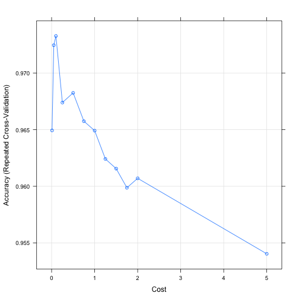
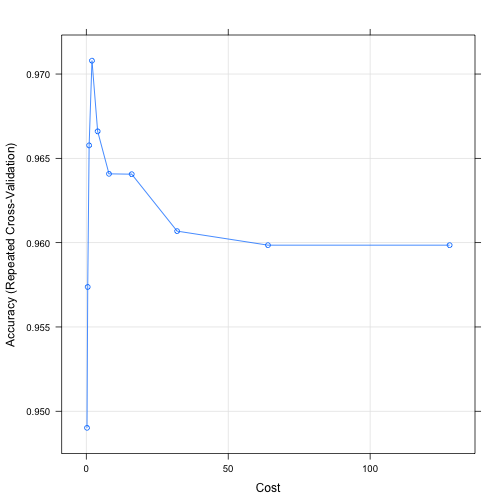

---
# Please do not edit this file directly; it is auto generated.
# Instead, please edit 70-SVM.md in _episodes_rmd/
title: "Support vector machines"
author: "Darya Vanichkina"
keypoints:
- somepoint
objectives:
- someobjective
questions: What is the meaning of life FIXME?
source: Rmd
start: 0
teaching: 30
exercises: 0
---


Support Vector Machines 
Maximal Margin Classifier 
Linear Support Vector Classifier
Nonlinear Kernels
Polynomial Kernels
Gaussian radial based function
Support Vector Machines 
Multi-Class SVMs
Hyperplanes and maximal margin classifier
Sort margin and support vector classifier
Kernels and support vector machines

? Voting classifier (hard/soft)


```r
library(caret)
```

```
## Loading required package: lattice
```

```
## Loading required package: ggplot2
```

```r
library(data.table)
```

```
## Warning: package 'data.table' was built under R version 3.5.2
```

# Wisconsin Diagnositc Breast Cancer Dataset


```r
wdbc<-fread(here::here("data/breast-cancer-wisconsin.csv"))

wdbc$diagnosis<-factor(wdbc$diagnosis)
```

# Aim

To create a classifier for predicting whether a breast cancer patient's tumor is malignant or benign.


```r
set.seed(3033)
intrain <- createDataPartition(y = wdbc$diagnosis, p= 0.7, list = FALSE)
training <- wdbc[intrain,]
testing <- wdbc[-intrain,]
```


```r
dim(training)
```

```
## [1] 399  32
```

```r
dim(testing)
```

```
## [1] 170  32
```

```r
anyNA(wdbc)
```

```
## [1] FALSE
```

```r
summary(wdbc)
```

```
##        id            diagnosis  radius_mean      texture_mean  
##  Min.   :     8670   B:357     Min.   : 6.981   Min.   : 9.71  
##  1st Qu.:   869218   M:212     1st Qu.:11.700   1st Qu.:16.17  
##  Median :   906024             Median :13.370   Median :18.84  
##  Mean   : 30371831             Mean   :14.127   Mean   :19.29  
##  3rd Qu.:  8813129             3rd Qu.:15.780   3rd Qu.:21.80  
##  Max.   :911320502             Max.   :28.110   Max.   :39.28  
##  perimeter_mean     area_mean      smoothness_mean   compactness_mean 
##  Min.   : 43.79   Min.   : 143.5   Min.   :0.05263   Min.   :0.01938  
##  1st Qu.: 75.17   1st Qu.: 420.3   1st Qu.:0.08637   1st Qu.:0.06492  
##  Median : 86.24   Median : 551.1   Median :0.09587   Median :0.09263  
##  Mean   : 91.97   Mean   : 654.9   Mean   :0.09636   Mean   :0.10434  
##  3rd Qu.:104.10   3rd Qu.: 782.7   3rd Qu.:0.10530   3rd Qu.:0.13040  
##  Max.   :188.50   Max.   :2501.0   Max.   :0.16340   Max.   :0.34540  
##  concavity_mean    concave points_mean symmetry_mean   
##  Min.   :0.00000   Min.   :0.00000     Min.   :0.1060  
##  1st Qu.:0.02956   1st Qu.:0.02031     1st Qu.:0.1619  
##  Median :0.06154   Median :0.03350     Median :0.1792  
##  Mean   :0.08880   Mean   :0.04892     Mean   :0.1812  
##  3rd Qu.:0.13070   3rd Qu.:0.07400     3rd Qu.:0.1957  
##  Max.   :0.42680   Max.   :0.20120     Max.   :0.3040  
##  fractal_dimension_mean   radius_se        texture_se      perimeter_se   
##  Min.   :0.04996        Min.   :0.1115   Min.   :0.3602   Min.   : 0.757  
##  1st Qu.:0.05770        1st Qu.:0.2324   1st Qu.:0.8339   1st Qu.: 1.606  
##  Median :0.06154        Median :0.3242   Median :1.1080   Median : 2.287  
##  Mean   :0.06280        Mean   :0.4052   Mean   :1.2169   Mean   : 2.866  
##  3rd Qu.:0.06612        3rd Qu.:0.4789   3rd Qu.:1.4740   3rd Qu.: 3.357  
##  Max.   :0.09744        Max.   :2.8730   Max.   :4.8850   Max.   :21.980  
##     area_se        smoothness_se      compactness_se      concavity_se    
##  Min.   :  6.802   Min.   :0.001713   Min.   :0.002252   Min.   :0.00000  
##  1st Qu.: 17.850   1st Qu.:0.005169   1st Qu.:0.013080   1st Qu.:0.01509  
##  Median : 24.530   Median :0.006380   Median :0.020450   Median :0.02589  
##  Mean   : 40.337   Mean   :0.007041   Mean   :0.025478   Mean   :0.03189  
##  3rd Qu.: 45.190   3rd Qu.:0.008146   3rd Qu.:0.032450   3rd Qu.:0.04205  
##  Max.   :542.200   Max.   :0.031130   Max.   :0.135400   Max.   :0.39600  
##  concave points_se   symmetry_se       fractal_dimension_se
##  Min.   :0.000000   Min.   :0.007882   Min.   :0.0008948   
##  1st Qu.:0.007638   1st Qu.:0.015160   1st Qu.:0.0022480   
##  Median :0.010930   Median :0.018730   Median :0.0031870   
##  Mean   :0.011796   Mean   :0.020542   Mean   :0.0037949   
##  3rd Qu.:0.014710   3rd Qu.:0.023480   3rd Qu.:0.0045580   
##  Max.   :0.052790   Max.   :0.078950   Max.   :0.0298400   
##   radius_worst   texture_worst   perimeter_worst    area_worst    
##  Min.   : 7.93   Min.   :12.02   Min.   : 50.41   Min.   : 185.2  
##  1st Qu.:13.01   1st Qu.:21.08   1st Qu.: 84.11   1st Qu.: 515.3  
##  Median :14.97   Median :25.41   Median : 97.66   Median : 686.5  
##  Mean   :16.27   Mean   :25.68   Mean   :107.26   Mean   : 880.6  
##  3rd Qu.:18.79   3rd Qu.:29.72   3rd Qu.:125.40   3rd Qu.:1084.0  
##  Max.   :36.04   Max.   :49.54   Max.   :251.20   Max.   :4254.0  
##  smoothness_worst  compactness_worst concavity_worst  concave points_worst
##  Min.   :0.07117   Min.   :0.02729   Min.   :0.0000   Min.   :0.00000     
##  1st Qu.:0.11660   1st Qu.:0.14720   1st Qu.:0.1145   1st Qu.:0.06493     
##  Median :0.13130   Median :0.21190   Median :0.2267   Median :0.09993     
##  Mean   :0.13237   Mean   :0.25427   Mean   :0.2722   Mean   :0.11461     
##  3rd Qu.:0.14600   3rd Qu.:0.33910   3rd Qu.:0.3829   3rd Qu.:0.16140     
##  Max.   :0.22260   Max.   :1.05800   Max.   :1.2520   Max.   :0.29100     
##  symmetry_worst   fractal_dimension_worst
##  Min.   :0.1565   Min.   :0.05504        
##  1st Qu.:0.2504   1st Qu.:0.07146        
##  Median :0.2822   Median :0.08004        
##  Mean   :0.2901   Mean   :0.08395        
##  3rd Qu.:0.3179   3rd Qu.:0.09208        
##  Max.   :0.6638   Max.   :0.20750
```


```r
set.seed(3233)

trctrl <- trainControl(method = "repeatedcv", number = 10, repeats = 3)

svm_Linear <- train(diagnosis ~., data = training, method = "svmLinear",
                    trControl=trctrl,
                    preProcess = c("center", "scale"),
                    tuneLength = 10)
svm_Linear
```

```
## Support Vector Machines with Linear Kernel 
## 
## 399 samples
##  31 predictor
##   2 classes: 'B', 'M' 
## 
## Pre-processing: centered (31), scaled (31) 
## Resampling: Cross-Validated (10 fold, repeated 3 times) 
## Summary of sample sizes: 359, 360, 359, 359, 359, 359, ... 
## Resampling results:
## 
##   Accuracy   Kappa    
##   0.9649145  0.9245162
## 
## Tuning parameter 'C' was held constant at a value of 1
```

```r
test_pred <- predict(svm_Linear, newdata = testing)
test_pred
```

```
##   [1] M M M M M M M M M M B B M M M M M M B B M B B B B M M B M B M M B B M
##  [36] B B M B M B B B B M M B M B M B B B B M B B B B B B B B B B B M M B M
##  [71] M M B B M B M B M M M M B B B B B M B M M M M B M B B B B B B B B B M
## [106] B B M B B B B M B B B B B B B B M B B M B B B B B B B M B M B B M B B
## [141] B B B B B B B B M B B B M M B B B B M B M M B B B B B B B B
## Levels: B M
```


```r
confusionMatrix(test_pred, testing$diagnosis )
```

```
## Confusion Matrix and Statistics
## 
##           Reference
## Prediction   B   M
##          B 107   2
##          M   0  61
##                                           
##                Accuracy : 0.9882          
##                  95% CI : (0.9581, 0.9986)
##     No Information Rate : 0.6294          
##     P-Value [Acc > NIR] : <2e-16          
##                                           
##                   Kappa : 0.9746          
##  Mcnemar's Test P-Value : 0.4795          
##                                           
##             Sensitivity : 1.0000          
##             Specificity : 0.9683          
##          Pos Pred Value : 0.9817          
##          Neg Pred Value : 1.0000          
##              Prevalence : 0.6294          
##          Detection Rate : 0.6294          
##    Detection Prevalence : 0.6412          
##       Balanced Accuracy : 0.9841          
##                                           
##        'Positive' Class : B               
## 
```

```r
grid <- expand.grid(C = c(0,0.01, 0.05, 0.1, 0.25, 0.5, 0.75, 1, 1.25, 1.5, 1.75, 2,5))
set.seed(3233)
svm_Linear_Grid <- train(diagnosis ~., data = training, method = "svmLinear",
                         trControl=trctrl,
                         preProcess = c("center", "scale"),
                         tuneGrid = grid,
                         tuneLength = 10)

svm_Linear_Grid
```

```
## Support Vector Machines with Linear Kernel 
## 
## 399 samples
##  31 predictor
##   2 classes: 'B', 'M' 
## 
## Pre-processing: centered (31), scaled (31) 
## Resampling: Cross-Validated (10 fold, repeated 3 times) 
## Summary of sample sizes: 359, 360, 359, 359, 359, 359, ... 
## Resampling results across tuning parameters:
## 
##   C     Accuracy   Kappa    
##   0.00        NaN        NaN
##   0.01  0.9649359  0.9228165
##   0.05  0.9724573  0.9399263
##   0.10  0.9732692  0.9419997
##   0.25  0.9673932  0.9296404
##   0.50  0.9682479  0.9318922
##   0.75  0.9657479  0.9266734
##   1.00  0.9649145  0.9245162
##   1.25  0.9624145  0.9189193
##   1.50  0.9615598  0.9172453
##   1.75  0.9598718  0.9136524
##   2.00  0.9607051  0.9153625
##   5.00  0.9540385  0.9011770
## 
## Accuracy was used to select the optimal model using the largest value.
## The final value used for the model was C = 0.1.
```

```r
plot(svm_Linear_Grid)
```




```r
test_pred_grid <- predict(svm_Linear_Grid, newdata = testing)
test_pred_grid
```

```
##   [1] M M M M M M M M M M B B M M M M M M B B M B B B B M M B M B M M B B M
##  [36] B B M B M B B B B M M B M B M B B B B M B B B B B B B B B B B M M B M
##  [71] M M B B M B M B M M M M B B B B B M B M M M M B M B B B B B B B B B M
## [106] B B M B B B B M B B B B B B B B M B B M B B B B B B B M B M B B M B B
## [141] B B B B B B B B M B B B M B B B B B M B M M B B B B B B B B
## Levels: B M
```


```r
confusionMatrix(test_pred_grid, testing$diagnosis )
```

```
## Confusion Matrix and Statistics
## 
##           Reference
## Prediction   B   M
##          B 107   3
##          M   0  60
##                                           
##                Accuracy : 0.9824          
##                  95% CI : (0.9493, 0.9963)
##     No Information Rate : 0.6294          
##     P-Value [Acc > NIR] : <2e-16          
##                                           
##                   Kappa : 0.9618          
##  Mcnemar's Test P-Value : 0.2482          
##                                           
##             Sensitivity : 1.0000          
##             Specificity : 0.9524          
##          Pos Pred Value : 0.9727          
##          Neg Pred Value : 1.0000          
##              Prevalence : 0.6294          
##          Detection Rate : 0.6294          
##    Detection Prevalence : 0.6471          
##       Balanced Accuracy : 0.9762          
##                                           
##        'Positive' Class : B               
## 
```

```r
set.seed(3233)
svm_Radial <- train(diagnosis ~., data = training, method = "svmRadial",
                    trControl=trctrl,
                    preProcess = c("center", "scale"),
                    tuneLength = 10)

svm_Radial
```

```
## Support Vector Machines with Radial Basis Function Kernel 
## 
## 399 samples
##  31 predictor
##   2 classes: 'B', 'M' 
## 
## Pre-processing: centered (31), scaled (31) 
## Resampling: Cross-Validated (10 fold, repeated 3 times) 
## Summary of sample sizes: 359, 360, 359, 359, 359, 359, ... 
## Resampling results across tuning parameters:
## 
##   C       Accuracy   Kappa    
##     0.25  0.9490171  0.8904167
##     0.50  0.9573718  0.9079250
##     1.00  0.9657692  0.9260199
##     2.00  0.9707906  0.9372007
##     4.00  0.9666026  0.9283122
##     8.00  0.9640812  0.9227732
##    16.00  0.9640598  0.9231233
##    32.00  0.9606838  0.9163937
##    64.00  0.9598504  0.9146393
##   128.00  0.9598504  0.9146393
## 
## Tuning parameter 'sigma' was held constant at a value of 0.04749587
## Accuracy was used to select the optimal model using the largest value.
## The final values used for the model were sigma = 0.04749587 and C = 2.
```

```r
plot(svm_Radial)
```



```r
test_pred_Radial <- predict(svm_Radial, newdata = testing)
test_pred_Radial
```

```
##   [1] M M M M M M M M M M B B M M M M M M B M M B B B B M M B M M M M B B M
##  [36] B B M B M B B B B M M B M B M B B B B M B B M B M B B B B B B M M B M
##  [71] M M B B M B M B M M M M B B B B B M B M M M M B M B B B B B B B B B M
## [106] B B M B B B B M B B B B B B B B M B B M B B B B B B B M B M B B M B B
## [141] B B B B B B B B M B B B M B B B B B M B M M B B B B B B B B
## Levels: B M
```

```r
confusionMatrix(test_pred_Radial, testing$diagnosis )
```

```
## Confusion Matrix and Statistics
## 
##           Reference
## Prediction   B   M
##          B 104   2
##          M   3  61
##                                           
##                Accuracy : 0.9706          
##                  95% CI : (0.9327, 0.9904)
##     No Information Rate : 0.6294          
##     P-Value [Acc > NIR] : <2e-16          
##                                           
##                   Kappa : 0.9372          
##  Mcnemar's Test P-Value : 1               
##                                           
##             Sensitivity : 0.9720          
##             Specificity : 0.9683          
##          Pos Pred Value : 0.9811          
##          Neg Pred Value : 0.9531          
##              Prevalence : 0.6294          
##          Detection Rate : 0.6118          
##    Detection Prevalence : 0.6235          
##       Balanced Accuracy : 0.9701          
##                                           
##        'Positive' Class : B               
## 
```


