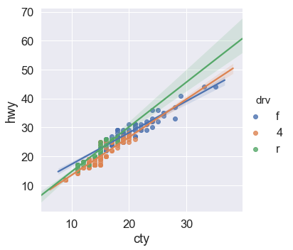

## Linear regression


```python
import matplotlib.pyplot as plt
import numpy as np
import pandas as pd
from pandas.api.types import CategoricalDtype
import statsmodels.api as sm
import seaborn as sns
from sklearn import preprocessing
from sklearn.model_selection import train_test_split
import pickle 

from sklearn.model_selection import train_test_split
from sklearn.model_selection import GridSearchCV, RandomizedSearchCV
from sklearn.metrics import mean_squared_error, r2_score,  mean_absolute_error

from sklearn.pipeline import Pipeline
from sklearn.preprocessing import StandardScaler
from sklearn.preprocessing import PolynomialFeatures

from sklearn.linear_model import LinearRegression, LassoCV, RidgeCV, ElasticNetCV

%matplotlib inline
sns.set(font_scale = 1.5)
```


```python
def onehot_row_drop(df, column = 'column'):
    df = pd.concat([df.drop(column, axis=1), pd.get_dummies(df[column], drop_first=True, prefix=column)],axis=1)
    return(df)

def group_infrequent(df, columnname,counts = 10):
    df.loc[df[columnname].value_counts()[df[columnname]].values <= counts, columnname] = "Other"


def none_of_this_feature(df, column = 'column'):
    # adds a column to the dataframe with a value of 0 where there is none of this feature,
    # and a 1 where it's actually there
    df['No_' + column] = np.where(df[column]==0, 0, 1)
    return(df)
```


```python
ameshousingClean = pd.read_csv('data/AmesHousingClean.csv')

# step 1
ameshousingClean['Age'] = ameshousingClean['Year_Sold'].max() - ameshousingClean['Year_Built']
ameshousingClean['Remodel_Age'] = ameshousingClean['Year_Sold'].max() - ameshousingClean['Year_Remod_Add']
ameshousingClean['Misc_Feature_Present'] =  np.where(ameshousingClean['Misc_Feature']=="None", 0, 1)


# step 2
# group situations where there are less than 20 cases of something
for i in ['Neighborhood', 'Roof_Matl', 'Exterior_1st', 'Exterior_2nd', 'Heating', 'MS_Zoning', 'Misc_Feature', 'Sale_Type']:
    group_infrequent(df=ameshousingClean, columnname=i, counts=20)


# Capture variables where some houses have "none of this feature" (i.e value of parameter = 0 aka zero-inflation)
none_of_feature = ['Second_Flr_SF','Three_season_porch','BsmtFin_SF_2','Bsmt_Unf_SF','Enclosed_Porch','Low_Qual_Fin_SF',
                   'Mas_Vnr_Area','Lot_Frontage','Open_Porch_SF','Screen_Porch','Pool_Area','Wood_Deck_SF', 'BsmtFin_SF_2', 'Second_Flr_SF']
for i in none_of_feature:
    ameshousingClean = none_of_this_feature(df = ameshousingClean, column=i)
    
# step 3
categorical_variable_list = ['Alley', 'Bldg_Type', 'Condition_1', 'Electrical', 'Exter_Cond', 'Exter_Qual', 
                             'Foundation', 'Functional', 'House_Style', 'Kitchen_Qual', 'Land_Contour', 
                             'Land_Slope', 'Lot_Config', 'Lot_Shape', 'Central_Air', 'Bsmt_Cond', 
                             'Bsmt_Exposure', 'BsmtFin_Type_1', 'BsmtFin_Type_2', 'Bsmt_Qual', 'Fence', 
                             'Fireplace_Qu', 'Garage_Cond', 'Garage_Finish', 'Garage_Type', 'Heating_QC',  
                              'MS_SubClass',  'Overall_Cond', 'Overall_Qual', 
                             'Paved_Drive', 'Roof_Style', 'Year_Sold', 'Neighborhood', 'Roof_Matl', 'Exterior_2nd',
                            'Exterior_1st', 'Heating', 'MS_Zoning', 'Misc_Feature', 'Street', 'Mas_Vnr_Type', 'Utilities',"Condition_2", "Pool_QC", "Garage_Qual", 'Sale_Type', 'Sale_Condition']

# step 4
# one hot encode the other categoricals
for i in categorical_variable_list:
    ameshousingClean = onehot_row_drop(df = ameshousingClean, column=i)

# step 5
# drop double no basement: (ranges from 80 to 83 in dataset, going with 80)
ameshousingClean = ameshousingClean.drop('Bsmt_Exposure_No_Basement', axis=1)
ameshousingClean = ameshousingClean.drop('BsmtFin_Type_2_No_Basement', axis=1)
ameshousingClean = ameshousingClean.drop('Bsmt_Qual_No_Basement', axis=1)
ameshousingClean = ameshousingClean.drop('Garage_Finish_No_Garage', axis=1)
ameshousingClean = ameshousingClean.drop('Garage_Type_No_Garage', axis=1)
ameshousingClean = ameshousingClean.drop('Garage_Qual_No_Garage', axis=1)
ameshousingClean = ameshousingClean.drop('Year_Built', axis=1)
ameshousingClean = ameshousingClean.drop('Year_Remod_Add', axis=1)
```

> ## Challenge 1
>
> Look at the code above. Can you explain why each of these transformations is being carried out? 
> See if you can figure out, in your groups, what each of the steps is doing.
> 
> {: .source}
>
> > ## Solution
> > 
> > {: .output}
> {: .solution}
{: .challenge}

Add a column to the dataset to split the Sale Price by percentile into 10 bins:


```python
ameshousingClean['Sale_Price_quartile'] =  pd.qcut(ameshousingClean['Sale_Price'], 10, labels=range(10))
```

Now we can use scikit-learn's train-test split to split the data into a training and testing subset, stratifying it by the percentile bin of the Sale_Price:


```python
index_train, index_test  = train_test_split(np.array(ameshousingClean.index), train_size=0.7, test_size = 0.3, 
                                            stratify = np.array(ameshousingClean['Sale_Price_quartile']), random_state=42)
ameshousingClean = ameshousingClean.drop('Sale_Price_quartile', axis = 1)

# Create variables for the training and test sets 
ames_train = ameshousingClean.loc[index_train,:].copy()
ames_test =  ameshousingClean.loc[index_test,:].copy()
```


```python
# What are their dimensions?
print(ames_train.shape)
print(ames_test.shape)
```

    (2051, 287)
    (879, 287)


Get a list of predictor names and make numpy matrices of the data:


```python
predictors = list(ameshousingClean.columns)
predictors.remove('Sale_Price')

# 
pickle.dump(predictors, open('models/predictors.pickle', 'wb'))
```


```python
# Create training and test response vectors
ames_train_y = np.log10(ames_train['Sale_Price'])
ames_test_y = np.log10(ames_test['Sale_Price'])

# Write training and test design matrices
ames_train_X = ames_train[predictors].copy()
ames_test_X = ames_test[predictors].copy()


# save them to files as well (this is an extra step that's not necessary in class, but useful for our jupyter notebook class notes)
pickle.dump(ames_train_y, open('models/ames_train_y.pickle', 'wb'))
pickle.dump(ames_test_y, open('models/ames_test_y.pickle', 'wb'))
pickle.dump(ames_train_X, open('models/ames_train_X.pickle', 'wb'))
pickle.dump(ames_test_X, open('models/ames_test_X.pickle', 'wb'))
```


```python
type(ames_train_X)
```


    pandas.core.frame.DataFrame


```python
type(ames_train_y)
```


    pandas.core.series.Series


## Fit OLS models with different features


```python
## Fit an Ordinary Least Squares Regression using all variables
ames_ols_all = LinearRegression()
ames_ols_all.fit(ames_train_X, ames_train_y)


## Fit an Ordinary Least Squares Regression using Gr_Liv_Area
ames_ols_GrLivArea = LinearRegression()
ames_ols_GrLivArea.fit(ames_train_X['Gr_Liv_Area'].values.reshape(-1, 1), ames_train_y)

## 
ames_ols_Second_Flr_SF = LinearRegression()
ames_ols_Second_Flr_SF.fit(ames_train_X['Second_Flr_SF'].values.reshape(-1, 1), ames_train_y)

## Fit an Ordinary Least Squares Regression using Gr_Liv_Area and Second_Flr_SF
ames_ols_GrLivArea_Second_Flr_SF = LinearRegression()
ames_ols_GrLivArea_Second_Flr_SF.fit(ames_train_X[['Gr_Liv_Area','Second_Flr_SF']], ames_train_y)

## Fit an Ordinary Least Squares Regression using Gr_Liv_Area and Age
ames_ols_GrLivArea_Age = LinearRegression()
ames_ols_GrLivArea_Age.fit(ames_train_X[['Gr_Liv_Area','Age']], ames_train_y)
```

    /Users/darya/anaconda3/lib/python3.7/site-packages/sklearn/preprocessing/data.py:625: DataConversionWarning: Data with input dtype uint8, int64, float64 were all converted to float64 by StandardScaler.
      return self.partial_fit(X, y)
    /Users/darya/anaconda3/lib/python3.7/site-packages/sklearn/base.py:465: DataConversionWarning: Data with input dtype uint8, int64, float64 were all converted to float64 by StandardScaler.
      return self.fit(X, y, **fit_params).transform(X)


    LinearRegression(copy_X=True, fit_intercept=True, n_jobs=None,
             normalize=False)


## Assess model fit


```python
columns=['Test RMSE', 'Test R2', 'Test MAE']
rows=['All', 'GrLivArea','Second_Flr_SF', 'GrLivArea_Age', 'GrLivArea Second_Flr_SF']
results=pd.DataFrame(0.0, columns=columns, index=rows)


def assess_fit_vars(listOfMethods, variables, testX, testY):
    for i, method in enumerate(methods):
        if variables[i] != ":":
            tmp_test_X = testX[variables[i]]
            if type(variables[i]) == str: #only one column - so need to reshape
                tmp_test_X = testX[variables[i]].values.reshape(-1, 1)
        else:
            tmp_test_X=testX
        # while we build the model and predict on the log10Transformed sale price, we display the error in dollars
        # as that makes more sense
        y_pred=10**(method.predict(tmp_test_X))
        results.iloc[i,0] = np.sqrt(mean_squared_error(10**(testY), y_pred))
        results.iloc[i,1] = r2_score(10**(testY), y_pred)
        results.iloc[i,2] = mean_absolute_error(10**(testY), y_pred)
    return(results.round(3))

methods =[ames_ols_all,  ames_ols_GrLivArea, ames_ols_Second_Flr_SF, ames_ols_GrLivArea_Age, ames_ols_GrLivArea_Second_Flr_SF]

variables =[":", 'Gr_Liv_Area','Second_Flr_SF',['Gr_Liv_Area', 'Age'], ['Gr_Liv_Area', 'Second_Flr_SF']]

compare_train = assess_fit_vars(listOfMethods = methods,variables=variables, testX = ames_train_X, testY = ames_train_y)
compare_train.sort_values('Test RMSE')
```


<div>
<style scoped>
    .dataframe tbody tr th:only-of-type {
        vertical-align: middle;
    }

    .dataframe tbody tr th {
        vertical-align: top;
    }

    .dataframe thead th {
        text-align: right;
    }
</style>
<table border="1" class="dataframe">
  <thead>
    <tr style="text-align: right;">
      <th></th>
      <th>Test RMSE</th>
      <th>Test R2</th>
      <th>Test MAE</th>
    </tr>
  </thead>
  <tbody>
    <tr>
      <th>All</th>
      <td>18810.886</td>
      <td>0.946</td>
      <td>11761.208</td>
    </tr>
    <tr>
      <th>GrLivArea_Age</th>
      <td>50897.025</td>
      <td>0.603</td>
      <td>29818.203</td>
    </tr>
    <tr>
      <th>GrLivArea</th>
      <td>64884.161</td>
      <td>0.355</td>
      <td>40056.146</td>
    </tr>
    <tr>
      <th>Second_Flr_SF</th>
      <td>78956.645</td>
      <td>0.046</td>
      <td>53158.416</td>
    </tr>
    <tr>
      <th>GrLivArea Second_Flr_SF</th>
      <td>79609.931</td>
      <td>0.030</td>
      <td>38615.494</td>
    </tr>
  </tbody>
</table>
</div>


```python
# on the test! set
compare = assess_fit_vars(listOfMethods = methods,variables=variables, testX = ames_test_X, testY = ames_test_y)
compare.sort_values('Test RMSE')
```


```python
# lets explore the coefficients
print(ameshousingClean.columns.get_loc('Gr_Liv_Area'))
print(ameshousingClean.columns.get_loc('Age'))
print(ameshousingClean.columns.get_loc('Second_Flr_SF'))
```

    10
    32
    8


> ## Challenge 2
>
> 1. Explore the coefficients for Gr_Liv_Area, Second_Flr_SF,  Gr_Liv_Area + Second_Flr_SF, 
> Gr_Liv_Area + Age, and the coefficients for these parameters for a model that 
> incorporates all of them. What do you observe? Are the coefficients for each parameter consistent among all the models?
>
> 2. Which model performs the best? Why? 
>
> 3. Does the same model perform best for the training and test data? Why?
>
>
>
> {: .source}
>
> > ## Solution
> > 
> > This is a discussion challenge. Answers will be discussed as a group. 
> > To get the coefficients for each model, use the `ames_ols_GrLivArea.coef_` method.
> >
> > 
> > 
> > {: .output}
> {: .solution}
{: .challenge}


```python
# save OLS model to pickle
pickle.dump(ames_ols_all, open('models/ames_ols_all.pickle', 'wb'))
```


```python
# Import CSV mtcars
data = pd.read_csv('https://gist.githubusercontent.com/ZeccaLehn/4e06d2575eb9589dbe8c365d61cb056c/raw/64f1660f38ef523b2a1a13be77b002b98665cdfe/mtcars.csv')
# Edit element of column header
data.rename(columns={'Unnamed: 0':'brand'}, inplace=True)


ameshousingClean = ameshousingClean.drop('Sale_Price_quartile', axis = 1)

# Create variables for the training and test sets 
ames_train = ameshousingClean.loc[index_train,:].copy()
ames_test =  ameshousingClean.loc[index_test,:].copy()
```


```python
data = pd.read_csv('https://raw.githubusercontent.com/tidyverse/ggplot2/master/data-raw/mpg.csv')
data.head()

sns.lmplot(
    data = data,
    x = 'cty', y = 'hwy', hue = 'drv'
)
```


<div>
<style scoped>
    .dataframe tbody tr th:only-of-type {
        vertical-align: middle;
    }

    .dataframe tbody tr th {
        vertical-align: top;
    }

    .dataframe thead th {
        text-align: right;
    }
</style>
<table border="1" class="dataframe">
  <thead>
    <tr style="text-align: right;">
      <th></th>
      <th>manufacturer</th>
      <th>model</th>
      <th>displ</th>
      <th>year</th>
      <th>cyl</th>
      <th>trans</th>
      <th>drv</th>
      <th>cty</th>
      <th>hwy</th>
      <th>fl</th>
      <th>class</th>
    </tr>
  </thead>
  <tbody>
    <tr>
      <th>0</th>
      <td>audi</td>
      <td>a4</td>
      <td>1.8</td>
      <td>1999</td>
      <td>4</td>
      <td>auto(l5)</td>
      <td>f</td>
      <td>18</td>
      <td>29</td>
      <td>p</td>
      <td>compact</td>
    </tr>
    <tr>
      <th>1</th>
      <td>audi</td>
      <td>a4</td>
      <td>1.8</td>
      <td>1999</td>
      <td>4</td>
      <td>manual(m5)</td>
      <td>f</td>
      <td>21</td>
      <td>29</td>
      <td>p</td>
      <td>compact</td>
    </tr>
    <tr>
      <th>2</th>
      <td>audi</td>
      <td>a4</td>
      <td>2.0</td>
      <td>2008</td>
      <td>4</td>
      <td>manual(m6)</td>
      <td>f</td>
      <td>20</td>
      <td>31</td>
      <td>p</td>
      <td>compact</td>
    </tr>
    <tr>
      <th>3</th>
      <td>audi</td>
      <td>a4</td>
      <td>2.0</td>
      <td>2008</td>
      <td>4</td>
      <td>auto(av)</td>
      <td>f</td>
      <td>21</td>
      <td>30</td>
      <td>p</td>
      <td>compact</td>
    </tr>
    <tr>
      <th>4</th>
      <td>audi</td>
      <td>a4</td>
      <td>2.8</td>
      <td>1999</td>
      <td>6</td>
      <td>auto(l5)</td>
      <td>f</td>
      <td>16</td>
      <td>26</td>
      <td>p</td>
      <td>compact</td>
    </tr>
  </tbody>
</table>
</div>


```python

```


    <seaborn.axisgrid.FacetGrid at 0x1c1fa51e80>




