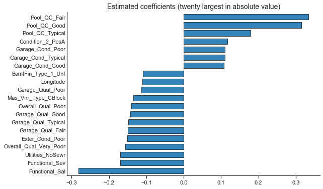
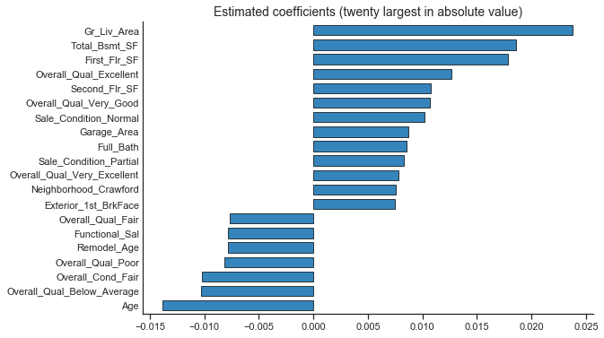
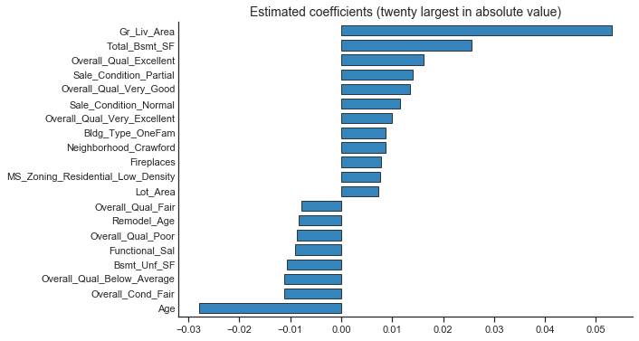

## Regularised Regression. Principle components Regression. Partial Least Squares Regression.


```python
# when delivering live coding, these libraries have already been loaded

import matplotlib.pyplot as plt
import numpy as np
import pandas as pd
from pandas.api.types import CategoricalDtype
import statsmodels.api as sm
import seaborn as sns
import pickle
#from sklearn import preprocessing
from sklearn.preprocessing import StandardScaler
from sklearn.metrics import mean_squared_error, r2_score,  mean_absolute_error
from sklearn.linear_model import LinearRegression, RidgeCV, LassoCV, ElasticNet
from sklearn.model_selection import train_test_split
from sklearn.model_selection import GridSearchCV, RandomizedSearchCV

# Set up plotting options for seaborn and matplotlib
sns.set_context('notebook') 
sns.set_style('ticks') 
%matplotlib inline
plt.rcParams['figure.figsize'] = (9, 6)

# This is also written to generate the lesson notes; not used while live-coding
# load from previous lessons
cached_files = ['models/ames_train_y.pickle','models/ames_test_y.pickle',
                'models/ames_train_X.pickle','models/ames_test_X.pickle',
                'models/predictors.pickle','models/ames_ols_all.pickle']

for file in cached_files:
    with open(file, 'rb') as f:
        objectname = file.replace('models/', '').replace('.pickle', '')
        exec(objectname + " = pickle.load(f)")
        f.close()
```


```python
# these have not been loaded yet while teaching

from sklearn.decomposition import PCA
from sklearn.cross_decomposition import PLSRegression
from sklearn.pipeline import Pipeline
from sklearn.utils import resample


def warn(*args, **kwargs):
    pass
import warnings
warnings.warn = warn


## A similar function has already been defined, but it's better to re copy paste here
def assess_model_fit(listOfModels,
                     listOfMethodNamesAsStrings, 
                     datasetX, 
                     datasetY):
    columns= ['RMSE', 'R2', 'MAE']
    rows=listOfMethodNamesAsStrings
    results=pd.DataFrame(0.0, columns=columns, index=rows)
    for i, method in enumerate(listOfModels):
        tmp_dataset_X=datasetX
        # while we build the model and predict on the log10Transformed sale price, we display the error in dollars
        # as that makes more sense
        y_pred=10**(method.predict(tmp_dataset_X))
        results.iloc[i,0] = np.sqrt(mean_squared_error(10**(datasetY), y_pred))
        results.iloc[i,1] = r2_score(10**(datasetY), y_pred)
        results.iloc[i,2] = mean_absolute_error(10**(datasetY), y_pred)
    return(results.round(3))
```

## Hyperparameter tuning: selecting the optimal value of lambda

Recall that both ridge and lasso regression have an additional parameter, lambda, which captures the penalty for incorporating additional features in the model. 


Hence, we need to first find the optimal value of lambda (using cross-validation), and THEN fit the model, and assess its fit.

Also, for both ridge and lasso regression, the SCALE of the variables matters (because the penalty term in the objective function treats all coefficients as comparable!). So we have to use the `StandardScaler()` function to standardize all numeric variables.

We will do all of this in a scikit-learn pipeline:


### Ridge regression (L2 regularisation)


```python
# logspace -  returns numbers spaced evenly on a log scale, base 2, from ^-12 to ^10
# total of 20 of them

alphas = list(np.logspace(-12, 10, 20, base=2))
ames_ridge = Pipeline([
    ('scaler', StandardScaler()),
    ('estimator', RidgeCV(alphas=alphas, cv=10)),
])


## Toggle comment below to build model
# ames_ridge.fit(ames_train_X, ames_train_y)
# pickle.dump(ames_ridge, open('models/ames_ridge.pickle', 'wb'))
with open('models/ames_ridge.pickle', 'rb') as f:
    ames_ridge = pickle.load(f)
```


```python
# what is the best value of alpha (the penalty parameter for Ridge regression?)
best_alpha_ridge = ames_ridge.named_steps.estimator.alpha_
print(best_alpha_ridge)
```

    458.922033222583


```python
# Of the list of elements we tested, which element was it?
alphas.index(best_alpha_ridge)
```


    18


### Lasso regression (L1 regularisation) 


```python
ames_lasso = Pipeline([
    ('scaler', StandardScaler()),
    ('estimator', LassoCV(alphas=alphas, cv=10)),
])

ames_lasso.fit(ames_train_X, ames_train_y)

## Toggle comment below to build model
# ames_lasso.fit(ames_train_X, ames_train_y)
# pickle.dump(ames_lasso, open('models/ames_lasso.pickle', 'wb'))
with open('models/ames_lasso.pickle', 'rb') as f:
    ames_lasso = pickle.load(f)
    
    
```


```python
# what is the best value of alpha (the penalty parameter for Lasso regression?)
best_alpha_lasso = ames_lasso.named_steps.estimator.alpha_
print(best_alpha_lasso)
```

    0.0005447548426570041


```python
# Of the list of elements we tested, which element was it?
alphas.index(best_alpha_lasso)
```


    1


## Elastic net: combining L1 and L2 regularisation


```python
# For l1_ratio = 0 the penalty is an L2 penalty. For l1_ratio = 1 it is an L1 penalty
# a * L1 + b * L2
# alpha = a + b and l1_ratio = a / (a + b)

parametersGrid = {"alpha": alphas,
                "l1_ratio": np.arange(0.01, 1.0, 0.1)}

ames_enet = Pipeline([
    ('scaler', StandardScaler()),
    ('estimator', GridSearchCV(ElasticNet(), parametersGrid, scoring='r2', cv=10)),
])

## Toggle comment below to build model
ames_enet.fit(ames_train_X, ames_train_y)
pickle.dump(ames_enet, open('models/ames_enet.pickle', 'wb'))
with open('models/ames_enet.pickle', 'rb') as f:
    ames_enet = pickle.load(f)
```


```python
# get the best parameter values 
best_params_enet = ames_enet.named_steps.estimator.best_estimator_
```


```python
# what is the best value of alpha (the penalty parameter for Lasso regression?)
print(best_params_enet.alpha)
```

    0.06723066163876137


> ## Challenge 1
>
> 1. Look at the coefficients for the model above. What was the balance between L1 (Lasso) and L2 (Ridge) regression?
> 2. What value of alpha was found to be optimal? Was this value expected based on the results we got when we ran Lasso and Ridge independently?
> 
> {: .source}
>
> > ## Solution
> > ~~~ 
> > print(best_params_enet.l1_ratio)
> > 
> > ~~~
> > 2. See [this answer](https://stackoverflow.com/questions/47365978/scikit-learn-elastic-net-approaching-ridge) for an explanation why the 
> >  two values of alpha were not the same.
> > {: .output}
> {: .solution}
{: .challenge}


```python
# What was the RMSE on the training data?
assess_model_fit(listOfModels = [ames_ols_all, ames_ridge, ames_lasso, ames_enet],
                 listOfMethodNamesAsStrings=['OLS','Ridge', 'Lasso', "ENet"], 
                 datasetX=ames_train_X,
                 datasetY=ames_train_y).sort_values("RMSE")
```


<div>
<style scoped>
    .dataframe tbody tr th:only-of-type {
        vertical-align: middle;
    }

    .dataframe tbody tr th {
        vertical-align: top;
    }

    .dataframe thead th {
        text-align: right;
    }
</style>
<table border="1" class="dataframe">
  <thead>
    <tr style="text-align: right;">
      <th></th>
      <th>RMSE</th>
      <th>R2</th>
      <th>MAE</th>
    </tr>
  </thead>
  <tbody>
    <tr>
      <th>OLS</th>
      <td>18810.886</td>
      <td>0.946</td>
      <td>11761.208</td>
    </tr>
    <tr>
      <th>Ridge</th>
      <td>21330.847</td>
      <td>0.930</td>
      <td>12951.372</td>
    </tr>
    <tr>
      <th>Lasso</th>
      <td>20365.796</td>
      <td>0.936</td>
      <td>12266.462</td>
    </tr>
    <tr>
      <th>ENet</th>
      <td>21292.160</td>
      <td>0.931</td>
      <td>12706.575</td>
    </tr>
  </tbody>
</table>
</div>


```python
# Compare with the test data!
assess_model_fit(listOfModels = [ames_ols_all, ames_ridge, ames_lasso, ames_enet],
                 listOfMethodNamesAsStrings=['OLS','Ridge', 'Lasso', "ENet"], 
                 datasetX=ames_test_X,
                 datasetY=ames_test_y).sort_values("RMSE")
```


<div>
<style scoped>
    .dataframe tbody tr th:only-of-type {
        vertical-align: middle;
    }

    .dataframe tbody tr th {
        vertical-align: top;
    }

    .dataframe thead th {
        text-align: right;
    }
</style>
<table border="1" class="dataframe">
  <thead>
    <tr style="text-align: right;">
      <th></th>
      <th>RMSE</th>
      <th>R2</th>
      <th>MAE</th>
    </tr>
  </thead>
  <tbody>
    <tr>
      <th>OLS</th>
      <td>64792.914</td>
      <td>0.303</td>
      <td>16436.269</td>
    </tr>
    <tr>
      <th>Ridge</th>
      <td>47670.165</td>
      <td>0.623</td>
      <td>15758.453</td>
    </tr>
    <tr>
      <th>Lasso</th>
      <td>59592.173</td>
      <td>0.411</td>
      <td>15672.588</td>
    </tr>
    <tr>
      <th>ENet</th>
      <td>52482.808</td>
      <td>0.543</td>
      <td>15590.977</td>
    </tr>
  </tbody>
</table>
</div>


## Compare the coefficients of each of the linear models:


```python
def plot_coefficients(model, labels):
    coef = model.coef_

    table = pd.Series(coef.ravel(), index = labels).sort_values(ascending=True, inplace=False)
    
    reference = pd.Series(np.abs(coef.ravel()), index = labels).sort_values(ascending=False, inplace=False)
    reference = reference.iloc[:20]
    table = table[reference.index]
    table = table.sort_values(ascending=True, inplace=False)

    fig, ax = fig, ax = plt.subplots()
    table.T.plot(kind='barh', edgecolor='black', width=0.7, linewidth=.8, alpha=0.9, ax=ax)
    ax.tick_params(axis=u'y', length=0) 
    ax.set_title('Estimated coefficients (twenty largest in absolute value)', fontsize=14)
    sns.despine()
    return fig, ax
```


```python
plot_coefficients(ames_ols_all, predictors)# the final_estimator attribute refers to the pipeline
plt.show()
```





```python
plot_coefficients(ames_ridge._final_estimator, predictors)# the final_estimator attribute refers to the pipeline
plt.show()
```





```python
plot_coefficients(ames_lasso._final_estimator, predictors)# the final_estimator attribute refers to the pipeline
plt.show()
```





```python
plot_coefficients(ames_enet.named_steps.estimator.best_estimator_, predictors)# the final_estimator attribute refers to the pipeline
plt.show()
```


> ## Challenge 2
>
> Compare the top coefficients for the models above. Why do you think the top/bottom predictors are different for each one?
> 
> {: .source}
>
> > ## Solution
> > 
> > 
> > {: .output}
> {: .solution}
{: .challenge}

***

## Principle components regression (PCR)


```python
# Define a pipeline to search for the best combination of PCA an
# and linear regression .

linreg = LinearRegression()
pca = PCA()
# how many components?
numcomp = list(np.linspace(1,len(ames_train_X.columns), num = 40).round().astype(int))

pipe = Pipeline(steps=[('scaler', StandardScaler()), 
                       ('pca', pca), 
                       ('linreg', linreg)])
param_grid = {'pca__n_components': numcomp}
ames_pcr = GridSearchCV(pipe, param_grid, iid=False, cv=5,
                      return_train_score=False)


## Toggle comment below to build model
ames_pcr.fit(ames_train_X, ames_train_y)
pickle.dump(ames_pcr, open('models/ames_pcr.pickle', 'wb'))
#with open('models/ames_pcr.pickle', 'rb') as f:
#    ames_pcr = pickle.load(f)
    
print("Best parameter (CV score=%0.3f):" % ames_pcr.best_score_)
print(ames_pcr.best_params_)
```

    Best parameter (CV score=0.884):
    {'pca__n_components': 249}


```python
# How many variables did we have?
print(ames_train_X.shape)
# Which number of PCs did we test?
print(numcomp)
```

    (2051, 286)
    [1, 8, 16, 23, 30, 38, 45, 52, 59, 67, 74, 81, 89, 96, 103, 111, 118, 125, 133, 140, 147, 154, 162, 169, 176, 184, 191, 198, 206, 213, 220, 228, 235, 242, 249, 257, 264, 271, 279, 286]


```python
# What was the RMSE on the training data?
assess_model_fit(listOfModels = [ames_ols_all, ames_ridge, ames_lasso, ames_enet, ames_pcr],
                 listOfMethodNamesAsStrings=['OLS','Ridge', 'Lasso', 'ENet', 'PCR'], 
                 datasetX=ames_train_X,
                 datasetY=ames_train_y).sort_values("RMSE")
```


<div>
<style scoped>
    .dataframe tbody tr th:only-of-type {
        vertical-align: middle;
    }

    .dataframe tbody tr th {
        vertical-align: top;
    }

    .dataframe thead th {
        text-align: right;
    }
</style>
<table border="1" class="dataframe">
  <thead>
    <tr style="text-align: right;">
      <th></th>
      <th>RMSE</th>
      <th>R2</th>
      <th>MAE</th>
    </tr>
  </thead>
  <tbody>
    <tr>
      <th>OLS</th>
      <td>18810.886</td>
      <td>0.946</td>
      <td>11761.208</td>
    </tr>
    <tr>
      <th>Ridge</th>
      <td>21330.847</td>
      <td>0.930</td>
      <td>12951.372</td>
    </tr>
    <tr>
      <th>Lasso</th>
      <td>20365.796</td>
      <td>0.936</td>
      <td>12266.462</td>
    </tr>
    <tr>
      <th>ENet</th>
      <td>21292.160</td>
      <td>0.931</td>
      <td>12706.575</td>
    </tr>
    <tr>
      <th>PCR</th>
      <td>19106.227</td>
      <td>0.944</td>
      <td>11995.822</td>
    </tr>
  </tbody>
</table>
</div>


```python
# What was the RMSE on the training data?
assess_model_fit(listOfModels = [ames_ols_all, ames_ridge, ames_lasso, ames_enet, ames_pcr],
                 listOfMethodNamesAsStrings=['OLS','Ridge', 'Lasso', 'ENet', 'PCR'], 
                 datasetX=ames_test_X,
                 datasetY=ames_test_y).sort_values("RMSE")
```


<div>
<style scoped>
    .dataframe tbody tr th:only-of-type {
        vertical-align: middle;
    }

    .dataframe tbody tr th {
        vertical-align: top;
    }

    .dataframe thead th {
        text-align: right;
    }
</style>
<table border="1" class="dataframe">
  <thead>
    <tr style="text-align: right;">
      <th></th>
      <th>RMSE</th>
      <th>R2</th>
      <th>MAE</th>
    </tr>
  </thead>
  <tbody>
    <tr>
      <th>OLS</th>
      <td>64792.914</td>
      <td>0.303</td>
      <td>16436.269</td>
    </tr>
    <tr>
      <th>Ridge</th>
      <td>47670.165</td>
      <td>0.623</td>
      <td>15758.453</td>
    </tr>
    <tr>
      <th>Lasso</th>
      <td>59592.173</td>
      <td>0.411</td>
      <td>15672.588</td>
    </tr>
    <tr>
      <th>ENet</th>
      <td>52482.808</td>
      <td>0.543</td>
      <td>15590.977</td>
    </tr>
    <tr>
      <th>PCR</th>
      <td>64658.779</td>
      <td>0.306</td>
      <td>16238.705</td>
    </tr>
  </tbody>
</table>
</div>


> ## Challenge 3
>
> Look at the code above. Is there anything you can do to perhaps slighly improve the fit of the PCR model?
>
> 
> {: .source}
>
> > ## Solution
> > 
> > Test all of the number of principal components from one below the optimum to one right above it. 
> > 
> > {: .output}
> {: .solution}
{: .challenge}

***
## Partial least squares regression (PLSR)


```python
# Define a pipeline to search for the best number of components in PLSR
plsr = PLSRegression()
# how many components?
numcomp = list(np.linspace(1,len(ames_train_X.columns), num = 40).round().astype(int))

pipe = Pipeline(steps=[('scaler', StandardScaler()),
                       ('plsr', plsr)])
param_grid = {'plsr__n_components': numcomp}
ames_plsr = GridSearchCV(pipe, param_grid, iid=False, cv=5,
                      return_train_score=False)


## Toggle comment below to build model
ames_plsr.fit(ames_train_X, ames_train_y)
pickle.dump(ames_plsr, open('models/ames_plsr.pickle', 'wb'))
with open('models/ames_plsr.pickle', 'rb') as f:
    ames_plsr = pickle.load(f)
    

```


```python
# how many components were best for fitting the model?
ames_plsr.best_params_
```


    {'plsr__n_components': 8}


```python
# What was the RMSE on the training data?
assess_model_fit(listOfModels = [ames_ols_all, ames_ridge, ames_lasso, ames_enet, ames_pcr, ames_plsr],
                 listOfMethodNamesAsStrings=['OLS','Ridge', 'Lasso', 'ENet', 'PCR','PLSR'], 
                 datasetX=ames_train_X,
                 datasetY=ames_train_y).sort_values("RMSE")
```


<div>
<style scoped>
    .dataframe tbody tr th:only-of-type {
        vertical-align: middle;
    }

    .dataframe tbody tr th {
        vertical-align: top;
    }

    .dataframe thead th {
        text-align: right;
    }
</style>
<table border="1" class="dataframe">
  <thead>
    <tr style="text-align: right;">
      <th></th>
      <th>RMSE</th>
      <th>R2</th>
      <th>MAE</th>
    </tr>
  </thead>
  <tbody>
    <tr>
      <th>OLS</th>
      <td>18810.886</td>
      <td>0.946</td>
      <td>11761.208</td>
    </tr>
    <tr>
      <th>PCR</th>
      <td>19106.227</td>
      <td>0.944</td>
      <td>11995.822</td>
    </tr>
    <tr>
      <th>PLSR</th>
      <td>20072.891</td>
      <td>0.938</td>
      <td>12450.140</td>
    </tr>
    <tr>
      <th>Lasso</th>
      <td>20365.796</td>
      <td>0.936</td>
      <td>12266.462</td>
    </tr>
    <tr>
      <th>ENet</th>
      <td>21292.160</td>
      <td>0.931</td>
      <td>12706.575</td>
    </tr>
    <tr>
      <th>Ridge</th>
      <td>21330.847</td>
      <td>0.930</td>
      <td>12951.372</td>
    </tr>
  </tbody>
</table>
</div>


```python
# What was the RMSE on the test data?
assess_model_fit(listOfModels = [ames_ols_all, ames_ridge, ames_lasso, ames_enet, ames_pcr, ames_plsr],
                 listOfMethodNamesAsStrings=['OLS','Ridge', 'Lasso', 'ENet', 'PCR','PLSR'], 
                 datasetX=ames_test_X,
                 datasetY=ames_test_y).sort_values("RMSE")
```


<div>
<style scoped>
    .dataframe tbody tr th:only-of-type {
        vertical-align: middle;
    }

    .dataframe tbody tr th {
        vertical-align: top;
    }

    .dataframe thead th {
        text-align: right;
    }
</style>
<table border="1" class="dataframe">
  <thead>
    <tr style="text-align: right;">
      <th></th>
      <th>RMSE</th>
      <th>R2</th>
      <th>MAE</th>
    </tr>
  </thead>
  <tbody>
    <tr>
      <th>Ridge</th>
      <td>47670.165</td>
      <td>0.623</td>
      <td>15758.453</td>
    </tr>
    <tr>
      <th>PLSR</th>
      <td>51509.933</td>
      <td>0.560</td>
      <td>15751.082</td>
    </tr>
    <tr>
      <th>ENet</th>
      <td>52482.808</td>
      <td>0.543</td>
      <td>15590.977</td>
    </tr>
    <tr>
      <th>Lasso</th>
      <td>59592.173</td>
      <td>0.411</td>
      <td>15672.588</td>
    </tr>
    <tr>
      <th>PCR</th>
      <td>64658.779</td>
      <td>0.306</td>
      <td>16238.705</td>
    </tr>
    <tr>
      <th>OLS</th>
      <td>64792.914</td>
      <td>0.303</td>
      <td>16436.269</td>
    </tr>
  </tbody>
</table>
</div>


```python
import sys
sys.path.insert(0, 'py-earth')
from pyearth import Earth
```


```python
# Define a pipeline to search for the best number of components in PLSR
mars = Earth()
max_degree = [1,2,3]

pipe = Pipeline(steps=[('scaler', StandardScaler()),
                       ('mars', mars)])
param_grid = {'mars__max_degree': max_degree}
ames_mars = GridSearchCV(pipe, param_grid, iid=False, cv=5,
                      return_train_score=False)


## Toggle comment below to build model
#ames_mars.fit(ames_train_X, ames_train_y)
#pickle.dump(ames_mars, open('models/ames_mars.pickle', 'wb'))
with open('models/ames_mars.pickle', 'rb') as f:
    ames_mars = pickle.load(f)
    

```


```python
# What was the RMSE on the training data?
assess_model_fit(listOfModels = [ames_ols_all, ames_ridge, ames_lasso, ames_enet, ames_pcr, ames_plsr, ames_mars],
                 listOfMethodNamesAsStrings=['OLS','Ridge', 'Lasso', 'ENet', 'PCR','PLSR','MARS'], 
                 datasetX=ames_train_X,
                 datasetY=ames_train_y).sort_values("RMSE")
```


<div>
<style scoped>
    .dataframe tbody tr th:only-of-type {
        vertical-align: middle;
    }

    .dataframe tbody tr th {
        vertical-align: top;
    }

    .dataframe thead th {
        text-align: right;
    }
</style>
<table border="1" class="dataframe">
  <thead>
    <tr style="text-align: right;">
      <th></th>
      <th>RMSE</th>
      <th>R2</th>
      <th>MAE</th>
    </tr>
  </thead>
  <tbody>
    <tr>
      <th>OLS</th>
      <td>18810.886</td>
      <td>0.946</td>
      <td>11761.208</td>
    </tr>
    <tr>
      <th>PCR</th>
      <td>19106.227</td>
      <td>0.944</td>
      <td>11995.822</td>
    </tr>
    <tr>
      <th>PLSR</th>
      <td>20072.891</td>
      <td>0.938</td>
      <td>12450.140</td>
    </tr>
    <tr>
      <th>Lasso</th>
      <td>20365.796</td>
      <td>0.936</td>
      <td>12266.462</td>
    </tr>
    <tr>
      <th>MARS</th>
      <td>20980.471</td>
      <td>0.933</td>
      <td>14240.862</td>
    </tr>
    <tr>
      <th>ENet</th>
      <td>21292.160</td>
      <td>0.931</td>
      <td>12706.575</td>
    </tr>
    <tr>
      <th>Ridge</th>
      <td>21330.847</td>
      <td>0.930</td>
      <td>12951.372</td>
    </tr>
  </tbody>
</table>
</div>


```python
# What was the RMSE on the test data?
assess_model_fit(listOfModels = [ames_ols_all, ames_ridge, ames_lasso, ames_enet, ames_pcr, ames_plsr, ames_mars],
                 listOfMethodNamesAsStrings=['OLS','Ridge', 'Lasso', 'ENet', 'PCR','PLSR','MARS'], 
                 datasetX=ames_test_X,
                 datasetY=ames_test_y).sort_values("RMSE")
```


<div>
<style scoped>
    .dataframe tbody tr th:only-of-type {
        vertical-align: middle;
    }

    .dataframe tbody tr th {
        vertical-align: top;
    }

    .dataframe thead th {
        text-align: right;
    }
</style>
<table border="1" class="dataframe">
  <thead>
    <tr style="text-align: right;">
      <th></th>
      <th>RMSE</th>
      <th>R2</th>
      <th>MAE</th>
    </tr>
  </thead>
  <tbody>
    <tr>
      <th>MARS</th>
      <td>24262.447</td>
      <td>0.902</td>
      <td>15162.366</td>
    </tr>
    <tr>
      <th>Ridge</th>
      <td>47670.165</td>
      <td>0.623</td>
      <td>15758.453</td>
    </tr>
    <tr>
      <th>PLSR</th>
      <td>51509.933</td>
      <td>0.560</td>
      <td>15751.082</td>
    </tr>
    <tr>
      <th>ENet</th>
      <td>52482.808</td>
      <td>0.543</td>
      <td>15590.977</td>
    </tr>
    <tr>
      <th>Lasso</th>
      <td>59592.173</td>
      <td>0.411</td>
      <td>15672.588</td>
    </tr>
    <tr>
      <th>PCR</th>
      <td>64658.779</td>
      <td>0.306</td>
      <td>16238.705</td>
    </tr>
    <tr>
      <th>OLS</th>
      <td>64792.914</td>
      <td>0.303</td>
      <td>16436.269</td>
    </tr>
  </tbody>
</table>
</div>


