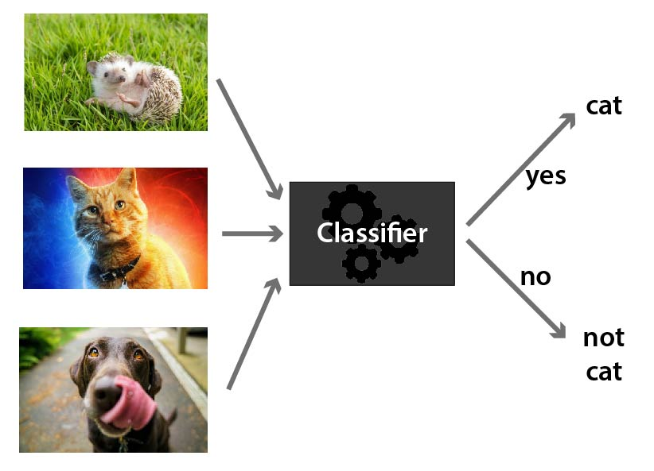

```{r setup, include=FALSE}
knitr::opts_chunk$set(echo = TRUE,
                      message=F,
                      warning=F,
                      cache=T)
```

# What is a classifier?

A classifier is some kind of rule / black box / widget that you can feed a new example and it will spit out whether or not it is part of a given class. E.g. above, we are classifying the animals to be either *cat* or *not cat*.



You can have classifiers for anything you can have a yes/no answer to, e.g.

- Is this a cat? 🐱
- Do these test results indicate cancer? 🚑
- Is this email spam or not spam? 📧

You can also have classifiers that categorise things into multiple (more than two) categories e.g.

- Which animal is this, out of the 12 animals I have trained my model on? 🐱
- Do these test results indicate {none, stage 1, stage 2, stage 3, stage 4} cancer? 🚑
- Is this email important, not important but not spam, or spam? 📧

It is clear that in some of these examples we are more concerned with being wrong in one direction than the other, e.g. it's better to let some spam email through accidentally than to block all of it but also junk important emails from people you know. Likewise, we would prefer our medical tests to err on the side of caution and not give a negative test result to someone who needs treatment. So we will need to adjust a parameter to decide how much we want to trade this off.

## Model evaluation (classification)

For now, let's imagine we have a classifier already. How can we test it to see how good it is?
A good start is a confusion matrix - a table of what test data it labels correctly and incorrectly.


### Confusion Matrix

When applying classification models, we often use a confusion matrix to evaluate certain performance measures. A confusion matrix is simply a matrix that compares "the truth" to the labels generated by your classifier. When we label a cat correctly, we refer to this as a true positive. When we fail to label a cat as a cat, this is called a false negative.  However, if we label something which is not a cat as a cat, this is called a false positive; and of course if we correctly label something which is not a cat, as not a cat, then this is a true negative.

### Some common metrics

#### Accuracy: 
How often does the classifier label examples correctly? Objective: maximize. Example: 
$$\frac{TP+TN}{TP+TN+FP+FN} = \frac{\text{Correctly labelled examples}}{\text{All examples}}=\frac{31+52}{31+52+10+7}=83
\%$$
Accuracy is the opposite of the misclassification rate. So,
$$\text{Misclassification rate} = 1 - \text{Accuracy} = \frac{\text{Incorrectly labelled examples}}{\text{All examples}} $$

#### Precision: 
What fraction of things labelled as a cat were actually cats? Objective: maximize. Example:

$$\frac{TP}{TP+FP} = \frac{\text{Correctly labelled cats}}{\text{All things labelled as cats}}=\frac{31}{31+10}=76\%$$

#### Sensitivity / Recall: 
How often does the classifier label a cat as a cat? Objective: maximize. Example: 

$$\frac{TP}{TP+FN} = \frac{\text{Correctly labelled cats}}{\text{All true cats}}=\frac{31}{31+7}=81\%$$

#### Specificity: 
How often does it label a not-cat as a not-cat? Objective: maximize. Example: 

$$\frac{TN}{TN+FP} = \frac{\text{Correctly labelled not-cats}}{\text{All true not-cats}}=\frac{52}{52+10}=84\%$$

#### F1-score:

This is a commonly used overall measure of classifier performance (but not the only one and not always the best depending upon the problem). It is defined as the harmonic mean of precision and sensitivity;

$$\frac{1}{F_1} = \frac{1}{2}\left(\frac{1}{\text{Precision}}+\frac{1}{\text{Sensitivity}}\right) $$
So that
$$F_1 = 2\cdot\left(\frac{1}{\frac{1}{81\%}+\frac{1}{83\%}}\right) = 82\%$$

#### Mean-square error (MSE)

Define a loss function $L_i = 1$ if the $i$th example is classified incorrectly and $L_i = 0$ if it is classified correctly. If there are $N$ examples in total then the mean-square error is
$$\text{MSE} = \frac{1}{N}\sum_i L_i = \frac{\text{Incorrectly labelled examples}}{\text{All examples}}=\text{Misclassification Rate}$$

Which is actually just the misclassification rate above. 

#### AUC: Area under the curve

A good classifier will have high precision and high specificity, minimizing both false positives and false negatives. In practice, and with an imperfect classifier, you can tune a knob to say which of those two you care more about. There will be some kind of a trade-off between the two.

To capture this balance, we often use a Reciever Operator Characteristic (ROC) curve that plots the false positive rate along the x-axis and the true positive rate along the y-axis, for all possible trade-offs. A line that is diagonal from the lower left corner to the upper right corner represents a random guess at labelling each example. The higher the line is in the upper left-hand corner, the better the classifier in general. AUC computes the area under this curve. For a perfect classifier, AUC = 1, for a random guess, AUC=0.5. Objective: maximize.


# Wisconsin Diagnositc Breast Cancer Dataset

Today we're going to be classifying patient's biopsy to see whether their breast tumor is malignant or benign. First, a fine needle aspirate (FNA) of a breast mass is taken. Basically they stick a needle in you and take a chunk out then put it under the microscope. It looks like this:


Features are computed from the digitized image, which describe the characteristics of the cell nuclei present in the image.

## Attribute Information:

1) ID number
2) Diagnosis (M = malignant, B = benign)
3-32)

Ten real-valued features are computed for each cell nucleus, each has 
- a *mean* across cells 
- a *standard deviation* across cells and 
- the *worst* value across cells:

a) radius (mean of distances from center to points on the perimeter)
b) texture (standard deviation of gray-scale values)
c) perimeter
d) area
e) smoothness (local variation in radius lengths)
f) compactness (perimeter^2 / area - 1.0)
g) concavity (severity of concave portions of the contour)
h) concave points (number of concave portions of the contour)
i) symmetry
j) fractal dimension ("coastline approximation" - 1)


## Let's Explore our data

```{r libraries, message=FALSE}
#for data manipulation
library(data.table)
library(tidyverse)
# for plotting
library(ggplot2)
library(corrplot)
library(GGally)
library(pROC)
library(plotROC)
# for machine learning
library(caret)
library(mlbench)
```

Load data:

```{r loadInTheData}
wdbcn<-fread(here::here("data/breast-cancer-wisconsin.csv")) #read in the csv
names(wdbcn)<-make.names(names(wdbcn),unique = TRUE) #fix up variable names with whitespace so they  don't  have whitespace  anymore.
names(wdbcn)
```

Turn the diagnosis into a factor
```{r factorize}
wdbc<-copy(wdbcn)
#make diagnosis a factor in wdbc
wdbc$diagnosis<-factor(wdbc$diagnosis)
#make diagnosis numeric in wdbcn
wdbcn$diagnosis<-recode(wdbcn$diagnosis, "M"=1, "B"=-1)
```

Look for NAs

```{r EDA_NA}
anyNA(wdbc)
```

Get a summary of the data frame
```{r EDAsummary}
summary(wdbc)
```

### Plot some things:


Plot mean radius of cell nucleii vs. mean concavity, coloured by diagnosis:

```{r plotAPair}
ggplot(wdbc,
       aes(x = radius_mean,
           y = concavity_mean,
           color = diagnosis))+
  geom_point(alpha = 0.5)
```

If we wanted to look at all possible scatterplot pairs we would do something like:
```{r PairPlot, message=F}
ggpairs(wdbc, 
        columns = 2:10, 
        mapping = aes(color = diagnosis))
```

But it's easier to look at a correlation plot:

```{r CorPlot}
M<-cor(wdbcn[, -c("id")])
cp<-corrplot(M, order = "hclust",tl.col = "black")
#draw lines on the corrplot to highlight the diagnosis column
dc <- which(colnames(cp)=="diagnosis") #column  of diagnosis
tc <- dim(M)[1] #total columns
dr <- tc-dc+1 #row of diagnosis, counting from the bottoem of the corrplot
segments(c(-0.5,0.5)+dc, rep(0.5,2), c(-0.5,0.5)+dc, rep(tc+0.5,2), lwd=1) #vertical
segments(rep(0.5,2), c(-0.5,0.5)+dr, rep(tc+0.5,2), c(-0.5,0.5)+dr, lwd=1) #horizontal
```


# Aim

To create a classifier for predicting whether a breast cancer patient's tumor is malignant or benign.

### Train Test Split

We're going to split our data into 70% training and 30% testing. 

```{r test_train_split}
set.seed(3033)
intrain <- createDataPartition(y = wdbc$diagnosis, p= 0.7, list = FALSE)
training <- wdbc[intrain,]
testing <- wdbc[-intrain,]
```

### Some standard checks on the test/train split

Look how many examples we have in the training and testing sets.

```{r standard_checks}
dim(training)
dim(testing)
```


Create respose and feature data in test and train sets

```{r SplitIntoFeatureAndResponse}
# create response and feature data

features <- setdiff(names(training), c("diagnosis","id")) #makes character vector of column names except these two

x_train <- training[, ..features]
y_train <- training$diagnosis

x_test <- testing[, ..features]
y_test <- testing$diagnosis
```

Set up caret for 10-fold Cross Validation repeated 3 times
```{r TrainControlSetup}
# set up 10-fold cross validation procedure
train_control <- trainControl(
  method = "cv", 
  number = 10,
  repeats = 3,
  summaryFunction = twoClassSummary, 
  classProbs = T,
  savePredictions = T
)
```


Make a function to evaluate our models

(get this from https://tinyurl.com/evaluate-classifiers)
```{r EvaluateTheClassification}
eval_classifier<-function(trained_model, x_test, y_test){
  
  #make predictions and probailities on the test set
  y_pred<-predict(trained_model,x_test,type = "raw")
  y_pred_prob<-predict(trained_model,x_test,type = "prob")
  
  #spit out the confusion matrix on the test set
  print(confusionMatrix(data = y_pred , y_test ))
  
  #make test predictions data frame 
  tdf<-tibble(y_pred, 
              B=y_pred_prob$B, 
              M=y_pred_prob$M, 
              y_test=y_test)
  
  # Select a parameter setting if random forest
  if (trained_model$method=="rf"){
    selectedIndices <- trained_model$pred$mtry == 2
    selected_pred <- trained_model$pred[selectedIndices, ]
  } else {
    selected_pred <- trained_model$pred
  }
  
  
  # Get the test set AUC:
  test_auc=auc(y_test, y_pred_prob$B)
  
  #plot train ROC in red
  p<-ggplot(selected_pred, 
            aes(m = M, d = obs)) + 
    geom_roc(hjust = -0.4, 
             vjust = 1.5,
             color = 'red') +
    #add test ROC in blue
    geom_roc(hjust = -0.4,
             vjust = 1.5, 
             color = 'blue', 
             data = tdf, 
             mapping = aes(m = M, d = y_test)) +
    #make it look prettier
    theme_classic()+
    coord_equal()+
    scale_x_continuous(expand=c(0.01,0.01))+
    scale_y_continuous(expand=c(0.01,0.01))+
    labs(title = paste0("Test AUC = ", format(round(test_auc,3), nsmall = 3),", train = red, test = blue"))
  
  print(p)
  
  return(invisible(tdf))
}
```

# Let's classify

## k-Nearest Neighbours Classifier

This takes the nearest k things and and says what is the majority vote? E.g. in the example below we look at the seven nearest neighbours, 4 of which are cats so we say that the new example is probably a cat as well.


```{r KNN, warning=F, message=F}
# train knn model
knn_model <- train(
  x = x_train,
  y = y_train,
  method = "knn",
  trControl = train_control
)

#evaluate
eval_classifier(trained_model = knn_model,
                x_test,
                y_test)

plot(knn_model)

```


## Naive Bayes Classifier

A Naïve Bayes classifier assumes that each of your columns are independent (uncorrelated with each other). It works out a probability that your example is a cat by counting the fraction of cats that had that value in each column, multiplying the values together and then multiplying again by what fraction of your training examples were cats. This is just writing out bayes rule of conditional probability and simplifying it for independent columns.

$$p(\text{Cat}| x_\text{new})=\frac{p(\text{Cat})p(x_\text{new}|\text{Cat})}{p(\text{Cat})p(x_\text{new}|\text{Cat})+p(\text{Not Cat})p(x_\text{new}|\text{Not Cat})}$$

In practice your columns are probably not independent, but we still use it anyway and it's usually ok, providing we only care about the label and not the probability it spits out.  

Continuous variables have to be somehow turned into discrete variables before you can use this technique, but most algorithms do this for you automatically.

```{r NaiveBayes, warning=F, message=F}
# train Naive Bayes Classifier model
nb_model <- train(
  x = x_train,
  y = y_train,
  method = "nb",
  trControl = train_control
)
# 
# #predict results on test set
# y_pred_nb<-predict(nb_model, newdata = x_test)
# 
# # results on test set
# confusionMatrix(data = y_pred_nb , y_test )

#evaluate
eval_classifier(trained_model = nb_model,
                x_test,
                y_test)

```

## Regularized Logistic  Classifier

This fits a logistic regression to the probability of recieving a class label of 1 or 0. Regularisation (hopefully) stops it from overfitting. 


```{r RegLogit, warning=F}
# train Regularized Logistic Classifier model
regLogistic_model <- train(
  x = x_train,
  y = y_train,
  method = "regLogistic",
  trControl = train_control
)

#evaluate
eval_classifier(trained_model = regLogistic_model,
                x_test,
                y_test)


plot(regLogistic_model)
```

## Boosted Logistic Classifier

Boosting is where you train  a bunch of not-so good learners (but still better than chance) and then add all their results up to get quite a good learner.

This is like getting everyone to guess  the number of jellybeans in the jar. You guess is probably terrible but if you average everyone's guess you get a pretty good estimate.

The best example I have seen is [pigeon boost](https://www.scientificamerican.com/article/using-pigeons-to-diagnose-cancer/)


Pigeons suck at identifying cancerous tissue but miraculously they are better than chance. So if you get a whole flock of pigeons and average the result you get a decent classifier from birds. 🐥

Here we are not using pigeons, we are using logistic regression classifiers but same deal. To make them all a bit different it only gives some of the features to each learner (otherwise they would all be the same and averaging them wouldn't help).

```{r BoostedLogit, warning=F}
# train Boosted Logistic Classifier model
logitb_model <- train(
  x = x_train,
  y = y_train,
  method = "LogitBoost",
  trControl = train_control
)

#evaluate
eval_classifier(trained_model = logitb_model,
                x_test,
                y_test)

```

## Decision Tree Classifier

A decision tree 🌳 picks the best split in the data greedily for each feature and basically makes a flowchart to follow with a new data point to say what you should classify it as. This makes them easy to understsand, but also usually not very accurate.

```{r DecisionTree}
tree_model <- train(x = x_train,
                  y = y_train,
                  method="rpart", 
                  preProc=c("center", "scale"), 
                  trControl=train_control)

#eval tree
eval_classifier(tree_model, x_test = x_test, y_test = y_test)

#plot the decision tree
plot(tree_model$finalModel, uniform=TRUE,
   main="Classification Tree for Cats",
   sub="Just joking its actually cancer again")
text(tree_model$finalModel, use.n=TRUE, all=TRUE, cex=.8)
```


## Random Forest Classifier

A random decision tree is where you make a decision tree but only train it on either (a) a random sample of the available data or (b) a random sample of the available features or (c) both.

A random forest is a whole bunch of these averaged together. 

Turns out these do pretty good and are used all over the place. But because they're the average of so many different models it's hard to get an understanding about it. It's basically a black box that predicts well.

```{r RandomForest}
rf_model <- train(x = x_train,
                  y = y_train,
                  method="rf", 
                  preProc=c("center", "scale"), 
                  trControl=train_control)

#eval rf
eval_classifier(rf_model, x_test = x_test, y_test = y_test)
```

# Support Vector Machine

A support vector machine tries to find the data points right on the boudary between the two classes (the "support vectors") and then uses them to define a maximum margin boundary.


# Support Vector Machine with caret and e1071

```{r LinearSVM}
svm_Linear_bc <- train(x_train,
                       y_train,
                       method = "svmLinearWeights",
                       trControl=train_control,
                       preProcess = c("center", "scale"),
                       tuneLength = 10)

eval_classifier(svm_Linear_bc,x_test = x_test, y_test = y_test)
```

# Support Vector Machine with e1071, linear kernel to plot

```{r LinearSVMAgainToPlot}
library(e1071)
fulldata <- data.frame("diagnosis" = y_train,x_train)

#train the svm
my.svm <- svm(diagnosis ~ .,
              probability=TRUE,
              na.rm=TRUE,
              kernel="linear",
              data = fulldata,
              scale = T,
              cross=10)

#work out the mean of the training data for the dimensions we don't want to plot
cm_train<-colMeans(x_train[,-c("radius_mean","concave.points_worst")])

#plot!
plot(my.svm,
     data = fulldata,
     formula = radius_mean~concave.points_worst,
     slice = as.list(cm_train))

y_pred<-predict(my.svm,x_test)

confusionMatrix(y_pred, y_test)
#note this result is the same
```

# Support Vector Machine with e1071, radial kernel to plot

```{r SVMRadial}
library(e1071)
fulldata <- data.frame("diagnosis" = y_train,x_train)

#train the svm
my.svm <- svm(diagnosis ~ .,
              probability=TRUE,
              na.rm=TRUE,
              kernel="radial",
              data = fulldata,
              scale = T,
              cross=10)

#work out the mean of the training data for the dimensions we don't want to plot
cm_train<-colMeans(x_train[,-c("radius_mean","concave.points_worst")])

#plot!
plot(my.svm,
     data = fulldata,
     formula = radius_mean~concave.points_worst,
     slice = as.list(cm_train))

y_pred<-predict(my.svm,x_test)

confusionMatrix(y_pred, y_test)
#note this result is the same
```

