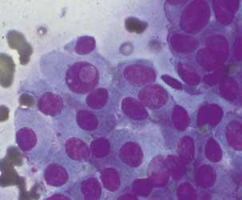

Support Vector Machines 

- Maximal Margin Classifier 
- Linear Support Vector Classifier
- Nonlinear Kernels
- Polynomial Kernels
- Gaussian radial based function
- Support Vector Machines 
- Multi-Class SVMs
- Hyperplanes and maximal margin classifier
- Sort margin and support vector classifier
- Kernels and support vector machines

- ? Voting classifier (hard/soft)


```{r libraries}
library(caret)
library(corrplot)
library(data.table)
library(ggplot2)
library(tidyverse)
```

# Wisconsin Diagnositc Breast Cancer Dataset



Features are computed from a digitized image of a fine needle aspirate (FNA) of a breast mass. They describe characteristics of the cell nuclei present in the image. 

## Attribute Information:

1) ID number
2) Diagnosis (M = malignant, B = benign)
3-32)

Ten real-valued features are computed for each cell nucleus, each has 
- a *mean* across cells 
- a *standard deviation* across cells and 
- the *worst* value across cells:

a) radius (mean of distances from center to points on the perimeter)
b) texture (standard deviation of gray-scale values)
c) perimeter
d) area
e) smoothness (local variation in radius lengths)
f) compactness (perimeter^2 / area - 1.0)
g) concavity (severity of concave portions of the contour)
h) concave points (number of concave portions of the contour)
i) symmetry
j) fractal dimension ("coastline approximation" - 1)

```{r loadData}
wdbcn<-fread(here::here("data/breast-cancer-wisconsin.csv"))
wdbc<-copy(wdbcn)
names(wdbc)

wdbc$diagnosis<-factor(wdbc$diagnosis)

anyNA(wdbc)

summary(wdbc)
```

# Plot some things:

```{r}
ggplot(wdbc,
       aes(x = radius_mean,
           y = concavity_mean,
           color = diagnosis))+
  geom_point(alpha = 0.5)


#GGally::ggpairs(wdbc,mapping = ggplot2::aes(color = diagnosis))
wdbcn$diagnosis<-recode(wdbcn$diagnosis, "M"=1, "B"=-1)


M<-cor(wdbcn[, -c("id")])
cp<-corrplot(M, order = "hclust",tl.col = "black")
dc <- which(colnames(cp)=="diagnosis") #column  of diagnosis
tc <- dim(M)[1] #total columns
dr <- tc-dc+1 #row of diagnosis, counting from the bottoem of the corrplot
segments(c(-0.5,0.5)+dc, rep(0.5,2), c(-0.5,0.5)+dc, rep(tc+0.5,2), lwd=1) #vertical
segments(rep(0.5,2), c(-0.5,0.5)+dr, rep(tc+0.5,2), c(-0.5,0.5)+dr, lwd=1) #horizontal
```


# Aim

To create a classifier for predicting whether a breast cancer patient's tumor is malignant or benign.

### Train Test Split

```{r test_train_split}
set.seed(3033)
intrain <- createDataPartition(y = wdbc$diagnosis, p= 0.7, list = FALSE)
training <- wdbc[intrain,]
testing <- wdbc[-intrain,]
```

### Some standard checks on the data
```{r standard_checks}
dim(training)
dim(testing)
```

#Try with caret and kernlab


```{r}
set.seed(3233)

trctrl <- trainControl(method = "repeatedcv", number = 10, repeats = 3)

training$cpw <- training$`concave points_worst`

tr_subset<-training[,.(radius_mean,cpw, diagnosis)]
tr_x_subset<-as.matrix(training[,.(radius_mean,cpw)])
tr_y_vec<- training$diagnosis

ksvm_Linear <- train(diagnosis ~ ., 
                     data = tr_subset, 
                     method = "svmLinear",
                     trControl=trctrl,
                     tuneLength = 10)

kernfit_caret_sml<-ksvm_Linear$finalModel

plot(kernfit_caret_sml, data = tr_x_subset)
```

#Try with kernlab without caret, target separate


```{r}

# fit model and produce plot
kernfit_bc <- ksvm(x = tr_x_subset,
                   y = tr_y_vec,
                   type = "C-svc", 
                   kernel = 'vanilladot')
plot(kernfit_bc, data = tr_x_subset)

```


#Try with e1071 without caret, formula

```{r}
# fit model and produce plot
svmfit_bc <- svm(diagnosis ~ .,
                 data = tr_subset,
                 kernel = "linear", 
                 scale = TRUE)

e1071:::plot.svm(svmfit_bc, data = tr_subset)#, radius_mean ~ cpw)


```


#Try with e1071 without caret, formula, more variables

```{r}

#make subsets
tr_subset2<-training[,.(radius_mean, radius_se, cpw, diagnosis)]
tr_x_subset2<-as.matrix(training[,.(radius_mean, radius_se,cpw)])
tr_y_vec2<- training$diagnosis

# fit model and produce plot
svmfit_bc <- svm(diagnosis ~ .,
                 data = tr_subset2,
                 kernel = "linear", 
                 scale = TRUE)

e1071:::plot.svm(svmfit_bc, radius_mean ~ cpw, data = tr_subset2)#, radius_mean ~ cpw)


```


#Try e1071 with caret

```{r}
set.seed(3233)

trctrl <- trainControl(method = "repeatedcv", number = 10, repeats = 3)

svm_Linear_bc <- train(diagnosis ~ ., 
                     data = tr_subset, 
                     method = "svmLinearWeights",
                     trControl=trctrl,
                     preProcess = c("center", "scale"),
                     tuneLength = 10)

svmfit_caret_bc<-svm_Linear_bc$finalModel
plot(svmfit_caret_bc, tr_subset)

```


```{r}
test_pred <- predict(svm_Linear, newdata = testing)
test_pred

#kernlab::plot(svm_Linear)#, data = training[,.(diagnosis, radius_mean,cpw)])
svm_Linear <- train(diagnosis ~ ., 
                    data = training[,.(diagnosis, radius_mean,cpw)], 
                    method = "svmLinear",
                    trControl=trctrl,
                    preProcess = c("center", "scale"),
                    tuneLength = 10)

library(kernlab)

xd = as.matrix(training[,.(radius_mean,cpw)])
yd = as.matrix(training[,.(diagnosis)])
ksvm_Linear<-ksvm(x = xd,
                  y = yd,
                  kernel = "vanilladot", type = 'C-svc',
                  kpar = "automatic", C = .1, cross = 10)

plot(ksvm_Linear)
plot(ksvm_Linear, data = xd)

kernlab::plot(ksvm_Linear, data = xd)
```

```{r, warning=F}

confusionMatrix(test_pred, testing$diagnosis )

```
```{r, warning=F}
grid <- expand.grid(C = c(0,0.01, 0.05, 0.1, 0.25, 0.5, 0.75, 1, 1.25, 1.5, 1.75, 2,5))
set.seed(3233)
svm_Linear_Grid <- train(diagnosis ~ ., data = training, method = "svmLinear",
                         trControl=trctrl,
                         preProcess = c("center", "scale"),
                         tuneGrid = grid,
                         tuneLength = 10)

svm_Linear_Grid

what_about_me<-svm_Linear_Grid$finalModel

#plot(what_about_me, data = xd)
```

```{r}
test_pred_grid <- predict(svm_Linear_Grid, newdata = testing)
test_pred_grid
```

```{r}
confusionMatrix(test_pred_grid, testing$diagnosis )
```
```{r}
set.seed(3233)
svm_Radial <- train(diagnosis ~., data = training, method = "svmRadial",
                    trControl=trctrl,
                    preProcess = c("center", "scale"),
                    tuneLength = 10)

svm_Radial
plot(svm_Radial)
```
```{r}
test_pred_Radial <- predict(svm_Radial, newdata = testing)
test_pred_Radial

confusionMatrix(test_pred_Radial, testing$diagnosis )
```


