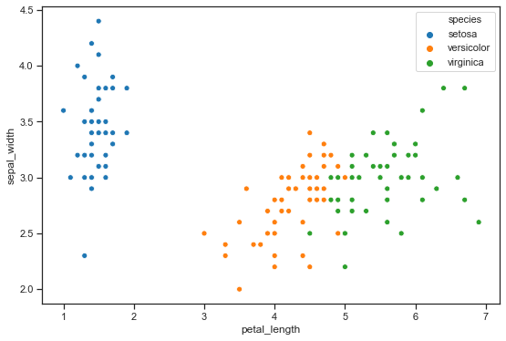
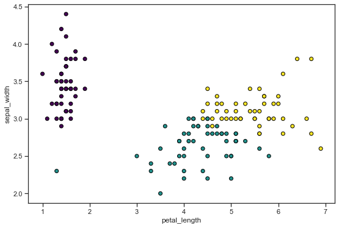
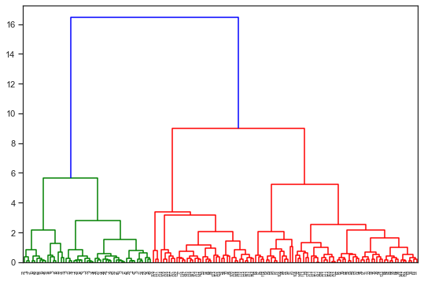
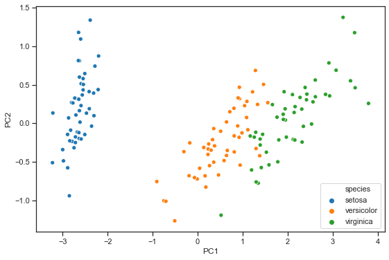
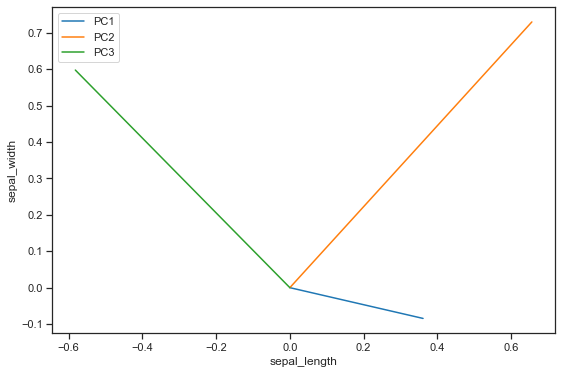
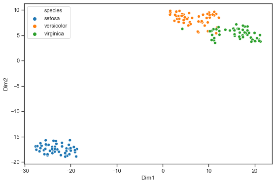

## Unsupervised learning


```python
import matplotlib.pyplot as plt
import numpy as np
import pandas as pd
from pandas.api.types import CategoricalDtype
import seaborn as sns

def warn(*args, **kwargs):
    pass
import warnings
warnings.warn = warn


from sklearn.cluster import KMeans, AgglomerativeClustering
from sklearn.metrics import silhouette_samples, silhouette_score
from scipy.cluster.hierarchy import dendrogram, linkage
from sklearn.decomposition import PCA
from sklearn.manifold import TSNE

from sklearn.pipeline import Pipeline
from sklearn.preprocessing import StandardScaler, RobustScaler

from sklearn.utils import resample


# Set up plotting options for seaborn and matplotlib
sns.set_context('notebook') 
sns.set_style('ticks') 
%matplotlib inline
plt.rcParams['figure.figsize'] = (9, 6)
```

## Dataset
We will be using the Iris dataset in order to demo unsupervised learning methods


```python
iris = sns.load_dataset('iris')
iris.head()
```


<div>
<style scoped>
    .dataframe tbody tr th:only-of-type {
        vertical-align: middle;
    }

    .dataframe tbody tr th {
        vertical-align: top;
    }

    .dataframe thead th {
        text-align: right;
    }
</style>
<table border="1" class="dataframe">
  <thead>
    <tr style="text-align: right;">
      <th></th>
      <th>sepal_length</th>
      <th>sepal_width</th>
      <th>petal_length</th>
      <th>petal_width</th>
      <th>species</th>
    </tr>
  </thead>
  <tbody>
    <tr>
      <th>0</th>
      <td>5.1</td>
      <td>3.5</td>
      <td>1.4</td>
      <td>0.2</td>
      <td>setosa</td>
    </tr>
    <tr>
      <th>1</th>
      <td>4.9</td>
      <td>3.0</td>
      <td>1.4</td>
      <td>0.2</td>
      <td>setosa</td>
    </tr>
    <tr>
      <th>2</th>
      <td>4.7</td>
      <td>3.2</td>
      <td>1.3</td>
      <td>0.2</td>
      <td>setosa</td>
    </tr>
    <tr>
      <th>3</th>
      <td>4.6</td>
      <td>3.1</td>
      <td>1.5</td>
      <td>0.2</td>
      <td>setosa</td>
    </tr>
    <tr>
      <th>4</th>
      <td>5.0</td>
      <td>3.6</td>
      <td>1.4</td>
      <td>0.2</td>
      <td>setosa</td>
    </tr>
  </tbody>
</table>
</div>


There are three species (our target label)


```python
iris['species'].unique()
```


    array(['setosa', 'versicolor', 'virginica'], dtype=object)


```python
iris_features = iris.iloc[:,0:4]
iris_target = iris.iloc[:,4]
print(iris_features.head())
```

       sepal_length  sepal_width  petal_length  petal_width
    0           5.1          3.5           1.4          0.2
    1           4.9          3.0           1.4          0.2
    2           4.7          3.2           1.3          0.2
    3           4.6          3.1           1.5          0.2
    4           5.0          3.6           1.4          0.2


```python
sns.scatterplot(x='petal_length',y='sepal_width', data=iris, hue=iris_target);
```





> ## Challenge 1
>
> 1. Take a few moments to explore the Iris dataset. What can you learn? Which species do you think will be easier to separate?
>
{: .challenge}

## K-means clustering
K-means looks for a fixed number (k) of clusters in a dataset. The K-means algorithm:
- identifies k number of centroids
- allocates every data point to the nearest cluster, while keeping the centroids as small as possible.
- performs iterative (repetitive) calculations to optimize the positions of the centroids

### Scale data


```python
iris_features_sc = RobustScaler().fit_transform(iris_features)
```

### Try 2 clusters


```python
model_kmeans_k2 = KMeans(n_clusters=2, random_state=0)
labels_k2 = model_kmeans_k2.fit_predict(iris_features_sc)
```


```python
plt.scatter(iris['petal_length'], iris['sepal_width'], c=labels_k2, cmap='viridis', edgecolor='k')
plt.xlabel('petal_length')
plt.ylabel('sepal_width');
```


### Try 3 clusters


```python
model_kmeans_k3 = KMeans(n_clusters=3, random_state=42)
labels_k3 = model_kmeans_k3.fit_predict(iris_features_sc)
# [x[:2] for x in iris['species'].to_list()]
```


```python
plt.scatter(iris['petal_length'], iris['sepal_width'], c=labels_k3, cmap='viridis', edgecolor='k')
plt.xlabel('petal_length')
plt.ylabel('sepal_width');

#for index, row in iris.iterrows():
#    plt.annotate(row['species'][:2], row['petal_length'], row['petal_width'])
```





> ## Challenge 2
>
> 1. Choose whichever clustering approach you think worked best among the above. If you partition the data this way, which of the variables is most distinct in the clusters?
> 
> {: .source}
>
> > ## Solution
> > 
> > ~~~
> > iris_clustered = iris.copy()
> > iris_clustered['prediction'] = labels_k3
> > iris_clustered.melt(id_vars=['prediction', 'species']).groupby(['prediction','variable']).mean()
> > 
> > ~~~
> > 
> > {: .output}
> {: .solution}
{: .challenge}

### Optimal number of clusters
One of the trickier tasks in clustering is identifying the appropriate number of clusters k.


```python
from scipy.spatial.distance import cdist

k_range = np.arange(2,12)
silhouette_avgs = []
sum_squared_distances = []

for i, k in enumerate(k_range):
    model_kmeans = KMeans(n_clusters=k, random_state=2)
    label_kmeans = model_kmeans.fit_predict(iris_features_sc)
    silhouette_avgs.append(silhouette_score(iris_features_sc, label_kmeans))    
    sum_squared_distances.append(model_kmeans.inertia_)
```


```python
# Look for maximum
plt.plot(k_range, silhouette_avgs)
plt.ylabel('Average Silhouette score') 
plt.xlabel('Number of clusters');
```


```python
# look for elbow. Also known as Scree plot
plt.plot(k_range, sum_squared_distances)
plt.ylabel('WCSS') #within cluster sum of squared distances
plt.xlabel('Number of clusters');
```


## Hierarchical Clustering

The first step is to compute the distance between each sample, for which we will use the ward distance.


```python
linked = linkage(iris_features_sc, method='ward')

dendrogram(linked,  
           orientation='top',
           distance_sort='descending',
           show_leaf_counts=True)
plt.show()
```





```python
model_hclust = AgglomerativeClustering(n_clusters=3, linkage='ward')
iris_hc = model_hclust.fit(iris_features_sc)
#model_hclust.fit_predict(iris_features_sc)
```


```python
plt.scatter(iris['petal_length'], iris['sepal_width'], 
            c=model_hclust.labels_, 
            cmap='viridis', 
            edgecolor='k')
plt.xlabel('petal_length')
plt.ylabel('sepal_width');
```


### Potting data


```python
sns.clustermap(iris_features, method='ward');
```


> ## Challenge
>
> Try constructing a heatmap using another method, and visualise the results.
> Do you think your approach is better or worse than the one proposed in the notes? 
> Compare with your group…
> 
> {: .source}
>
> > ## Solution
> > 
> > Compare with your neighbor
> > 
> > {: .output}
> {: .solution}
{: .challenge}

## Principal Component Analysis (PCA)


```python
nPCs = 3
PCnames = ['PC1','PC2','PC3']
iris_pca = PCA(n_components=nPCs).fit(iris_features)
iris_reduced = iris_pca.fit_transform(iris_features)
```


```python
iris_PC_df = pd.DataFrame(iris_reduced, columns = PCnames)
sns.scatterplot(x='PC1',y='PC2', data=iris_PC_df, hue=iris_target);
```





### Eigenvalues


```python
iris_eig = iris_pca.explained_variance_ratio_

x = np.arange(nPCs)
fig, ax = plt.subplots()
plt.bar(x, iris_eig)
plt.ylabel('Percentage of explained variance')
plt.xlabel('Principal Component')
plt.xticks(x, PCnames)
plt.show();
```


```python
iris_comp = iris_pca.components_
iris_comp
```


    array([[ 0.36138659, -0.08452251,  0.85667061,  0.3582892 ],
           [ 0.65658877,  0.73016143, -0.17337266, -0.07548102],
           [-0.58202985,  0.59791083,  0.07623608,  0.54583143]])


```python
for pc in np.arange(nPCs):
    plt.plot([0, iris_comp[pc, 0]], [0,iris_comp[pc,1]], 
             label=PCnames[pc])
plt.xlabel(iris_features.columns[0])
plt.ylabel(iris_features.columns[1])
plt.legend()
plt.show();
```





```python
sns.scatterplot(x='PC2',y='PC3', data=iris_PC_df, hue=iris_target);
```


If you need to generate more/better visualisations and exploration of your PCA outcome, R has much better "out of the box" visualisations to help you understand what is going on. See [here](https://pages.github.sydney.edu.au/informatics/lessons-mlr/90-Unsupervised/index.html) for our code for doing this on the iris dataset.


```python
model_tsne = TSNE(n_components=2, perplexity=25, random_state=42)
iris_tsne = model_tsne.fit_transform(iris_features)
```


```python
iris_TSNE_df = pd.DataFrame(iris_tsne, columns = ['Dim1','Dim2'])
sns.scatterplot(x='Dim1',y='Dim2', data=iris_TSNE_df, 
                hue=iris_target);
```




